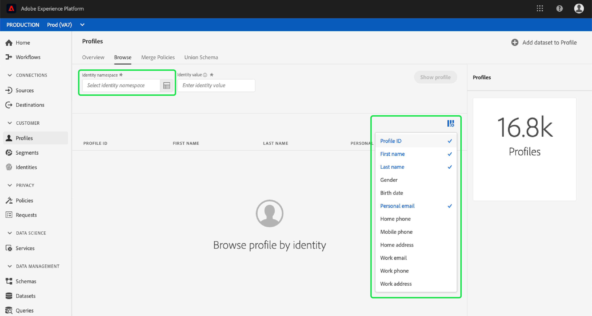
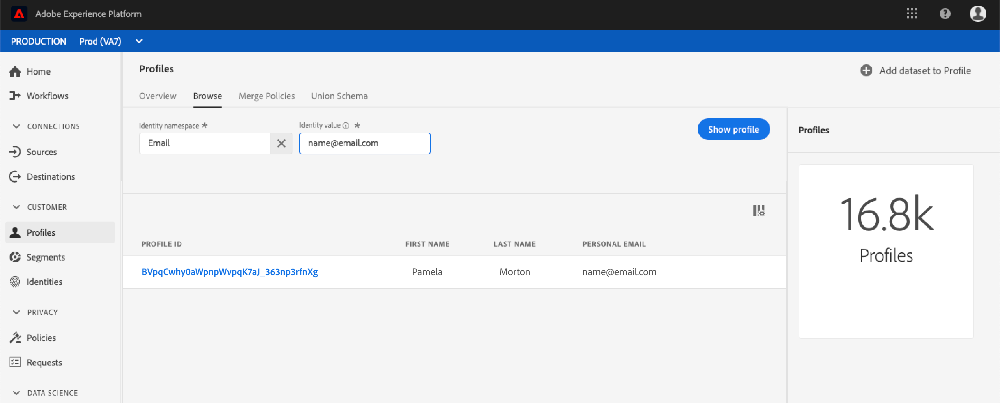

# [!DNL Real-time Customer Profile] Guia da interface do usuário

[!DNL Real-time Customer Profile] O cria uma visualização holística de cada um dos clientes individuais, combinando dados de vários canais, incluindo dados online, offline, CRM e de terceiros. Este documento serve como um guia para interagir com [!DNL Real-time Customer Profile] dados na interface do usuário do Adobe Experience Platform (UI).

## Introdução

Este guia da interface do usuário requer uma compreensão dos vários serviços [!DNL Experience Platform] envolvidos no gerenciamento [!DNL Real-time Customer Profiles]. Antes de ler este guia ou trabalhar na interface do usuário, revise a documentação dos seguintes serviços:

* [[!DNL Real-time Customer Profile]](../home.md): Fornece um perfil de consumidor unificado e em tempo real com base em dados agregados de várias fontes.
* [[!DNL Identity Service]](../../identity-service/home.md): Permite  [!DNL Real-time Customer Profile] por meio da ligação de identidades de diferentes fontes de dados, à medida que são assimiladas no  [!DNL Platform].
* [[!DNL Experience Data Model (XDM)]](../../xdm/home.md): A estrutura padronizada pela qual  [!DNL Platform] organiza os dados de experiência do cliente.

## Visão geral

Na interface do usuário do Experience Platform, selecione **[!UICONTROL Profiles]** na navegação à esquerda para abrir a guia **[!UICONTROL Overview]**. Esta guia fornece links para a documentação e vídeos para ajudar você a entender e começar a trabalhar com perfis.

### Painel de perfis

Para alguns usuários, selecionar **[!UICONTROL Profiles]** na navegação à esquerda e abrir a guia **[!UICONTROL Overview]** fornece um painel que descreve as métricas principais relacionadas aos dados do seu Perfil.

Para saber mais, visite o [Guia do painel de perfis](profile-dashboard.md).

## Procurar

Selecione a guia **[!UICONTROL Browse]** para procurar perfis por identidade.

### Métricas de perfil {#profile-metrics}

No lado direito da guia **[!UICONTROL Browse]** são várias métricas importantes relacionadas aos dados do seu perfil, incluindo o [profile count](#profile-count) total, bem como uma listagem de [perfis por namespace](#profiles-by-namespace).

Essas métricas de perfil são avaliadas usando a política de mesclagem padrão da sua organização. Para obter mais informações sobre como trabalhar com políticas de mesclagem, incluindo como definir uma política de mesclagem padrão, consulte a [visão geral das políticas de mesclagem](../merge-policies/overview.md).

Além dessas métricas, a seção de métricas de perfil também fornece uma última data e hora atualizadas, mostrando quando as métricas foram avaliadas pela última vez.

### Contagem de perfis {#profile-count}

A contagem de perfis exibe o número total de perfis que sua organização tem em [!DNL Experience Platform], depois que a política de mesclagem padrão de sua organização tiver mesclado fragmentos de perfil para formar um único perfil para cada cliente individual. Em outras palavras, sua organização pode ter vários fragmentos de perfil relacionados a um único cliente que interage com sua marca em diferentes canais, mas esses fragmentos seriam mesclados (de acordo com a política de mesclagem padrão) e retornariam uma contagem de perfil &quot;1&quot; porque estão todos relacionados ao mesmo indivíduo.

A contagem de perfis também inclui perfis com atributos (dados de registro), bem como perfis que contêm apenas dados de séries de tempo (evento), como perfis do Adobe Analytics. A contagem de perfis é atualizada regularmente para fornecer um número total atualizado de perfis na Platform.

Quando a assimilação de registros no armazenamento [!DNL Profile] aumenta ou diminui a contagem em mais de 5%, um trabalho é acionado para atualizar a contagem. Para fluxos de trabalho de dados de transmissão, uma verificação é feita de hora em hora para determinar se o limite de aumento ou diminuição de 5% foi atingido. Se tiver sido, uma tarefa é acionada automaticamente para atualizar a contagem de perfis. Para assimilação em lote, dentro de 15 minutos da assimilação bem-sucedida de um lote no armazenamento de Perfil, se o limite de aumento ou diminuição de 5% for atingido, uma tarefa será executada para atualizar a contagem de perfis.

### Perfis por namespace {#profiles-by-namespace}

A métrica **[!UICONTROL Perfis por namespace]** exibe a contagem total e o detalhamento dos namespaces em todos os perfis unidos na Loja de perfis. O número total de perfis por namespace (em outras palavras, adicionar os valores mostrados para cada namespace) sempre será maior que a métrica de contagem de perfil, pois um perfil pode ter vários namespaces associados a ela. Por exemplo, se um cliente interagir com sua marca em mais de um canal, vários namespaces serão associados a esse cliente individual.

Semelhante à métrica [profile count](#profile-count), quando a assimilação de registros no armazenamento [!DNL Profile] aumenta ou diminui a contagem em mais de 5%, uma tarefa é acionada para atualizar as métricas do namespace. Para fluxos de trabalho de dados de transmissão, uma verificação é feita de hora em hora para determinar se o limite de aumento ou diminuição de 5% foi atingido. Se tiver sido, uma tarefa é acionada automaticamente para atualizar a contagem de perfis. Para assimilação em lote, dentro de 15 minutos da assimilação bem-sucedida de um lote no armazenamento [!DNL Profile], se o limite de aumento ou diminuição de 5% for atingido, uma tarefa será executada para atualizar as métricas.

### Política de mesclagem

O seletor **[!UICONTROL Merge policy]** seleciona automaticamente a política de mesclagem padrão para sua organização. Se não quiser usar essa política de mesclagem, poderá selecionar `X` ao lado da política de mesclagem padrão para abrir a caixa de diálogo **[!UICONTROL Selecionar política de mesclagem]**, onde poderá escolher outra política de mesclagem.

Para saber mais sobre as políticas de mesclagem e sua função na Platform, consulte a [visão geral das políticas de mesclagem](../merge-policies/overview.md).

### Namespace de identidade

O seletor de **[!UICONTROL Namespace de identidade]** abre uma caixa de diálogo onde você pode escolher o namespace de identidade pelo qual deseja pesquisar e você pode personalizar os atributos exibidos da pesquisa selecionando o ícone de filtro e escolhendo quais atributos deseja adicionar ou remover.

Na caixa de diálogo **[!UICONTROL Selecionar namespace de identidade]**, escolha o namespace pelo qual deseja pesquisar ou use a barra de pesquisa na caixa de diálogo para começar a digitar o nome de um namespace. Você pode selecionar um namespace para exibir detalhes adicionais e, depois de encontrar o namespace que gostaria de usar, pode selecionar o botão de opção e pressionar **[!UICONTROL Select]** para continuar.

### Valor de identidade

Depois de selecionar um namespace de identidade, você retorna à guia **[!UICONTROL Procurar]**, onde pode inserir um **[!UICONTROL Valor de identidade]**. Esse valor é específico para um perfil de cliente individual e deve ser uma entrada válida para o namespace fornecido. Por exemplo, selecionar o namespace de identidade &quot;Email&quot; exigiria um valor de identidade no formato de um endereço de email válido.

Depois que um valor é inserido, selecione **[!UICONTROL Mostrar perfil]** e um único perfil correspondente ao valor é retornado. Selecione a **[!UICONTROL ID do perfil]** para visualizar os detalhes do perfil.

### Detalhes do perfil {#profile-detail}

Ao selecionar a **[!UICONTROL ID de perfil]**, a guia **[!UICONTROL Detail]** é aberta. As informações de perfil exibidas na guia **[!UICONTROL Detail]** foram unidas de vários fragmentos de perfil para formar uma única visualização do cliente individual. Isso inclui detalhes do cliente, como atributos básicos, identidades vinculadas e preferências de canal. Os campos padrão mostrados também podem ser alterados em um nível organizacional para exibir os atributos preferenciais do Perfil. Para saber mais sobre como personalizar esses campos, incluindo instruções passo a passo para adicionar e remover atributos e redimensionar painéis, leia o [guia de personalização de detalhes do perfil](profile-customization.md).

É possível exibir informações adicionais relacionadas ao perfil individual ao selecionar outra das guias disponíveis. Essas guias incluem atributos, eventos e associação a segmentos, que mostra os segmentos para os quais o perfil está qualificado no momento.

## Mesclar políticas

No menu principal **[!UICONTROL Profiles]**, selecione a guia **[!UICONTROL Merge Policies]** para exibir uma lista das políticas de mesclagem pertencentes à sua organização. Cada política listada exibe seu nome, seja a política de mesclagem padrão ou não, e a classe de esquema à qual se aplica.

Para obter mais informações sobre políticas de mesclagem, consulte a [visão geral das políticas de mesclagem](../merge-policies/overview.md).

## Esquema da União {#union-schema}

No menu principal **[!UICONTROL Profiles]**, selecione a guia **[!UICONTROL Union Schema]** para exibir os esquemas de união disponíveis para seus dados assimilados. Um schema de união é uma combinação de todos os campos [!DNL Experience Data Model] (XDM) na mesma classe, cujos esquemas foram habilitados para uso em [!DNL Real-time Customer Profile].

Para obter mais informações sobre schemas de união, visite o [guia da interface do usuário do schema de união](union-schema.md).

## Próximas etapas

Ao ler este guia, agora você sabe como visualizar e gerenciar seus dados [!DNL Profile] usando a interface [!DNL Experience Platform]. Para obter informações sobre como trabalhar com dados de perfil usando a API de perfil do cliente em tempo real, consulte o [Guia do desenvolvedor de perfil](../api/overview.md).
