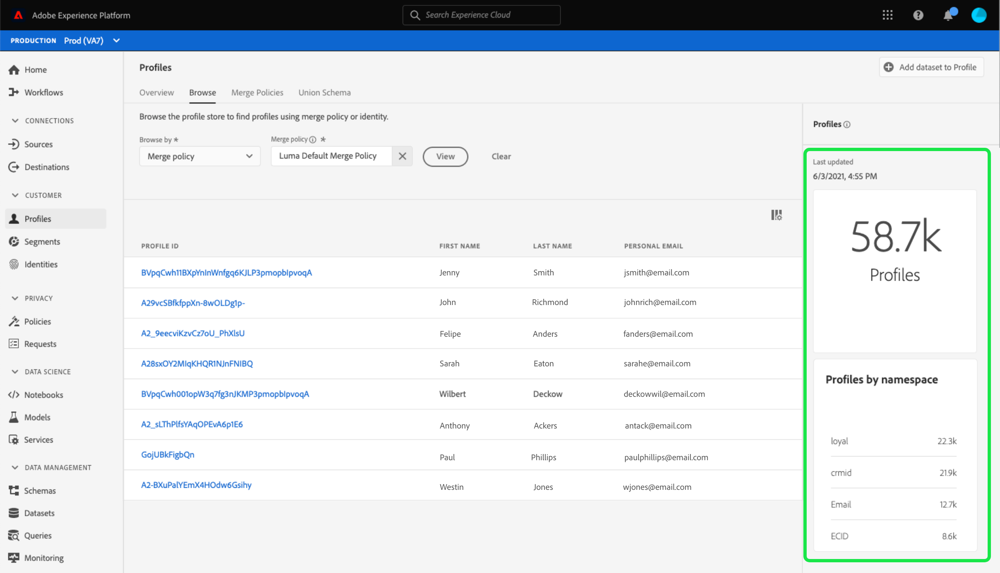
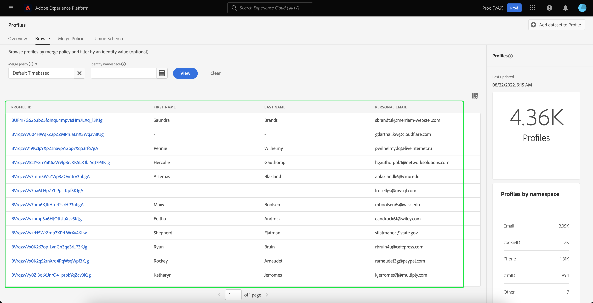
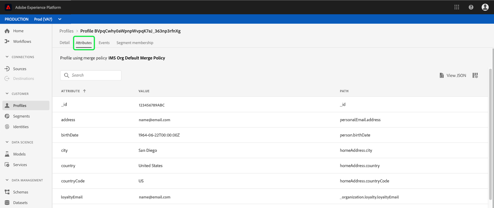

# [!DNL Real-time Customer Profile] Guia da interface do usuário

[!DNL Real-time Customer Profile] O cria uma visualização holística de cada um dos clientes individuais, combinando dados de vários canais, incluindo dados online, offline, CRM e de terceiros. Este documento serve como guia para interagir com o [!DNL Real-time Customer Profile] na interface do usuário do Adobe Experience Platform (UI).

## Introdução

Este guia da interface do usuário requer uma compreensão das várias [!DNL Experience Platform] serviços envolvidos na gestão [!DNL Real-time Customer Profiles]. Antes de ler este guia ou trabalhar na interface do usuário, revise a documentação dos seguintes serviços:

* [[!DNL Real-time Customer Profile] visão geral](../home.md): Fornece um perfil de consumidor unificado e em tempo real com base em dados agregados de várias fontes.
* [[!DNL Identity Service]](../../identity-service/home.md): Habilitar [!DNL Real-time Customer Profile] por conectar identidades a partir de fontes de dados diferentes, à medida que são assimiladas [!DNL Platform].
* [[!DNL Experience Data Model (XDM)]](../../xdm/home.md): O quadro normalizado pelo qual [!DNL Platform] organiza os dados de experiência do cliente.

## [!UICONTROL Visão geral]

Na interface do usuário do Experience Platform, selecione **[!UICONTROL Perfis]** na navegação à esquerda para abrir o **[!UICONTROL Visão geral]** exibindo o painel de perfil.

>[!NOTE]
>
>Se sua organização for nova na Plataforma e ainda não tiver conjuntos de dados ativos do Perfil ou políticas de mesclagem criadas, a variável [!UICONTROL Perfis] o painel não está visível. Em vez disso, a variável [!UICONTROL Visão geral] A guia exibe links e documentação para ajudar você a começar a usar o Perfil do cliente em tempo real.

### Painel de perfis {#profile-dashboard}

O painel de perfis descreve as métricas principais relacionadas aos dados de perfil de sua organização.

Para saber mais, visite o [guia do painel de perfis](../../dashboards/guides/profiles.md).

## [!UICONTROL Procurar] métricas de guia

Selecione o **[!UICONTROL Procurar]** para exibir várias métricas relacionadas aos dados de perfil de sua organização. Também é possível usar essa guia para navegar pelo armazenamento de perfis usando uma política de mesclagem ou uma identidade, conforme descrito na próxima seção deste guia.

No lado direito do **[!UICONTROL Procurar]** é a guia [contagem de perfis](#profile-count) , bem como uma lista de [perfis por namespace](#profiles-by-namespace).

>[!NOTE]
>
>Essas métricas de perfil podem variar em relação às métricas exibidas no [painel de perfis](#profile-dashboard) porque são avaliadas usando a política de mesclagem padrão de sua organização. Para obter mais informações sobre como trabalhar com políticas de mesclagem, incluindo como definir uma política de mesclagem padrão, consulte o [visão geral das políticas de mesclagem](../merge-policies/overview.md).

Além dessas métricas, esta seção fornece uma data e hora atualizadas recentemente, mostrando quando as métricas foram avaliadas pela última vez.

### Contagem de perfis {#profile-count}

A contagem de perfis exibe o número total de perfis que sua organização tem no Experience Platform, depois que a política de mesclagem padrão da organização mescla fragmentos de perfil para formar um único perfil para cada cliente individual. Em outras palavras, sua organização pode ter vários fragmentos de perfil relacionados a um único cliente que interage com sua marca em diferentes canais, mas esses fragmentos seriam mesclados (de acordo com a política de mesclagem padrão) e retornariam uma contagem de perfil &quot;1&quot; porque estão todos relacionados ao mesmo indivíduo.

A contagem de perfis também inclui perfis com atributos (dados de registro), bem como perfis que contêm apenas dados de séries de tempo (evento), como perfis do Adobe Analytics. A contagem de perfis é atualizada regularmente para fornecer um número total atualizado de perfis na Platform.

#### Atualização da métrica de contagem de perfis

Quando a assimilação de registros na variável [!DNL Profile] armazenar aumenta ou diminui a contagem em mais de 5%, uma tarefa é acionada para atualizar a contagem. Para fluxos de trabalho de dados de transmissão, uma verificação é feita de hora em hora para determinar se o limite de aumento ou diminuição de 5% foi atingido. Se tiver sido, uma tarefa é acionada automaticamente para atualizar a contagem de perfis. Para assimilação em lote, dentro de 15 minutos da assimilação bem-sucedida de um lote no armazenamento de Perfil, se o limite de aumento ou diminuição de 5% for atingido, uma tarefa será executada para atualizar a contagem de perfis.

### [!UICONTROL Perfis por namespace] {#profiles-by-namespace}

O **[!UICONTROL Perfis por namespace]** exibe a contagem total e o detalhamento dos namespaces em todos os perfis unidos na Loja de perfis. O número total de perfis por namespace (em outras palavras, adicionar os valores mostrados para cada namespace) sempre será maior que a métrica de contagem de perfil, pois um perfil pode ter vários namespaces associados a ela. Por exemplo, se um cliente interagir com sua marca em mais de um canal, vários namespaces serão associados a esse cliente individual.

#### Atualização do [!UICONTROL Perfis por namespace] métrica

Semelhante ao [contagem de perfis](#profile-count) , quando a assimilação de registros na variável [!DNL Profile] armazenar aumenta ou diminui a contagem em mais de 5%, uma tarefa é acionada para atualizar as métricas do namespace. Para fluxos de trabalho de dados de transmissão, uma verificação é feita de hora em hora para determinar se o limite de aumento ou diminuição de 5% foi atingido. Se tiver sido, uma tarefa é acionada automaticamente para atualizar a contagem de perfis. Para a ingestão em lote, no prazo de 15 minutos após a ingestão bem-sucedida de um lote no [!DNL Profile] armazenar, se o limite de aumento ou diminuição de 5% for atingido, uma tarefa será executada para atualizar as métricas.

## Use [!UICONTROL Procurar] guia para exibir perfis

No **[!UICONTROL Procurar]** é possível exibir perfis de amostra usando uma política de mesclagem ou pesquisar perfis específicos usando um namespace e um valor de identidade.

### Procurar por [!UICONTROL Política de mesclagem]

O **[!UICONTROL Procurar]** é definida como a política de mesclagem padrão para sua organização por padrão. Para escolher uma política de mesclagem diferente, selecione o `X` ao lado do nome da política de mesclagem e use o seletor para abrir o **[!UICONTROL Selecionar política de mesclagem]** caixa de diálogo.

>[!NOTE]
>
>Se não houver uma política de mesclagem selecionada, use o botão seletor ao lado de **[!UICONTROL Política de mesclagem]** para abrir a caixa de diálogo de seleção.

Para escolher uma política de mesclagem na **[!UICONTROL Selecionar política de mesclagem]** , selecione o botão de opção ao lado do nome da política e use **[!UICONTROL Selecionar]** para retornar ao [!UICONTROL Procurar] guia . Em seguida, você pode selecionar **[!UICONTROL Exibir]** para atualizar os perfis de amostra e ver uma amostra de perfis com a nova política de mesclagem aplicada.

Os perfis mostrados representam uma amostra de até 20 perfis do armazenamento de perfis de sua organização, após a aplicação da política de mesclagem selecionada. As amostras de perfis para a política de mesclagem selecionada são atualizadas quando novos dados são adicionados ao armazenamento de perfil da sua organização.

Para exibir os detalhes de um dos perfis de amostra, selecione o **[!UICONTROL ID do perfil]**. Para obter mais informações, consulte a seção mais adiante neste guia em [visualizar detalhes do perfil](#profile-detail).

Para saber mais sobre as políticas de mesclagem e sua função na Platform, consulte o [visão geral das políticas de mesclagem](../merge-policies/overview.md).

### Procurar por [!UICONTROL Identidade] {#browse-identity}

No **[!UICONTROL Procurar]** , você pode usar um namespace de identidade para buscar um perfil específico por um valor de identidade. A navegação por uma identidade requer que você forneça uma política de mesclagem, um namespace de identidade e um valor de identidade.

Se necessário, use o **[!UICONTROL Política de mesclagem]** seletor para abrir o **[!UICONTROL Selecionar política de mesclagem]** e escolha a política de mesclagem que deseja usar.

Em seguida, use o **[!UICONTROL Namespace de identidade]** seletor para abrir o **[!UICONTROL Selecionar namespace de identidade]** e escolha o namespace pelo qual deseja pesquisar. Se sua organização tiver muitos namespaces, você poderá usar a barra de pesquisa na caixa de diálogo para começar a digitar o nome de um namespace.

Você pode selecionar um namespace para exibir detalhes adicionais ou selecionar o botão de opção para escolher um namespace. Você pode usar **[!UICONTROL Selecionar]** para continuar.

Depois de selecionar uma [!UICONTROL Namespace de identidade] e regressando ao [!UICONTROL Procurar] você pode inserir uma **[!UICONTROL Valor de identidade]** relacionado ao namespace selecionado.

>[!NOTE]
>
>Esse valor é específico para um perfil de cliente individual e deve ser uma entrada válida para o namespace fornecido. Por exemplo, selecionar o namespace de identidade &quot;Email&quot; exigiria um valor de identidade no formato de um endereço de email válido.

Depois que um valor for inserido, selecione **[!UICONTROL Exibir]** e um único perfil correspondente ao valor é retornado. Selecione o **[!UICONTROL ID do perfil]** para exibir os detalhes do perfil.

## Exibir detalhes do perfil {#profile-detail}

Depois de selecionar uma **[!UICONTROL ID do perfil]**, o **[!UICONTROL Detalhe]** será aberta. As informações do perfil são exibidas no **[!UICONTROL Detalhe]** A guia foi unida de vários fragmentos de perfil para formar uma única visualização do cliente individual. Isso inclui detalhes do cliente, como atributos básicos, identidades vinculadas e preferências de canal.

Os campos padrão mostrados também podem ser alterados em um nível organizacional para exibir os atributos preferenciais do Perfil. Para saber mais sobre como personalizar esses campos, incluindo instruções passo a passo para adicionar e remover atributos e redimensionar painéis, leia o [guia de personalização de detalhes do perfil](profile-customization.md).

Você pode exibir informações adicionais relacionadas ao perfil individual do cliente selecionando outra das guias disponíveis. Essas guias incluem atributos, eventos e a guia de associação de segmento que mostra os segmentos para os quais o perfil está qualificado no momento.

### Guia Atributos

O **[!UICONTROL Atributos]** A guia fornece uma exibição de lista resumindo todos os atributos relacionados a um único perfil, após a aplicação da política de mesclagem especificada.

Esses atributos também podem ser exibidos como um objeto JSON ao selecionar **[!UICONTROL Exibir JSON]**. Isso é útil para qualquer usuário que deseje entender melhor como os atributos de perfil são assimilados na Platform.

### Guia Eventos

O **[!UICONTROL Eventos]** contém dados dos 100 ExperienceEvents mais recentes associados ao cliente. Esses dados podem incluir aberturas de email, atividades do carrinho e exibições de página. Selecionar **[!UICONTROL Exibir tudo]** para qualquer evento individual fornece campos e valores adicionais como parte do evento.

Os eventos também podem ser exibidos como um objeto JSON ao selecionar para **[!UICONTROL Exibir JSON]**. Isso é útil para entender como os eventos são capturados na Platform.

### Guia Associação de segmento

O **[!UICONTROL Associação de segmento]** A guia exibe uma lista com o nome e a descrição dos segmentos aos quais o perfil individual do cliente pertence no momento. Essa lista é atualizada automaticamente à medida que o perfil se qualifica ou expira dos segmentos. A contagem total de segmentos para os quais o perfil está qualificado no momento é mostrada no lado direito da guia .

Para obter mais informações sobre a segmentação no Experience Platform, consulte [Documentação do Serviço de segmentação do Adobe Experience Platform](../../segmentation/home.md).

## Mesclar políticas

Do principal **[!UICONTROL Perfis]** selecione o **[!UICONTROL Políticas de Mesclagem]** para exibir uma lista de políticas de mesclagem pertencentes à sua organização. Cada política listada exibe seu nome, seja a política de mesclagem padrão ou não, e a classe de esquema à qual se aplica.

Para obter mais informações sobre políticas de mesclagem, consulte a [visão geral das políticas de mesclagem](../merge-policies/overview.md).

## Schema da União {#union-schema}

Do principal **[!UICONTROL Perfis]** selecione o **[!UICONTROL Esquema de união]** para exibir os esquemas de união disponíveis para seus dados assimilados. Um schema de união é uma combinação de todos [!DNL Experience Data Model] (XDM) campos sob a mesma classe, cujos esquemas foram habilitados para uso em [!DNL Real-time Customer Profile].

Para obter mais informações sobre schemas de união, visite o [guia da interface do usuário do schema de união](union-schema.md).

## Próximas etapas

Ao ler este guia, você sabe como visualizar e gerenciar os dados de perfil de sua organização usando a interface do usuário do Experience Platform. Para obter informações sobre como trabalhar com dados de perfil usando APIs do Experience Platform, consulte o [Guia da API do perfil do cliente em tempo real](../api/overview.md).
