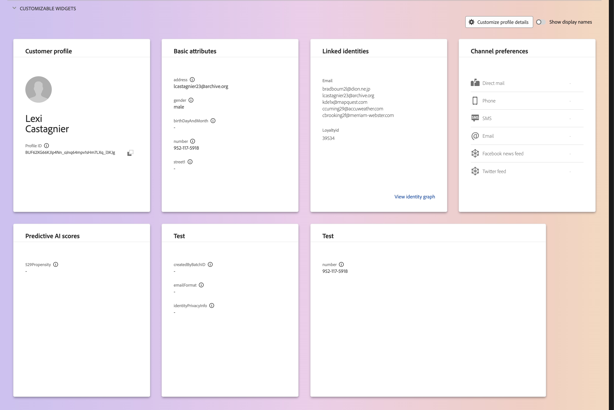

# [!DNL Real-Time Customer Profile] Guia da interface

O [!DNL Real-Time Customer Profile] cria uma visualização integral de cada cliente individual, combinando dados de vários canais, inclusive dados online, offline, de CRM e de terceiros. Este documento serve como um guia para interagir com os dados do [!DNL Real-Time Customer Profile] na interface do usuário (UI) do Adobe Experience Platform.

## Introdução

Este guia de interface do usuário requer uma compreensão dos vários serviços do [!DNL Experience Platform] envolvidos no gerenciamento do [!DNL Real-Time Customer Profiles]. Antes de ler este guia ou trabalhar na interface do usuário, consulte a documentação dos seguintes serviços:

* [[!DNL Real-Time Customer Profile] visão geral](../home.md): fornece um perfil de consumidor unificado em tempo real com base em dados agregados de várias fontes.
* [[!DNL Identity Service]](../../identity-service/home.md): Habilita [!DNL Real-Time Customer Profile] unindo identidades de fontes de dados diferentes conforme elas são assimiladas em [!DNL Experience Platform].
* [[!DNL Experience Data Model (XDM)]](../../xdm/home.md): a estrutura padronizada pela qual o [!DNL Experience Platform] organiza os dados de experiência do cliente.

## [!UICONTROL Visão geral]

Na interface do usuário do Experience Platform, selecione **[!UICONTROL Perfis]** na navegação à esquerda para abrir a guia **[!UICONTROL Visão geral]** exibindo o painel de perfil.

>[!NOTE]
>
>Se sua organização for nova no Experience Platform e ainda não tiver conjuntos de dados de Perfil ativos ou políticas de mesclagem criadas, o painel [!UICONTROL Perfis] não estará visível. Em vez disso, a guia [!UICONTROL Visão geral] exibe links e documentação para ajudar você a começar a usar o Perfil do cliente em tempo real.

### Painel do perfil {#profile-dashboard}

O painel de perfil descreve as métricas principais relacionadas aos dados de perfil de sua organização.

Para saber mais, visite o [guia do painel do perfil](../../dashboards/guides/profiles.md).

## Guia [!UICONTROL Procurar]

Na guia **[!UICONTROL Procurar]**, você pode exibir seus perfis em um modo de exibição de **cartão** ou em um modo de exibição de **gráfico** selecionando o botão de alternância.

Além disso, você pode navegar pelos perfis usando uma política de mesclagem ou pesquisar perfis específicos usando um namespace de identidade e valor.

### Procurar por [!UICONTROL Política de mesclagem]

Por padrão, a guia **[!UICONTROL Procurar]** está definida como a política de mesclagem padrão para sua organização. Para escolher uma política de mesclagem diferente, selecione `X` ao lado do nome da política de mesclagem e use o seletor para abrir a caixa de diálogo **[!UICONTROL Selecionar política de mesclagem]**.

>[!NOTE]
>
>Se não houver política de mesclagem selecionada, use o botão seletor ao lado do campo **[!UICONTROL Política de mesclagem]** para abrir a caixa de diálogo de seleção.

Para escolher uma política de mesclagem na caixa de diálogo **[!UICONTROL Selecionar política de mesclagem]**, selecione o botão de opção ao lado do nome da política e use **[!UICONTROL Selecionar]** para retornar à guia [!UICONTROL Procurar]. Você pode selecionar **[!UICONTROL Exibir]** para atualizar os perfis de exemplo e ver uma amostragem de perfis com a nova política de mesclagem aplicada.

Os perfis exibidos representam uma amostra de até 20 perfis do armazenamento de perfis da sua organização, depois que a política de mesclagem selecionada é aplicada. Os perfis de exemplo para a política de mesclagem selecionada são atualizados quando novos dados são adicionados ao armazenamento de perfis da sua organização.

Para exibir os detalhes de um dos perfis de exemplo, selecione a **[!UICONTROL ID do Perfil]**. Para obter mais informações, consulte a seção mais adiante neste guia em [exibindo detalhes do perfil](#profile-detail).

Para saber mais sobre as políticas de mesclagem e sua função na Experience Platform, consulte a [visão geral das políticas de mesclagem](../merge-policies/overview.md).

### Procurar por [!UICONTROL Identidade] {#browse-identity}

Na guia **[!UICONTROL Procurar]**, você pode usar um namespace de identidade para procurar um perfil específico por um valor de identidade. A navegação por uma identidade exige que você forneça uma política de mesclagem, um namespace de identidade e um valor de identidade.

Se necessário, use o seletor de **[!UICONTROL Política de mesclagem]** para abrir a caixa de diálogo **[!UICONTROL Selecionar política de mesclagem]** e escolher a política de mesclagem que deseja usar.

Em seguida, use o seletor de **[!UICONTROL Namespace de identidade]** para abrir a caixa de diálogo **[!UICONTROL Selecionar namespace de identidade]** e escolha o namespace pelo qual deseja pesquisar. Se sua organização tiver muitos namespaces, você poderá usar a barra de pesquisa na caixa de diálogo para começar a digitar o nome de um namespace.

Você pode selecionar um namespace para exibir detalhes adicionais ou selecionar o botão de opção para escolher um namespace. Você pode usar **[!UICONTROL Selecionar]** para continuar.

Depois de selecionar um [!UICONTROL namespace de identidade] e retornar à guia [!UICONTROL Procurar], você pode inserir um **[!UICONTROL valor de identidade]** relacionado ao namespace selecionado.

>[!NOTE]
>
>Esse valor é específico para um perfil de cliente individual e deve ser uma entrada válida para o namespace fornecido. Por exemplo, selecionar o namespace de identidade &quot;Email&quot; exigiria um valor de identidade na forma de um endereço de email válido.

Depois que um valor for inserido, selecione **[!UICONTROL Exibir]** e um único perfil correspondente ao valor será retornado. Selecione a **[!UICONTROL ID do Perfil]** para exibir um perfil.

## Exibir perfil {#view-profile}

>[!CONTEXTUALHELP]
>id="platform_errors_uplib_201001_404"
>title="Entidade não encontrada"
>abstract="Isso significa que a Experience Platform não encontrou a entidade solicitada. Para resolver esse erro, tente uma das seguintes soluções:<ul><li>Verifique se a ID do perfil correta está listada no URL da entidade que você está tentando acessar.</li><li>Verifique se você tem a combinação correta de Organização e sandbox para a entidade que está tentando acessar.</li></ul>"

Depois de selecionar uma **[!UICONTROL ID de perfil]**, a guia **[!UICONTROL Detalhes]** é aberta. As informações do perfil exibidas na guia **[!UICONTROL Detalhes]** foram mescladas de vários fragmentos de perfil para formar uma única visualização do cliente individual. Isso inclui detalhes do cliente, como atributos básicos, identidades vinculadas e preferências de canal.

Além disso, você pode exibir outros detalhes sobre perfis, como seus [atributos](#attributes), [eventos](#events) e [associação de público](#audience-membership).

### Guia Detalhes {#profile-detail}

A guia **[!UICONTROL Detalhes]** fornece informações mais detalhadas sobre o perfil selecionado e é separada em quatro seções: Insights do perfil do cliente, widgets do AI insight, widgets personalizáveis e widgets classificados automaticamente.

Além disso, você pode alternar se os insights gerados pela IA são exibidos, mostrar os detalhes do hub em comparação com a borda, bem como visualizar os detalhes na exibição de gráfico.

#### Insights do perfil do cliente {#customer-profile-insights}

A seção **[!UICONTROL Insights do perfil do cliente]** exibe uma breve introdução aos atributos do perfil. Isso inclui a ID do perfil, o email, o número de telefone, o gênero, a data de nascimento, bem como as identidades e as associações de público-alvo do perfil.

#### Widgets de insight de IA {#ai-insight-widgets}

A seção **[!UICONTROL widgets do insight de IA]** exibe widgets gerados pela IA. Esses widgets fornecem insights rápidos sobre o perfil, com base nos dados do perfil, incluindo dados demográficos (como idade, gênero ou local), comportamentos do usuário (como histórico de compras, atividade do site ou engajamento nas redes sociais), bem como psicográficos (como interesses, preferência ou opções de estilo de vida). Todos os widgets de IA usam dados que **já** existem no perfil.

#### Widgets personalizáveis {#customizable-widgets}

A seção **[!UICONTROL Widgets personalizáveis]** exibe widgets que você pode personalizar de acordo com suas necessidades comerciais. Você pode agrupar atributos em widgets separados, remover widgets indesejados ou ajustar o layout dos widgets.

Os campos padrão mostrados também podem ser alterados em um nível organizacional para exibir atributos de perfil preferenciais. Para saber mais sobre como personalizar esses campos, incluindo instruções passo a passo para adicionar e remover atributos e redimensionar painéis de painel, leia o [guia de personalização de detalhes do perfil](profile-customization.md).

Você também pode optar por alternar entre visualizar os nomes de atributo como seus nomes de exibição e os nomes de caminho do campo. Para alternar entre essas duas exibições, selecione a opção **[!UICONTROL Mostrar nomes para exibição]**.

#### Widgets classificados automaticamente {#auto-classified-widgets}

A seção **[!UICONTROL Widgets classificados automaticamente]** exibe widgets que usam o esquema de união para determinar os grupos de campos de origem aos quais um atributo pertence, fornecendo um contexto mais claro sobre a origem dos dados. Você pode usar a barra de pesquisa para procurar mais facilmente por palavras-chave em seus widgets.

Esses widgets combinam dados de evento (com o widget Eventos de experiência) e dados de atributo, permitindo que você tenha uma visualização unificada do seu perfil. Você pode usar esses widgets para explorar a estrutura dos dados do seu perfil e estruturar melhor seus [widgets personalizáveis](#customizable-widgets).

>[!NOTE]
>
>Se houver vários grupos de campos de origem, os widgets usarão somente **um** das opções disponíveis.

### Guia Atributos {#attributes}

A guia **[!UICONTROL Atributos]** fornece uma exibição de lista resumindo todos os atributos relacionados a um único perfil, após a política de mesclagem especificada ser aplicada.

Esses atributos também podem ser exibidos como um objeto JSON ao selecionar **[!UICONTROL Exibir JSON]**. Isso é útil para qualquer usuário que deseje entender melhor como os atributos de perfil são assimilados na Experience Platform.

Para exibir os atributos disponíveis na Edge, selecione **[!UICONTROL Edge]** no seletor de local de dados.

Para obter mais informações sobre perfis de borda, leia a [documentação sobre perfis de borda](../edge-profiles.md).

### Guia Eventos {#events}

A guia **[!UICONTROL Eventos]** contém dados dos 100 Eventos de Experiência mais recentes associados ao cliente. Esses dados podem incluir aberturas de email, atividades de carrinho e exibições de página. Selecionar **[!UICONTROL Exibir todos]** para qualquer evento individual fornece campos e valores adicionais para capturas como parte do evento.

Os eventos também podem ser exibidos como um objeto JSON ao selecionar **[!UICONTROL Exibir JSON]**. Isso é útil para entender como os eventos são capturados no Experience Platform.

### Guia Associação de público {#audience-membership}

A guia **[!UICONTROL Associação de público-alvo]** exibe uma lista com o nome e a descrição dos públicos-alvo aos quais o perfil de cliente individual pertence atualmente. Essa lista é atualizada automaticamente conforme o perfil se qualifica ou expira dos públicos-alvo. A contagem total de públicos para os quais o perfil está qualificado no momento é mostrada no lado direito da guia.

Para obter mais informações sobre segmentação no Experience Platform, consulte a [documentação do Serviço de segmentação do Experience Platform](../../segmentation/home.md).

Para exibir a associação de público-alvo dos perfis disponíveis na Edge, selecione **[!UICONTROL Edge]** no seletor de local de dados. Mais informações sobre a segmentação de borda podem ser encontradas no [guia de segmentação de borda](../../segmentation/methods/edge-segmentation.md).

## Mesclar políticas

No menu principal **[!UICONTROL Perfis]**, selecione a guia **[!UICONTROL Políticas de mesclagem]** para exibir uma lista de políticas de mesclagem que pertencem à sua organização. Cada política listada exibe seu nome, seja ela a política de mesclagem padrão e a classe de esquema à qual se aplica.

Para obter mais informações sobre políticas de mesclagem, consulte a [visão geral das políticas de mesclagem](../merge-policies/overview.md).

## Esquema de união {#union-schema}

No menu principal **[!UICONTROL Perfis]**, selecione a guia **[!UICONTROL Esquema de união]** para exibir os esquemas de união disponíveis para seus dados assimilados. Um esquema de união é uma combinação de todos os campos [!DNL Experience Data Model] (XDM) na mesma classe, cujos esquemas foram habilitados para uso em [!DNL Real-Time Customer Profile].

Para obter mais informações sobre esquemas de união, visite o [guia da interface do esquema de união](union-schema.md).

## Atributos computados {#computed-attributes}

No menu principal **[!UICONTROL Perfis]**, selecione a guia **[!UICONTROL Atributos computados]** para exibir uma lista de atributos computados que pertencem à sua organização.

Para obter mais informações sobre atributos computados, leia a [visão geral sobre atributos computados](../computed-attributes/overview.md). Para obter mais informações sobre como usar atributos computados na interface do Experience Platform, leia o [guia da interface do usuário de atributos computados](../computed-attributes/ui.md).

## Próximas etapas

Ao ler este guia, você sabe como visualizar e gerenciar os dados de perfil de sua organização usando a interface do usuário do Experience Platform. Para obter informações sobre como trabalhar com dados de perfil usando APIs do Experience Platform, consulte o [Guia da API de perfil do cliente em tempo real](../api/overview.md).
