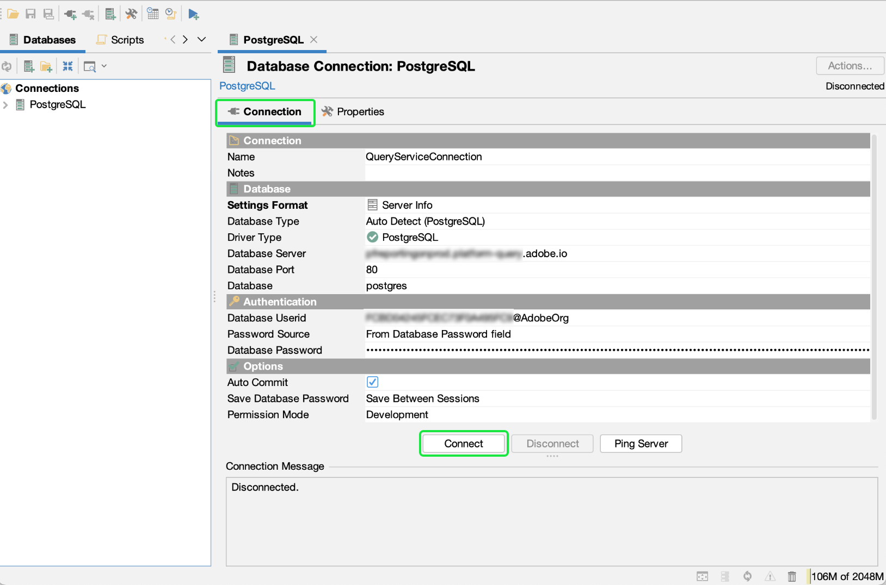

# Connect [!DNL DbVisualizer] para [!DNL Query Service] {#connect-dbvisualizer}

Este documento aborda as etapas para conectar o [!DNL DbVisualizer] ferramenta de banco de dados com Adobe Experience Platform [!DNL Query Service].

## Introdução

Este guia requer que você já tenha acesso ao [!DNL DbVisualizer] aplicativos de desktop e estão familiarizados com como navegar em sua interface. Para baixar o [!DNL DbVisualizer] para aplicativos de desktop ou para obter mais informações, consulte o [funcionário [!DNL DbVisualizer] documentação](https://www.dbvis.com/download/).

>[!NOTE]
>
>Existem [!DNL Windows], [!DNL macOS]e [!DNL Linux] versões de [!DNL DbVisualizer]. As capturas de tela deste guia foram realizadas com o uso da variável [!DNL macOS] aplicativo de desktop. Pode haver pequenas discrepâncias na interface do usuário entre as versões do .

Para adquirir as credenciais necessárias para conexão [!DNL  DbVisualizer] para o Experience Platform, você deve ter acesso ao espaço de trabalho Consultas na interface do usuário da plataforma. Entre em contato com o administrador da Organização IMS caso não tenha acesso ao espaço de trabalho de Consultas.

## Criar uma conexão de banco de dados {#connect-database}

Depois de instalar o aplicativo de desktop no computador local, inicie o aplicativo e selecione **[!DNL Create a Database Connection]** da [!DNL DbVisualizer] menu. Em seguida, selecione **[!DNL Create a Connection]** no painel à direita.

![O [!DNL DbVisualizer] menu principal com &quot;Create a Database Connection&quot; realçado.](../images/clients/dbvisualizer/create-db-connection.png)

Use a barra de pesquisa ou selecione [!DNL PostgreSQL] na lista suspensa nome do driver. O espaço de trabalho Conexão de Banco de Dados é exibido.

![O menu suspenso do nome do driver com [!DNL PostgreSQL] destacado.](../images/clients/dbvisualizer/driver-name.png)

No espaço de trabalho Conexão de Banco de Dados, selecione o **[!DNL Properties]** , seguido pela guia **[!DNL Driver Properties]** na barra lateral de navegação.

As três propriedades necessárias do driver são vistas na tabela abaixo.

| Propriedade | Descrição |
| ------ | ------ |
| `PGHOST` | O nome do host para o [!DNL PostgreSQL] servidor. Esse é o seu Experience Platform [!UICONTROL Host] credencial. |
| `SSL` | Isso controla o uso dos requisitos SSL. Você **must** use o valor &quot;1&quot; para ativar esse requisito. |
| `user` | O nome de usuário conectado ao banco de dados é a ID da organização. É uma sequência de caracteres alfanumérica que termina em `@adobe.org` |

>[!IMPORTANT]
>
>Consulte a [[!DNL Query Service] Documentação SSL](./ssl-modes.md) para saber mais sobre o suporte SSL para conexões de terceiros com o Adobe Experience Platform Query Service e como se conectar usando `verify-full` Modo SSL.

### [!DNL Query Service] credenciais

O `PGHOST` e `user` são obtidos de suas credenciais do Adobe Experience Platform. Para encontrar suas credenciais, faça logon na interface do usuário da plataforma e selecione **[!UICONTROL Queries]** no menu de navegação esquerdo, seguido por **[!UICONTROL Credenciais]**. Para obter mais informações sobre como encontrar o nome do banco de dados, o host, a porta e as credenciais de logon, leia a [guia de credenciais](../ui/credentials.md).

[!DNL Query Service] O também oferece credenciais que não estão expirando para permitir uma configuração única com clientes de terceiros. Consulte a documentação para [instruções completas sobre como gerar e usar credenciais que não estão expirando](../ui/credentials.md#non-expiring-credentials).

Use a barra de pesquisa para localizar cada propriedade e, em seguida, selecione a célula correspondente para o valor do parâmetro. A célula será realçada em azul. Insira sua credencial da Platform no campo de valor e selecione **[!DNL Apply]** para adicionar a propriedade do driver.

>[!NOTE]
>
>Para adicionar um segundo `user` perfil, selecione `user` na coluna de parâmetro , selecione o ícone azul + (mais) para adicionar credenciais para cada usuário. Selecionar **[!DNL Apply]** para adicionar a propriedade do driver.

O [!DNL Edited] mostra uma marca de seleção para indicar que o valor do parâmetro foi atualizado.

## Autenticação

Para exigir uma autenticação baseada em ID de usuário e senha sempre que uma conexão for estabelecida, selecione **[!DNL Authentication]** na barra lateral de navegação abaixo [!DNL PostgreSQL].

No painel Autenticação de conexão, verifique as **[!DNL Require Userid]** e **[!DNL Require Password]** caixas de seleção e, em seguida, selecione **[!DNL Apply]**.

## Conectar-se à plataforma

Para fazer uma conexão, selecione o **[!DNL Connection]** no espaço de trabalho Conexão do Banco de Dados e insira suas credenciais do Experience Platform para as seguintes configurações.

- **Nome**: É recomendável fornecer um nome amigável para reconhecer a conexão.
- **Servidor de banco de dados**: Este é o seu Experience Platform [!UICONTROL Host] credencial.
- **Porta do Banco de Dados**: A porta para [!DNL Query Service]. Você deve usar a porta 80 para se conectar [!DNL Query Service].
- **Banco de dados**: Usar a credencial `dbname` value `prod:all`.
- **Userid do Banco de Dados**: Esta é a ID da organização da plataforma. O Userid estará no formato de `ORG_ID@AdobeOrg`.
- **Senha do banco de dados**: Esta é uma sequência de caracteres alfanuméricos encontrada no [!DNL Query Service] painel de credenciais.

Depois de ter inserido todas as credenciais relevantes, selecione **[!DNL Connect]**.

O [!DNL Connect] será exibida na primeira ocasião da sessão.

Digite sua ID de usuário e senha e selecione **[!DNL Connect]**. Uma mensagem é exibida no log para confirmar uma conexão bem-sucedida.

## Próximas etapas

Agora que você se conectou [!DNL DbVisualizer] com [!DNL Query Service], você pode usar [!DNL DbVisualizer] para gravar queries. Para obter mais informações sobre como gravar e executar consultas, leia o [guia sobre execução de query](../best-practices/writing-queries.md).
