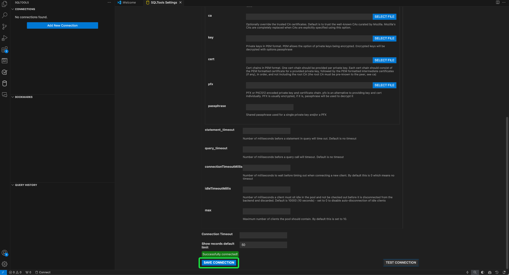

# Conectar [!DNL GitHub Copilot] e [!DNL Visual Studio Code] ao Serviço de consulta

>[!IMPORTANT]
>
>Antes de usar essa ferramenta integrada, você deve entender quais dados são compartilhados com o GitHub. Os dados compartilhados incluem informações contextuais sobre o código e os arquivos que estão sendo editados (&quot;prompts&quot;) e detalhes sobre as ações do usuário (&quot;dados de envolvimento do usuário&quot;).  Revise a declaração de privacidade de [[!DNL GitHub Copilot]](https://docs.github.com/en/site-policy/privacy-policies/github-general-privacy-statement#github-privacy-statement) para saber mais sobre os dados coletados. Você também deve considerar as implicações de segurança do envolvimento de serviços de terceiros, pois é responsável por garantir a conformidade com as políticas de governança de dados de sua organização. A Adobe não se responsabiliza por quaisquer preocupações ou problemas relacionados a dados que possam surgir com o uso dessa ferramenta. Consulte a documentação do GitHub para obter mais informações.

O [!DNL GitHub Copilot], desenvolvido pelo OpenAI Codex, é uma ferramenta orientada por IA que melhora a sua experiência de codificação, sugerindo trechos de código e funções inteiras diretamente no seu editor. Integrado ao [!DNL Visual Studio Code] ([!DNL VS Code]), o [!DNL Copilot] pode acelerar muito seu fluxo de trabalho, principalmente ao trabalhar com consultas complexas. Siga este guia para saber como conectar o [!DNL GitHub Copilot] e o [!DNL VS Code] ao Serviço de Consulta para gravar e gerenciar suas consultas com mais eficiência. Para obter mais informações sobre [!DNL Copilot], visite a [página do produto Copilot do GitHub](https://github.com/pricing) e a [documentação oficial [!DNL Copilot] 5}.](https://docs.github.com/en/copilot/about-github-copilot/what-is-github-copilot)

Este documento aborda as etapas necessárias para conectar o [!DNL GitHub Copilot] e o [!DNL VS Code] ao Serviço de Consulta do Adobe Experience Platform.

## Introdução {#get-started}

Este guia requer que você já tenha acesso a uma conta GitHub e tenha se inscrito em [!DNL GitHub Copilot]. Você pode [se inscrever pelo site do GitHub](https://github.com/github-copilot/signup). Você também precisa de [!DNL VS Code]. Você pode [baixar [!DNL VS Code] de seu site oficial](https://code.visualstudio.com/download).

Depois de instalar o [!DNL VS Code] e ativar a assinatura do [!DNL Copilot], adquira suas credenciais de conexão para o Experience Platform. Essas credenciais estão localizadas na guia [!UICONTROL Credentials] do espaço de trabalho [!UICONTROL Queries] na interface do usuário do Experience Platform. Leia o guia de credenciais para [saber como localizar esses valores na interface do usuário do Experience Platform](../ui/credentials.md). Entre em contato com o administrador da organização se você não tiver acesso ao espaço de trabalho [!UICONTROL Queries].

### Extensões [!DNL Visual Studio Code] necessárias {#required-extensions}

As [!DNL Visual Studio Code] extensões a seguir são necessárias para gerenciar e consultar com eficácia seus bancos de dados Experience Platform SQL diretamente no editor de código. Baixe e instale essas extensões.

- [SQLTools](https://marketplace.visualstudio.com/items?itemName=mtxr.sqltools): use a extensão SQLTools para gerenciar e consultar vários bancos de dados SQL. Ele inclui recursos como um executor de query, formatador SQL e explorador de conexões, com suporte para drivers adicionais para aumentar a produtividade do desenvolvedor. Leia a visão geral no Visual Studio Marketplace para obter mais detalhes.
- [SQLTools PostgreSQL/Driver de Barata](https://marketplace.visualstudio.com/items?itemName=mtxr.sqltools-driver-pg): essa extensão permite conectar, consultar e gerenciar bancos de dados PostgreSQL e CockroachDB diretamente no editor de código.

As próximas extensões habilitam [!DNL GitHub Copilot] e seus recursos de chat.

- [[!DNL GitHub Copilot]](https://marketplace.visualstudio.com/items?itemName=GitHub.copilot): Fornece sugestões de codificação em linha à medida que você digita.
- [[!DNL GitHub Copilot] Chat](https://marketplace.visualstudio.com/items?itemName=GitHub.copilot-chat): uma extensão complementar que fornece assistência à IA de conversação.

## Criar conexão {#create-connection}

Selecione o ícone do cilindro () na navegação à esquerda de [!DNL VS Code], seguido por **[!DNL Add New Connection]** ou pelo ícone de mais do cilindro ().

O **[!DNL Connection Assistant]** aparece. Selecione o driver de banco de dados **[!DNL PostgreSQL]**.

![A página de configurações SQLTools em [!DNL VS Code] com PostgreSQl realçado.](../images/clients/github-copilot/postgres-database-driver.png)

### Configurações de conexão de entrada {#input-connection-settings}

A exibição [!DNL Connection Settings] aparece. Insira suas credenciais de conexão do Experience Platform nos campos apropriados das SQLTools [!DNL Connection Assistant]. Os valores obrigatórios são explicados na tabela abaixo.

| Propriedade | Descrição |
| --- |--- |
| [!DNL Connection name] | Forneça um &quot;[!DNL Connection name]&quot; como `Prod_MySQL_Server` que seja descritivo e indique claramente sua finalidade (por exemplo, um ambiente de produção para um servidor MySQL). As práticas recomendadas incluem: <ul><li>Siga as convenções de nomenclatura de sua organização para garantir que ela seja exclusiva no sistema.</li><li>Mantenha-o conciso para manter a clareza e evitar confusão com outras conexões.</li><li>Inclua detalhes relevantes sobre a função ou o ambiente da conexão no nome.</li></ul> |
| [!DNL Connect using] | Use a opção **[!DNL Server and Port]** para especificar o endereço do servidor (nome do host) e o número da porta para estabelecer uma conexão direta com o Experience Platform |
| [!DNL Server address] | Insira o valor **[!UICONTROL Host]** fornecido em suas credenciais do Experience Platform Postgres, como `acmeprod.platform-query.adobe.io`. |
| [!DNL Port] | Normalmente, esse valor é `80` para serviços da Experience Platform. |
| [!DNL Database] | Insira o valor **[!UICONTROL Database]** fornecido em suas credenciais do Experience Platform Postgres, como `prod:all`. |
| [!DNL Username] | Essa propriedade se refere à ID da organização. Insira o valor **[!UICONTROL Username]** fornecido em suas credenciais do Experience Platform Postgres. |
| [!DNL Password] | Essa propriedade é o token de acesso. Insira o valor **[!UICONTROL Password]** fornecido em suas credenciais do Experience Platform Postgres. |

Em seguida, selecione **[!DNL Use Password]**, seguido por **[!DNL Save as plaintext in settings]** no menu suspenso exibido. O campo [!DNL Password] é exibido. Use esse campo de entrada de texto para inserir seu token de acesso.

Finalmente, para habilitar o SSL, selecione o campo de entrada [!DNL SSL] e escolha [!DNL Enabled] no menu suspenso exibido.

>[!TIP]
>
>Depois de inserir todas as credenciais, você poderá testar a conexão antes de salvá-la. Role para baixo até a parte inferior do espaço de trabalho e selecione **[!DNL Test Connection]**.
>
>{width="100" zoomable="yes"}

Depois de inserir corretamente os detalhes da conexão, selecione **[!DNL Save Connection]** para confirmar as configurações.

A exibição [!DNL Review connection details] aparece e mostra suas credenciais de conexão. Quando tiver certeza de que os detalhes da sua conexão são precisos, selecione **[!DNL Connect Now]**.

Seu espaço de trabalho [!DNL VS Code] aparece com uma sugestão de [!DNL GitHub Copilot].

![Uma sessão SQL conectada em [!DNL VS Code].](../images/clients/github-copilot/connected.png)

## Guia rápido do [!DNL GitHub Copilot]

Depois de conectado à sua instância do Experience Platform, você pode usar o [!DNL Copilot] como um assistente de codificação de IA para ajudá-lo a escrever código com mais rapidez e confiança. Esta seção aborda os principais recursos e como usá-los.

## Introdução ao [!DNL GitHub Copilot] {#get-started-with-copilot}

Primeiro, verifique se você tem a versão mais recente do [!DNL VS Code] instalada. Uma versão desatualizada do [!DNL VS Code] pode impedir que os recursos da chave [!DNL Copilot] funcionem conforme o esperado. Em seguida, verifique se a configuração [!DNL Enable Auto Completions] está habilitada. Se [!DNL Copilot] estiver sendo executado corretamente, o ícone **[!DNL Copilot](** O ícone Copilot será exibido). [!DNL Copilot] Selecione o ícone **[!DNL Copilot]** para abrir o [!DNL [!DNL GitHub Copilot] Menu]. No **[!DNL [!DNL GitHub Copilot] Menu]**, selecione **[!DNL Edit Settings]**

![O editor [!DNL VS Code] com o [!DNL GitHub Copilot Menu] exibido e o ícone [!DNL Copilot] e as Configurações de Edição realçados.](../images/clients/github-copilot/github-copilot-menu.png)

Percorra as opções e verifique se a caixa de seleção está habilitada para a configuração [!DNL Enable Auto Completions].

![O painel de configurações de [!DNL GitHub Copilot] com a caixa de seleção Habilitar Conclusões Automáticas marcada e realçada.](../images/clients/github-copilot/enable-auto-completions.png)

## Conclusões de código {#code-completions}

Depois que você instalar a extensão [!DNL GitHub Copilot] e fazer logon, ela ativará automaticamente um recurso chamado **Texto Fantasma**, que sugere a conclusão de código à medida que você digita. Essas sugestões ajudam você a escrever código de forma mais eficiente e com menos interrupções. Também é possível usar comentários para orientar as sugestões do código de IA. Isso significa que os usuários não técnicos podem converter fala simples em código para explorar seus dados.

![A interface do usuário do VSCode com uma sugestão de código e o ícone [!DNL GitHub Copilot] realçado.](../images/clients/github-copilot/ghost-text.png)

>[!TIP]
>
>Se você quiser desabilitar [!DNL Copilot] para um arquivo ou idioma específico, selecione o ícone na barra de status e desabilite-o.

### Aceitar sugestões completas ou parciais de Texto Fantasma {#accept-suggestions}

Quando [!DNL GitHub Copilot] sugere conclusão de código, você pode aceitar sugestões parciais ou completas. Selecione **Tab** para aceitar toda a sugestão ou mantenha pressionada a tecla **Control (ou Command no Mac)** e pressione a **seta para a direita** para aceitar texto parcial. Para descartar uma sugestão, pressione **Escape**.

>[!TIP]
>  
>Se você não estiver recebendo sugestões, verifique se [[!DNL Copilot] está habilitado no idioma do arquivo](#get-started-with-copilot).

![O editor [!DNL VS Code] exibindo uma sugestão de texto cinza claro de [!DNL GitHub Copilot] como Texto Fantasma, ao lado do código parcialmente digitado.](../images/clients/github-copilot/accept-partial-suggestions.png)

### Sugestões alternativas {#alternative-suggestions}

Para percorrer as sugestões de código alternativo, selecione as setas na caixa de diálogo [!DNL Copilot].

![O editor [!DNL VS Code] mostrando o painel de sugestões alternativas do Copilot.](../images/clients/github-copilot/code-suggestions.png)

## Usar chat em linha {#inline-chat}

Você também pode conversar com [!DNL Copilot] diretamente sobre o seu código. Use **Control (ou Command) + I** para acionar a caixa de diálogo de chat embutida. Esse recurso é usado para iterar no código e refinar sugestões no contexto. Você pode realçar um bloco de código e usar o bate-papo em linha para ver uma solução diferente proposta pela IA antes de aceitar.

<!-- THis section is poss unnecessary:
There are inline features for chat including doc, expalin, fix and test

 -->

## Exibição de chat dedicada {#dedicated-chat}

Você pode usar uma interface de bate-papo mais tradicional com uma barra lateral de bate-papo dedicada para formar ideias e estratégias, resolver problemas de codificação e discutir detalhes de implementação. Selecione o ícone de bate-papo () na barra lateral [!DNL VS Code] para abrir uma janela de chat dedicada.

![A barra lateral de chat [!DNL GitHub Copilot] com o ícone de chat realçado.](../images/clients/github-copilot/chat-sidebar.png)

Você também pode acessar o histórico do chat selecionando o ícone de histórico () na parte superior do painel de chat.

## Próximas etapas

Agora você está pronto para consultar com eficiência seus bancos de dados Experience Platform diretamente do editor de código, e usar as sugestões de código alimentadas por IA do [!DNL GitHub Copilot] para simplificar a gravação e a otimização de consultas SQL. Para obter mais informações sobre como gravar e executar consultas, consulte a [orientação para a execução da consulta](../best-practices/writing-queries.md).
