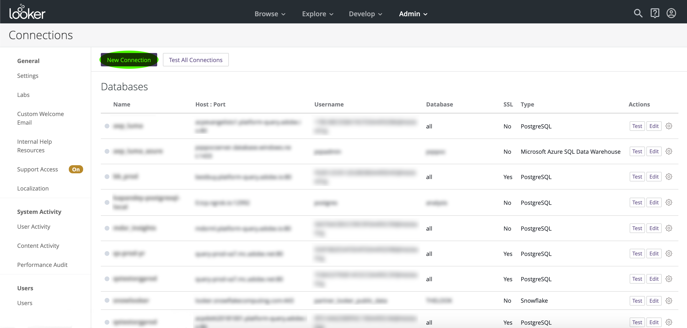

# Conectar com o Looker

Para conectar o Looker com o Adobe Query Service no Adobe Experience Platform, siga as etapas abaixo:

Depois de fazer logon no Looker, clique em **Admin**, seguido por **Conexões**.

Nesta página, clique em **Nova conexão**.

Aqui, você pode preencher os detalhes das Configurações de conexão.

- **Nome:** O nome da sua conexão.
- **Dialeto:** O dialeto usado para o banco de dados SQL. O Serviço de Query usa **PostgreSQL**.
- **Host e porta:** O terminal do host e sua porta para o Serviço de Query.
- **Banco de dados:** O banco de dados que será usado.
- **Nome de usuário e senha:** As credenciais de logon que serão usadas. O nome de usuário estará na forma de `ORG_ID@AdobeOrg`.

>[!NOTE]
>
>Para obter mais informações sobre como localizar seu host e porta, nome do banco de dados e credenciais de logon, visite a página de [credenciais no Platform](https://platform.adobe.com/query/configuration). Para localizar suas credenciais, faça logon no Platform, clique em **Query** e, em seguida, clique em **Credenciais**.

Depois de inserir os detalhes da conexão, clique em **Testar essas configurações** para garantir que suas credenciais funcionem corretamente. Se o fizerem, uma mensagem informando que você pode se conectar será exibida abaixo. Se a conexão for realmente bem-sucedida, clique em **Adicionar conexão** para criar a conexão.

## Próximas etapas

Agora que você se conectou ao Serviço de Query, você pode usar o Looker para escrever query. Para obter mais informações sobre como gravar e executar query, leia o guia [de query](../creating-queries/creating-queries.md)em execução.