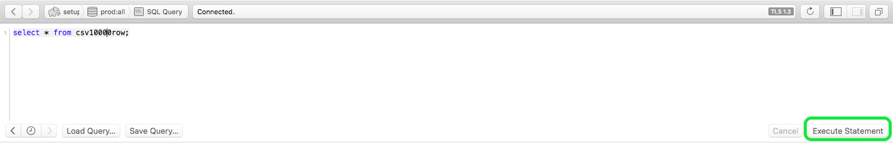

# Conecte [!DNL Postico] ao Serviço de query (Mac)

Este documento aborda as etapas para conectar [!DNL Postico] com Adobe Experience Platform [!DNL Query Service].

>[!NOTE]
>
> Este guia pressupõe que você já tenha acesso a [!DNL Postico] e esteja familiarizado com como navegar em sua interface. Mais informações sobre [!DNL Postico] podem ser encontradas na documentação [oficial [!DNL Postico] documentação](https://eggerapps.at/postico/docs).
> 
> Além disso, [!DNL Postico] é **somente** disponível em dispositivos macOS.

Para conectar [!DNL Postico] ao Serviço de query, abra [!DNL Postico] e selecione **[!DNL New Favorite]**.

Agora você pode inserir valores para se conectar ao Adobe Experience Platform.

Para obter mais informações sobre como encontrar o nome do banco de dados, o host, a porta e as credenciais de logon, leia o [guia de credenciais](../ui/credentials.md). Para localizar suas credenciais, faça logon em [!DNL Platform], selecione **[!UICONTROL Queries]**, seguido por **[!UICONTROL Credentials]**.

Após inserir suas credenciais, selecione **[!DNL Connect]** para se conectar ao Serviço de query.

Após se conectar à Platform, você poderá ver uma lista de todas as relações feitas anteriormente com o Serviço de query.

## Criar instruções SQL

Para criar uma nova consulta SQL, selecione e abra &quot;Consulta SQL&quot;.

Uma caixa é exibida e aqui você pode digitar a consulta que deseja executar. Quando terminar, selecione **[!DNL Execute Statement]** para executar a consulta.

Uma tabela é exibida mostrando os resultados da execução de query concluída.

## Próximas etapas

Agora que você se conectou a [!DNL Query Service], é possível usar [!DNL Postico] para gravar consultas. Para obter mais informações sobre como gravar e executar consultas, leia o [guia de consultas em execução](../best-practices/writing-queries.md).
