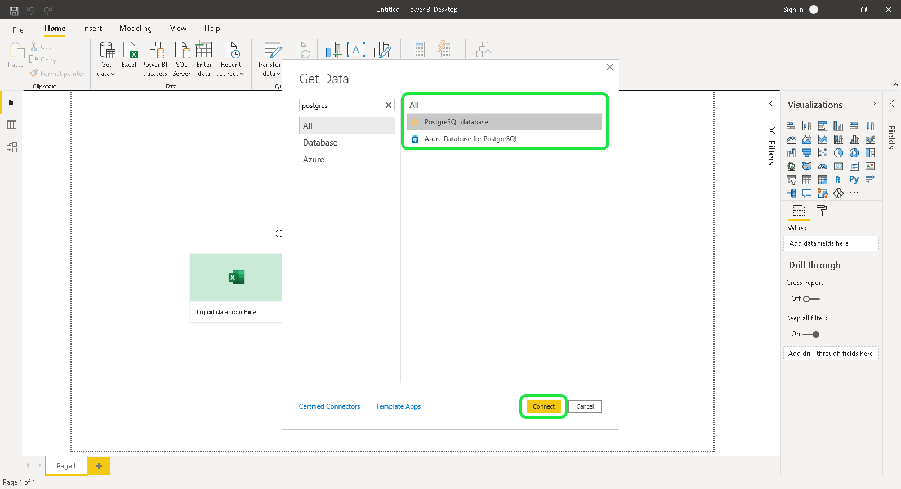
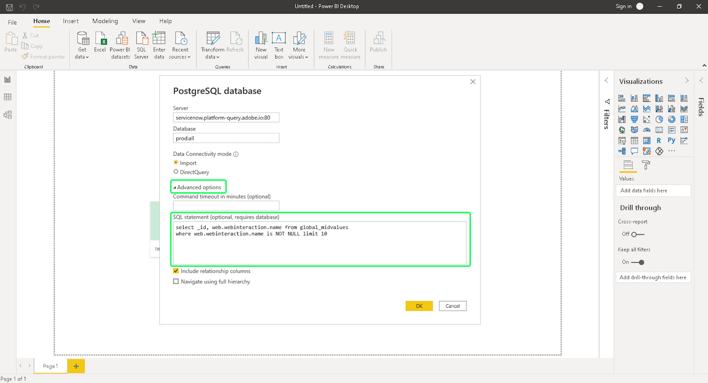

# Conectar o Power BI ao Serviço de Consulta

Este documento aborda as etapas para conectar o Power BI Desktop com o Serviço de query Adobe Experience Platform.

## Introdução

Este guia requer que você já tenha acesso ao aplicativo de desktop do Power BI e esteja familiarizado com como navegar na interface dele. Para baixar o Power BI Desktop ou para obter mais informações, consulte a [documentação oficial de Power BI](https://docs.microsoft.com/pt-BR/power-bi/).

>[!IMPORTANT]
>
> O aplicativo de desktop do Power BI é **only** disponível em dispositivos Windows.

Para adquirir as credenciais necessárias para conectar o Power BI ao Experience Platform, você deve ter acesso ao espaço de trabalho Consultas na interface do usuário da plataforma. Entre em contato com o administrador da Organização IMS caso não tenha acesso ao espaço de trabalho de Consultas.

Depois de instalar o Power BI, será necessário instalar o `Npgsql`, um pacote de driver .NET para PostgreSQL. Mais informações sobre o Npgsql podem ser encontradas no [Documentação Npgsql](https://www.npgsql.org/doc/index.html).

>[!IMPORTANT]
>
>Você deve baixar a v4.0.10 ou inferior, já que versões mais recentes resultam em erros.

Em &quot;[!DNL Npgsql GAC Installation]&quot; na tela de configuração personalizada, selecione **[!DNL Will be installed on local hard drive]**.

Para garantir que o Npgsql foi instalado corretamente, reinicie o computador antes de prosseguir para as próximas etapas.

## Conectar o Power BI ao Serviço de Consulta {#connect-power-bi}

Para conectar o Power BI ao Serviço de query, abra o Power BI e selecione **[!DNL Get Data]** na faixa do menu superior.

Insira &quot;PostgreSQL&quot; na barra de pesquisa para restringir a lista de fontes de dados. Nos resultados que forem exibidos, selecione **[!DNL PostgreSQL database]**, seguida de **[!DNL Connect]**.

A caixa de diálogo PostgreSQl do banco de dados é exibida, solicitando valores para o servidor e o banco de dados. Esses valores são obtidos de suas credenciais do Adobe Experience Platform. Para encontrar suas credenciais, faça logon na interface do usuário da plataforma e selecione **[!UICONTROL Queries]** no menu de navegação esquerdo, seguido por **[!UICONTROL Credenciais]**. Para obter mais informações sobre como encontrar o nome do banco de dados, o host, a porta e as credenciais de logon, leia a [guia de credenciais](../ui/credentials.md).

Para o **[!DNL Server]** no Power BI, insira o valor do host encontrado na seção Credenciais do Serviço de Consulta. Para produção, adicione porta `:80` ao final da string de host. Por exemplo, `made-up.platform-query.adobe.io:80`.

O **[!DNL Database]** pode ser &quot;all&quot; ou um nome de tabela de conjunto de dados. Por exemplo, `prod:all`.

>[!IMPORTANT]
>
>As estruturas de dados aninhadas em ferramentas de BI de terceiros podem ser niveladas para melhorar sua usabilidade e reduzir a carga de trabalho necessária para recuperar, analisar, transformar e relatar dados. Consulte a documentação no[`FLATTEN` recurso](../best-practices/flatten-nested-data.md) para obter instruções sobre como ativar essa configuração ao se conectar a um banco de dados.

### Modo de Conectividade de Dados

Em seguida, você pode selecionar **[!DNL Data Connectivity mode]**. Selecionar **[!DNL Import]** seguida de **[!DNL OK]** para exibir uma lista de todas as tabelas disponíveis ou selecione **[!DNL DirectQuery]** para consultar a fonte de dados diretamente sem importar ou copiar dados diretamente no Power BI.

Para saber mais sobre **[!DNL Import]** , leia a seção sobre [importação de uma tabela](#import). Para saber mais sobre **[!DNL DirectQuery]** , leia a seção sobre [consulta de um conjunto de dados sem importar dados](#direct-query).

Selecionar **[!DNL OK]** depois de confirmar os detalhes do banco de dados.

### Autenticação

Um prompt solicitando seu nome de usuário, senha e configurações do aplicativo é exibido. Nesse caso, o nome de usuário é a ID da organização e a senha é o token de autenticação. Ambos podem ser encontrados na página de credenciais do Serviço de Consulta.

Preencha estes detalhes e selecione **[!DNL Connect]** para continuar até a próxima etapa.

## Importar uma tabela {#import}

Ao selecionar a variável **[!DNL Import]** [!DNL Data Connectivity mode], o conjunto de dados completo é importado, permitindo usar as tabelas e colunas selecionadas no aplicativo de desktop do Power BI como estão.

>[!IMPORTANT]
>
>Para ver as alterações de dados que ocorreram desde a importação inicial, é necessário atualizar os dados no Power BI importando o conjunto de dados completo novamente.

Para importar uma tabela, insira os detalhes do servidor e do banco de dados [conforme descrito acima](#connect-power-bi) e selecione o **[!DNL Import]** [!DNL Data Connectivity mode], seguida de **[!DNL OK]**. Uma caixa de diálogo é exibida, exibindo uma lista de todas as tabelas disponíveis. Selecione a tabela que deseja visualizar, seguida por **[!DNL Load]** para trazer o conjunto de dados para o Power BI.

A tabela agora é importada para o Power BI.

### Importar tabelas usando SQL personalizado

No momento, o Power BI e outras ferramentas de terceiros, como o Tableau, não permitem que os usuários importem objetos aninhados, como objetos XDM na Platform. Para explicar isso, o Power BI permite usar o SQL personalizado para acessar esses campos aninhados e criar uma visualização nivelada dos dados. O Power BI carrega essa visualização nivelada dos dados aninhados anteriormente como uma tabela normal.

No provedor de banco de dados PostgreSQL, selecione **[!DNL Advanced options]** para inserir uma consulta SQL personalizada no **[!DNL SQL statement]** seção. Essa consulta personalizada deve ser usada para nivelar seus pares de nome-valor JSON em um formato de tabela.

Após ter inserido seu query personalizado, selecione **[!DNL OK]** para continuar a conectar o banco de dados. Consulte a [autenticação](#authentication) seção acima para obter orientação sobre como conectar um banco de dados a partir dessa parte do workflow.

Quando a autenticação for concluída, uma visualização dos dados nivelados será exibida no painel da Área de trabalho do Power BI como uma tabela. O servidor e o nome do banco de dados são listados na parte superior da caixa de diálogo. Selecionar **[!DNL Load]** para concluir o processo de importação.

As visualizações agora estão disponíveis para edição e exportação no aplicativo Power BI Desktop.

## Consultar o conjunto de dados sem importar dados {#direct-query}

O **[!DNL DirectQuery]** [!DNL Data Connectivity mode] O consulta a fonte de dados diretamente sem importar ou copiar dados para o Power BI Desktop. Usando esse modo de conexão, você pode atualizar todas as visualizações com dados atuais por meio da interface do usuário. No entanto, o tempo necessário para produzir ou atualizar a visualização varia de acordo com o desempenho da fonte de dados subjacente.

Para usar isso [!DNL Data Connectivity mode], selecione o **[!DNL DirectQuery]** alternar então **[!DNL Advanced options]** para inserir uma consulta SQL personalizada no **[!DNL SQL statement]** seção. Certifique-se de que **[!DNL Include relationship columns]** está selecionada. Após concluir seu query, selecione **[!DNL OK]** para continuar.

Uma pré-visualização do query é exibida. Selecionar **[!DNL Load]** para ver os resultados da query.

## Próximas etapas

Ao ler este documento, você deve entender como se conectar ao aplicativo de desktop do Power BI e os diferentes modos de conexão de dados disponíveis. Para obter mais informações sobre como gravar e executar queries, consulte o [orientação para a execução da consulta](../best-practices/writing-queries.md).
