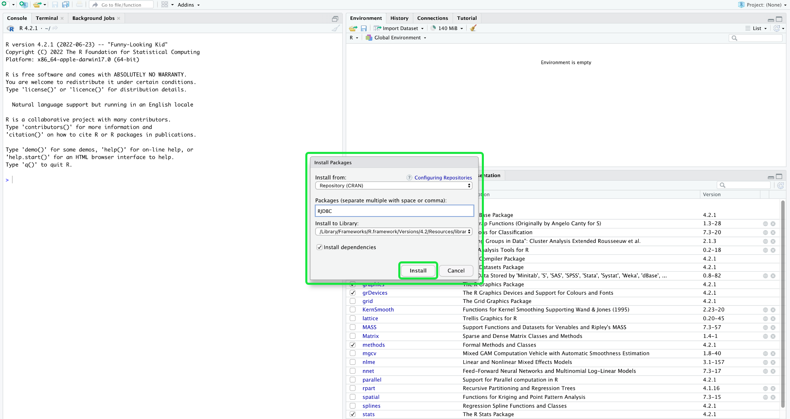
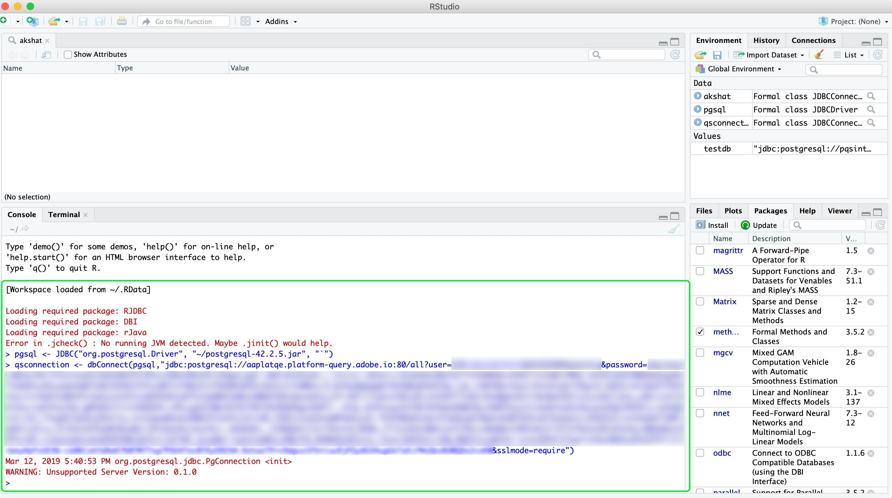

# Conectar [!DNL RStudio] ao Serviço de Consulta

Este documento percorre as etapas para conectar [!DNL RStudio] com Adobe Experience Platform [!DNL Query Service].

>[!NOTE]
>
> Este guia supõe que você já tenha acesso a [!DNL RStudio] e está familiarizado com como usá-lo. Mais informações sobre [!DNL RStudio] podem ser encontradas na documentação [oficial [!DNL RStudio] documentação](https://rstudio.com/products/rstudio/).
> 
> Além disso, para usar o RStudio com o Serviço de query, é necessário instalar o driver PostgreSQL JDBC 4.2. Você pode baixar o driver JDBC no [site oficial do PostgreSQL](https://jdbc.postgresql.org/download.html).

## Crie uma conexão [!DNL Query Service] na interface [!DNL RStudio]

Depois de instalar [!DNL RStudio], é necessário instalar o pacote RJDBC. Vá para o painel **[!DNL Packages]** e selecione **[!DNL Install]**.


Um pop-up é exibido, mostrando a tela **[!DNL Install Packages]**. Certifique-se de que **[!DNL Repository (CRAN)]** esteja selecionado para a seção **[!DNL Install from]**. O valor de **[!DNL Packages]** deve ser `RJDBC`. Certifique-se de que **[!DNL Install dependencies]** esteja selecionado. Depois de confirmar que todos os valores estão corretos, selecione **[!DNL Install]** para instalar os pacotes.



Agora que o pacote RJDBC foi instalado, reinicie o RStudio para concluir o processo de instalação.

Depois que o RStudio for reiniciado, é possível se conectar ao Serviço de query. Selecione o pacote **[!DNL RJDBC]** no painel **[!DNL Packages]** e insira o seguinte comando no console:

```console
pgsql <- JDBC("org.postgresql.Driver", "{PATH TO THE POSTGRESQL JDBC JAR}", "`")
```

Onde {PATH TO THE POSTGRESQL JDBC JAR} representa o caminho para o PostgreSQL JDBC JAR que foi instalado em seu computador.

Agora, você pode criar sua conexão com o Serviço de query inserindo o seguinte comando no console:

```console
qsconnection <- dbConnect(pgsql, "jdbc:postgresql://{HOSTNAME}:{PORT}/{DATABASE_NAME}?user={USERNAME}&password={PASSWORD}&sslmode=require")
```

>[!NOTE]
>
>Para obter mais informações sobre como encontrar o nome do banco de dados, o host, a porta e as credenciais de logon, visite a página [credenciais no Platform](https://platform.adobe.com/query/configuration). Para localizar suas credenciais, faça logon em [!DNL Platform], selecione **[!UICONTROL Queries]**, seguido por **[!UICONTROL Credentials]**.



## Gravação de queries

Agora que você se conectou a [!DNL Query Service], é possível gravar queries para executar e editar instruções SQL. Por exemplo, você pode usar `dbGetQuery(con, sql)` para executar queries, onde `sql` é a consulta SQL que deseja executar.

O query a seguir usa um conjunto de dados contendo [Experience Events](../best-practices/experience-event-queries.md) e cria um histograma de exibições de página de um site, considerando a altura da tela do dispositivo.

```sql
df_pageviews <- dbGetQuery(con,
"SELECT t.range AS buckets, 
 Count(*) AS pageviews 
FROM (SELECT CASE 
 WHEN device.screenheight BETWEEN 0 AND 99 THEN '0 - 99' 
 WHEN device.screenheight BETWEEN 100 AND 199 THEN '100-199' 
 WHEN device.screenheight BETWEEN 200 AND 299 THEN '200-299' 
 WHEN device.screenheight BETWEEN 300 AND 399 THEN '300-399' 
 WHEN device.screenheight BETWEEN 400 AND 499 THEN '400-499' 
 WHEN device.screenheight BETWEEN 500 AND 599 THEN '500-599' 
 ELSE '600-699' 
 end AS range 
 FROM aa_post_vals_3) t 
GROUP BY t.range 
ORDER BY buckets 
LIMIT 1000000")
```

Uma resposta bem-sucedida retorna os resultados da query:

```r
df_pageviews
 buckets pageviews
1 0 - 99 198985
2 500-599 67138
3 300-399 2147
4 200-299 354
5 400-499 6947
6 100-199 4415
7 600-699 3097040
```

## Próximas etapas

Para obter mais informações sobre como gravar e executar consultas, leia o guia em [executar consultas](../best-practices/writing-queries.md).
