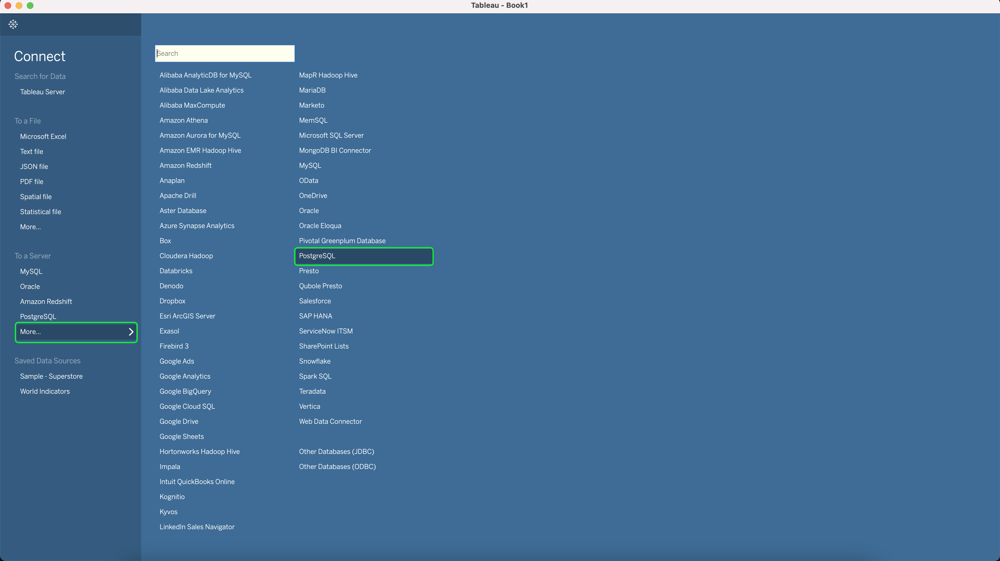

# Connect [!DNL Tableau] para Serviço de Consulta

Este documento aborda as etapas para conectar o Tableau ao Adobe Experience Platform [!DNL Query Service].

>[!NOTE]
>
> Este guia supõe que você já tenha acesso ao [!DNL Tableau] e estão familiarizados com como navegar em sua interface. Mais informações sobre [!DNL Tableau] podem ser encontradas no [funcionário [!DNL Tableau] documentação](https://help.tableau.com/current/pro/desktop/en-us/default.htm).

Para ligar [!DNL Tableau] para [!DNL Query Service], abrir [!DNL Tableau]e no **[!DNL To a Server]** seção selecionar **[!DNL More]** seguida de **[!DNL PostgreSQL]**

Agora você pode inserir valores para se conectar ao Adobe Experience Platform. Para obter mais informações sobre como encontrar o nome do banco de dados, o host, a porta e as credenciais de logon, leia a [guia de credenciais](../ui/credentials.md). Para localizar suas credenciais, faça logon em [!DNL Platform], em seguida selecione **[!UICONTROL Queries]**, seguida de **[!UICONTROL Credenciais]**.

Verifique se você marcou a **[!UICONTROL SSL obrigatório]** antes de tentar se conectar.

>[!IMPORTANT]
>
>Consulte a [[!DNL Query Service] Documentação SSL](./ssl-modes.md) para saber mais sobre o suporte SSL para conexões de terceiros com o Adobe Experience Platform Query Service e como se conectar usando `verify-full` Modo SSL.

>[!IMPORTANT]
>
>As estruturas de dados aninhadas em ferramentas de BI de terceiros podem ser niveladas para melhorar sua usabilidade e reduzir a carga de trabalho necessária para recuperar, analisar, transformar e relatar dados. Consulte a documentação no[`FLATTEN` recurso](../best-practices/flatten-nested-data.md) para obter instruções sobre como ativar essa configuração ao se conectar a um banco de dados.

Depois de preencher todas as suas credenciais, selecione **[!DNL Sign In]** para continuar.

Agora você se conectou ao Adobe Experience Platform, com uma lista das tabelas exibidas no lado.

## Próximas etapas

Agora que você se conectou a [!DNL Query Service], você pode usar [!DNL Tableau] para gravar queries. Para obter mais informações sobre como gravar e executar consultas, leia o guia em [execução de consultas](../best-practices/writing-queries.md).
