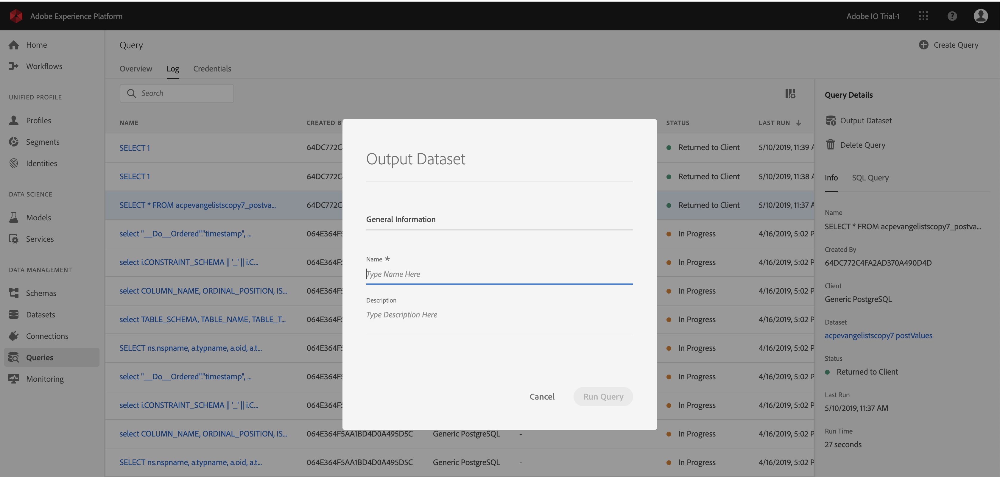

# Gerar conjuntos de dados a partir dos resultados do query

O verdadeiro poder do [!DNL Query Service] é revelado quando os query são usados para gerar conjuntos de dados no para [!DNL Data Lake] serem usados como entrada em mais query ou em outros serviços, como [!DNL Data Science Workspace], [!DNL Real-time Customer Profile]ou [!DNL Analysis Workspace].

[!DNL Query Service] permite a criação de conjuntos de dados da interface do usuário. Siga estas etapas:

1. Grave seu query usando um cliente conectado e valide a saída.
2. Faça logon na [!DNL Platform] interface do usuário e vá para Query.
3. Encontre seu query na lista e passe o mouse sobre a linha.
4. Click **[!UICONTROL Create Dataset]**. 
5. Insira um nome de conjunto de dados, anexado à sua ID LDAP (não precisa ser exclusivo ou seguro para SQL); o sistema gera um &quot;nome de tabela&quot; com base no nome fornecido aqui).
6. Insira uma descrição do conjunto de dados e clique em **[!UICONTROL Executar Query]**.
7. Observe o query ser concluído e vá para a página de lista do conjunto de dados para ver o conjunto de dados que você acabou de criar.

Depois que um conjunto de dados é criado, ele pode ser acessado como qualquer outro conjunto de dados no [!DNL Data Lake] e usado para vários casos de uso.

>[!NOTE]
>
>Em uma implementação em tempo real, você deve aplicar [!DNL Data Governance] rótulos após a criação do conjunto de dados.

## Gerar conjuntos de dados com um [!DNL Experience Data Model] schema predefinido

Para gerar um conjunto de dados com um schema predefinido [!DNL Experience Data Model] (XDM), é necessário usar a sintaxe SQL. Para obter mais informações sobre qual sintaxe você deve usar, leia o guia [Sintaxe](../sql/syntax.md#create-table-as-select)SQL.

## Conjuntos de dados de saída

Os conjuntos de dados criados por meio dessa funcionalidade são gerados com um schema ad hoc que corresponde à estrutura dos dados de saída, conforme definido na instrução SQL. Alguns serviços downstream exigem conjuntos de dados com schemas específicos [!DNL Experience Data Model] (XDM). Verifique os requisitos de formatação de dados para serviços downstream antes de gravar seus query.