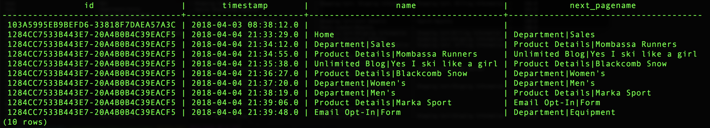

# Uso de funções definidas pela Adobe

Um dos grandes diferenciais da Adobe é que eles entendem os dados de experiência e o que os clientes precisam para poder fazer com esses dados. Você pode usar essa compreensão para criar funções auxiliares que facilitem seu trabalho.

Este documento cobre funções definidas pela Adobe (ADFs) para suportar três [!DNL Analytics] atividades principais:
- [Sessões](#sessionization)
- [Atribuição](#attribution)
- [Definição de caminho](#pathing)

## Sessões

O `SESS_TIMEOUT()` reproduz os agrupamentos de visitas encontrados com o Adobe Analytics. Ele executa um agrupamento com base em tempo semelhante, mas com parâmetros personalizáveis.

**Sintaxe:**

`SESS_TIMEOUT(timestamp, timeout_in_seconds) OVER ([partition] [order] [frame])`

**Devoluções:**

Estrutura com campos `(timestamp_diff, num, is_new, depth)`

### Explore o nível de linha `SESS_TIMEOUT()` e a saída

```sql
SELECT analyticsVisitor,
      session.is_new,
      session.timestamp_diff,
      session.num,
      session.depth
FROM  (
        SELECT endUserIDs._experience.aaid.id as analyticsVisitor,
        SESS_TIMEOUT(timestamp, 60 * 30)
        OVER (PARTITION BY endUserIDs._experience.aaid.id
        ORDER BY timestamp
        ROWS BETWEEN UNBOUNDED PRECEDING AND CURRENT ROW)
        AS session
        FROM your_analytics_table
        WHERE _ACP_YEAR = 2018
      )
LIMIT 100;
```


### Criar um novo relatório de tendências com visitantes, sessões e visualizações de página

```sql
SELECT
      date_format( from_utc_timestamp(timestamp, 'EDT') , 'yyyy-MM-dd') as Day,
      COUNT(DISTINCT analyticsVisitor ) as Visitors,
      COUNT(DISTINCT analyticsVisitor || session.num ) as Sessions,
      SUM( PageViews ) as PageViews
FROM
    (
      SELECT
          timestamp,
          endUserIDs._experience.aaid.id as analyticsVisitor,
          SESS_TIMEOUT(timestamp, 60 * 30)
      OVER (PARTITION BY endUserIDs._experience.aaid.id
      ORDER BY timestamp
      ROWS BETWEEN UNBOUNDED PRECEDING AND CURRENT ROW)
      AS session,
          web.webPageDetails.pageviews.value as PageViews
      FROM your_analytics_table
      WHERE _ACP_YEAR = 2018
    )
GROUP BY Day 
ORDER BY Day DESC 
LIMIT 31;
```


## Atribuição

A atribuição é a forma como você aloca métricas ou conversões, como receita, pedido ou inscrições, para seus esforços de marketing.

No Adobe Analytics, as configurações de atribuição são configuradas usando variáveis como eVars e são geradas conforme os dados são assimilados.

Os ADFs de Atribuição encontrados em [!DNL Query Service] permitem que essas alocações sejam definidas e geradas no momento do query.

Este exemplo foca na atribuição de último toque, mas a Adobe também oferta a atribuição de primeiro toque.

>[!NOTE]
>
>Outras opções com tempos limite e expiração com base em eventos estarão disponíveis em versões futuras do [!DNL Query Service].

**Sintaxe:**

`ATTRIBUTION_LAST_TOUCH(timestamp, [channel_name], column) OVER ([partition] [order] [frame])`

**Devoluções:**

Estrutura com campo `(value)`

### Explore a atribuição em nível de linha

```sql
SELECT
  endUserIds._experience.aaid.id,
  _experience.analytics.customDimensions.evars.evar10 as MemberLevel,
  ATTRIBUTION_LAST_TOUCH(timestamp, 'eVar10', _experience.analytics.customDimensions.evars.evar10)
      OVER(PARTITION BY endUserIds._experience.aaid.id
           ORDER BY timestamp
           ROWS BETWEEN UNBOUNDED PRECEDING AND CURRENT ROW).value
      AS LastMemberLevel,
  commerce.purchases.value as Orders
FROM your_analytics_table 
WHERE _ACP_YEAR=2018 AND _ACP_MONTH=4
LIMIT 50;
```


### Criar um detalhamento de pedidos por Nível do último membro (eVar10)

```sql
SELECT
  LastMemberLevel,
  SUM(Orders) as MemberLevelOrders
FROM 
(SELECT
  ATTRIBUTION_LAST_TOUCH(timestamp, 'eVar10', _experience.analytics.customDimensions.evars.evar10)
      OVER(PARTITION BY endUserIds._experience.aaid.id
           ORDER BY timestamp
           ROWS BETWEEN UNBOUNDED PRECEDING AND CURRENT ROW).value
      AS LastMemberLevel,
  commerce.purchases.value as Orders
FROM your_analytics_table 
WHERE _ACP_YEAR=2018 AND _ACP_MONTH=4
)
GROUP BY LastMemberLevel 
ORDER BY MemberLevelOrders DESC
LIMIT 25;
```


## Definição de caminho

A definição de caminho ajuda a entender como os clientes navegam em seu site. O `NEXT()` e os `PREVIOUS()` ADFs possibilitam isso.

**Sintaxe:**

```
NEXT(key, [shift, [ignoreNulls]]) OVER ([partition] [order] [frame])
PREVIOUS(key, [shift, [ignoreNulls]]) OVER ([partition] [order] [frame])
```

**Devoluções:**

Estrutura com campo `(value)`

### Selecionar a página atual e a próxima página

```sql
SELECT 
      endUserIds._experience.aaid.id,
      timestamp,
      web.webPageDetails.name,
      NEXT(web.webPageDetails.name, 1, true)
          OVER(PARTITION BY endUserIds._experience.aaid.id
              ORDER BY timestamp
              ROWS BETWEEN CURRENT ROW AND UNBOUNDED FOLLOWING).value
          AS next_pagename
FROM your_analytics_table
WHERE _ACP_YEAR=2018 
LIMIT 10;
```



### Criar um relatório de detalhamento para os cinco principais nomes de página na entrada da sessão

```sql
  SELECT 
    PageName,
    PageName_2,
    PageName_3,
    PageName_4,
    PageName_5,
    SUM(PageViews) as PageViews
  FROM
    (SELECT
      PageName,
      NEXT(PageName, 1, true)
        OVER(PARTITION BY VisitorID, session.num
              ORDER BY timestamp
              ROWS BETWEEN CURRENT ROW AND UNBOUNDED FOLLOWING).value
        AS PageName_2,
      NEXT(PageName, 2, true)
        OVER(PARTITION BY VisitorID, session.num
              ORDER BY timestamp
              ROWS BETWEEN CURRENT ROW AND UNBOUNDED FOLLOWING).value
        AS PageName_3,
      NEXT(PageName, 3, true)
         OVER(PARTITION BY VisitorID, session.num
              ORDER BY timestamp
              ROWS BETWEEN CURRENT ROW AND UNBOUNDED FOLLOWING).value
        AS PageName_4,
      NEXT(PageName, 4, true)
         OVER(PARTITION BY VisitorID, session.num
              ORDER BY timestamp
              ROWS BETWEEN CURRENT ROW AND UNBOUNDED FOLLOWING).value
        AS PageName_5,
      PageViews,
      session.depth AS SessionPageDepth
    FROM
      (SELECT
        endUserIds._experience.aaid.id as VisitorID,
        timestamp,
        web.webPageDetails.pageviews.value AS PageViews,
        web.webPageDetails.name AS PageName,
        SESS_TIMEOUT(timestamp, 60 * 30) 
          OVER (PARTITION BY endUserIDs._experience.aaid.id 
                ORDER BY timestamp 
                ROWS BETWEEN UNBOUNDED PRECEDING AND CURRENT ROW) 
        AS session
      FROM your_analytics_table
      WHERE _ACP_YEAR=2018)
    )
  WHERE SessionPageDepth=1
  GROUP BY PageName, PageName_2, PageName_3, PageName_4, PageName_5
  ORDER BY PageViews DESC
  LIMIT 100;
```


## Recursos adicionais

O vídeo a seguir mostra como executar query na interface do Adobe Experience Platform e em um cliente PSQL. Além disso, o vídeo também usa exemplos envolvendo propriedades individuais em um objeto XDM, usando funções definidas pela Adobe e usando CREATE TABLE AS SELECT (CTAS).

>[!VIDEO](https://video.tv.adobe.com/v/29796?quality=12&learn=on)

