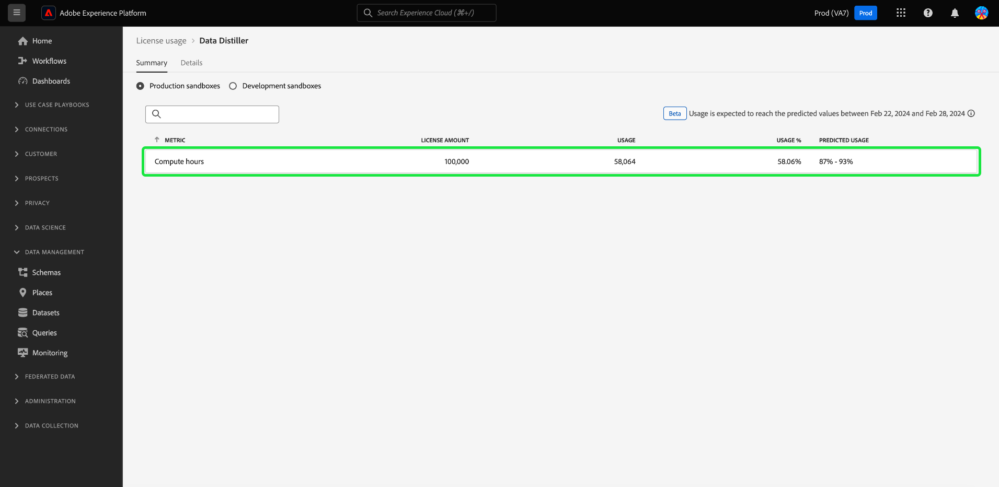

# Monitorar uso de licença de consulta em lote {#monitor-license-usage}

A interface do usuário do Adobe Experience Platform (UI) fornece um painel pelo qual você pode visualizar informações importantes sobre o uso de licenças do Serviço de query da sua organização.

Para obter instruções detalhadas sobre como acessar e interagir com o painel de uso da licença na interface do usuário, bem como para saber mais sobre as métricas disponíveis exibidas no painel, visite o [guia do painel de uso de licenças](../../dashboards/guides/license-usage.md).

Leia o [visão geral dos painéis](../../dashboards/home.md) para obter um resumo de todos os recursos do painel no Experience Platform.

## Widgets {#widgets}

O painel de uso da licença é composto de widgets, que exibem métricas somente leitura, fornecendo informações importantes sobre o uso da licença de sua organização. As métricas visíveis dependem do licenciamento específico da sua organização.

Selecione um botão de opção para escolher uma sandbox para análise e use a lista suspensa para selecionar um período de tempo para a análise. As opções disponíveis são 30 dias, 90 dias, 12 meses, o último ano, o período completo do contrato ou uma data personalizada.

## Calcular horas {#compute-hours}

O [!UICONTROL Calcular horas] O widget usa um gráfico de linhas para visualizar o tempo de processamento de consultas em lote de sua organização a cada dia. O widget exibe três métricas indicadas por um número na parte superior esquerda do widget. São eles

- [!UICONTROL Real]: O número total de horas computacionais para o período escolhido na lista suspensa de visão geral. Essa métrica também é indicada no gráfico por uma linha sólida.
- [!UICONTROL Licenciado]: O número total de horas computacionais permitidas pelo contrato de licença de sua organização. Essa métrica também é indicada no gráfico por uma linha pontilhada.
- [!UICONTROL Uso]: Essa é a porcentagem de seu uso em relação ao máximo de horas de computação acordado pela licença.

>[!IMPORTANT]
>
>O [!UICONTROL Calcular horas] O widget é aplicável somente a clientes com a licença do Data Distiller para consultas em lote.

