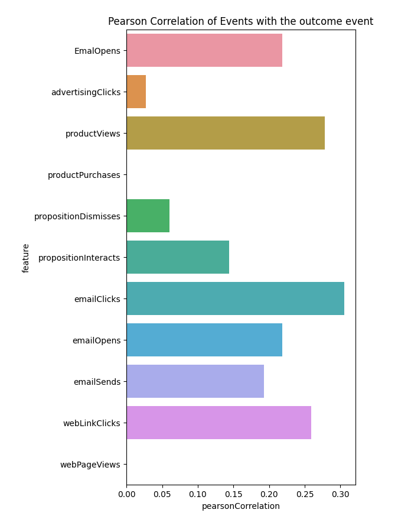

# Análise exploratória de dados

Este documento fornece alguns exemplos básicos e práticas recomendadas para usar o Data Distiller para explorar e analisar dados de uma [!DNL Python] notebook.

## Introdução

Antes de continuar com este guia, verifique se você criou uma conexão com o Data Distiller em seu [!DNL Python] notebook. Consulte a documentação para obter instruções sobre como [conectar um [!DNL Python] notebook para o Data Distiller](./establish-connection.md).

## Adquirir estatísticas básicas {#basic-statistics}

Use o código abaixo para recuperar o número de linhas e perfis distintos em um conjunto de dados.

```python
table_name = 'ecommerce_events'

basic_statistics_query = f"""
SELECT
    COUNT(_id) as "totalRows",
    COUNT(DISTINCT _id) as "distinctUsers"
FROM {table_name}"""

df = qs_cursor.query(basic_statistics_query, output="dataframe")
df
```

**Saída de exemplo**

|     | totalRows | distinctUsers |
| --- | ----------- | -------------- |
| 0 | 1276563 | 1276563 |

## Criar uma versão de amostra de conjuntos de dados grandes {#create-dataset-sample}

Se o conjunto de dados que você deseja consultar for muito grande ou se os resultados exatos das consultas exploratórias não forem necessários, use o [funcionalidade de amostragem](../../essential-concepts/dataset-samples.md) disponível para consultas do Data Distiller. Este é um processo de duas etapas:

- Primeiro, **analyse** o conjunto de dados para criar uma versão de amostra com uma taxa de amostragem especificada
- Em seguida, consulte a versão de amostra do conjunto de dados. Dependendo das funções aplicadas ao conjunto de dados de amostra, talvez você queira dimensionar a saída para os números para o conjunto de dados completo

### Criar uma amostra de 5% {#create-sample}

O exemplo abaixo analisa o conjunto de dados e cria uma amostra de 5%:

```python
# A sampling rate of 10 is 100% in Query Service, so for 5% use a sampling rate 0.5
sampling_rate = 0.5

analyze_table_query=f"""
SET aqp=true;
ANALYZE TABLE {table_name} TABLESAMPLE SAMPLERATE {sampling_rate}"""

qs_cursor.query(analyze_table_query, output="raw")
```

### Veja suas amostras {#view-sample}

Você pode usar o `sample_meta` Função para exibir todas as amostras que foram criadas de um determinado conjunto de dados. O trecho de código abaixo demonstra como usar a variável `sample_meta` função.

```python
sampled_version_of_table_query = f'''SELECT sample_meta('{table_name}')'''

df_samples = qs_cursor.query(sampled_version_of_table_query, output="dataframe")
df_samples
```

**Saída de exemplo**:

|   | sample_table_name | sample_dataset_id | parent_dataset_id | sample_type | taxa_de_amostragem | filter_condition_on_source_dataset | sample_num_rows | criado |
|---|---|---|---|---|---|---|---|---|
| 0 | cmle_summary_data_experience_event_dataset_c... | 650f7a09ed6c3e28d34d7fc2 | 64fb4d7a7d748828d304a2f4 | uniforme | 0.5 | 6427 | 23/09/2023 | 11:51:37 |

{style="table-layout:auto"}

### Consulte sua amostra {#query-sample-data}

Você pode consultar sua amostra diretamente referenciando o nome da tabela de exemplo dos metadados retornados. Você pode multiplicar os resultados pela taxa de amostragem para obter uma estimativa.

```python
sample_table_name = df_samples[df_samples["sampling_rate"] == sampling_rate]["sample_table_name"].iloc[0]

count_query=f'''SELECT count(*) as cnt from {sample_table_name}'''

df = qs_cursor.query(count_query, output="dataframe")
# Divide by the sampling rate to extrapolate to the full dataset
approx_count = df["cnt"].iloc[0] / (sampling_rate / 100)

print(f"Approximate count: {approx_count} using {sampling_rate *10}% sample")
```

**Saída de exemplo**

```console
Approximate count: 1284600.0 using 5.0% sample
```

## Análise de funil de email {#email-funnel-analysis}

Uma análise de funil é um método para entender as etapas necessárias para atingir um resultado desejado e quantos usuários passam por cada uma dessas etapas. O exemplo abaixo ilustra uma simples análise de funil das etapas que levam um usuário a assinar um boletim informativo. O resultado da assinatura é representado por um tipo de evento de `web.formFilledOut`.

Primeiro, execute uma query para obter o número de usuários em cada etapa.

```python
simple_funnel_analysis_query = f'''SELECT eventType, COUNT(DISTINCT _id) as "distinctUsers",COUNT(_id) as "distinctEvents" FROM {table_name} GROUP BY eventType ORDER BY distinctUsers DESC'''

funnel_df = qs_cursor.query(simple_funnel_analysis_query, output="dataframe")
funnel_df
```

**Saída de exemplo**

|   | eventType | distinctUsers | distinctEvents |
|---|---|---|---|
| 0 | directMarketing.emailSent | 598840 | 598840 |
| 1 | directMarketing.emailOpened | 239028 | 239028 |
| 2 | web.webpagedetails.pageViews | 120118 | 120118 |
| 3 | advertising.impressions | 119669 | 119669 |
| 4 | directMarketing.emailClicked | 51581 | 51581 |
| 5 | commerce.productViews | 37915 | 37915 |
| 6 | decisioning.propositionDisplay | 37650 | 37650 |
| 7 | web.webinteraction.linkClicks | 37581 | 37581 |
| 8 | web.formFilledOut | 17860 | 17860 |
| 9 | advertising.clicks | 7610 | 7610 |
| 10 | decisioning.propositionInteract | 2964 | 2964 |
| 11 | decisioning.propositionDismiss | 2889 | 2889 |
| 12 | commerce.purchases | 2858 | 2858 |

{style="table-layout:auto"}

### Plotar resultados da consulta {#plot-results}

Em seguida, plote os resultados da consulta usando o [!DNL Python] `plotly` biblioteca:

```python
import plotly.express as px

email_funnel_events = ["directMarketing.emailSent", "directMarketing.emailOpened", "directMarketing.emailClicked", "web.formFilledOut"]
email_funnel_df = funnel_df[funnel_df["eventType"].isin(email_funnel_events)]

fig = px.funnel(email_funnel_df, y='eventType', x='distinctUsers')
fig.show()
```

**Saída de exemplo**


## Correlações de evento {#event-correlations}

Outra análise comum é calcular correlações entre tipos de evento e um tipo de evento de conversão de destino. Neste exemplo, o evento de subscrição é representado por `web.formFilledOut`. Este exemplo usa o [!DNL Spark] Funções disponíveis em queries do Data Distiller para realizar as seguintes etapas:

1. Conte o número de eventos para cada tipo de evento por perfil.
2. Agregue as contagens de cada tipo de evento nos perfis e calcule as correlações de cada tipo de evento com `web,formFilledOut`.
3. Transforme o quadro de dados de contagens e correlações em uma tabela de coeficientes de correlação Pearson de cada recurso (contagens do tipo de evento) com o evento de destino.
4. Visualizar os resultados em um gráfico.

A variável [!DNL Spark] As funções agregam os dados para retornar uma pequena tabela de resultados, de modo que você possa executar esse tipo de consulta no conjunto de dados completo.

```python
large_correlation_query=f'''
SELECT SUM(webFormsFilled) as webFormsFilled_totalUsers,
       SUM(advertisingClicks) as advertisingClicks_totalUsers,
       SUM(productViews) as productViews_totalUsers,
       SUM(productPurchases) as productPurchases_totalUsers,
       SUM(propositionDismisses) as propositionDismisses_totaUsers,
       SUM(propositionDisplays) as propositionDisplays_totaUsers,
       SUM(propositionInteracts) as propositionInteracts_totalUsers,
       SUM(emailClicks) as emailClicks_totalUsers,
       SUM(emailOpens) as emailOpens_totalUsers,
       SUM(webLinkClicks) as webLinksClicks_totalUsers,
       SUM(webPageViews) as webPageViews_totalusers,
       corr(webFormsFilled, emailOpens) as webForms_EmailOpens,
       corr(webFormsFilled, advertisingClicks) as webForms_advertisingClicks,
       corr(webFormsFilled, productViews) as webForms_productViews,
       corr(webFormsFilled, productPurchases) as webForms_productPurchases,
       corr(webFormsFilled, propositionDismisses) as webForms_propositionDismisses,
       corr(webFormsFilled, propositionInteracts) as webForms_propositionInteracts,
       corr(webFormsFilled, emailClicks) as webForms_emailClicks,
       corr(webFormsFilled, emailOpens) as webForms_emailOpens,
       corr(webFormsFilled, emailSends) as webForms_emailSends,
       corr(webFormsFilled, webLinkClicks) as webForms_webLinkClicks,
       corr(webFormsFilled, webPageViews) as webForms_webPageViews
FROM(
    SELECT _{tenant_id}.cmle_id as userID,
            SUM(CASE WHEN eventType='web.formFilledOut' THEN 1 ELSE 0 END) as webFormsFilled,
            SUM(CASE WHEN eventType='advertising.clicks' THEN 1 ELSE 0 END) as advertisingClicks,
            SUM(CASE WHEN eventType='commerce.productViews' THEN 1 ELSE 0 END) as productViews,
            SUM(CASE WHEN eventType='commerce.productPurchases' THEN 1 ELSE 0 END) as productPurchases,
            SUM(CASE WHEN eventType='decisioning.propositionDismiss' THEN 1 ELSE 0 END) as propositionDismisses,
            SUM(CASE WHEN eventType='decisioning.propositionDisplay' THEN 1 ELSE 0 END) as propositionDisplays,
            SUM(CASE WHEN eventType='decisioning.propositionInteract' THEN 1 ELSE 0 END) as propositionInteracts,
            SUM(CASE WHEN eventType='directMarketing.emailClicked' THEN 1 ELSE 0 END) as emailClicks,
            SUM(CASE WHEN eventType='directMarketing.emailOpened' THEN 1 ELSE 0 END) as emailOpens,
            SUM(CASE WHEN eventType='directMarketing.emailSent' THEN 1 ELSE 0 END) as emailSends,
            SUM(CASE WHEN eventType='web.webinteraction.linkClicks' THEN 1 ELSE 0 END) as webLinkClicks,
            SUM(CASE WHEN eventType='web.webinteraction.pageViews' THEN 1 ELSE 0 END) as webPageViews
    FROM {table_name}
    GROUP BY userId
)
'''
large_correlation_df = qs_cursor.query(large_correlation_query, output="dataframe")
large_correlation_df
```

**Saída de exemplo**:

|   | webFormsFilled_totalUsers | advertisingClicks_totalUsers | productViews_totalUsers | productPurchases_totalUsers | propositionDismisses_totalUsers | propositionDisplays_totalUsers | propositionInteracts_totalUsers | emailClicks_totalUsers | emailOpens_totalUsers | webLinksClicks_totalUsers | .. | webForms_advertisingClicks | webForms_productViews | webForms_productPurchases | webForms_propositionDismisses | webForms_propositionInteracts | webForms_emailClicks | webForms_emailOpens | webForms_emailSends | webForms_webLinkClicks | webForms_webPageViews |
|---|---|---|---|---|---|---|---|---|---|---|---|---|---|---|---|---|---|---|---|---|---|
| 0 | 17860 | 7610 | 37915 | 0 | 2889 | 37650 | 2964 | 51581 | 239028 | 37581 | … | 0.026805 | 0.2779 | None | 0.06014 | 0.143656 | 0.305657 | 0.218874 | 0.192836 | 0.259353 | None |

{style="table-layout:auto"}

### Transformar linha em correlação de tipo de evento {#event-type-correlation}

Em seguida, transforme a única linha de dados na saída de query acima, em uma tabela que mostre as correlações de cada tipo de evento com o evento de subscrição de target:

```python
cols = large_correlation_df.columns
corrdf = large_correlation_df[[col for col in cols if ("webForms_"  in col)]].melt()
corrdf["feature"] = corrdf["variable"].apply(lambda x: x.replace("webForms_", ""))
corrdf["pearsonCorrelation"] = corrdf["value"]

corrdf.fillna(0)
```

**Saída de exemplo**:

|    | variável | Valor de  | recurso | pearsonCorrelation |
| --- | ---  |  ---  |  ---  | --- |
| 0 | `webForms_EmailOpens` | 0.218874 | EmailOpens | 0.218874 |
| 1 | `webForms_advertisingClicks` | 0.026805 | advertisingClicks | 0.026805 |
| 2 | `webForms_productViews` | 0.277900 | productViews | 0.277900 |
| 3 | `webForms_productPurchases` | 0.000000 | productPurchases | 0.000000 |
| 4 | `webForms_propositionDismisses` | 0.060140 | propositionDismisses | 0.060140 |
| 5 | `webForms_propositionInteracts` | 0.143656 | propositionInteracts | 0.143656 |
| 6 | `webForms_emailClicks` | 0.305657 | emailClicks | 0.305657 |
| 7 | `webForms_emailOpens` | 0.218874 | emailOpens | 0.218874 |
| 8 | `webForms_emailSends` | 0.192836 | emailSends | 0.192836 |
| 9 | `webForms_webLinkClicks` | 0.259353 | webLinkClicks | 0.259353 |
| 10 | `webForms_webPageViews` | 0.000000 | webPageViews | 0.000000 |


Por fim, é possível visualizar as correlações com a variável `matplotlib` Biblioteca Python:

```python
import matplotlib.pyplot as plt
fig, ax = plt.subplots(figsize=(5,10))
sns.barplot(data=corrdf.fillna(0), y="feature", x="pearsonCorrelation")
ax.set_title("Pearson Correlation of Events with the outcome event")
```



## Próximas etapas

Ao ler este documento, você aprendeu a usar o Data Distiller para explorar e analisar dados de uma [!DNL Python] notebook. A próxima etapa na criação de pipelines de recursos, do Experience Platform para alimentar modelos personalizados no ambiente de aprendizado de máquina, é criar pipelines de recursos [recursos de engenharia para aprendizado de máquina](./feature-engineering.md).
