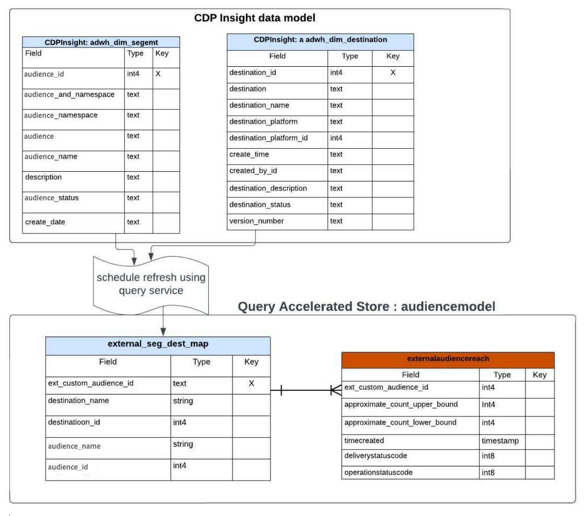

# Consultar guia acelerado de insights de relatórios de loja

O armazenamento acelerado de consultas permite reduzir o tempo e o poder de processamento necessários para obter insights críticos de seus dados. Normalmente, os dados são processados em intervalos regulares (por exemplo, por hora ou por dia), onde as exibições agregadas são criadas e relatadas. A análise desses relatórios gerados a partir de dados agregados deriva insights destinados a melhorar o desempenho dos negócios. O query accelerated store fornece um serviço de cache, simultaneidade, uma experiência interativa e uma API sem estado. No entanto, ele presume que os dados são pré-processados e otimizados para consulta agregada e não para consulta de dados brutos.

O armazenamento acelerado de query permite criar um modelo de dados personalizado e/ou estender um modelo de dados existente do Adobe Real-Time Customer Data Platform. Em seguida, é possível envolver ou incorporar seus insights de relatório em uma estrutura de relatórios/visualização de sua escolha. Consulte a documentação do Modelo de Dados do Real-Time Customer Data Platform Insights para saber como [personalizar seus modelos de consulta SQL para criar relatórios do Real-Time CDP para seus casos de uso de marketing e KPI (indicador chave de desempenho)](../../../dashboards/data-models/cdp-insights-data-model-b2c.md).

O modelo de dados do Real-Time CDP da Adobe Experience Platform fornece insights sobre perfis, públicos-alvo e destinos e ativa os painéis do Real-Time CDP insight. Este documento orienta você pelo processo de criação do modelo de dados de insights do relatório e também sobre como estender modelos de dados do Real-Time CDP, conforme necessário.

## Pré-requisitos

Este tutorial usa painéis definidos pelo usuário para visualizar dados de seu modelo de dados personalizado na interface do Experience Platform. Consulte a [documentação de painéis definidos pelo usuário](../../../dashboards/standard-dashboards.md) para saber mais sobre este recurso.

## Introdução

O SKU do Data Distiller é necessário para criar um modelo de dados personalizado para seus insights de relatório e estender os modelos de dados do Real-Time CDP que contêm dados enriquecidos do Experience Platform. Consulte a documentação de [empacotamento](../../packaging.md), [medidas de proteção](../../guardrails.md#query-accelerated-store) e [licenciamento](../../data-distiller/license-usage.md) relacionada à SKU do Data Distiller. Se você não tiver o Data Distiller SKU, entre em contato com o representante do serviço de atendimento ao cliente da Adobe para obter mais informações.

## Criar um modelo de dados de insights de relatórios

Este tutorial usa um exemplo de criação de um modelo de dados de insight de público-alvo. Se você usar uma ou mais plataformas de anunciante para alcançar seu público-alvo, poderá usar a API do anunciante para obter uma contagem de correspondência aproximada de seu público-alvo.

No início, você tem um modelo de dados inicial de suas fontes (possivelmente da API da plataforma do anunciante). Para fazer uma exibição agregada de seus dados brutos, crie um modelo de insights de relatório conforme descrito na imagem abaixo. Isso permite que um conjunto de dados obtenha os limites superior e inferior da correspondência do público-alvo.


Neste exemplo, a tabela/conjunto de dados `externalaudiencereach` é baseada em uma ID e rastreia os limites inferior e superior para a contagem de correspondências. A tabela/conjunto de dados de dimensão `externalaudiencemapping` mapeia a ID externa para um destino e público-alvo no Experience Platform.

## Crie um modelo para relatar insights com o Data Distiller

Em seguida, crie um modelo de relatório insight (`audienceinsight` neste exemplo) e use o comando SQL `ACCOUNT=acp_query_batch and TYPE=QSACCEL` para garantir que ele seja criado no repositório acelerado. Em seguida, use o Serviço de consulta para criar um esquema `audienceinsight.audiencemodel` para o banco de dados `audienceinsight`.

>[!NOTE]
>
>O SKU do Data Distiller é necessário para o comando `ACCOUNT=acp_query_batch`. Sem ele, um modelo de dados regular é criado no data lake.

```sql
CREATE database audienceinsight WITH (TYPE=QSACCEL, ACCOUNT=acp_query_batch);
 
CREATE schema audienceinsight.audiencemodel;
```

## Criar tabelas, relacionamentos e preencher dados

Agora que você criou o modelo de insight de relatórios `audienceinsight`, crie as tabelas `externalaudiencereach` e `externalaudiencemapping` e estabeleça relações entre elas. Em seguida, use o comando `ALTER TABLE` para adicionar uma restrição de chave estrangeira entre as tabelas e definir uma relação. O exemplo de SQL a seguir demonstra como fazer isso.

```sql
CREATE TABLE IF NOT exists audienceinsight.audiencemodel.externalaudiencereach
WITH ( DISTRIBUTION = REPLICATE ) AS
  SELECT cast(null as int) approximate_count_upper_bound,
         cast(null as string) deliverystatusdescription,
         cast(null as timestamp)  timeupdated ,
         cast(null as int) operationstatuscode ,
         cast(null as string) operationstatusdescription,
         cast(null as int) approximate_count_lower_bound,
         cast(null as timestamp)timecreated ,
         cast(null as timestamp)timecontentupdated ,
         cast(null as int) deliverystatuscode ,
         cast(null as int)  ext_custom_audience_id
   WHERE false;
 
CREATE TABLE IF NOT exists audienceinsight.audiencemodel.externalaudiencemapping
WITH ( DISTRIBUTION = REPLICATE ) AS
SELECT cast(null as int) audience_id,
       cast(null as int) destination_id,
       cast(null as int) ext_custom_audience_id
 WHERE false;
 
ALTER TABLE externalaudiencereach ADD  CONSTRAINT FOREIGN KEY (ext_custom_audience_id) REFERENCES externalaudiencemapping (ext_custom_audience_id) NOT enforced;
```

Após a execução bem-sucedida de ambos os comandos `ALTER TABLE`, a relação entre as tabelas de fatos e de dimensões é formada.

Depois que as instruções forem executadas, use o comando `SHOW datagroups;` para retornar uma lista dos conjuntos de dados disponíveis no armazenamento acelerado do `audienceinsight.audiencemodel`. Os resultados tabelados devem ser semelhantes ao exemplo fornecido abaixo.

>[!IMPORTANT]
>
>Somente dados no repositório acelerado podem ser acessados do ponto de extremidade de API sem estado do Serviço de Consulta `POST /data/foundation/query/accelerated-queries`.

```console
    Database     |    Schema     | GroupType |      ChildType       |        ChildName        | PhysicalParent |               ChildId               
|-----------------+---------------+-----------+----------------------+-------------------------+----------------+--------------------------------------
 audienceinsight | audiencemodel | QSACCEL   | Data Warehouse Table | externalaudiencemapping | true           | 9155d3b4-889d-41da-9014-5b174f6fa572
 audienceinsight | audiencemodel | QSACCEL   | Data Warehouse Table | externalaudiencereach   | true           | 1b941a6d-6214-4810-815c-81c497a0b636
```

## Consultar o modelo de dados de relatórios do insight

Use o Serviço de consulta para consultar a tabela de dimensões `audiencemodel.externalaudiencereach`. Um exemplo de query pode ser visto abaixo.

```sql
SELECT a.ext_custom_audience_id,
       a.approximate_count_upper_bound
FROM   audiencemodel.externalaudiencereach AS a
       LEFT OUTER JOIN audiencemodel.externalaudiencemapping AS b
                    ON ( ( a.ext_custom_audience_id ) =
                         ( b.ext_custom_audience_id ) )
GROUP  BY a.ext_custom_audience_id,
          a.approximate_count_upper_bound
LIMIT  5000 ;
```

Os resultados tabulados incluem uma contagem e uma ID.

```console
ext_custom_audience_id | approximate_count_upper_bound
|------------------------+-------------------------------
 23850912218170554      |                          1000
 23850808585120554      |                       1012000
 23850808585220554      |                        100000
 23850814978560554      |                          1000
 23850808585180554      |                        421000
 23850814978510554      |                       3001000
 23850814978530554      |                        300000
 23850912218160554      |                        105000
 23850808584990554      |                          1000
 23850809520110554      |                          1000
(10 rows)
```

## Estender seu modelo de dados com o modelo de dados do Real-Time CDP Insights

É possível estender seu modelo de público-alvo com detalhes adicionais para criar uma tabela de dimensão mais avançada. Por exemplo, é possível mapear o nome do público-alvo e o nome do destino para o identificador de público-alvo externo. Para fazer isso, use o Serviço de consulta para criar ou atualizar um novo conjunto de dados e adicioná-lo ao modelo de público-alvo que combina públicos-alvo e destinos com uma identidade externa. O diagrama abaixo ilustra o conceito dessa extensão do modelo de dados.



## Criar tabelas de dimensão para estender seu modelo de insights de relatórios

Use o Serviço de Consulta para adicionar os principais atributos descritivos dos conjuntos de dados de dimensão do Real-Time CDP enriquecidos ao modelo de dados `audienceinsight` e estabelecer uma relação entre sua tabela de fatos e a nova tabela de dimensões. O código SQL abaixo demonstra como integrar tabelas de dimensões existentes ao seu modelo de dados de insights de relatórios.

```sql
CREATE TABLE audienceinsight.audiencemodel.external_seg_dest_map AS
  SELECT ext_custom_audience_id,
         destination_name,
         audience_name,
         destination_status,
         a.destination_id,
         a.audience_id
  FROM   externalaudiencemapping AS a
         LEFT OUTER JOIN adwh_dim_audiences AS b
                      ON ( ( a.audience_id ) = ( b.audience_id ) )
         LEFT OUTER JOIN adwh_dim_destination AS c
                      ON ( ( a.destination_id ) = ( c.destination_id ) );
 
ALTER TABLE externalaudiencereach  ADD  CONSTRAINT FOREIGN KEY (ext_custom_audience_id) REFERENCES external_seg_dest_map (ext_custom_audience_id) NOT enforced;
```

Use o comando `SHOW datagroups;` para confirmar a criação da tabela de dimensões `external_seg_dest_map` adicionais.

```console
    Database     |     Schema     | GroupType |      ChildType       |                ChildName  | PhysicalParent |               ChildId               
|-----------------+----------------+-----------+----------------------+----------------------------------------------------+----------------+--------------------------------------
 audienceinsight | audiencemodel | QSACCEL   | Data Warehouse Table | external_seg_dest_map      | true           | 4b4b86b7-2db7-48ee-a67e-4b28cb900810
 audienceinsight | audiencemodel | QSACCEL   | Data Warehouse Table | externalaudiencemapping    | true           | b0302c05-28c3-488b-a048-1c635d88dca9
 audienceinsight | audiencemodel | QSACCEL   | Data Warehouse Table | externalaudiencereach      | true           | 4485c610-7424-4ed6-8317-eed0991b9727
```

## Consulte seu modelo de dados de insights de relatório de armazenamento acelerado estendido

Agora que o modelo de dados `audienceinsight` foi aumentado, ele está pronto para ser consultado. O SQL a seguir mostra a lista de destinos e públicos mapeados.

```sql
SELECT a.ext_custom_audience_id,
       b.destination_name,
       b.audience_name,
       b.destination_status,
       b.destination_id,
       b.audience_id
FROM   audiencemodel.externalaudiencereach1 AS a
       LEFT OUTER JOIN audiencemodel.external_seg_dest_map AS b
                    ON ( ( a.ext_custom_audience_id ) = (
                         b.ext_custom_audience_id ) )
LIMIT  25; 
```

A consulta retorna todos os conjuntos de dados no armazenamento acelerado de consultas:

```console
ext_custom_audience_id | destination_name |       audience_name        | destination_status | destination_id | audience_id 
|------------------------+------------------+---------------------------+--------------------+----------------+-------------
 23850808595110554      | FCA_Test2        | United States             | enabled            |     -605911558 | -1357046572
 23850799115800554      | FCA_Test2        | Born in 1980s             | enabled            |     -605911558 | -1224554872
 23850799115790554      | FCA_Test2        | Born in 1970s             | enabled            |     -605911558 |  1899603869
 23850798177620554      | FCA_Test1        | Billionaires              | enabled            |      321720439 |  1401872665
 23850814978560554      | FCA_Test3        | Canada - Saskatchewan     | enabled            |     1182494936 | -1917996562
 23850808585180554      | FCA_Test3        | United States             | enabled            |     1182494936 | -1357046572
 23850814978530554      | FCA_Test3        | Canada - British Columbia | enabled            |     1182494936 |  -652840507
 23850808585120554      | FCA_Test3        | Canada - Quebec           | enabled            |     1182494936 |  -519557860
 23850809520110554      | FCA_Test3        | Born in 1960s             | enabled            |     1182494936 |   237824266
 23850808585220554      | FCA_Test3        | Western Canada            | enabled            |     1182494936 |  1075937528
 23850808584990554      | FCA_Test3        | Canada - Ontario          | enabled            |     1182494936 |  1593438041
 23850814978510554      | FCA_Test3        | Canada - Alberta          | enabled            |     1182494936 |  1862946783
 23850912218170554      | FCA_Test4        | Canada - Alberta          | enabled            |     1549248886 |  1862946783
 23850912218160554      | FCA_Test4        | Born in 1970s             | enabled            |     1549248886 |  1899603869
```

## Visualizar seus dados com painéis definidos pelo usuário

Agora que criou seu modelo de dados personalizado, você está pronto para visualizar seus dados com consultas personalizadas e painéis definidos pelo usuário.

O SQL a seguir fornece um detalhamento da contagem de correspondências por públicos-alvo em um destino e um detalhamento de cada destino de públicos-alvo por público-alvo.

```sql
SELECT b.destination_name,
       a.approximate_count_upper_bound,
       b.audience_name
FROM   audiencemodel.externalaudiencereach AS a
       LEFT OUTER JOIN audiencemodel.external_seg_dest_map AS b
                    ON ( ( a.ext_custom_audience_id ) = (
                         b.ext_custom_audience_id ) )
GROUP  BY b.destination_name,
          a.approximate_count_upper_bound,
          b.audience_name
ORDER BY b.destination_name
LIMIT  5000
```

A imagem abaixo fornece um exemplo das possíveis visualizações personalizadas usando seu modelo de dados de insights de relatórios.


Seu modelo de dados personalizado pode ser encontrado na lista de modelos de dados disponíveis no espaço de trabalho do painel definido pelo usuário. Consulte o [guia do painel definido pelo usuário](../../../dashboards/standard-dashboards.md) para obter orientação sobre como utilizar seu modelo de dados personalizado.
