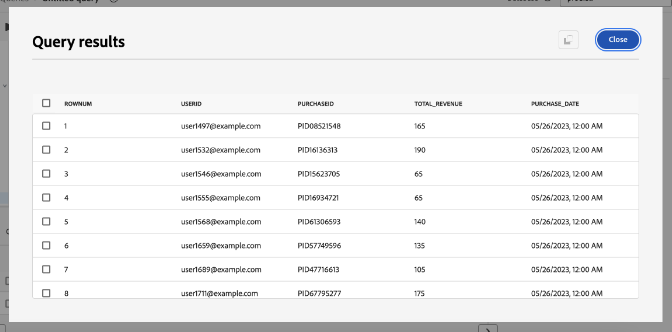
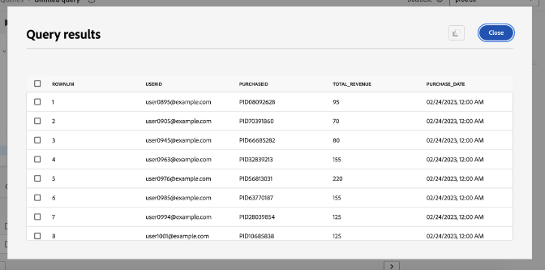
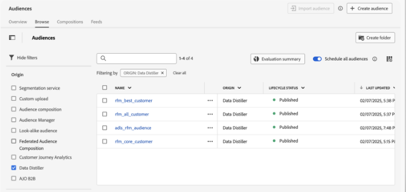

# Principais dicas para maximizar o valor com o Adobe Experience Platform Data Distiller - OS656

Esta página contém o conjunto de dados de exemplo para que você aplique o que aprendeu na sessão do Adobe Summit &quot;OS656 - Principais dicas para maximizar o valor com o Adobe Experience Platform Data Distiller&quot;. Você aprenderá a acelerar as implementações do Adobe Real-Time Customer Data Platform e do Journey Optimizer, enriquecendo os dados do Perfil do cliente em tempo real. Esse enriquecimento aproveita insights profundos nos padrões de comportamento do cliente para criar públicos-alvo para entrega e otimização de experiência.

Através do estudo de caso Luma, você analisará os dados comportamentais do usuário e criará um modelo de *Recenticidade, Frequência, Monetário (RFM)* — uma técnica de análise de marketing para segmentação de clientes com base nos padrões de compra.

## Pré-requisito

Para executar este caso de uso, sua instância do Adobe Experience Platform deve ser licenciada para o [Data Distiller](./overview.md). Entre em contato com seu representante da Adobe para obter mais informações.

## Visão geral do modelo RFM {#rfm-overview}

RFM, abreviação de Recency (R), Frequency (F) e Monetary (M), é uma abordagem orientada por dados para a segmentação e análise do cliente. Essa metodologia avalia três aspectos principais do comportamento do cliente: quanto tempo um cliente fez uma compra, com que frequência ele interage e quanto gasta. Ao quantificar esses fatores, as empresas podem obter insights acionáveis sobre os segmentos de clientes e desenvolver estratégias de marketing direcionadas que atendam melhor às necessidades individuais dos clientes.

## Entender o comportamento do cliente com o modelo RFM {#understand-customer-behavior}

O modelo RFM segmenta os clientes com base no comportamento transacional usando três parâmetros principais.

- A **Recenticidade** mede o tempo desde a última compra de um cliente, indicando os níveis de engajamento e o potencial de compra futuro.
- **Frequência** rastreia a frequência com que um cliente interage, servindo como um indicador claro de fidelidade e envolvimento contínuo.
- **Valor monetário** avalia o total de gastos por clientes, destacando seu valor geral para a empresa.

Ao combinar esses fatores, as empresas atribuem pontuações numéricas (normalmente em uma escala de `1` a `4`) a cada cliente. Pontuações mais baixas indicam resultados mais favoráveis. Por exemplo, um cliente que marca `1` em todas as categorias é considerado um dos melhores, demonstrando atividade recente, alto engajamento e gastos significativos.

## Benefícios e limitações do modelo RFM {#benefits-and-limitations}

Toda técnica de modelagem de marketing envolve compensações, oferecendo benefícios e limitações. A modelagem RFM é uma ferramenta valiosa para entender o comportamento do cliente e refinar as estratégias de marketing. Suas vantagens incluem a segmentação de clientes para personalizar mensagens, otimizar a receita e melhorar as taxas de resposta, a retenção, a satisfação e o Valor vitalício do cliente (CLTV).

No entanto, a modelagem RFM tem limitações. Ele presume uniformidade dentro dos segmentos com base na recenticidade, frequência e valor monetário, o que pode simplificar demais o comportamento do cliente. O modelo também atribui peso igual a esses fatores, possivelmente representando incorretamente o valor do cliente. Além disso, não leva em conta o contexto, como características específicas do produto ou preferências do cliente, o que pode levar a interpretações incorretas do comportamento de compra.

## Criar um público-alvo SQL dinâmico baseado em pontuação RFM {#build-a-dynamic-rfm-audience}

Antes de iniciar o estudo de caso do Luma, é necessário assimilar um conjunto de dados de amostra. Primeiro, [selecione o link para baixar o conjunto de dados `luma_web_data.zip` localmente](../resources/luma_web_data.zip). O conjunto de dados de exemplo é um arquivo csv em um formato .zip compactado para alinhar-se ao caso de uso. Descompacte esse arquivo ZIP usando o Adobe Acrobat ou uma ferramenta confiável de extração de arquivos, como o utilitário integrado do sistema operacional. Na prática, você normalmente obteria dados do Adobe Analytics, Adobe Commerce ou Adobe Web/Mobile SDK.

Neste tutorial, você usará o Data Distiller para extrair eventos e campos relevantes em um formato CSV padronizado. O objetivo é incluir apenas campos essenciais, mantendo uma estrutura de dados plana para oferecer eficiência e facilidade de uso.

### Etapa 1: Fazer upload dos dados CSV na Experience Platform {#upload-csv-data}

Siga estas etapas para fazer upload de um arquivo CSV para o Adobe Experience Platform.

#### Criar um conjunto de dados de um arquivo CSV {#create-a-dataset}

Na interface do usuário do Experience Platform, selecione **[!UICONTROL Conjuntos de dados]** no painel de navegação esquerdo, seguido de **[!UICONTROL Criar conjunto de dados]**. Em seguida, selecione **[!UICONTROL Criar conjunto de dados do arquivo CSV]** nas opções disponíveis.

O painel [!UICONTROL Configurar Conjunto de Dados] é exibido. No campo **[!UICONTROL Nome]**, insira o nome do conjunto de dados como &quot;luma_web_data&quot; e selecione **[!UICONTROL Próximo]**.

O painel [!UICONTROL Adicionar dados] é exibido. Arraste e solte o arquivo CSV na caixa **[!UICONTROL Adicionar dados]** ou selecione **[!UICONTROL Escolher Arquivo]** para procurar e carregar o arquivo.

Para saber mais sobre este processo, consulte o [tutorial de assimilação em lote](../../ingestion/tutorials/ingest-batch-data.md) e o [fluxo de trabalho de criação do conjunto de dados](../../catalog/datasets/user-guide.md#create) no guia da interface do usuário do conjunto de dados.

#### Revisar e concluir o upload {#review-and-complete-upload}

Depois que o arquivo for carregado, uma pré-visualização de dados será exibida na parte inferior da interface. Selecione **[!UICONTROL Concluir]** para concluir o carregamento.


A exibição das atividades do conjunto de dados para o conjunto de dados &quot;luma_web_data&quot; é exibida. O upload manual do arquivo CSV
é assimilado como um lote e identificado por uma [!UICONTROL ID do lote]. Um painel no lado direito exibe o nome da tabela como `luma_web_data`.

>[!TIP]
>
>Ao gravar consultas no Data Distiller, use o nome da tabela em vez do nome do conjunto de dados. O nome do conjunto de dados é usado apenas para navegação na interface do usuário.


<!--  
My table name is; luma_web_data_20250312_235611_817 Should we explain the suffix? 
-->

Após concluir o processamento dos dados, selecione [!UICONTROL Visualizar conjunto de dados] no canto superior direito para visualizar o conjunto de dados. É assim que a pré-visualização do conjunto de dados aparece:


#### Considerações sobre esquema {#schema-considerations}

Um esquema XDM estruturado (por exemplo, registro, evento ou esquemas B2B) não é necessário porque os dados são importados como um arquivo CSV bruto. Em vez disso, o conjunto de dados usa um esquema ad hoc.

>[!TIP]
>
>Os esquemas ad hoc são esquemas XDM com campos com namespace para uso somente por um único conjunto de dados. Esquemas ad hoc são usados em vários workflows de assimilação de dados para o Experience Platform e para criar determinados tipos de conexões de origem.

Embora o Data Distiller seja compatível com todos os tipos de esquema, o conjunto de dados final para assimilação no Perfil do cliente em tempo real usará um esquema XDM de registro.

### Etapa 2: conecte-se ao data lake e explore os conjuntos de dados disponíveis {#connect-to-the-data-lake-and-explore-datasets}

A próxima etapa é explorar os dados no data lake da Adobe Experience Platform para garantir precisão e integridade. Os dados devem ser precisos e completos para gerar insights significativos, mas erros, inconsistências ou valores ausentes podem ocorrer durante as transferências de dados. Isso torna essencial a verificação e a exploração de dados.

>[!TIP]
>
>O data lake armazena dados brutos e não processados, como logs de eventos, dados de sequência de cliques e registros assimilados em massa, para análise e processamento. A Loja de perfis contém dados identificáveis pelo cliente, incluindo eventos compilados por identidade e informações de atributos, para oferecer suporte à personalização e ativação em tempo real.

Use o Data Distiller para verificar a qualidade e a integridade do conjunto de dados por meio de várias operações. Para confirmar se os dados foram convertidos com precisão durante a assimilação, execute `SELECT` consultas para inspecioná-los, validá-los e analisá-los. Esse processo ajuda a identificar e resolver discrepâncias, inconsistências ou informações ausentes.

#### Executar uma consulta básica de exploração {#basic-exploration-queries}

Na interface do usuário do Adobe Experience Platform, selecione **[!UICONTROL Consultas]** no painel de navegação esquerdo e, em seguida, **[!UICONTROL Criar consulta]**. O Editor de consultas é exibido.

Cole a seguinte consulta no editor e execute-a:

```sql
SELECT * FROM luma_web_data; 
```

Os resultados da consulta são exibidos abaixo do Editor de consultas na guia **[!UICONTROL Resultados]**. Para expandir os resultados em um novo diálogo, selecione **[!UICONTROL Exibir resultados]**. Os resultados são semelhantes à imagem abaixo.


Consulte o documento [orientação geral para execução de consulta](../best-practices/writing-queries.md) para obter mais informações.

#### Focalizar em pedidos e excluir transações canceladas {#focus-orders-exclude-cancelled}

O modelo RFM avalia a recenticidade, a frequência e o valor monetário com base nas compras concluídas. Eventos não transacionais, como exibições de página e interações de check-out, são excluídos da análise. Além disso, as ordens canceladas devem ser removidas, pois não contribuem para cálculos RFM válidos e exigem uma abordagem de processamento diferente.

Para garantir a precisão:

- Identifique as IDs de compra associadas a cancelamentos e agrupe-as usando `GROUP BY`.
- Exclua essas IDs de compra do conjunto de dados.
- Filtre os dados para reter somente os pedidos concluídos.

As consultas a seguir demonstram como identificar e excluir pedidos cancelados do conjunto de dados.

Esta primeira consulta seleciona todas as IDs de compra não nulas associadas a um cancelamento e as agrega usando `GROUP BY`. As IDs de compra resultantes devem ser excluídas do conjunto de dados.

```sql
CREATE VIEW orders_cancelled
AS
  SELECT purchase_id
  FROM   luma_web_data
  WHERE  event_type IN ( 'order', 'cancellation' )
         AND purchase_id IS NOT NULL
  GROUP  BY purchase_id
  HAVING Count(DISTINCT event_type) = 2; 
```

A segunda query recupera somente as IDs de compra que não estão nesse conjunto excluído.

```sql
SELECT *
FROM   luma_web_data
WHERE  purchase_id NOT IN (SELECT purchase_id
                           FROM   orders_cancelled)
        OR purchase_id IS NULL; 
```

A terceira consulta remove todos os eventos que não são de ordem do conjunto de dados.

```sql
SELECT *
FROM   luma_web_data
WHERE  event_type = 'order'
       AND purchase_id NOT IN (SELECT purchase_id
                               FROM   orders_cancelled); 
```

### Etapa 3: enriquecer os dados usando as funções do Data Distiller {#enrich-the-data}

Em seguida, use o Data Distiller para extrair e transformar dados do cliente, gerar pontuações RFM, agregar transações e segmentar clientes por meio do comportamento de compra. Siga estas etapas para calcular valores de Recenticidade, Frequência e Monetário (RFM), criar um modelo de público-alvo e preparar insights para ativação.

#### Calcular a pontuação de RFM para cada ID de usuário exclusiva

Para calcular as pontuações RFM, extraia os campos principais dos dados brutos usando a filtragem de campo.

A próxima consulta se baseia na lógica da seção anterior selecionando email como `userid`, já que cada pedido requer um logon de email. O Data Distiller aplica a função `TO_DATE` para converter o carimbo de data/hora em um formato de data. O campo `total_revenue` representa o preço de cada transação e é agregado posteriormente pela soma para cada `userid`.

```sql
SELECT email AS userid, 
       purchase_id AS purchaseid, 
       price_total AS total_revenue, -- reflects the price for each individual transaction
       TO_DATE(timestamp) AS purchase_date -- converts timestamp to date format
FROM luma_web_data 
WHERE event_type = 'order' 
      AND purchase_id NOT IN (SELECT purchase_id FROM orders_cancelled) 
      AND email IS NOT NULL;
```

Os resultados se parecem com a imagem abaixo.



Em seguida, crie um `TABLE` para armazenar os resultados da consulta anterior em um conjunto de dados derivado. Copie e cole o seguinte comando no Editor de Consultas para criar um `TABLE`.

```sql
CREATE TABLE IF NOT EXISTS order_data AS
  SELECT email              AS userid,
         purchase_id        AS purchaseid,
         price_total        AS total_revenue,
         To_date(timestamp) AS purchase_date
  FROM   luma_web_data
  WHERE  event_type = 'order'
         AND purchase_id NOT IN (SELECT purchase_id FROM orders_cancelled)
         AND email IS NOT NULL; 
```

O resultado é semelhante à imagem a seguir, mas com uma ID de conjunto de dados diferente.


Como prática recomendada, execute uma consulta de exploração simples para inspecionar os dados no conjunto de dados. Use a seguinte instrução para exibir seus dados.

```sql
SELECT * FROM order_data;
```



#### Agregar as transações para gerar os valores RFM {#aggregate-transactions}

Para calcular os valores RFM, esta consulta agrega transações para cada usuário.

A função `DATEDIFF(CURRENT_DATE, MAX(purchase_date)) AS days_since_last_purchase` calcula o número de dias desde a compra mais recente para cada usuário.

Use a seguinte consulta SQL:

```sql
SELECT 
    userid, 
    DATEDIFF(CURRENT_DATE, MAX(purchase_date)) AS days_since_last_purchase, 
    COUNT(purchaseid) AS orders, 
    SUM(total_revenue) AS total_revenue 
FROM order_data 
GROUP BY userid;
```

Os resultados se parecem com a imagem abaixo.


Para aprimorar a eficiência e a reutilização da consulta, crie um `VIEW` para armazenar os valores RFM agregados.

```sql
CREATE VIEW rfm_values
AS
  SELECT userid,
         DATEDIFF(current_date, MAX(purchase_date)) AS days_since_last_purchase,
         COUNT(purchaseid)                          AS orders,
         SUM(total_revenue)                         AS total_revenue
  FROM   order_data
  GROUP BY userid; 
```

O resultado se parece com a imagem a seguir, mas com uma ID diferente.


Novamente como prática recomendada, execute uma consulta de exploração simples para inspecionar os dados na exibição. Use a seguinte instrução.

```sql
SELECT * FROM rfm_values;
```

A captura de tela a seguir mostra um exemplo de resultado da consulta, exibindo os valores de RFM calculados para cada usuário. O resultado corresponde à ID de exibição da consulta `CREATE VIEW`.


#### Gerar o cubo multidimensional RFM {#generate-multi-dimensional-cube}

Para segmentar clientes com base em suas pontuações RFM, use um cubo multidimensional RFM. A função de janela `NTILE` classifica valores em compartimentos classificados e divide cada dimensão em quatro grupos iguais (quartis), permitindo a segmentação estruturada.

- Recenticidade: os clientes são classificados de acordo com a data em que fizeram uma compra (`days_since_last_purchase`). Os que compraram mais recentemente estão no grupo 1, enquanto os que não compraram por mais tempo estão no grupo 4.
- Frequência: os clientes são classificados por frequência de compras (`ORDER BY orders DESC`). Os compradores mais frequentes estão no grupo 1, enquanto os menos frequentes estão no grupo 4.
- Monetário: os clientes são classificados por gasto total (`total_revenue`). Os maiores gastadores estão no grupo 1, enquanto os menores gastadores estão no grupo 4.

Execute a seguinte consulta SQL para gerar o cubo multidimensional RFM:

```sql
SELECT userid,
       days_since_last_purchase,
       orders,
       total_revenue,
       5 - NTILE(4)
             OVER (
               ORDER BY days_since_last_purchase DESC) AS recency,
       NTILE(4)
         OVER (
           ORDER BY orders DESC)                       AS frequency,
       NTILE(4)
         OVER (
           ORDER BY total_revenue DESC)                AS monetization
FROM rfm_values; 
```

Os resultados se parecem com as imagens abaixo.


Em seguida, use a seguinte instrução para criar um `VIEW` para esses dados.

Criar um `VIEW` para o cubo multidimensional RFM melhora a eficiência armazenando dados pré-segmentados, eliminando a necessidade de recalcular as pontuações RFM em consultas futuras. Ele simplifica instruções SQL, garante a consistência dos dados e melhora a reutilização para análise adicional.

```sql
CREATE OR replace VIEW rfm_scores
AS
  SELECT userid,
         days_since_last_purchase,
         orders,
         total_revenue,
         5 - NTILE(4)
               over (
                 ORDER BY days_since_last_purchase DESC) AS recency,
         NTILE(4)
           over (
             ORDER BY orders DESC)                       AS frequency,
         NTILE(4)
           over (
             ORDER BY total_revenue DESC)                AS monetization
  FROM   rfm_values;
```

O resultado é semelhante à imagem a seguir, mas com uma ID de visualização diferente.


#### Segmentos RFM modelo {#model-rfm-segments}

Com as pontuações RFM calculadas, os clientes podem ser categorizados nos seis segmentos de prioridade a seguir:

1. `Core`: melhores clientes com alta Recenticidade, Frequência e Valor monetário (Recenticidade = 1, Frequência = 1, Monetário = 1).
1. `Loyal`: Clientes frequentes que são consistentes, mas não são os principais gastadores (Frequência = 1).
1. `Whales`: maiores gastadores, independentemente de Recenticidade e Frequência (Monetário = 1).
1. `Promising`: Gastadores frequentes, mas baixos (Frequência = 1, 2, 3; Monetário = 2, 3, 4).
1. `Rookies`: Novos clientes com baixa frequência (Recenticidade = 1, Frequência = 4).
1. `Slipping`: Clientes anteriormente fiéis com atividade diminuída (Recenticidade = 2, 3, 4; Frequência = 4).

Para simplificar o acesso e a reutilização, crie um `VIEW` que armazene os segmentos, as pontuações e os valores de RFM.

As instruções `CASE` no SQL a seguir categorizam clientes em segmentos com base em suas pontuações RFM e atribuem os resultados à variável `RFM_Model`.

+++Selecione para exibir SQL

```sql
CREATE OR replace VIEW rfm_model_segment
AS
  SELECT userid,
         days_since_last_purchase,
         orders,
         total_revenue,
         recency,
         frequency,
         monetization,
         CASE
           WHEN recency = 1
                AND frequency = 1
                AND monetization = 1 THEN '1. Core - Your Best Customers'
           WHEN recency IN( 1, 2, 3, 4 )
                AND frequency = 1
                AND monetization IN ( 1, 2, 3, 4 ) THEN
           '2. Loyal - Your Most Loyal Customers'
           WHEN recency IN( 1, 2, 3, 4 )
                AND frequency IN ( 1, 2, 3, 4 )
                AND monetization = 1 THEN
           '3. Whales - Your Highest Paying Customers'
           WHEN recency IN( 1, 2, 3, 4 )
                AND frequency IN ( 1, 2, 3 )
                AND monetization IN( 2, 3, 4 ) THEN
           '4. Promising - Faithful customers'
           WHEN recency = 1
                AND frequency = 4
                AND monetization IN ( 1, 2, 3, 4 ) THEN
           '5. Rookies - Your Newest Customers'
           WHEN recency IN ( 2, 3, 4 )
                AND frequency = 4
                AND monetization IN ( 1, 2, 3, 4 ) THEN
           '6. Slipping - Once Loyal, Now Gone'
         END RFM_Model
  FROM   rfm_scores; 
```

+++

O `VIEW` gerado segue a mesma estrutura das criações anteriores, mas com uma ID diferente.

Como prática recomendada, execute uma consulta de exploração simples para inspecionar os dados na exibição. Use a seguinte instrução.

<!-- Double check this SQL. I wrote it.- it was absent fom the KT doc. -->

```sql
SELECT * FROM rfm_model_segment;
```

<!-- Perhaps these VIEW results could be chopped? -->

As capturas de tela a seguir exibem um exemplo de resultado da consulta `SELECT * FROM rfm_model_segment;`, mostrando os dados segmentados do modelo RFM. A saída reflete a estrutura do `VIEW` gerado, incluindo segmentos de clientes atribuídos com base em pontuações RFM.


### Etapa 4: usar SQL para assimilar dados RFM em lote no Perfil do cliente em tempo real {#sql-batch-ingest-rfm-data}

Em seguida, assimile dados do cliente enriquecidos com RFM em lote no Perfil do cliente em tempo real. Comece criando um conjunto de dados habilitado para perfil e inserindo os dados transformados usando SQL.

#### Criar um conjunto de dados derivado para armazenar atributos RFM {#create-a-derived-dataset}

Como esse conjunto de dados será assimilado no Armazenamento de perfis, ele requer uma chave de partição.

>[!TIP]
>
>O campo de identidade principal serve como a chave da partição, garantindo uma distribuição de dados, recuperação e desempenho de consulta eficientes. Atribuir uma identidade principal com um namespace de identidade agrupa os registros de perfil relacionados, otimizando pesquisas e atualizações no Armazenamento de perfis.

Crie um conjunto de dados vazio para armazenar atributos RFM e atribuir uma identidade principal.

Nesta instrução SQL:

- `userId TEXT PRIMARY IDENTITY NAMESPACE 'Email'`: Define a coluna userId como a identidade principal usando o namespace &#39;Email&#39;&#x200B;.
- `days_since_last_purchase INTEGER`: armazena o número de dias desde a última compra do usuário.&#x200B;
- `orders INTEGER`: representa o número total de pedidos feitos pelo usuário.&#x200B;
- `total_revenue DECIMAL(18, 2)`: captura a receita total gerada pelo usuário, com precisão de até 18 dígitos e duas casas decimais.&#x200B;
- `recency INTEGER, frequency INTEGER, monetization INTEGER`: Armazene as respectivas pontuações RFM do usuário.&#x200B;
- `rfm_model TEXT`: retém a classificação de segmento RFM atribuída ao usuário.&#x200B;
- `WITH (LABEL = 'PROFILE')`: marca a tabela como habilitada para perfil no Experience Platform, garantindo que os dados assimilados contribuam para a criação de Perfis de clientes em tempo real.&#x200B;

>[!NOTE]
>
>O namespace &#39;Email&#39; é um [namespace de identidade padrão](../../identity-service/features/namespaces.md#standard) no Adobe Experience Platform. Ao definir campos de identidade, verifique se o namespace apropriado está especificado para facilitar a resolução de identidade precisa. &#x200B;
>
>Para obter mais informações sobre como definir campos de identidade e trabalhar com namespaces de identidade, consulte a [documentação do Serviço de Identidade](../../identity-service/home.md) ou o guia em [como definir um campo de identidade na interface do Adobe Experience Platform](../../xdm/ui/fields/identity.md).

Como o Editor de consultas oferece suporte à execução sequencial, você pode incluir a criação de tabelas e consultas de inserção de dados em uma única sessão. O SQL a seguir cria primeiro uma tabela ativada por perfil para armazenar atributos RFM. Em seguida, ele insere dados de clientes enriquecidos com RFM de `rfm_model_segment` na tabela `adls_rfm_profile`, estruturando cada registro em seu namespace específico de locatário, o que é necessário para a assimilação do Perfil do cliente em tempo real.

Como o Editor de consultas oferece suporte à execução sequencial, você pode executar as consultas de criação de tabela e inserção de dados em uma única sessão. O SQL a seguir cria primeiro uma tabela ativada por perfil para armazenar atributos RFM. Em seguida, ele insere dados de clientes enriquecidos com RFM de `rfm_model_segment` na tabela `adls_rfm_profile`, garantindo que cada registro seja estruturado corretamente sob seu namespace específico de locatário (`_{TENANT_ID}`). Esse namespace é essencial para a assimilação do Perfil do cliente em tempo real e uma resolução de identidade precisa.

>[!IMPORTANT]
>
>Substitua `_{TENANT_ID}` pelo namespace do locatário de sua organização. Esse namespace é exclusivo da sua organização e garante que todos os dados assimilados sejam atribuídos corretamente na Adobe Experience Platform.

```sql
CREATE TABLE IF NOT EXISTS adls_rfm_profile (
    userId TEXT PRIMARY IDENTITY NAMESPACE 'Email',
    days_since_last_purchase INTEGER,
    orders INTEGER,
    total_revenue DECIMAL(18, 2),
    recency INTEGER,
    frequency INTEGER,
    monetization INTEGER,
    rfm_model TEXT
) WITH (LABEL = 'PROFILE');

INSERT INTO adls_rfm_profile
SELECT STRUCT(userId, days_since_last_purchase, orders, total_revenue, recency,
              frequency, monetization, rfm_model) _{TENANT_ID}
FROM rfm_model_segment;
```

O resultado dessa consulta se assemelha às criações anteriores de conjuntos de dados neste manual, mas com uma ID diferente.

Depois de criar o conjunto de dados, navegue até **[!UICONTROL Conjuntos de dados]** > **[!UICONTROL Procurar]** > `adls_rfm_profile` para verificar se o conjunto de dados está vazio.


Você também pode navegar até **[!UICONTROL Esquemas]** > **[!UICONTROL Procurar]** > `adls_rfm_profile` para exibir o diagrama de Esquema de Perfil Individual XDM do seu conjunto de dados recém-criado e seus grupos de campos personalizados.


#### Insira dados no conjunto de dados derivado recém-criado {#insert-data-into-derived-dataset}

Em seguida, insira os dados de `rfm_model_segment VIEW` em `adls_rfm_profile`, que está habilitado para o Perfil de Cliente em Tempo Real.

Verifique se a ordem do campo na consulta `SELECT` da instrução `INSERT` corresponde exatamente à estrutura de `rfm_model_segment`. Esse alinhamento garante que os valores de `rfm_model_segment` sejam inseridos corretamente nos campos correspondentes na tabela de destino. O desalinhamento entre campos de origem e de destino pode causar incompatibilidades de dados.

>[!NOTE]
>
>Essa consulta é executada no modo de lote, o que requer a ativação de um cluster para executar o processo. A operação lê os dados do data lake, processa-os no cluster e grava os resultados de volta no data lake.

```sql
INSERT INTO adls_rfm_profile
SELECT Struct(userid, days_since_last_purchase, orders, total_revenue, recency,
              frequency, monetization, rfm_model) _{TENANT_ID}
FROM   rfm_model_segment; 
```

Após a conclusão, a saída da consulta exibe &quot;Consulta concluída&quot; no console.

### Etapa 5: agendar a consulta para processamento em lote {#schedule-the-query}

Agora que seu código SQL gera um conjunto de dados derivado e o habilita para o Perfil de cliente em tempo real, a próxima etapa é automatizar as atualizações, programando a execução da consulta em intervalos específicos. Por meio de atualizações automáticas do conjunto de dados, você elimina a necessidade de execução manual.

#### Agendar a execução da consulta

Depois de salvar seu SQL, navegue até a guia **[!UICONTROL Modelos]** para exibir a consulta salva e iniciar o processo de agendamento. Há duas maneiras de agendar uma consulta:

Selecione **[!UICONTROL Adicionar Calendário]** na barra lateral direita.


Como alternativa, selecione a guia **[!UICONTROL Agendamentos]** abaixo do nome do modelo e selecione **[!UICONTROL Adicionar Agendamento]**.


Para obter mais detalhes sobre o agendamento de consultas, consulte a [documentação de Agendamentos de Consulta](../ui/query-schedules.md).

A exibição [!UICONTROL Detalhes do agendamento] é exibida. Aqui, insira os seguintes detalhes para configurar o agendamento:

- **[!UICONTROL Frequência de Execução]**: **Semanalmente**
- **[!UICONTROL Dia de Execução]**: **Segunda-feira e terça-feira**
- **[!UICONTROL Hora de Execução da Agenda]**: **10:10 UTC**
- **[!UICONTROL Período de Agendamento]**: **17 de março - 30 de abril de 2025**

Selecione **[!UICONTROL Salvar]** para confirmar o agendamento.


Depois de salvar o agendamento, você pode navegar até a guia **[!UICONTROL Consultas agendadas]** a qualquer momento para monitorar os trabalhos agendados do Data Distiller. Para obter mais detalhes sobre [exibição do status de execução da consulta, mensagens de erro e alertas](../ui/monitor-queries.md), consulte o documento monitorar consultas agendadas.

Uma vez configurado, o query SQL é executado automaticamente nos intervalos definidos, garantindo que os dados permaneçam atualizados sem a necessidade de intervenção manual.

### Etapa 6: criar e ativar um público-alvo com base em RFM

<!-- double check this intro paragraph ... -->

Neste tutorial, há dois métodos para criar e ativar um público-alvo baseado em RFM.

- Solução 1: crie e ative um público-alvo diretamente usando a Data Distiller e consultas SQL.
- Solução 2: defina e gerencie um público na interface do usuário do Experience Platform usando atributos RFM pré-calculados, sem SQL.

Escolha a abordagem que melhor se adapta ao seu fluxo de trabalho.

#### Solução 1: público-alvo de SQL por meio do Data Distiller {#data-distiller-sql-audience}

Use o comando `CREATE AUDIENCE AS SELECT` para definir um novo público-alvo. O público-alvo criado é salvo em um conjunto de dados e registrado no espaço de trabalho **[!UICONTROL Públicos-alvo]** em **[!UICONTROL Data Distiller]**.

Os públicos-alvo criados com a extensão SQL são registrados automaticamente na origem [!UICONTROL Data Distiller] no espaço de trabalho [!UICONTROL Audiences]. No [Portal de público-alvo](../../segmentation/ui/audience-portal.md), você pode exibir, gerenciar e ativar seus públicos-alvo conforme necessário.




Para obter mais detalhes sobre públicos-alvo SQL, consulte a [documentação sobre públicos-alvo da Data Distiller](../data-distiller-audiences/overview.md). Para saber como gerenciar públicos-alvo na interface, consulte a [Visão geral do Portal de públicos-alvo](../../segmentation/ui/audience-portal.md#audience-list).

#### Criar um público-alvo {#create-an-audience}

Para criar um público-alvo, use os seguintes comandos SQL:

```sql
-- Define an audience for best customers based on RFM scores
CREATE AUDIENCE rfm_best_customer 
WITH (
    primary_identity = _{TENANT_ID}.userId, 
    identity_namespace = queryService
) AS ( 
    SELECT * FROM adls_rfm_profile 
    WHERE _{TENANT_ID}.recency = 1 
        AND _{TENANT_ID}.frequency = 1 
        AND _{TENANT_ID}.monetization = 1 
);

-- Define an audience that includes all customers
CREATE AUDIENCE rfm_all_customer 
WITH (
    primary_identity = _{TENANT_ID}.userId, 
    identity_namespace = queryService
) AS ( 
    SELECT * FROM adls_rfm_profile 
);

-- Define an audience for core customers based on email identity
CREATE AUDIENCE rfm_core_customer 
WITH (
    primary_identity = _{TENANT_ID}.userId, 
    identity_namespace = Email
) AS ( 
    SELECT * FROM adls_rfm_profile 
    WHERE _{TENANT_ID}.recency = 1 
        AND _{TENANT_ID}.frequency = 1 
        AND _{TENANT_ID}.monetization = 1 
);
```

#### Criar um conjunto de dados de público-alvo vazio {#create-empty-audience-dataset}

Antes de adicionar perfis, crie um conjunto de dados vazio para armazenar registros de público-alvo.

```sql
-- Create an empty audience dataset
CREATE AUDIENCE adls_rfm_audience 
WITH (
    primary_identity = userId, 
    identity_namespace = Email
) AS 
SELECT 
    CAST(NULL AS STRING) userId, 
    CAST(NULL AS INTEGER) days_since_last_purchase, 
    CAST(NULL AS INTEGER) orders, 
    CAST(NULL AS DECIMAL(18,2)) total_revenue, 
    CAST(NULL AS INTEGER) recency, 
    CAST(NULL AS INTEGER) frequency, 
    CAST(NULL AS INTEGER) monetization, 
    CAST(NULL AS STRING) rfm_model 
WHERE FALSE;
```

#### Inserir perfis em um público existente {#insert-an-audience}

Para adicionar perfis a um público existente, use o comando INSERT INTO. Isso permite adicionar perfis individuais ou segmentos de público-alvo inteiros a um conjunto de dados de público-alvo existente.

```sql
-- Insert profiles into the audience dataset
INSERT INTO AUDIENCE adls_rfm_audience 
SELECT 
    _{TENANT_ID}.userId, 
    _{TENANT_ID}.days_since_last_purchase, 
    _{TENANT_ID}.orders, 
    _{TENANT_ID}.total_revenue, 
    _{TENANT_ID}.recency, 
    _{TENANT_ID}.frequency, 
    _{TENANT_ID}.monetization 
FROM adls_rfm_profile 
WHERE _{TENANT_ID}.rfm_model = '6. Slipping - Once Loyal, Now Gone';
```

#### Excluir um público {#delete-an-audience}

Para excluir um público existente, use o comando SOLTAR PÚBLICO. Se o público-alvo não existir, ocorrerá uma exceção, a menos que IF EXISTS seja especificado.

```sql
DROP AUDIENCE IF EXISTS adls_rfm_audience;
```

#### Solução 2: crie um público-alvo com atributos RFM {#create-audience-with-rfm-attributes}

Use atributos RFM para segmentar usuários com base em seu comportamento e características. Esta seção orienta você na interface do usuário do Adobe Experience Platform para definir um público-alvo usando pontuações RFM.

Para verificar se os dados foram carregados no Perfil de cliente em tempo real, navegue até **[!UICONTROL Clientes] > [!UICONTROL Perfis] > [!UICONTROL Procurar]**. Selecione **[!UICONTROL Namespace de Identidade]** como `Email` e insira `user0076@example.com`. Verifique os detalhes do perfil para confirmar se ele contém os atributos RFM esperados.


Para procurar públicos existentes, selecione **[!UICONTROL Públicos-alvo]** no painel de navegação esquerdo e verifique se a guia **[!UICONTROL Procurar]** está selecionada. A lista de públicos-alvo disponíveis na sandbox é exibida. Selecionar um público-alvo exibe sua descrição, as regras de qualificação e o número de perfis incluídos.

Para criar um novo público, selecione **[!UICONTROL Criar público-alvo]** no canto superior direito. Uma caixa de diálogo é exibida com duas opções. Selecione **[!UICONTROL Regra de Compilação]** seguido por **[!UICONTROL Criar]**.


A interface do usuário da Composição de público-alvo fornece acesso aos atributos do perfil. Navegue até **[!UICONTROL Atributos] > [!UICONTROL Perfil Individual XDM]** para exibir os atributos disponíveis.

Para obter mais detalhes sobre como usar a Composição de público-alvo, consulte o [Guia da interface do usuário de Composição de público-alvo](../../segmentation/ui/audience-composition.md). Para obter mais detalhes sobre como usar o Construtor de segmentos, consulte o [Guia da interface do Construtor de segmentos](../../segmentation/ui/segment-builder.md).


Os atributos personalizados criados no Data Distiller são armazenados na pasta correspondente ao nome do namespace do locatário, que aparece ao lado do nome da sandbox. Esses atributos podem ser usados para definir os critérios de segmentação de público.


Para criar um público-alvo usando atributos RFM, arraste e solte o atributo `Rfm_Model` no Audience Composer. Esses atributos podem ser usados para Edge, Streaming e Públicos em lote.


Para finalizar o público-alvo, selecione **[!UICONTROL Salvar e publicar]** no canto superior direito. Depois de salvar, o público-alvo recém-criado aparece no espaço de trabalho [!UICONTROL Públicos-alvo], onde você pode revisar seu resumo e critérios de qualificação.

Use o Construtor de segmentos para acessar os atributos RFM derivados e criar públicos adicionais. Ative o público-alvo SQL recém-criado com base nas pontuações RFM e envie-o para qualquer destino preferencial, incluindo o Adobe Journey Optimizer.
