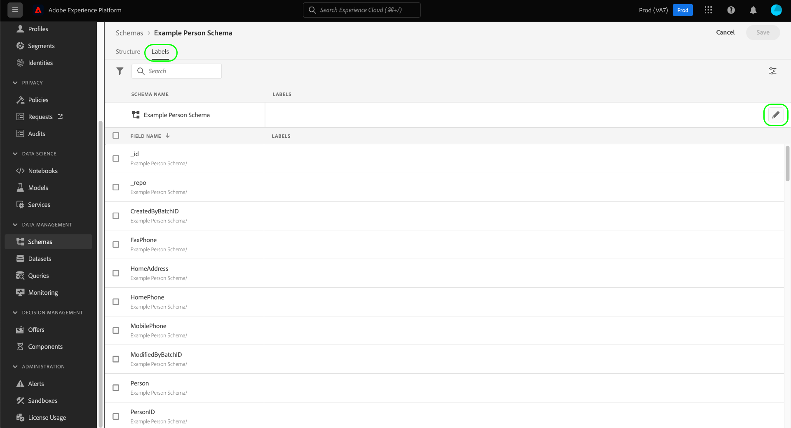

# Suporte ao controle de acesso baseado em atributos para esquemas ad hoc

Todos os dados trazidos para o Adobe Experience Platform são encapsulados pelos esquemas do Experience Data Model (XDM) e podem estar sujeitos a restrições de uso definidas pela organização ou por regulamentos legais.

Ao executar uma consulta CTAS por meio do Serviço de query quando nenhum schema é especificado, um schema ad hoc é gerado automaticamente. Geralmente, é necessário restringir a utilização de determinados campos ou conjuntos de dados de esquemas ad hoc para controlar o acesso a dados pessoais confidenciais e a informações pessoalmente identificáveis. O Adobe Experience Platform facilita esse controle de acesso, permitindo rotular campos de esquema pela interface do usuário da plataforma usando o recurso de controle de acesso baseado em atributo.

Rótulos podem ser aplicados a qualquer momento, fornecendo flexibilidade na maneira como você decide controlar os dados. No entanto, é uma prática recomendada rotular dados assim que eles forem assimilados na plataforma ou assim que os dados estiverem disponíveis para uso na plataforma.

A rotulagem baseada em esquemas é um componente importante do controle de acesso baseado em atributos para gerenciar melhor o acesso dado aos usuários ou grupos de usuários. O Adobe Experience Platform permite restringir o acesso a qualquer campo de um esquema ad hoc criando e aplicando rótulos.

Este documento fornece um tutorial para gerenciar o acesso a dados confidenciais aplicando rótulos a campos de dados de esquemas ad hoc gerados pelo Serviço de query.

## Introdução

Este guia requer uma compreensão funcional dos seguintes componentes do Adobe Experience Platform:

* [Sistema do Experience Data Model (XDM)](https://experienceleague.adobe.com/docs/experience-platform/xdm/home.html?lang=pt-BR): A estrutura padronizada pela qual o Experience Platform organiza os dados de experiência do cliente.
   * [[!DNL Schema Editor]](https://experienceleague.adobe.com/docs/experience-platform/xdm/ui/overview.html): Saiba como criar e gerenciar esquemas e outros recursos na interface do usuário da plataforma.
* [[!DNL Data Governance]](../../data-governance/home.md): Saiba como [!DNL Data Governance] O permite gerenciar os dados do cliente e garantir a conformidade com as regulamentações, restrições e políticas aplicáveis ao uso dos dados.
* [Controle de acesso baseado em atributos](../../access-control/abac/overview.md): O controle de acesso baseado em atributos é um recurso do Adobe Experience Platform que permite aos administradores controlar o acesso a objetos e/ou recursos específicos com base em atributos. Os atributos podem ser metadados adicionados a um objeto, como um rótulo adicionado a um campo de esquema ad hoc ou regular. Um administrador define políticas de acesso que incluem atributos para gerenciar permissões de acesso do usuário.

## Criar um esquema ad hoc

Depois que a consulta é executada e os resultados são gerados, um esquema ad hoc é gerado automaticamente e adicionado ao inventário de esquema.

Para adicionar um rótulo de dados, navegue até [!UICONTROL Esquemas] guia de navegação do painel selecionando [!UICONTROL Esquemas] no painel esquerdo da interface do usuário da plataforma. O inventário de esquema é exibido.

>[!NOTE]
>
>Os esquemas ad hoc não são exibidos por padrão no inventário de esquemas.

## Descubra esquemas ad hoc no inventário de esquema da interface do usuário da plataforma

Para ativar a exibição de esquemas ad hoc na interface do usuário da plataforma, selecione o ícone de filtro (../images/data-governance/filter.png) à esquerda do campo de pesquisa e selecione **[!UICONTROL Mostrar esquemas adhoc] no painel esquerdo exibido.

Selecione o nome do schema ad hoc criado recentemente na lista disponível. Uma visualização da estrutura do esquema ad hoc é exibida.

## Editar rótulos de governança

Para editar rótulos de dados para seu esquema ad hoc, selecione a variável [!UICONTROL Rótulos] guia . A área de trabalho de rótulos permite aplicar, criar e editar rótulos para seus campos de esquema ad hoc e controlar permissões de acesso por meio da interface do usuário. Todos os campos no esquema ad hoc são representados aqui.

## Editar rótulos para o esquema ou campo

Para editar os rótulos de todo o esquema, selecione o ícone de lápis () ao lado do nome do schema sob o [!UICONTROL Rótulos] guia .

Para aplicar um rótulo a um campo existente, selecione um ou mais campos na lista seguida por [!UICONTROL Editar rótulos de governança] na barra lateral direita.

## Editar fornecedor de rótulos

O [!UICONTROL Editar rótulos] O programa de energia é exibido. Nessa visualização, você pode criar ou editar rótulos de governança existentes por meio da interface do usuário.

Consulte a documentação para obter orientação sobre como [criar ou editar rótulos para o esquema ou campo selecionado](https://experienceleague.adobe.com/docs/experience-platform/xdm/tutorials/labels.html#edit-the-labels-for-the-schema-or-field).

>[!NOTE]
>
>Criar um novo rótulo ou editar um rótulo existente requer permissões de administrador para sua organização. Se você não tiver privilégios de administrador, entre em contato com o administrador do sistema para organizar o acesso.

Rótulos também podem ser criados usando o espaço de trabalho de permissões. Consulte a [guia sobre como criar rótulos no espaço de trabalho de permissões](../../access-control/abac/ui/labels.md) para obter instruções.

Depois que o nível apropriado de controle de acesso baseado em atributos for aplicado, o seguinte comportamento do sistema se aplica a qualquer query executada por meio do Serviço de query quando um usuário tenta acessar dados não acessíveis:

1. Se um usuário recusar o acesso a um dos campos em um schema, ele não poderá ler ou gravar no campo restrito. Isso se aplica aos seguintes cenários comuns:

   * Quando um usuário tenta executar uma consulta com apenas uma coluna restrita, o sistema gera um erro informando que a coluna não existe.
   * Quando um usuário tenta executar um query com várias colunas que incluem uma coluna restrita, o sistema retornará a saída somente para todas as colunas não restritas.

1. Se um usuário solicitar acesso a um campo calculado, ele deverá ter acesso a todos os campos usados na composição, caso contrário o sistema negará acesso ao campo calculado.

Se uma identidade ou identidade primária for definida no esquema ad hoc, o sistema atenderá automaticamente quaisquer solicitações de higiene de dados associadas e limpará os dados nesses conjuntos de dados vinculados à coluna de identidade.

## Próximas etapas

Após a leitura deste documento, você tem uma melhor compreensão de como adicionar rótulos de uso de dados a esquemas ad hoc criados por meio de consultas CTAS do Serviço de query. Se ainda não tiver feito isso, os seguintes documentos serão úteis para melhorar sua compreensão do controle de dados no Serviço de query:

* [Identidades de esquema ad hoc](./ad-hoc-schema-identities.md)
* [Governança de dados](https://experienceleague.adobe.com/docs/experience-platform/data-governance/home.html)
