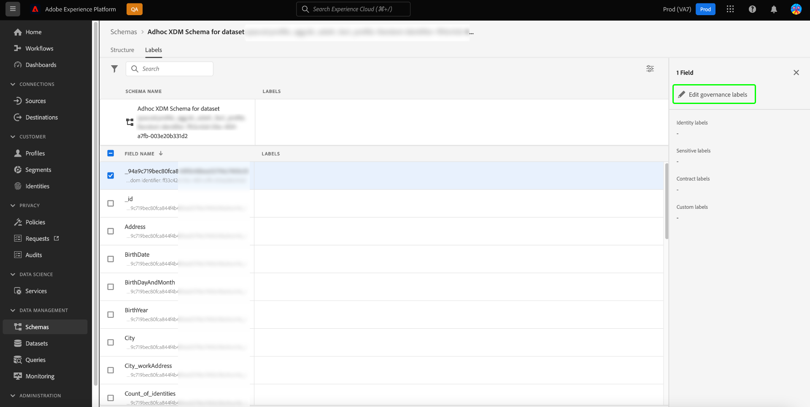

# Suporte de controle de acesso baseado em atributos para esquemas ad hoc

Quaisquer dados trazidos para o Adobe Experience Platform são encapsulados por esquemas do Experience Data Model (XDM) e podem estar sujeitos a restrições de uso definidas por sua organização ou por regulamentos legais.

Executando uma consulta CTAS por meio do Serviço de consulta quando nenhum esquema é especificado, um esquema ad hoc é gerado automaticamente. Muitas vezes, é necessário restringir o uso de determinados campos, ou conjuntos de dados, de esquemas ad hoc para controlar o acesso a dados pessoais confidenciais e a informações de identificação pessoal. O Adobe Experience Platform facilita esse controle de acesso permitindo rotular campos de esquema por meio da interface do usuário da plataforma usando o recurso de controle de acesso baseado em atributos.

Os rótulos podem ser aplicados a qualquer momento, proporcionando flexibilidade na maneira como você escolhe controlar os dados. Embora, seja uma prática recomendada rotular os dados assim que eles forem assimilados na Platform ou assim que os dados se tornarem disponíveis para uso na Platform.

A rotulagem baseada em esquema é um componente importante do controle de acesso baseado em atributos para gerenciar melhor o acesso fornecido a usuários ou grupos de usuários. O Adobe Experience Platform permite restringir o acesso a qualquer campo de um esquema ad hoc criando e aplicando rótulos.

Este documento fornece um tutorial para gerenciar o acesso a dados confidenciais aplicando rótulos a campos de dados de esquemas ad hoc gerados por meio do Serviço de consulta.

## Introdução

Este manual necessita de uma compreensão funcional dos seguintes componentes da Adobe Experience Platform:

* [Sistema do Experience Data Model (XDM)](../../xdm/home.md): a estrutura padronizada pela qual o Experience Platform organiza os dados de experiência do cliente.
   * [[!DNL Schema Editor]](../../xdm/ui/overview.md): saiba como criar e gerenciar esquemas e outros recursos na interface do Platform.
* [[!DNL Data Governance]](../../data-governance/home.md): saiba como [!DNL Data Governance] O permite gerenciar os dados do cliente e garantir a conformidade com os regulamentos, as restrições e as políticas aplicáveis ao uso de dados.
* [Controle de acesso baseado em atributos](../../access-control/abac/overview.md): o controle de acesso baseado em atributos é um recurso do Adobe Experience Platform que permite aos administradores controlar o acesso a objetos e/ou recursos específicos com base em atributos. Os atributos podem ser metadados adicionados a um objeto, como um rótulo adicionado a um campo de esquema ad hoc ou regular. Um administrador define políticas de acesso que incluem atributos para gerenciar permissões de acesso do usuário.

## Criar um esquema ad hoc

Depois que a consulta for executada e os resultados forem gerados, um esquema ad hoc será gerado automaticamente e adicionado ao inventário do esquema.

Para adicionar um rótulo de dados, navegue até [!UICONTROL Esquemas] guia procurar do painel selecionando [!UICONTROL Esquemas] no painel esquerdo da interface do usuário da Platform. O inventário do esquema é exibido.

>[!NOTE]
>
>Esquemas ad hoc não são exibidos por padrão no inventário de esquemas.

## Descubra esquemas ad hoc no inventário de esquemas da interface do usuário da plataforma {#discover-ad-hoc-schemas}

Para ativar a exibição de esquemas ad hoc na interface do usuário da Platform, selecione o ícone de filtro () à esquerda do campo de pesquisa e selecione **[!UICONTROL Mostrar esquemas adhoc] no painel esquerdo exibido.

Selecione o nome do esquema ad hoc criado recentemente na lista disponível. Uma visualização da estrutura do schema ad hoc é exibida.

## Editar rótulos de governança

Para editar rótulos de dados para o esquema ad hoc, selecione o [!UICONTROL Rótulos] guia. O espaço de trabalho de rótulos permite aplicar, criar e editar rótulos para seus campos de esquema ad hoc e controlar permissões de acesso por meio da interface. Todos os campos no esquema ad hoc são representados aqui.

## Editar rótulos para o esquema ou campo

Para editar os rótulos para todo o esquema, selecione o ícone de lápis () ao lado do nome do esquema sob o [!UICONTROL Rótulos] guia.

Para aplicar um rótulo a um campo existente, selecione um ou mais campos na lista seguido de [!UICONTROL Editar rótulos de governança] na barra lateral direita.

## Popover Editar rótulos

A variável [!UICONTROL Editar rótulos] popover é exibido. Nesta visualização, é possível criar ou editar rótulos de governança existentes por meio da interface do usuário.

Consulte a documentação para obter orientação sobre como [criar ou editar rótulos para o esquema ou campo selecionado](../../xdm/tutorials/labels.md#edit-the-labels-for-the-schema-or-field).

>[!NOTE]
>
>Criar um novo rótulo ou editar um rótulo existente requer permissões de administrador para sua organização. Se você não tiver privilégios de administrador, entre em contato com o administrador do sistema para obter acesso.

Rótulos também podem ser criados usando o espaço de trabalho de permissões. Consulte a [guia sobre a criação de rótulos no espaço de trabalho de permissões](../../access-control/abac/ui/labels.md) para obter instruções.

Depois que o nível apropriado de controle de acesso baseado em atributos for aplicado, o seguinte comportamento do sistema será aplicado a qualquer consulta executada por meio do Serviço de consulta quando um usuário tentar acessar dados não acessíveis:

1. Se um usuário tiver o acesso recusado a um dos campos em um esquema, ele não poderá ler ou gravar no campo restrito. Isso se aplica aos seguintes cenários comuns:

   * Quando um usuário tenta executar uma consulta somente com uma coluna restrita, o sistema emite um erro de que a coluna não existe.
   * Quando um usuário tenta executar uma consulta com várias colunas que incluem uma coluna restrita, o sistema retornará a saída somente para todas as colunas não restritas.

1. Se um usuário solicitar acesso a um campo calculado, será necessário ter acesso a todos os campos usados na composição ou o sistema negará acesso ao campo calculado.

Se uma identidade ou identidade primária for definida no esquema ad hoc, o sistema atenderá automaticamente a todas as solicitações de higiene de dados associadas e limpará os dados nesses conjuntos de dados vinculados à coluna de identidade.

## Próximas etapas

Depois de ler este documento, você compreenderá melhor como adicionar rótulos de uso de dados a esquemas ad hoc criados por meio de consultas CTAS do Serviço de consulta. Se ainda não tiver feito isso, os seguintes documentos são úteis para melhorar a sua compreensão da governança de dados no Serviço de consulta:

* [Identidades de esquema ad hoc](./ad-hoc-schema-identities.md)
* [Governança de dados](../../data-governance/home.md)
