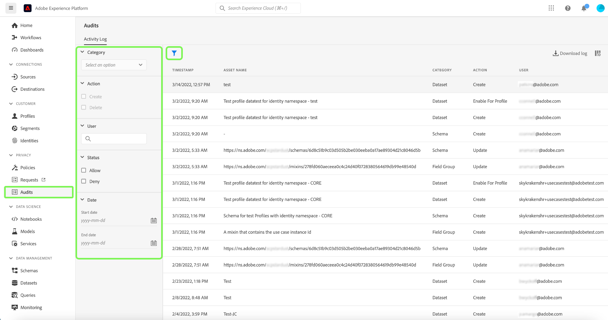
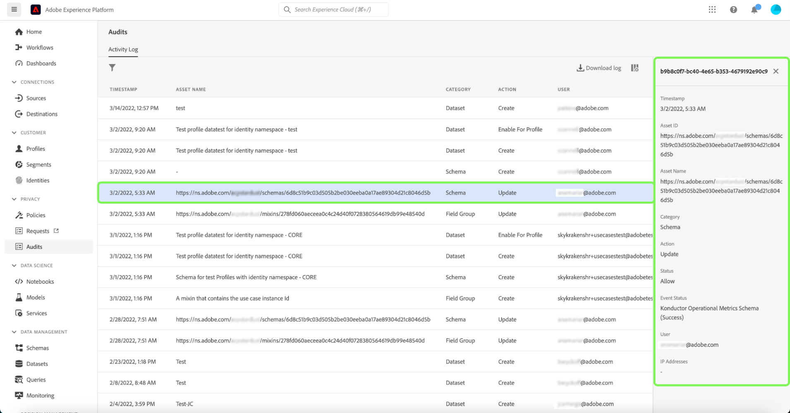

# Integração do log de auditoria do [!DNL Query Service]

A integração do log de auditoria [!DNL Query Service] do Adobe Experience Platform fornece registros de ações de usuário relacionadas à consulta. Os logs de auditoria são uma ferramenta essencial para solucionar problemas e seguir as políticas corporativas de gerenciamento de dados e os requisitos normativos. O recurso permite retornar um log de ação para vários tipos de evento e filtrar e exportar os registros. Os logs podem ser acessados por meio da interface do usuário do Experience Platform ou da [API de Consulta de Auditoria](https://www.adobe.io/experience-platform-apis/references/audit-query/) e baixados nos formatos de arquivo CSV ou JSON.

Para saber mais sobre a interface do usuário de logs de auditoria, consulte o [documento de visão geral dos logs de auditoria](../../landing/governance-privacy-security/audit-logs/overview.md). Para saber mais sobre como fazer chamadas para APIs do Experience Platform, consulte o [guia da API de logs de auditoria](../../landing/api-guide.md).

>[!NOTE]
>
>As ações de remoção da sessão são registradas. Para fluxos de trabalho de interface, consulte [Gerenciar sessões do Serviço de Consulta](../ui/session-management.md).

## Pré-requisitos

Você deve ter a permissão [!DNL Data Governance] [!UICONTROL View User Activity Log] habilitada para exibir o painel de log de auditoria na interface do usuário do Experience Platform. A permissão é habilitada por meio da Adobe [Admin Console](https://adminconsole.adobe.com/). Entre em contato com o administrador da organização se você não tiver privilégios de administrador para habilitar essa permissão. Consulte a documentação de controle de acesso para obter [instruções completas sobre como adicionar permissões por meio do Admin Console](../../access-control/home.md).

## [!DNL Query Service] categorias de log de auditoria {#audit-log-categories}

As categorias de log de auditoria fornecidas por [!DNL Query Service] são as seguintes.

| Categoria | Descrição |
|---|---|
| [!UICONTROL Query] | Esta categoria permite auditar execuções de consulta. |
| [!UICONTROL Query template] | Esta categoria permite auditar as várias ações (criar, atualizar e excluir) executadas em um template de query. |
| [!UICONTROL Scheduled query] | Esta categoria permite a auditoria de agendamentos que foram criados, atualizados ou excluídos em [!DNL Query Service]. |

## Executar um log de auditoria [!DNL Query Service] {#perform-an-audit-log}

Para executar uma auditoria para atividades de [!DNL Query Service], selecione **[!UICONTROL Audits]** na navegação à esquerda, seguido pelo ícone funnel () para exibir uma lista de controles de filtro para ajudar a limitar os resultados.

Na guia [!UICONTROL Audits] do painel [!UICONTROL Activity log], você pode filtrar todas as ações gravadas do Experience Platform por qualquer uma das categorias [!DNL Query Service]. Os resultados do log podem ser filtrados ainda mais com base no período em que foram executados, na ação/função executada ou no usuário que emitiu a consulta. Consulte a documentação do log de auditoria para [instruções completas sobre como filtrar os logs com base na categoria, ação, usuário e status](../../landing/governance-privacy-security/audit-logs/overview.md#managing-audit-logs-in-the-ui).

Os dados do log de auditoria retornados contêm as seguintes informações em todas as consultas que atendem aos critérios de filtro escolhidos.

| Nome da coluna | Descrição |
|---|---|
| [!UICONTROL Timestamp] | A data e hora exatas da ação executada em um formato `month/day/year hour:minute AM/PM`. |
| [!UICONTROL Asset Name] | O valor do campo [!UICONTROL Asset Name] depende da categoria escolhida como filtro. Ao usar a categoria [!UICONTROL Scheduled query], este é o **nome da agenda**. Ao usar a categoria [!UICONTROL Query template], este é o **nome do modelo**. Ao usar a categoria [!UICONTROL Query], esta é a **identificação da sessão** |
| [!UICONTROL Category] | Este campo corresponde à categoria selecionada por você na lista suspensa de filtros. |
| [!UICONTROL Action] | Pode ser criar, excluir, atualizar ou executar. As ações disponíveis dependem da categoria escolhida como filtro. |
| [!UICONTROL User] | Esse campo fornece a ID do usuário que executou a consulta. |

>[!NOTE]
>
>Mais detalhes da consulta são fornecidos ao baixar os resultados do log nos formatos de arquivo CSV ou JSON, do que são exibidos por padrão no painel de log de auditoria.

## Painel de detalhes

Selecione qualquer linha de resultados de log de auditoria para abrir um painel de detalhes à direita da tela.

O painel de detalhes pode ser usado para encontrar o [!UICONTROL Asset ID] e o [!UICONTROL Event status].

O valor de [!UICONTROL Asset ID] muda dependendo da categoria usada na auditoria.

* Ao usar a categoria [!UICONTROL Query], o [!UICONTROL Asset ID] é a **ID da sessão**.
* Ao usar a categoria [!UICONTROL Query template], o [!UICONTROL Asset ID] é a **ID do modelo** e tem o prefixo `[!UICONTROL templateID:]`.
* Ao usar a categoria [!UICONTROL Scheduled query], o [!UICONTROL Asset ID] é a **ID da agenda** e tem o prefixo `[!UICONTROL scheduleID:]`.

O valor de [!UICONTROL Event status] muda dependendo da categoria usada na auditoria.

* Ao usar a categoria [!UICONTROL Query], o campo [!UICONTROL Event status] fornece uma lista de todas as **IDs de consulta** executadas pelo usuário nessa sessão.
* Ao usar a categoria [!UICONTROL Query template], o campo [!UICONTROL Event status] fornece o **nome do modelo** como um prefixo para o status do evento.
* Ao usar a categoria [!UICONTROL Query schedule], o campo [!UICONTROL Event status] fornece o **nome da agenda** como um prefixo para o status do evento.

## Filtros disponíveis para [!DNL Query Service] categorias de log de auditoria {#available-filters}

Os filtros disponíveis variam de acordo com a categoria selecionada na lista suspensa. A tabela a seguir detalha os filtros disponíveis para [[!DNL Query Service] categorias de log de auditoria](#audit-log-categories).

| Filtro | Descrição |
|---|---|
| Categoria | Consulte a seção [[!DNL Query Service] categorias de log de auditoria](#audit-log-categories) para obter uma lista completa das categorias disponíveis. |
| Ação | Ao se referir a [!DNL Query Service] categorias de auditoria, a atualização é uma **modificação no formulário existente**, a exclusão é a **remoção do agendamento ou modelo**, a criação é **criação de um novo agendamento ou modelo** e a execução é **execução de uma consulta**. |
| Usuário(a) | Insira a ID de usuário completa (por exemplo, johndoe@acme.com) para filtrar por usuário. |
| Status | As opções [!UICONTROL Allow], [!UICONTROL Success] e [!UICONTROL Failure] filtram os logs com base no &quot;Status&quot; ou &quot;Status do Evento&quot;, enquanto a opção [!UICONTROL Deny] filtrará **todos** logs. |
| Data | Selecione uma data inicial e/ou final para definir um intervalo de datas para filtrar os resultados. |

## Próximas etapas

Ao ler este documento, você tem uma melhor compreensão do recurso de log de auditoria do [!DNL Query Service] e como ele pode ser usado para filtrar suas ações de usuário do [!DNL Query Service].

Se estiver usando o recurso de log de auditoria [!DNL Query Service] para fins de solução de problemas, você deverá ler o [guia de solução de problemas](../troubleshooting-guide.md).
