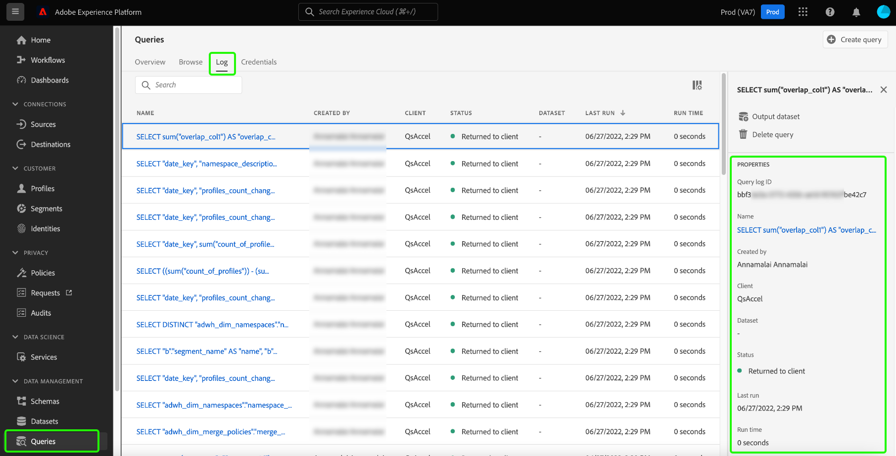

# Governança de dados no Serviço de consulta

O Adobe Experience Platform reúne dados de vários sistemas corporativos e permite que você limpe, forme, manipule e enriqueça os dados por meio do Serviço de consulta de acordo com suas necessidades. Isso permite que os profissionais de marketing identifiquem, entendam e envolvam os clientes de uma maneira melhor. Garantir o controle adequado dos dados é um aspecto crítico do tratamento de informações pessoais, pois alguns dados podem estar sujeitos a restrições de uso com base em políticas organizacionais e regulamentos legais. É essencial garantir que os dados assimilados e suas operações relacionadas estejam em conformidade com as políticas de uso de dados definidas.

O controle de dados no Serviço de consulta permite gerenciar dados do cliente e garantir a conformidade com regulamentos, restrições e políticas aplicáveis ao uso de dados. Isso desempenha uma função importante ao garantir que as políticas de uso tenham sido aplicadas de acordo com as regulamentações definidas por sua empresa.

Recomenda-se que as organizações que rotineiramente realizam o processamento de dados descrevam, pratiquem e apliquem essas diretrizes para criar um ambiente consciente sobre a privacidade para todos os usuários.

As seguintes categorias são instrumentais no cumprimento dos regulamentos de conformidade de dados ao usar o Serviço de consulta:

1. Segurança
1. Auditoria
1. Uso de dados
1. Privacidade
<!-- 1. Data hygiene -->

Este documento examina cada uma das diferentes áreas de governança e demonstra como facilitar a conformidade de dados ao usar o Serviço de consulta. Consulte a [visão geral de governança, privacidade e segurança](../../landing/governance-privacy-security/overview.md) para obter informações mais detalhadas sobre como o Experience Platform permite gerenciar dados de clientes e garantir a conformidade.

## Segurança

A segurança de dados é o processo de proteger dados contra acesso não autorizado e garantir acesso seguro em todo o ciclo de vida. O acesso seguro é mantido no Experience Platform por meio da aplicação de funções e permissões por recursos como controle de acesso baseado em funções e controle de acesso baseado em atributos. Credenciais, SSL e criptografia de dados também são usados para garantir a proteção de dados na plataforma.

A segurança no que diz respeito ao Serviço de consulta está dividida nas seguintes categorias:

* [Controle de acesso](#access-control): o acesso é controlado por meio de funções e permissões, incluindo permissões de nível de conjunto de dados e coluna.
* Proteção de dados por meio de [conectividade](#connectivity): os dados são protegidos por meio da Platform e de clientes externos por meio de uma conexão limitada com credenciais com ou sem expiração.
* Proteção de dados por meio de [criptografia e chaves de nível de sistema](#encryption): a segurança dos dados é garantida por meio de criptografia quando os dados estão em repouso.

<!-- * Securing data through [encryption and customer-managed keys (CMK)](#encryption-and-customer-managed-keys): Access controlled through encryption when data is at rest. -->

### Controle de acesso {#access-control}

O controle de acesso no Adobe Experience Platform permite usar [Adobe Admin Console](https://adminconsole.adobe.com/) para gerenciar o acesso aos recursos do Serviço de consulta usando permissões com base em funções. Da mesma forma, você pode controlar o acesso a atributos de dados específicos por meio do gerenciamento de rótulos em esquemas e campos de dados.

Esta seção descreve as permissões de controle de acesso necessárias que um usuário deve ter para utilizar totalmente os recursos do Serviço de consulta. Consulte os documentos em [gerenciamento de permissões](../../access-control/ui/permissions.md) e [gerenciamento de usuários](../../access-control/ui/users.md) para obter instruções detalhadas sobre como atribuir acesso a um perfil de produto.

#### Permissões relevantes

As permissões de controle de acesso relevantes são definidas nas tabelas abaixo de acordo com seu nível de escopo.

**Permissões de execução de consulta**

Para executar consultas no Serviço de consulta, um usuário deve ter uma função atribuída com a seguinte permissão:

| Permissão | Descrição |
|---|---|
| [!UICONTROL Gerenciar consultas] | Essa permissão permite que os usuários executem a exploração de dados e consultas em lote, que podem ler um conjunto de dados existente ou gravar dados em conjuntos de dados. Isso inclui `CREATE TABLE AS SELECT` (`CTAS`) e `INSERT INTO AS SELECT` (`ITAS`) consultas. |

**Permissões do conjunto de dados**

Esta seção serve como um guia para o acesso baseado em recursos necessário para acessar conjuntos de dados ao consultar dados por meio do Serviço de consulta.

Por meio da interface de Permissões, é possível definir o controle de acesso baseado em recursos para um conjunto de dados e um esquema com as seguintes permissões:

| Permissão | Descrição |
|---|---|
| [!UICONTROL Gerenciar conjuntos de dados] | Esta permissão fornece acesso somente leitura a esquemas e permite acesso a conjuntos de dados de leitura, criação, edição e exclusão para uso com o Serviço de consulta. |
| [!UICONTROL Visualizar conjuntos de dados] | Essa permissão permite acesso somente leitura a conjuntos de dados e esquemas para uso com o Serviço de consulta. |

#### Controle de acesso para colunas/campos

O recurso de controle de acesso baseado em atributos permite que os usuários do Serviço de consulta restrinjam o acesso a dados críticos do usuário. O acesso pode ser concedido ou restrito com base nas permissões atribuídas a uma função. O acesso do usuário a colunas individuais é controlado pelos rótulos de uso de dados relevantes e pelos conjuntos de permissões aplicados às funções atribuídas aos usuários.

Marcar grupos de campos de esquema e classes com rótulos de uso de dados aplica restrições de uso de dados a todos os esquemas com os mesmos grupos de campos e classes. Consulte a visão geral em [controle de acesso baseado em atributos](../../access-control/abac/overview.md) para obter informações abrangentes sobre esse recurso.

Esse recurso permite que você conceda direitos de acesso em colunas confidenciais aos grupos de usuários de sua escolha. O controle de acesso em uma coluna pode restringir os recursos de leitura e gravação de um tipo específico de usuário.

O controle de acesso para colunas pode ser aplicado no nível do schema para esquemas padrão e ad hoc. Aplique rótulos de uso de dados a esquemas XDM para restringir o acesso a uma ou mais colunas. A rotulagem de dados é aplicada de forma consistente, mesmo para conjuntos de dados criados pelo Serviço de consulta usando um esquema predefinido ou um esquema ad hoc gerado como parte da operação CTAS.

Depois que o nível apropriado de acesso for aplicado usando rótulos e funções, o seguinte comportamento do sistema ocorrerá quando um usuário tentar acessar os dados não acessíveis:

1. Se um usuário tiver o acesso negado a uma das colunas em um esquema, ele também terá a permissão negada para ler ou gravar na coluna restrita. Isso se aplica aos seguintes cenários comuns:

   * **Caso 1**: quando um usuário tenta executar uma consulta que afeta apenas uma coluna restrita, o sistema emite um erro de que a coluna não existe.
   * **Caso 2**: quando um usuário tenta executar uma consulta com várias colunas, incluindo uma coluna restrita, o sistema retorna a saída somente para todas as colunas não restritas.

1. Se um usuário tentar acessar um campo calculado, será necessário ter acesso a todos os campos usados na composição ou o sistema também negará acesso ao campo calculado.

#### Controles de acesso para exibições

O Serviço de consulta oferece a capacidade de usar SQL ANSI padrão para [`CREATE VIEW`](../sql/syntax.md#create-view) declarações. Para workflows de dados altamente confidenciais, você deve aplicar controles apropriados ao criar exibições.

A variável `CREATE VIEW` palavra-chave define uma view de uma consulta, mas a view não é materializada fisicamente. Em vez disso, a consulta é executada sempre que a exibição é referenciada em uma consulta. Quando um usuário cria uma visualização a partir de um conjunto de dados, as regras de controle de acesso baseadas em função e atributo para o conjunto de dados pai são **não** hierarquicamente aplicado. Como resultado, você deve definir explicitamente as permissões em cada uma das colunas ao criar uma visualização.

### Conectividade {#connectivity}

O Serviço de consulta pode ser acessado por meio da interface do usuário da Platform ou formando uma conexão com clientes compatíveis externos. O acesso a todas as frentes disponíveis é controlado por um conjunto de credenciais.

#### Conectividade por meio de clientes externos

O acesso ao Serviço de consulta usando um cliente de terceiros requer credenciais para autorização. Essas credenciais são obrigatórias para acessar o Serviço de consulta com qualquer um dos clientes externos compatíveis. Você pode se conectar a clientes externos usando [credenciais que expiram](#expiring-credentials) ou [credenciais sem expiração](#non-expiring-credentials).

#### Tempo de conexão limitado por meio de credenciais que estão expirando {#expiring-credentials}

[Credenciais que expiram](../ui/credentials.md) permite que os usuários formem uma conexão temporária com um cliente externo. Este conjunto de credenciais é válido somente por 24 horas. A expiração desses tipos de credenciais pode ser vista junto com a guia de credencial no painel Serviço de consulta.

#### Credenciais sem expiração {#non-expiring-credentials}

[Credenciais sem expiração](../ui/credentials.md#non-expiring-credentials) permite formar uma conexão permanente com um cliente externo, facilitando a conexão com o Serviço de consulta sem a necessidade de uma senha manual.

Para ativar a opção de geração de credenciais sem expiração, você deve seguir as instruções [fluxo de trabalho de pré-requisito](../ui/credentials.md#prerequisites). Como parte desse processo, o administrador da organização deve configurar permissões para o perfil do produto, dando ao administrador o controle sobre quais contas têm acesso para usar credenciais sem expiração.

Contas de usuários técnicos com credenciais sem expiração podem receber funções para garantir o controle de dados apropriado, definindo o escopo de seu acesso de leitura e gravação com base em suas responsabilidades e necessidades. Consulte a seção anterior sobre [uso de permissões com base em funções por meio do controle de acesso](#access-control) para gerenciar o acesso ao Serviço de consulta.

Após a conclusão do fluxo de trabalho de pré-requisito, os usuários autorizados agora podem [gerar as credenciais de conexão necessárias](../ui/credentials.md#generate-credentials).

#### Criptografia de dados SSL

Para maior segurança, o Serviço de consulta fornece suporte nativo a conexões SSL para criptografar comunicações cliente/servidor. A Platform oferece suporte a várias opções SSL para atender às suas necessidades de segurança de dados e equilibrar a sobrecarga de processamento da criptografia e do intercâmbio de chaves.

Consulte o guia sobre disponíveis [Opções de SSL para conexões de clientes de terceiros ao Serviço de consulta](../clients/ssl-modes.md) para obter mais informações, incluindo como se conectar usando o `verify-full` Valor do parâmetro SSL.

### Criptografia {#encryption}

<!-- Commented out lines to be included when customer-managed keys is released. Link out to the new document. -->

<!-- ### Encryption and customer-managed keys (CMK) {#encryption-and-customer-managed-keys} -->

A criptografia é o uso de um processo algorítmico para transformar dados em texto codificado e ilegível, garantindo que as informações estejam protegidas e inacessíveis sem uma chave de descriptografia.

A conformidade de dados do Serviço de consulta garante que os dados sejam sempre criptografados. Os dados em trânsito são sempre compatíveis com HTTPS e os dados em repouso são criptografados em um armazenamento Azure Data Lake usando chaves de nível de sistema. Consulte a documentação em [como os dados são criptografados no Adobe Experience Platform](https://experienceleague.adobe.com/docs/experience-platform/landing/governance-privacy-security/encryption.html) para obter mais informações. Para obter detalhes sobre como os dados em repouso são criptografados no Armazenamento Azure Data Lake, consulte o [documentação oficial do Azure](https://docs.microsoft.com/en-us/azure/data-lake-store/data-lake-store-encryption).

<!-- Data-in-transit is always HTTPS compliant and similarly when the data is at rest in the data lake, the encryption is done with Customer Management Key (CMK), which is already supported by Data Lake Management. The currently supported version is TLS1.2. -->

## Auditoria {#audit}

O Serviço de consulta registra a atividade do usuário e categoriza essa atividade em diferentes tipos de log. Registra informações de fornecimento em **quem** realizada **o que** ação e **quando**. Cada ação registrada em um log contém metadados que indicam o tipo de ação, a data e a hora, a ID do email do usuário que executou a ação e atributos adicionais relevantes ao tipo de ação.

Qualquer uma das categorias de log pode ser solicitada, conforme desejado por um usuário da Platform. Esta seção fornece detalhes sobre o tipo de informações capturadas para o Serviço de consulta e onde essas informações podem ser acessadas.

### Logs de consulta {#query-logs}

A interface dos logs de consulta permite monitorar e revisar os detalhes de execução de todas as consultas que foram executadas pelo Editor de consultas ou pela API do Serviço de consulta. Isso traz transparência às atividades do Serviço de consulta, permitindo verificar os metadados **all** as consultas que foram executadas no Serviço de consulta. Inclui todos os tipos de queries, seja uma query exploratória, batch ou agendada.

Os logs de consulta podem ser acessados por meio da interface do usuário da plataforma no [!UICONTROL Logs] guia do [!UICONTROL Consultas] espaço de trabalho.

### Logs de auditoria {#audit-logs}

Os logs de auditoria contêm informações mais detalhadas do que os logs de consulta e permitem filtrar logs com base em atributos como usuário, data, tipo de consulta e assim por diante. Além dos detalhes disponíveis na interface do log de consulta, os Logs de auditoria armazenam detalhes de usuários individuais, juntamente com seus dados de sessão ou conectividade com um cliente de terceiros.

Ao fornecer um registro exato das ações do usuário, uma trilha de auditoria pode ajudar na solução de problemas e ajudar sua empresa a cumprir com as políticas corporativas de gerenciamento de dados e os requisitos normativos. Os logs de auditoria fornecem um registro de todas as atividades da Platform. Usando logs de auditoria, você pode auditar ações do usuário relacionadas à execução da consulta, modelos e consultas programadas para aumentar a transparência e a visibilidade das ações executadas pelos usuários no Serviço de consulta.

A tabela a seguir indica as categorias de consulta capturadas pelos logs de auditoria e os tipos de ação registrados:

| Categoria | Tipo de ação |
|---|---|
| Consulta | Executar |
| Modelo de consulta | Criar, Excluir, Atualizar |
| Consulta Agendada | Criar, Excluir, Atualizar |

Abaixo está uma lista de três logs do servidor estendido que contêm mais detalhes do que aqueles encontrados nos logs de consulta. Os logs estendidos são encontrados nas categorias de consulta de logs de auditoria:

1. **Logs de meta query**: quando uma consulta é executada, várias subconsultas de backend associadas (como análise) são executadas. Esses tipos de queries são conhecidos como queries de &quot;metadados&quot;. Seus detalhes relevantes podem ser encontrados em logs de auditoria.
1. **Logs de sessão**: o sistema cria um log de entrada de sessão para um usuário quando ele faz logon no Serviço de consulta, independentemente de executar uma consulta.
1. **Logs de conexão de cliente de terceiros**: um log de auditoria de conectividade é gerado quando um usuário conecta com êxito o Serviço de consulta a um cliente de terceiros.

Consulte a [visão geral dos logs de auditoria](../../landing/governance-privacy-security/audit-logs/overview.md) para obter mais informações sobre como os logs de auditoria podem ajudar sua organização a abordar a conformidade de dados.

## Uso de dados {#data-usage}

A estrutura de governança de dados da Platform fornece uma maneira uniforme de usar dados com responsabilidade em todas as soluções, serviços e plataformas Adobe. Ele coordena a abordagem sistêmica para capturar, comunicar e usar metadados em toda a Adobe Experience Cloud. Isso, por sua vez, ajuda os controladores de dados a rotular os dados de acordo com as ações de marketing necessárias e as restrições impostas a esses dados a partir dessas ações de marketing desejadas. Consulte a visão geral em [rótulos de uso de dados](../../data-governance/labels/overview.md) para obter mais informações sobre como a Governança de dados permite aplicar rótulos de uso de dados a conjuntos de dados e campos.

É uma prática recomendada trabalhar para garantir a conformidade dos dados em cada estágio da jornada dos dados. Para o efeito, os conjuntos de dados derivados que utilizam esquemas ad hoc devem ser rotulados adequadamente como parte da estrutura de governação de dados. Há dois tipos de conjuntos de dados derivados formados pelo Serviço de consulta: conjuntos de dados que usam um esquema padrão e conjuntos de dados que usam um esquema ad hoc.

>[!NOTE]
>
>Os conjuntos de dados criados usando o Serviço de consulta são chamados de &quot;conjuntos de dados derivados&quot;.

Como os esquemas ad hoc são criados por um usuário individual para uma finalidade específica, os campos do esquema XDM têm namespace para esse conjunto de dados específico e não se destinam ao uso em diferentes conjuntos de dados. Como resultado, os esquemas ad hoc não estão visíveis por padrão na interface do usuário do Experience Platform. Embora não haja diferença na aplicação de rótulos de uso de dados entre os esquemas padrão e ad hoc, os esquemas ad hoc criados pelo Serviço de consulta para fins de rotulagem devem primeiro ser tornados visíveis na interface do usuário da plataforma. Consulte o guia sobre [descoberta de esquemas ad hoc na interface do usuário da plataforma](./ad-hoc-schema-labels.md#discover-ad-hoc-schemas) para obter mais detalhes.

Depois de acessar o esquema, você pode [aplicar rótulos a campos individuais](../../xdm/tutorials/labels.md). Depois que um esquema é rotulado, todos os conjuntos de dados derivados desse esquema herdam esses rótulos. Aqui, você pode configurar políticas de uso de dados que podem impedir que dados com determinados rótulos sejam ativados para determinados destinos. Para obter mais informações, consulte a visão geral em [políticas de uso de dados](../../data-governance/policies/overview.md).

## Privacidade {#privacy}

[Privacy Service](../../privacy-service/home.md) O ajuda a gerenciar as solicitações de clientes para acessar e excluir seus dados de acordo com as regulamentações legais de privacidade. Ele faz isso pesquisando os dados de identificadores pré-existentes e acessa ou exclui esses dados, dependendo da tarefa de privacidade solicitada. Os dados devem ser rotulados corretamente para que o serviço determine quais campos acessar ou excluir durante trabalhos de privacidade. Os dados sujeitos a solicitações de privacidade devem conter informações de identidade do cliente para vincular os dados diferentes à pessoa individual à qual a solicitação de privacidade se aplica. O Serviço de consulta pode enriquecer os dados usados com um identificador exclusivo para atender a tarefas de privacidade.

As solicitações de privacidade podem ser enviadas para o data lake ou para o armazenamento de dados Perfil. Os registros excluídos do data lake não resultam na exclusão de perfis que foram feitos desses registros. Além disso, um trabalho de privacidade para excluir informações pessoais do data lake não exclui o perfil, portanto, qualquer informação (que contenha essa ID de perfil) assimilada após a conclusão do trabalho de privacidade atualiza esse perfil normalmente. Tal reafirma a necessidade de identificar adequadamente os dados utilizados em esquemas específicos.

Consulte a documentação do Privacy Service para obter mais informações sobre [dados de identidade para solicitações de privacidade](../../privacy-service/identity-data.md) e como configurar suas operações de dados e aproveitar as tecnologias Adobe para recuperar efetivamente as informações de identidade apropriadas para as solicitações de privacidade do cliente.

Os recursos do Serviço de consulta para governança de dados simplificam e simplificam o processo de categorização de dados e a adesão aos regulamentos de uso de dados. Depois que os dados são identificados, o Serviço de consulta permite alocar a identidade principal em todos os conjuntos de dados de saída. Você **deve** adicione identidades ao conjunto de dados para facilitar as solicitações de privacidade de dados e trabalhar para a conformidade de dados.

Os campos de dados de esquema podem ser definidos como um campo de identidade por meio da interface do usuário da plataforma e do Serviço de consulta também permite [marcar as identidades primárias usando o comando SQL &quot;ALTER TABLE&quot;](../sql/syntax.md#alter-table). Definição de uma identidade usando o `ALTER TABLE` Esse comando é especialmente útil quando conjuntos de dados são criados usando SQL em vez de diretamente de um esquema por meio da interface do usuário da plataforma. Consulte a documentação para obter instruções sobre como [definir campos de identidade na interface](../../xdm/ui/fields/identity.md) ao usar esquemas padrão.

<!-- COMMENTING OUT DATA HYGEINE SECTION TEMPORARILY UNTIL IT IS GA. currently it is in Beta only.

## Data hygiene 

"Data hygiene" refers to the process of repairing or removing data that may be outdated, inaccurate, incorrectly formatted, duplicated, or incomplete. It is important to ensure adequate data hygiene along every step of the data's journey and even from the initial data storage location. In Query Service, this is either the data lake or the data warehouse.

It is necessary to assign an identity to a derived dataset to allow their management by the [!DNL Data Hygiene] service. Conversely, when you create aggregated data on an accelerated data store, the aggregated data cannot be used to derive the original data. As a result of this data aggregation, the need to raise data hygiene requests is eliminated. == THIS APPEARS TO BE A PRIVACY USE CASE NAD NOT DATA HYGEINE ++  this is confusing.

An exception to this scenario is the case of deletion. If a data hygiene deletion is requested on a dataset and before the deletion is completed, another derived dataset query is executed, then the derived dataset will capture information from the original dataset. In this case, you must be mindful that if a request to delete a dataset has been sent, you must not execute any new derived dataset queries using the same dataset source. 

See the [data hygiene overview](../../hygiene/home.md) for more information on data hygiene in Adobe Experience Platform. -->
