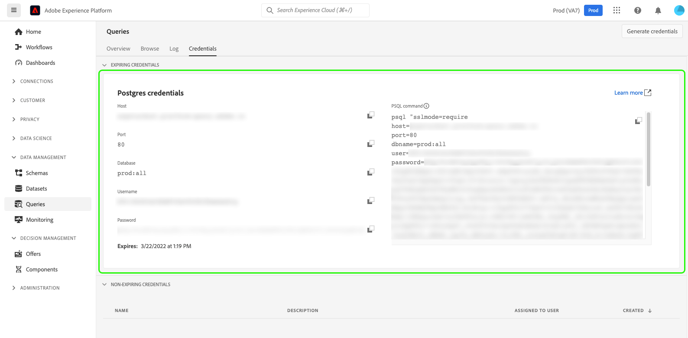

# Governança de dados no Serviço de consulta

O Adobe Experience Platform reúne dados de vários sistemas corporativos e permite que você limpe, forme, manipule e enriqueça os dados por meio do Serviço de consulta de acordo com suas necessidades. Isso permite que os profissionais de marketing identifiquem, entendam e envolvam os clientes de maneira melhor. Garantir o controle adequado dos dados é um aspecto crítico do tratamento de informações pessoais, pois alguns dados podem estar sujeitos a restrições de uso com base em políticas organizacionais e regulamentos legais. É essencial garantir que os dados assimilados e suas operações relacionadas estejam em conformidade com as políticas de uso de dados definidas.

O controle de dados no Serviço de consulta permite gerenciar dados do cliente e garantir a conformidade com regulamentos, restrições e políticas aplicáveis ao uso de dados. Isso desempenha uma função importante ao garantir que as políticas de uso tenham sido aplicadas de acordo com as regulamentações definidas por sua empresa.

Recomenda-se que as organizações que rotineiramente realizam o processamento de dados descrevam, pratiquem e apliquem essas diretrizes para criar um ambiente consciente sobre a privacidade para todos os usuários.

As seguintes categorias são instrumentais no cumprimento dos regulamentos de conformidade de dados ao usar o Serviço de consulta:

1. Segurança
1. Auditoria
1. Uso de dados
1. Privacidade
1. Higiene de dados

Este documento examina cada uma das diferentes áreas de governança e demonstra como facilitar a conformidade de dados ao usar o Serviço de consulta. Consulte a [visão geral sobre governança, privacidade e segurança](../../landing/governance-privacy-security/overview.md) para obter informações mais detalhadas sobre como o Experience Platform permite gerenciar os dados do cliente e garantir a conformidade.

## Segurança {#security}

A segurança de dados é o processo de proteger dados contra acesso não autorizado e garantir acesso seguro em todo o ciclo de vida. O acesso seguro é mantido no Experience Platform por meio da aplicação de funções e permissões por recursos como controle de acesso baseado em funções e controle de acesso baseado em atributos. Credenciais, SSL e criptografia de dados também são usados para garantir a proteção de dados na Experience Platform.

A segurança no que diz respeito ao Serviço de consulta está dividida nas seguintes categorias:

* [Controle de acesso](#access-control): o acesso é controlado por meio de funções e permissões, incluindo permissões de nível de conjunto de dados e coluna.
* Protegendo dados por meio de [conectividade](#connectivity): os dados são protegidos por meio da Experience Platform e de clientes externos por meio de uma conexão limitada com credenciais que estão expirando ou credenciais que não estão expirando.
* Proteção de dados por meio de [criptografia e CMKs (chaves gerenciadas pelo cliente)](#encryption-and-customer-managed-keys): acesso controlado por meio de criptografia quando os dados estão em repouso.

### Controle de acesso {#access-control}

O controle de acesso no Adobe Experience Platform é gerenciado por permissões com base em funções que determinam quais usuários podem usar os recursos do Serviço de consulta. Da mesma forma, você pode controlar o acesso a atributos de dados específicos por meio do gerenciamento de rótulos em esquemas e campos de dados.

Esta seção descreve as permissões de controle de acesso necessárias que um usuário deve ter para utilizar totalmente os recursos do Serviço de consulta. Consulte os documentos em [gerenciando permissões](../../access-control/ui/permissions.md) e [gerenciando usuários](../../access-control/ui/users.md) para obter instruções detalhadas sobre como atribuir acesso a um perfil de produto.

#### Permissões relevantes

As permissões de controle de acesso relevantes são definidas nas tabelas abaixo de acordo com seu nível de escopo.

**Permissões de execução da consulta**

Para executar consultas no Serviço de consulta, um usuário deve ter uma função atribuída com a seguinte permissão:

| Permissão | Descrição |
|---|---|
| [!UICONTROL Manage Queries] | Essa permissão permite que os usuários executem a exploração de dados e consultas em lote, que podem ler um conjunto de dados existente ou gravar dados em conjuntos de dados. Isso inclui as consultas `CREATE TABLE AS SELECT` (`CTAS`) e `INSERT INTO AS SELECT` (`ITAS`). |

**Permissões do conjunto de dados**

Esta seção serve como um guia para o acesso baseado em recursos necessário para acessar conjuntos de dados ao consultar dados por meio do Serviço de consulta.

Por meio da interface de Permissões, é possível definir o controle de acesso baseado em recursos para um conjunto de dados e um esquema com as seguintes permissões:

| Permissão | Descrição |
|---|---|
| [!UICONTROL Manage Datasets] | Esta permissão fornece acesso somente leitura a esquemas e permite acesso a conjuntos de dados de leitura, criação, edição e exclusão para uso com o Serviço de consulta. |
| [!UICONTROL View Datasets] | Essa permissão permite acesso somente leitura a conjuntos de dados e esquemas para uso com o Serviço de consulta. |

#### Controle de acesso para colunas/campos

O recurso de controle de acesso baseado em atributos permite que os usuários do Serviço de consulta restrinjam o acesso a dados críticos do usuário. O acesso pode ser concedido ou restrito com base nas permissões atribuídas a uma função. O acesso do usuário a colunas individuais é controlado pelos rótulos de uso de dados relevantes e pelos conjuntos de permissões aplicados às funções atribuídas aos usuários.

Marcar grupos de campos de esquema e classes com rótulos de uso de dados aplica restrições de uso de dados a todos os esquemas com os mesmos grupos de campos e classes. Consulte a visão geral no [controle de acesso baseado em atributos](../../access-control/abac/overview.md) para obter informações abrangentes sobre esse recurso.

Esse recurso permite que você conceda direitos de acesso em colunas confidenciais aos grupos de usuários de sua escolha. O controle de acesso em uma coluna pode restringir os recursos de leitura e gravação de um tipo específico de usuário.

O controle de acesso para colunas pode ser aplicado no nível do schema para esquemas padrão e ad hoc. Aplique rótulos de uso de dados a esquemas XDM para restringir o acesso a uma ou mais colunas. A rotulagem de dados é aplicada de forma consistente, mesmo para conjuntos de dados criados pelo Serviço de consulta usando um esquema predefinido ou um esquema ad hoc gerado como parte da operação CTAS.

Depois que o nível apropriado de acesso for aplicado usando rótulos e funções, o seguinte comportamento do sistema ocorrerá quando um usuário tentar acessar os dados não acessíveis:

1. If a user has been denied access to one of the columns within a schema, the user is also denied permission to read or write on the restricted column. This applies to the following common scenarios:

   * **Case 1**: When a user tries to execute a query affecting only a restricted column, the system throws an error that the column doesn&#39;t exist.
   * **Case 2**: When a user tries to execute a query with multiple columns including a restricted column, the system returns output for all non-restricted columns only.

1. If a user tries to access a calculated field, the user is required to have access to all the fields used in the composition or the system denies access to the calculated field as well.

#### Access controls for views

Query Service provides the ability to use standard ANSI SQL for [`CREATE VIEW`](../sql/syntax.md#create-view) statements. For highly sensitive data workflows, you must enforce appropriate controls when creating views.

The `CREATE VIEW` keyword defines a view of a query but the view is not physically materialized. Instead, the query is run every time the view is referenced in a query. When a user creates a view from a dataset, the role- and attribute-based access control rules for the parent dataset are **not** hierarchically applied. As a result, you must explicitly set permissions on each of the columns when a view is created.

#### Create field-based access restrictions on accelerated datasets {#create-field-based-access-restrictions-on-accelerated-datasets}

With the [attribute-based access control capability](../../access-control/abac/overview.md) you can define organizational or data usage scopes on fact and dimension datasets in the [accelerated store](../data-distiller/sql-insights/send-accelerated-queries.md). This allows administrators to manage access to specific segments and better manage the access given to users or groups of users.

To create field-based access restrictions on accelerated datasets, you can use Query Service CTAS queries to create accelerated datasets and structure these datasets based on existing XDM schemas or ad hoc schemas. Administrators can then [add and edit data usage labels for the schema](../../xdm/tutorials/labels.md#edit-the-labels-for-the-schema-or-field) or [ad hoc schema](./ad-hoc-schema-labels.md#edit-governance-labels). You can apply, create, and edit labels to your schemas from the [!UICONTROL Labels] workspace in the [!UICONTROL Schemas] UI.

Data usage labels can also be [applied or edited directly onto the dataset](../../data-governance/labels/user-guide.md#add-labels) through the Datasets UI, or created from the Access Control [!UICONTROL Labels] workspace. See the guide on how to [create a new label](../../access-control/abac/ui/labels.md) for more information.

User access to individual columns can then be controlled by the attached data usage labels and the permission sets applied to the roles that are assigned to users.

### Connectivity {#connectivity}

Query Service is accessible through the Experience Platform UI or by forming a connection with external compatible clients. Access to all available fronts is controlled by a set of credentials.

#### Connectivity through external clients

O acesso ao Serviço de consulta usando um cliente de terceiros requer credenciais para autorização. Essas credenciais são obrigatórias para acessar o Serviço de consulta com qualquer um dos clientes externos compatíveis. Você pode se conectar a clientes externos usando [credenciais com vencimento](#expiring-credentials) ou [credenciais sem vencimento](#non-expiring-credentials).

#### Tempo de conexão limitado por meio de credenciais que estão expirando {#expiring-credentials}

[Credenciais que expiram](../ui/credentials.md) permitem que os usuários formem uma conexão temporária com um cliente externo. Este conjunto de credenciais é válido somente por 24 horas. A expiração desses tipos de credenciais pode ser vista junto com a guia de credencial no painel Serviço de consulta.

#### Credenciais sem expiração {#non-expiring-credentials}

[Credenciais sem expiração](../ui/credentials.md#non-expiring-credentials) permitem que você estabeleça uma conexão permanente com um cliente externo, facilitando a conexão com o Serviço de Consulta sem a necessidade de uma senha manual.

Para habilitar a opção de gerar credenciais sem expiração, você deve seguir o [fluxo de trabalho de pré-requisito](../ui/credentials.md#prerequisites) descrito. Como parte desse processo, o administrador da organização deve configurar permissões para o perfil do produto, dando ao administrador o controle sobre quais contas têm acesso para usar credenciais sem expiração.

Contas de usuários técnicos com credenciais sem expiração podem receber funções para garantir o controle de dados apropriado, definindo o escopo de seu acesso de leitura e gravação com base em suas responsabilidades e necessidades. Consulte a seção anterior sobre [uso de permissões baseadas em função por meio do controle de acesso](#access-control) para gerenciar o acesso ao Serviço de Consulta.

Após a conclusão do fluxo de trabalho de pré-requisito, os usuários autorizados agora podem [gerar as credenciais de conexão necessárias](../ui/credentials.md#generate-credentials).

#### Criptografia de dados SSL

Para maior segurança, o Serviço de consulta fornece suporte nativo a conexões SSL para criptografar comunicações cliente/servidor. O Experience Platform oferece suporte a várias opções de SSL para atender às suas necessidades de segurança de dados e equilibrar a sobrecarga de processamento da criptografia e da troca de chaves.

Consulte o manual sobre as [opções de SSL disponíveis para conexões de clientes de terceiros ao Serviço de Consulta](../clients/ssl-modes.md) para obter mais informações, incluindo como se conectar usando o valor do parâmetro SSL `verify-full`.

### Criptografia e chaves gerenciadas pelo cliente (CMK) {#encryption-and-customer-managed-keys}

A criptografia é o uso de um processo algorítmico para transformar dados em texto codificado e ilegível, garantindo que as informações estejam protegidas e inacessíveis sem uma chave de descriptografia.

A conformidade de dados do Serviço de consulta garante que os dados sejam sempre criptografados. Os dados em trânsito são sempre compatíveis com HTTPS e os dados em repouso são criptografados em um armazenamento Azure Data Lake usando chaves de nível de sistema. Consulte a documentação sobre [como os dados são criptografados no Adobe Experience Platform](../../landing/governance-privacy-security/encryption.md) para obter mais informações. Para obter detalhes sobre como os dados em repouso são criptografados no Azure Data Lake Storage, consulte a [documentação oficial do Azure](https://docs.microsoft.com/en-us/azure/data-lake-store/data-lake-store-encryption).

Os dados em trânsito são sempre compatíveis com HTTPS e, da mesma forma, quando os dados estão em repouso no data lake, a criptografia é feita com a Chave de gerenciamento de clientes (CMK), que já é compatível com o Gerenciamento de Data Lake. A versão atualmente compatível é TLS1.2. Consulte a [documentação de CMKs (chaves gerenciadas pelo cliente)](../../landing/governance-privacy-security/customer-managed-keys/overview.md) para saber como configurar suas próprias chaves de criptografia para os dados armazenados no Adobe Experience Platform.

## Auditoria {#audit}

O Serviço de consulta registra a atividade do usuário e categoriza essa atividade em diferentes tipos de log. Os logs fornecem informações sobre **quem** executou a ação **o quê** e **quando**. Cada ação registrada em um log contém metadados que indicam o tipo de ação, a data e a hora, a ID do email do usuário que executou a ação e atributos adicionais relevantes ao tipo de ação.

Qualquer categoria de log pode ser solicitada, conforme desejado por um usuário do Experience Platform. Esta seção fornece detalhes sobre o tipo de informações capturadas para o Serviço de consulta e onde essas informações podem ser acessadas.

### Logs de consulta {#query-logs}

A interface dos logs de consulta permite monitorar e revisar os detalhes de execução de todas as consultas que foram executadas pelo Editor de consultas ou pela API do Serviço de consulta. Isso traz transparência para as atividades do Serviço de consulta, permitindo que você verifique os metadados de **todas** as consultas que foram executadas no Serviço de consulta. Inclui todos os tipos de queries, seja uma query exploratória, batch ou agendada.

Os logs de consulta podem ser acessados por meio da interface do usuário do Experience Platform na guia [!UICONTROL Logs] do espaço de trabalho [!UICONTROL Queries].

### Logs de auditoria {#audit-logs}

Os logs de auditoria contêm informações mais detalhadas do que os logs de consulta e permitem filtrar logs com base em atributos como usuário, data, tipo de consulta e assim por diante. Além dos detalhes disponíveis na interface do log de consulta, os Logs de auditoria armazenam detalhes de usuários individuais, juntamente com seus dados de sessão ou conectividade com um cliente de terceiros.

Ao fornecer um registro exato das ações do usuário, uma trilha de auditoria pode ajudar na solução de problemas e ajudar sua empresa a cumprir com as políticas corporativas de gerenciamento de dados e os requisitos normativos. Os logs de auditoria fornecem um registro de todas as atividades do Experience Platform. Usando logs de auditoria, você pode auditar ações do usuário relacionadas à execução da consulta, modelos e consultas programadas para aumentar a transparência e a visibilidade das ações executadas pelos usuários no Serviço de consulta.

A tabela a seguir indica as categorias de consulta capturadas pelos logs de auditoria e os tipos de ação registrados:

| Categoria | Tipo de ação |
|---|---|
| Consulta | Executar |
| Modelo de consulta | Criar, Excluir, Atualizar |
| Consulta programada | Criar, Excluir, Atualizar |

Abaixo está uma lista de três logs do servidor estendido que contêm mais detalhes do que aqueles encontrados nos logs de consulta. Os logs estendidos são encontrados nas categorias de consulta de logs de auditoria:

1. **Logs de consulta do Meta**: quando uma consulta é executada, várias subconsultas de back-end associadas (como análise) são executadas. Esses tipos de queries são conhecidos como queries de &quot;metadados&quot;. Seus detalhes relevantes podem ser encontrados em logs de auditoria.
1. **Logs de sessão**: o sistema cria um log de entrada de sessão para um usuário quando ele faz logon no Serviço de consulta, independentemente de executar uma consulta.
1. **Logs de conexão de cliente de terceiros**: um log de auditoria de conectividade é gerado quando um usuário conecta com êxito o Serviço de Consulta a um cliente de terceiros.

Consulte a [visão geral dos logs de auditoria](../../landing/governance-privacy-security/audit-logs/overview.md) para obter mais informações sobre como os logs de auditoria podem ajudar sua organização a abordar a conformidade de dados.

## Uso de dados {#data-usage}

A estrutura de governança de dados da Experience Platform fornece uma maneira uniforme de usar dados com responsabilidade em todas as soluções, serviços e plataformas da Adobe. Ele coordena a abordagem sistêmica para capturar, comunicar e usar metadados em toda a Adobe Experience Cloud. Isso, por sua vez, ajuda os controladores de dados a rotular os dados de acordo com as ações de marketing necessárias e as restrições impostas a esses dados a partir dessas ações de marketing desejadas. Consulte a visão geral em [rótulos de uso de dados](../../data-governance/labels/overview.md) para obter mais informações sobre como a Governança de dados permite aplicar rótulos de uso de dados a conjuntos de dados e campos.

É uma prática recomendada trabalhar para garantir a conformidade dos dados em cada estágio da jornada dos dados. Para o efeito, os conjuntos de dados derivados que utilizam esquemas ad hoc devem ser rotulados adequadamente como parte da estrutura de governação de dados. Há dois tipos de conjuntos de dados derivados formados pelo Serviço de consulta: conjuntos de dados que usam um esquema padrão e conjuntos de dados que usam um esquema ad hoc.

>[!NOTE]
>
>Os conjuntos de dados criados usando o Serviço de consulta são chamados de &quot;conjuntos de dados derivados&quot;.

Como os esquemas ad hoc são criados por um usuário individual para uma finalidade específica, os campos do esquema XDM têm namespace para esse conjunto de dados específico e não se destinam ao uso em diferentes conjuntos de dados. Como resultado, os esquemas ad hoc não estão visíveis por padrão na interface do usuário do Experience Platform. Embora não haja diferença na aplicação de rótulos de uso de dados entre os esquemas padrão e ad hoc, os esquemas ad hoc criados pelo Serviço de consulta para fins de rotulagem devem primeiro ser tornados visíveis na interface do usuário do Experience Platform. Consulte o manual sobre [descoberta de esquemas ad hoc na interface do usuário do Experience Platform](./ad-hoc-schema-labels.md#discover-ad-hoc-schemas) para obter mais detalhes.

Depois de acessar o esquema, você pode [aplicar rótulos a campos individuais](../../xdm/tutorials/labels.md). Depois que um esquema é rotulado, todos os conjuntos de dados derivados desse esquema herdam esses rótulos. Aqui, você pode configurar políticas de uso de dados que podem impedir que dados com determinados rótulos sejam ativados para determinados destinos. Para obter mais informações, consulte a visão geral em [políticas de uso de dados](../../data-governance/policies/overview.md).

## Privacidade {#privacy}

O [Privacy Service](../../privacy-service/home.md) ajuda você a gerenciar solicitações de clientes para acessar e excluir seus dados de acordo com as regulamentações legais de privacidade. Ele faz isso pesquisando os dados de identificadores pré-existentes e acessa ou exclui esses dados, dependendo da tarefa de privacidade solicitada. Os dados devem ser rotulados corretamente para que o serviço determine quais campos acessar ou excluir durante trabalhos de privacidade. Os dados sujeitos a solicitações de privacidade devem conter informações de identidade do cliente para vincular os dados diferentes à pessoa individual à qual a solicitação de privacidade se aplica. Query Service can enrich the data it uses with a unique identifier for the purpose of satisfying privacy jobs.

Privacy requests can be sent to the data lake or the Profile data store. Records deleted from the data lake do not result in the deletion of profiles that were made from those records. Also, a privacy job to delete personal information from the data lake does not delete their profile so any information (that contains that profile ID) ingested after the completion of the privacy job updates that profile as normal. This reaffirms the need to properly identify data used in hoc schemas.

See the Privacy Service documentation for more information on [identity data for privacy requests](../../privacy-service/identity-data.md) and how to configure your data operations and leverage Adobe technologies to effectively retrieve the appropriate identity information for customer privacy requests.

Query Service features for data governance simplify and streamline the process of data categorization and adherence to data usage regulations. Once the data has been identified, Query Service enables you to allocate the primary identity on all output datasets. You **must** add identities into the dataset to facilitate data privacy requests and work towards data compliance.

Schema data fields can be set as an identity field through the Experience Platform UI and Query Service also allows you to [mark the primary identities by using the SQL command &#39;ALTER TABLE&#39;](../sql/syntax.md#alter-table). Setting an identity using the `ALTER TABLE` command is especially useful when datasets are created using SQL rather than directly from a schema through the Experience Platform UI. See the documentation for instructions on how to [define identity fields in the UI](../../xdm/ui/fields/identity.md) when using standard schemas.

## Higiene de dados {#data-hygiene}

&quot;Data hygiene&quot; refers to the process of repairing or removing data that may be outdated, inaccurate, incorrectly formatted, duplicated, or incomplete. These processes make sure that datasets are accurate and consistent across all systems. It is important to ensure adequate data hygiene along every step of the data&#39;s journey and even from the initial data storage location. In Experience Platform Query Service, this is either the data lake or the accelerated store.

You can assign an identity to a derived dataset to allow their data management following Experience Platform&#39;s centralized data hygiene services.

Conversely, when you create an aggregated dataset on the accelerated store, the aggregated data cannot be used to derive the original data. As a result of this data aggregation, the need to raise data hygiene requests is eliminated.

An exception to this scenario is the case of deletion. If a data hygiene deletion is requested on a dataset and before the deletion is completed, another derived dataset query is executed, then the derived dataset will capture information from the original dataset. In this case, you must be mindful that if a request to delete a dataset has been sent, you must not execute any newly derived dataset queries using the same dataset source.

See the [data hygiene overview](../../hygiene/home.md) for more information on data hygiene in Adobe Experience Platform.
