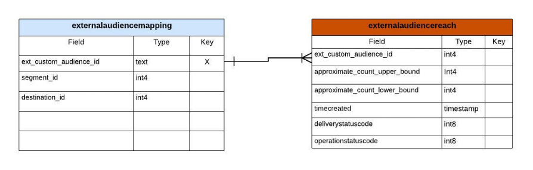

# Consultar insights de relatório de repositório acelerado

O armazenamento acelerado de query permite reduzir o tempo e o poder de processamento necessários para obter insights críticos de seus dados. Normalmente, os dados são processados em intervalos regulares (por exemplo, de hora em hora ou diariamente), onde exibições agregadas são criadas e relatadas. A análise desses relatórios gerados a partir de dados agregados deriva informações destinadas a melhorar o desempenho dos negócios. O armazenamento acelerado do query fornece um serviço de cache, simultaneidade, uma experiência interativa e uma API sem estado. No entanto, presume que os dados sejam pré-processados e otimizados para consulta agregada e não para consulta de dados brutos.

O armazenamento acelerado de query permite criar um modelo de dados personalizado e/ou estender em modelos de dados existentes do Adobe Real-time Customer Data Platform. Em seguida, você pode interagir ou incorporar seus insights de relatórios em uma estrutura de relatórios/visualização de sua escolha. Consulte a documentação do Modelo de dados do Real-time Customer Data Platform Insights para saber como [personalize seus modelos de consulta SQL para criar relatórios do Real-Time CDP para seus casos de uso de indicador de desempenho principal (KPI) de marketing](../../dashboards/cdp-insights-data-model.md).

O modelo de dados do Real-Time CDP do Adobe Experience Platform fornece informações sobre perfis, segmentos e destinos e permite o uso de painéis do Real-Time CDP Insight. Este documento o orienta pelo processo de criação de seu modelo de dados de insights de relatórios e também como estender modelos de dados do Real-Time CDP, conforme necessário.

## Pré-requisitos

Este tutorial usa painéis definidos pelo usuário para visualizar dados do modelo de dados personalizado na interface do usuário da plataforma. Consulte a [documentação dos painéis definidos pelo usuário](../../dashboards/user-defined-dashboards.md) para saber mais sobre esse recurso.

## Introdução

O SKU do Distiller de dados é necessário para criar um modelo de dados personalizado para seus insights de relatórios e estender os modelos de dados do Real-Time CDP que contêm dados enriquecidos da plataforma. Consulte a [embalagem](../packages.md), [medidas de proteção](../guardrails.md#query-accelerated-store)e [licenciamento](../data-distiller/licence-usage.md) documentação relacionada ao SKU do Data Distiller. Se você não tiver a SKU do Data Distiller, entre em contato com o representante de serviço ao cliente do Adobe para obter mais informações.

## Criar um modelo de dados de insights de relatórios

Este tutorial usa um exemplo de criação de um modelo de dados de insight do público-alvo. Se você usar uma ou mais plataformas de anunciantes para acessar seu público-alvo, poderá usar a API do anunciante para obter uma contagem aproximada de correspondência do seu público-alvo.

Desde o início, você tem um modelo de dados inicial das suas fontes (possivelmente da sua API da plataforma do anunciante). Para fazer uma exibição agregada dos dados brutos, crie um modelo de relatórios de insights, conforme descrito na imagem abaixo. Isso permite que um conjunto de dados obtenha os limites superior e inferior da correspondência do público-alvo.



Neste exemplo, a variável `externalaudiencereach` tabela/conjunto de dados é baseado em uma ID e rastreia os limites inferior e superior para a contagem de correspondência. O `externalaudiencemapping` tabela/conjunto de dados da dimensão mapeia a ID externa para um destino e segmento na Plataforma.

## Criar um modelo para relatórios de insights com o Data Distiller

Em seguida, crie um modelo de insight de relatório (`audienceinsight` neste exemplo) e use o comando SQL `ACCOUNT=acp_query_batch and TYPE=QSACCEL` para garantir que ele seja criado na loja acelerada. Em seguida, use o Serviço de query para criar um `audienceinsight.audiencemodel` para o `audienceinsight` banco de dados.

>[!NOTE]
>
>O SKU do Distiller de dados é necessário para a variável `ACCOUNT=acp_query_batch` comando. Sem ele, um modelo de dados regular é criado no lago de dados.

```sql
CREATE database audienceinsight WITH (TYPE=QSACCEL, ACCOUNT=acp_query_batch);
 
CREATE schema audienceinsight.audiencemodel;
```

## Criar tabelas, relações e preencher dados

Agora que você criou a `audienceinsight` modelo de insight do relatório, crie o `externalaudiencereach` e `externalaudiencemapping` tabelas e estabelecer relações entre elas. Em seguida, use o `ALTER TABLE` para adicionar uma restrição de chave estrangeira entre as tabelas e definir uma relação. O exemplo SQL a seguir demonstra como fazer isso.

```sql
CREATE TABLE IF NOT exists audienceinsight.audiencemodel.externalaudiencereach
WITH ( DISTRIBUTION = REPLICATE ) AS
  SELECT cast(null as int) approximate_count_upper_bound,
         cast(null as string) deliverystatusdescription,
         cast(null as timestamp)  timeupdated ,
         cast(null as int) operationstatuscode ,
         cast(null as string) operationstatusdescription,
         cast(null as int) approximate_count_lower_bound,
         cast(null as timestamp)timecreated ,
         cast(null as timestamp)timecontentupdated ,
         cast(null as int) deliverystatuscode ,
         cast(null as int)  ext_custom_audience_id
   WHERE false;
 
CREATE TABLE IF NOT exists audienceinsight.audiencemodel.externalaudiencemapping
WITH ( DISTRIBUTION = REPLICATE ) AS
SELECT cast(null as int) segment_id,
       cast(null as int) destination_id,
       cast(null as int) ext_custom_audience_id
 WHERE false;
 
ALTER TABLE externalaudiencereach ADD  CONSTRAINT FOREIGN KEY (ext_custom_audience_id) REFERENCES externalaudiencemapping (ext_custom_audience_id) NOT enforced;
```

Após a execução bem-sucedida de ambos `ALTER TABLE` , a relação entre as tabelas de fato e dimensão é formada.

Depois que as instruções forem executadas, use a variável `SHOW datagroups;` para retornar uma lista dos conjuntos de dados disponíveis no armazenamento acelerado do `audienceinsight.audiencemodel`. Os resultados tabulados devem ser semelhantes ao exemplo fornecido abaixo.

>[!IMPORTANT]
>
>Somente os dados no armazenamento acelerado são acessíveis a partir do ponto de extremidade da API sem estado do Serviço de Consulta `POST /data/foundation/query/accelerated-queries`.

```console
    Database     |    Schema     | GroupType |      ChildType       |        ChildName        | PhysicalParent |               ChildId               
-----------------+---------------+-----------+----------------------+-------------------------+----------------+--------------------------------------
 audienceinsight | audiencemodel | QSACCEL   | Data Warehouse Table | externalaudiencemapping | true           | 9155d3b4-889d-41da-9014-5b174f6fa572
 audienceinsight | audiencemodel | QSACCEL   | Data Warehouse Table | externalaudiencereach   | true           | 1b941a6d-6214-4810-815c-81c497a0b636
```

## Consultar o modelo de dados de insight de relatório

Use o Serviço de query para consultar o `audiencemodel.externalaudiencereach` tabela de dimensão. Um exemplo de query pode ser visto abaixo.

```sql
SELECT a.ext_custom_audience_id,
       a.approximate_count_upper_bound
FROM   audiencemodel.externalaudiencereach AS a
       LEFT OUTER JOIN audiencemodel.externalaudiencemapping AS b
                    ON ( ( a.ext_custom_audience_id ) =
                         ( b.ext_custom_audience_id ) )
GROUP  BY a.ext_custom_audience_id,
          a.approximate_count_upper_bound
LIMIT  5000 ;
```

Os resultados tabulados incluem uma contagem e uma ID.

```console
ext_custom_audience_id | approximate_count_upper_bound
------------------------+-------------------------------
 23850912218170554      |                          1000
 23850808585120554      |                       1012000
 23850808585220554      |                        100000
 23850814978560554      |                          1000
 23850808585180554      |                        421000
 23850814978510554      |                       3001000
 23850814978530554      |                        300000
 23850912218160554      |                        105000
 23850808584990554      |                          1000
 23850809520110554      |                          1000
(10 rows)
```

## Estender seu modelo de dados com o modelo de dados do Real-Time CDP insights

Você pode estender seu modelo de público-alvo com detalhes adicionais para criar uma tabela de dimensão mais rica. Por exemplo, você pode mapear o nome do segmento e o nome do destino para o identificador de público-alvo externo. Para fazer isso, use o Serviço de query para criar ou atualizar um novo conjunto de dados e adicioná-lo ao modelo de público-alvo que combina segmentos e destinos com uma identidade externa. O diagrama abaixo ilustra o conceito dessa extensão de modelo de dados.


## Criar tabelas de dimensão para estender seu modelo de insights de relatórios

Use o Serviço de query para adicionar os principais atributos descritivos dos conjuntos de dados de dimensão do Real-Time CDP enriquecidos ao `audienceinsight` modelo de dados e estabeleça uma relação entre a tabela de fatos e a nova tabela de dimensões. O SQL abaixo demonstra como integrar tabelas de dimensão existentes ao modelo de dados de insights de relatórios.

```sql
CREATE TABLE audienceinsight.audiencemodel.external_seg_dest_map AS
  SELECT ext_custom_audience_id,
         destination_name,
         segment_name,
         destination_status,
         a.destination_id,
         a.segment_id
  FROM   externalaudiencemapping AS a
         LEFT OUTER JOIN adwh_dim_segments AS b
                      ON ( ( a.segment_id ) = ( b.segment_id ) )
         LEFT OUTER JOIN adwh_dim_destination AS c
                      ON ( ( a.destination_id ) = ( c.destination_id ) );
 
ALTER TABLE externalaudiencereach  ADD  CONSTRAINT FOREIGN KEY (ext_custom_audience_id) REFERENCES external_seg_dest_map (ext_custom_audience_id) NOT enforced;
```

Use o `SHOW datagroups;` para confirmar a criação do `external_seg_dest_map` tabela de dimensão.

```console
    Database     |     Schema     | GroupType |      ChildType       |                ChildName  | PhysicalParent |               ChildId               
-----------------+----------------+-----------+----------------------+----------------------------------------------------+----------------+--------------------------------------
 audienceinsight | audiencemodel | QSACCEL   | Data Warehouse Table | external_seg_dest_map      | true           | 4b4b86b7-2db7-48ee-a67e-4b28cb900810
 audienceinsight | audiencemodel | QSACCEL   | Data Warehouse Table | externalaudiencemapping    | true           | b0302c05-28c3-488b-a048-1c635d88dca9
 audienceinsight | audiencemodel | QSACCEL   | Data Warehouse Table | externalaudiencereach      | true           | 4485c610-7424-4ed6-8317-eed0991b9727
```

## Consulte o modelo de dados de insights de relatório de loja acelerada estendida

Agora que a variável `audienceinsight` o modelo de dados foi aumentado, ele está pronto para ser consultado. O SQL a seguir mostra a lista de destinos e segmentos mapeados.

```sql
SELECT a.ext_custom_audience_id,
       b.destination_name,
       b.segment_name,
       b.destination_status,
       b.destination_id,
       b.segment_id
FROM   audiencemodel.externalaudiencereach1 AS a
       LEFT OUTER JOIN audiencemodel.external_seg_dest_map AS b
                    ON ( ( a.ext_custom_audience_id ) = (
                         b.ext_custom_audience_id ) )
LIMIT  25; 
```

O query retorna todos os conjuntos de dados no armazenamento acelerado da consulta:

```console
ext_custom_audience_id | destination_name |       segment_name        | destination_status | destination_id | segment_id 
------------------------+------------------+---------------------------+--------------------+----------------+-------------
 23850808595110554      | FCA_Test2        | United States             | enabled            |     -605911558 | -1357046572
 23850799115800554      | FCA_Test2        | Born in 1980s             | enabled            |     -605911558 | -1224554872
 23850799115790554      | FCA_Test2        | Born in 1970s             | enabled            |     -605911558 |  1899603869
 23850798177620554      | FCA_Test1        | Billionaires              | enabled            |      321720439 |  1401872665
 23850814978560554      | FCA_Test3        | Canada - Saskatchewan     | enabled            |     1182494936 | -1917996562
 23850808585180554      | FCA_Test3        | United States             | enabled            |     1182494936 | -1357046572
 23850814978530554      | FCA_Test3        | Canada - British Columbia | enabled            |     1182494936 |  -652840507
 23850808585120554      | FCA_Test3        | Canada - Quebec           | enabled            |     1182494936 |  -519557860
 23850809520110554      | FCA_Test3        | Born in 1960s             | enabled            |     1182494936 |   237824266
 23850808585220554      | FCA_Test3        | Western Canada            | enabled            |     1182494936 |  1075937528
 23850808584990554      | FCA_Test3        | Canada - Ontario          | enabled            |     1182494936 |  1593438041
 23850814978510554      | FCA_Test3        | Canada - Alberta          | enabled            |     1182494936 |  1862946783
 23850912218170554      | FCA_Test4        | Canada - Alberta          | enabled            |     1549248886 |  1862946783
 23850912218160554      | FCA_Test4        | Born in 1970s             | enabled            |     1549248886 |  1899603869
```

## Visualizar seus dados com painéis definidos pelo usuário

Agora que você criou seu modelo de dados personalizado, está pronto para visualizar seus dados com consultas personalizadas e painéis definidos pelo usuário.

O SQL a seguir fornece um detalhamento da contagem de correspondência por públicos-alvo em um destino e um detalhamento de cada destino de públicos-alvo por segmento.

```sql
SELECT b.destination_name,
       a.approximate_count_upper_bound,
       b.segment_name
FROM   audiencemodel.externalaudiencereach AS a
       LEFT OUTER JOIN audiencemodel.external_seg_dest_map AS b
                    ON ( ( a.ext_custom_audience_id ) = (
                         b.ext_custom_audience_id ) )
GROUP  BY b.destination_name,
          a.approximate_count_upper_bound,
          b.segment_name
ORDER BY b.destination_name
LIMIT  5000
```

A imagem abaixo fornece um exemplo de possíveis visualizações personalizadas usando o modelo de dados de insights de relatórios.


Seu modelo de dados personalizado pode ser encontrado na lista de modelos de dados disponíveis no espaço de trabalho do painel definido pelo usuário. Consulte a [guia do painel definido pelo usuário](../../dashboards/user-defined-dashboards.md) para obter orientação sobre como utilizar seu modelo de dados personalizado.
