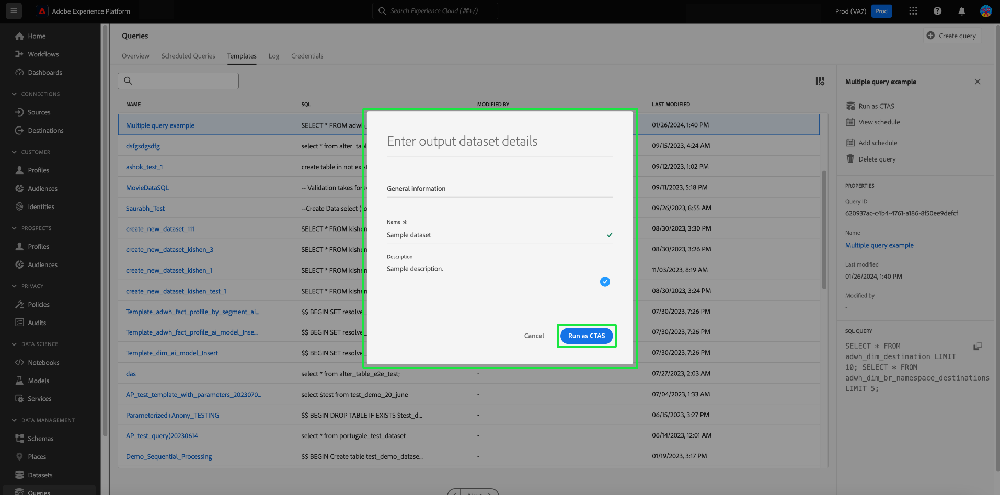

# Gerar conjuntos de dados de saída a partir dos resultados da consulta

[!DNL Query Service] permite usar consultas para gerar conjuntos de dados na [!DNL Data Lake]. Esses conjuntos de dados podem ser usados como entrada para mais consultas ou em outros serviços, como [!DNL Data Science Workspace], Perfil do cliente em tempo real ou [!DNL Analysis Workspace].

## Gerar conjuntos de dados a partir da interface do usuário do Adobe Experience Platform

Para criar conjuntos de dados na interface do usuário (UI) do Adobe Experience Platform, siga estas etapas:

1. Crie uma consulta usando um cliente conectado e valide a saída. Para saber como escrever consultas usando [!DNL Query Editor], leia o [!DNL Query Editor] Guia da interface do usuário [ao gravar consultas](./user-guide.md#writing-queries).

2. Na interface da Platform, navegue até **[!UICONTROL Consultas]** seguido pelo **[!UICONTROL Modelos]** e selecione a query criada. Para obter mais detalhes sobre como visualizar consultas que foram criadas e salvas para sua organização na interface do usuário da Platform, leia a [[!DNL Query Service] visão geral](./overview.md#browse).

3. No painel Detalhes da consulta, selecione **[!UICONTROL Conjunto de dados de saída]**.

   

4. Na caixa de diálogo exibida, digite um nome de conjunto de dados anexado à sua ID LDAP. O nome do conjunto de dados não precisa ser exclusivo ou seguro para SQL. Observe que o nome da tabela do conjunto de dados será gerado com base no nome do conjunto de dados criado aqui.

5. Em seguida, insira uma descrição para o conjunto de dados na [!UICONTROL Descrição] e selecione **[!UICONTROL Executar consulta]**.

   

6. Quando a execução da consulta for concluída, navegue até **[!UICONTROL Conjuntos de dados]** para exibir o conjunto de dados criado. Para saber mais sobre como executar ações comuns ao trabalhar com conjuntos de dados na interface do Platform, consulte a [Guia da interface do usuário de conjuntos de dados](../../catalog/datasets/user-guide.md).

Depois que um conjunto de dados é criado, ele pode ser acessado como qualquer outro no [!DNL Data Lake] e usado para vários casos de uso.

>[!NOTE]
>
>Em uma implementação em tempo real, você deve aplicar rótulos de Governança de dados após a criação do conjunto de dados. Para saber mais sobre como aplicar rótulos de uso de dados a conjuntos de dados, consulte a [Visão geral dos rótulos de uso de dados](../../data-governance/labels/overview.md).

## Gerar conjuntos de dados com uma variável de dados predefinida [!DNL Experience Data Model] schema

Use a sintaxe SQL para gerar um conjunto de dados com uma [!DNL Experience Data Model] Esquema de (XDM). Para obter mais informações sobre a sintaxe compatível com o [!DNL Query Service], leia o [Guia de Sintaxe SQL](../sql/syntax.md#create-table-as-select).

## Conjuntos de dados de saída

Os conjuntos de dados criados por meio dessa funcionalidade são gerados com um esquema ad hoc que corresponde à estrutura dos dados de saída conforme definido na instrução SQL. Alguns serviços downstream exigem conjuntos de dados com esquemas XDM específicos. Verifique os requisitos de formatação de dados para serviços downstream antes de gravar suas consultas.

## Próximas etapas

Depois de ler este documento, você deverá entender como usar o [!DNL Query Service] para gerar conjuntos de dados a partir da interface do usuário da Platform. Para obter mais informações sobre como acessar, gravar e executar consultas na interface do usuário da Platform, consulte [[!DNL Query Service] Visão geral da interface](./overview.md).
