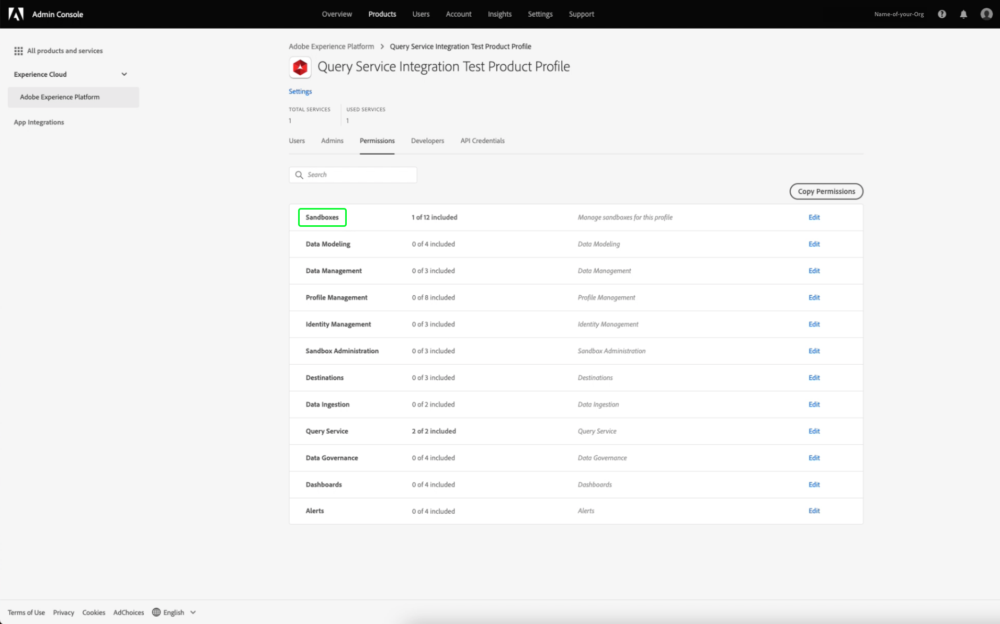

# Guia de credenciais

O Adobe Experience Platform Query Service permite conectar-se com clientes externos. Você pode se conectar a esses clientes externos usando credenciais que estão expirando ou credenciais que não estão expirando.

## Credenciais de expiração

Você pode usar as credenciais que estão expirando para configurar rapidamente uma conexão com um cliente externo.


A seção **[!UICONTROL Expirando credenciais]** fornece as seguintes informações:

- **[!UICONTROL Host]**: O nome do host ao qual você se conectará. Para conexão com o Serviço de query, isso incluirá o nome da Organização IMS que você está usando no momento.
- **[!UICONTROL Porta]**: O número da porta do host à qual você se conectará.
- **[!UICONTROL Banco de dados]**: O nome do banco de dados ao qual você se conectará.
- **[!UICONTROL Nome de usuário]**: O nome de usuário que você usará para se conectar ao Serviço de query.
- **[!UICONTROL Senha]**: A senha que você usará para se conectar ao Serviço de query.
- **[!UICONTROL comando]** PSQL: Um comando que inseriu automaticamente todas as informações relevantes para você se conectar ao Serviço de query usando PSQL na linha de comando.
- **[!UICONTROL Expira]**: A data de expiração das credenciais que expiram. As credenciais expiram 24 horas após serem geradas.

## Credenciais que não expiram

Você pode usar credenciais que não estão expirando para configurar uma conexão mais permanente com um cliente externo.

Antes de criar credenciais que não estejam expirando, você deve configurar as permissões **Sandboxes** e **Gerenciar integração do serviço de consulta** para sua organização na Adobe Admin Console.

Faça logon em [Adobe Admin Console](https://adminconsole.adobe.com/) e selecione a Org relevante na barra de navegação superior.

Na seção [!UICONTROL Products and services] do [!UICONTROL Overview], selecione **Adobe Experience Platform**.


A página Detalhes do Adobe Experience Platform é exibida. Em seguida, crie um novo perfil. Selecione [!UICONTROL **Novo perfil**].


Uma caixa de diálogo de criação de perfil é exibida. Insira um nome descritivo para o novo perfil e selecione [!UICONTROL **Save**]. A página [!UICONTROL Settings] para seu novo perfil é exibida. Selecione a guia [!UICONTROL **Permissões**] a partir das opções disponíveis.

### Ativar Permissões do Serviço de Consulta

Para garantir que as permissões corretas do Serviço de Consulta estejam habilitadas para sua Organização, localize e selecione a categoria [!UICONTROL **Serviço de Consulta**] na lista.


O espaço de trabalho [!UICONTROL Editar Permissões] para Serviço de Consulta é exibido. Selecione o ícone de mais (**+**) para [!UICONTROL **Gerenciar Consultas**] e [!UICONTROL **Gerenciar Integração do Serviço de Consulta**] para adicioná-los à coluna [!UICONTROL Itens de Permissão Incluídos]. Em seguida, selecione [!UICONTROL **Save**] para confirmar as alterações.


Isso retorna à guia Settings > Permissions .

### Ativar permissões de sandbox

Para garantir que a sandbox correta esteja selecionada para sua organização, localize e selecione a categoria [!UICONTROL **Sandboxes**] na lista.



O espaço de trabalho Sandboxes é exibido. A partir de [!UICONTROL Itens de Permissão Disponíveis], encontre a sandbox relevante, nesta imagem, ela é a sandbox de Produção. Selecione o ícone de adição (**+**) para adicioná-lo ao [!UICONTROL Itens de permissão incluídos]. Em seguida, selecione [!UICONTROL **Save**] para confirmar as alterações.


Isso retorna à guia Settings > Permissions .

Há mais três etapas necessárias para permitir que um usuário acesse o recurso de conta que não está expirando.

- Adicione um novo usuário para conceder as permissões recém-criadas. Selecione a guia [!UICONTROL **Users**], seguida por [!UICONTROL **Adicionar usuário**].


A caixa de diálogo criar usuário é exibida. Insira um nome e email para o novo usuário e selecione [!UICONTROL **Save**].

- O usuário deve ser adicionado como administrador para permitir a criação de uma conta para qualquer perfil de produto ativo. Para adicionar o usuário recém-criado como administrador. selecione a guia [!UICONTROL **Admins**], seguida por [!UICONTROL **Add Admins**].


A caixa de diálogo adicionar administrador é exibida. Insira os detalhes do novo administrador nos campos de texto e selecione [!UICONTROL **Save**].

- O usuário deve ser adicionado como desenvolvedor para que uma integração seja criada. Selecione a guia **Developers**, seguida pelo **Adicionar desenvolvedor**.


A caixa de diálogo adicionar desenvolvedor é exibida. Insira os detalhes do novo desenvolvedor nos campos de texto e selecione **Save**.

Para saber mais sobre como atribuir permissões, leia a documentação em [Controle de acesso](../../access-control/home.md).

Todas as permissões necessárias agora estão configuradas no console Adobe Developer para que o usuário use o recurso de credenciais que está expirando.

Para criar um conjunto de credenciais que não expiram, no espaço de trabalho Credenciais de Consultas selecione **[!UICONTROL Gerar credenciais]**.


A modal gerar credenciais é exibida. Para criar credenciais que não estão expirando, será necessário fornecer os seguintes detalhes:

- **[!UICONTROL Nome]**: O nome das credenciais que você está gerando.
- **[!UICONTROL Descrição]**: (Opcional) Uma descrição das credenciais que você está gerando.
- **[!UICONTROL Atribuído a]**: O usuário ao qual as credenciais serão atribuídas. Esse valor deve ser o endereço de email do usuário que está criando as credenciais.
- **[!UICONTROL Senha]**  (Opcional) Uma senha opcional para suas credenciais. Se a senha não for definida, o Adobe gerará automaticamente uma senha para você.

Depois de fornecer todos os detalhes necessários, selecione **[!UICONTROL Generate credentials]** para gerar suas credenciais.


>[!IMPORTANT]
>
>Depois que o botão **[!UICONTROL Generate credentials]** é selecionado, um arquivo JSON de configuração é baixado no computador local. Como o Adobe **not** registra a credencial gerada, você **deve** armazenar com segurança o arquivo baixado e manter um registro da credencial.
>
>Além disso, se as credenciais não forem usadas por 90 dias, elas serão removidas.

O arquivo JSON de configuração contém informações como nome técnico da conta, ID da conta técnica e credencial. Ele é fornecido no formato a seguir.

```json
{"technicalAccountName":"9F0A21EE-B8F3-4165-9871-846D3C8BC49E@TECHACCT.ADOBE.COM","credential":"3d184fa9e0b94f33a7781905c05203ee","technicalAccountId":"4F2611B8613AA3670A495E55"}
```

Depois de salvar suas credenciais geradas, selecione **[!UICONTROL Fechar]**. Agora você pode ver uma lista de todas as suas credenciais que não estão expirando.


Você pode editar ou excluir suas credenciais que não expiram. Para editar uma credencial que não expire, selecione o ícone de lápis (). Para excluir uma credencial que não esteja expirando, selecione o ícone excluir ().

Ao editar uma credencial que não esteja expirando, um modal é exibido. Você pode fornecer os seguintes detalhes para atualizar:

- **[!UICONTROL Nome]**: O nome das credenciais que você está gerando.
- **[!UICONTROL Descrição]**: (Opcional) Uma descrição das credenciais que você está gerando.
- **[!UICONTROL Atribuído a]**: O usuário ao qual as credenciais serão atribuídas. Esse valor deve ser o endereço de email do usuário que está criando as credenciais.


Depois de fornecer todos os detalhes necessários, selecione **[!UICONTROL Update account]** para concluir a atualização de suas credenciais.

## Usar credenciais para se conectar a clientes externos

Você pode usar as credenciais que estão expirando ou que não estão expirando para se conectar a clientes externos, como o Aqua Data Studio, o Looker ou o Power BI.

A tabela abaixo contém a lista de parâmetros e sua descrição, normalmente necessária para se conectar a clientes externos.

>[!NOTE]
>
>Ao se conectar a um host usando credenciais que não estão expirando, ainda é necessário usar todos os parâmetros listados na seção [!UICONTROL EXPIRING CREDENTIALS] exceto a senha.

| Parâmetro | Descrição |
|---|---|
| **Servidor/Host** | O nome do servidor/host ao qual você está se conectando. Esse valor assume a forma de `server.adobe.io` e pode ser encontrado em **[!UICONTROL Host]**. |
| **Port** | A porta do servidor/host ao qual você está se conectando. Esse valor pode ser encontrado em **[!UICONTROL Port]**. Um exemplo de valor para a porta seria `80`. |
| **Banco de dados** | O banco de dados ao qual você está se conectando. Esse valor pode ser encontrado em **[!UICONTROL Database]**. Um exemplo de valor para o banco de dados seria `prod:all`. |
| **Nome do usuário** | O nome de usuário do usuário que está se conectando ao cliente externo. Ele assume o formato de uma sequência de caracteres alfanumérica antes de `@AdobeOrg`. Esse valor é encontrado em **[!UICONTROL Username]**. |
| **Password** | A senha do usuário que está se conectando ao cliente externo. <ul><li>Se você estiver usando credenciais que estão expirando, isso poderá ser encontrado em **[!UICONTROL Password]** na seção de credenciais que estão expirando.</li><li>Se você estiver usando credenciais que não estão expirando, esse valor será composto dos argumentos da technicalAccountID e da credencial obtida do arquivo JSON de configuração. O valor da senha assume o formulário: `{technicalAccountId}:{credential}`.</li></ul> |

## Próximas etapas

Agora que você entende como as credenciais que estão expirando e que não estão expirando funcionam, pode usar essas credenciais para se conectar a clientes externos. Para obter mais informações detalhadas sobre clientes externos, leia o [guia Conectar clientes ao Serviço de query](../clients/overview.md).
