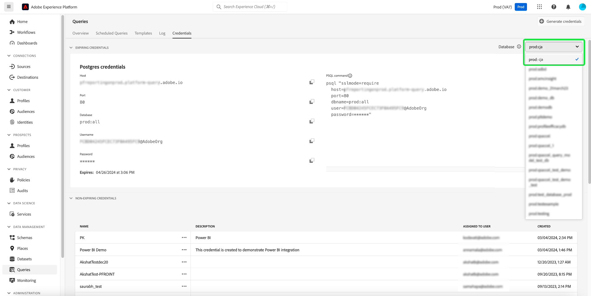

# Guia de credenciais

O Adobe Experience Platform Query Service permite conectar-se com clientes externos. Você pode se conectar a esses clientes externos usando credenciais com ou sem expiração.

>[!NOTE]
>
>O painel de credenciais não está disponível automaticamente para todos os(as) usuários(as). Entre em contato com a equipe de conta da Adobe para solicitar que a guia [!UICONTROL Credentials] seja incluída no espaço de trabalho do Serviço de consulta, se necessário. Se solicitado, essa alteração abrange toda a organização e é realizada pela equipe de engenharia da Adobe. Não é uma configuração controlada por usuários.

## Credenciais expiradas {#expiring-credentials}

>[!CONTEXTUALHELP]
>id="platform_queryservice_credentials_expiringcredentials"
>title="Modo SSL do cliente"
>abstract="O SSL deve ser habilitado nos clientes conectados ao Query Service. Verifique se o modo SSL está definido como “obrigatório”."

Você pode usar credenciais com expiração para configurar rapidamente uma conexão com um cliente externo.


A seção **[!UICONTROL Expiring credentials]** fornece as seguintes informações:

- **[!UICONTROL Host]**: O nome do host ao qual conectar seu cliente. Ele incorpora o nome da sua organização, como visto na faixa superior da interface do usuário do Experience Platform.
- **[!UICONTROL Port]**: O número da porta do host ao qual se conectar.
- **[!UICONTROL Database]**: O nome do banco de dados ao qual conectar um cliente.
- **[!UICONTROL Username]**: O nome de usuário usado para conexão com o Serviço de Consulta.
- **[!UICONTROL Password]**: a senha usada para se conectar ao Serviço de Consulta. As senhas na interface do usuário receberam hash por questões de segurança. Selecione o ícone de cópia () para copiar suas credenciais completas com hash para a área de transferência.
- **[!UICONTROL PSQL command]**: um comando que inseriu automaticamente todas as informações relevantes para você se conectar ao Serviço de Consulta usando PSQL na linha de comando.
- **[!UICONTROL Expires]**: A data e a hora de expiração das credenciais. A duração padrão da validade do token é de 24 horas, mas pode ser alterada nas configurações avançadas do Admin Console.

>[!TIP]
>
>Para alterar a vida útil da sessão da sua conexão de credenciais com o Serviço de Consulta expirando, navegue até a [Admin Console](https://adminconsole.adobe.com/) e selecione as seguintes opções na tela: **Configurações** > **Privacidade e Segurança** > **Configurações de Autenticação** > **Configurações avançadas** > **Vida útil máxima da sessão**.
>
>
>
>Consulte a documentação de Ajuda do Adobe para obter mais informações sobre as [Configurações avançadas](https://helpx.adobe.com/enterprise/using/authentication-settings.html#advanced-settings) oferecidas pelo Admin Console.

### Conectar-se aos dados do Customer Journey Analytics nas sessões de consulta {#connect-to-customer-journey-analytics}

Use a extensão Customer Journey Analytics BI com Power BI ou Tableau para acessar suas [visualizações de dados](https://experienceleague.adobe.com/en/docs/analytics-platform/using/cja-dataviews/data-views) do Customer Journey Analytics com SQL. Ao integrar o Serviço de consulta à extensão BI, você pode acessar suas visualizações de dados diretamente nas sessões do Serviço de consulta. Essa integração simplifica a funcionalidade das ferramentas de BI que usam o Serviço de consulta como interface PostgreSQL. Essa funcionalidade elimina a necessidade de duplicar visualizações de dados em ferramentas de BI, garante a geração de relatórios consistentes entre plataformas e simplifica a integração dos dados do Customer Journey Analytics com outras fontes em plataformas de BI.

Consulte a documentação para saber como [conectar o Serviço de consulta a uma variedade de aplicativos de cliente de desktop](../clients/overview.md), como [Power BI](../clients/power-bi.md) ou [Tableau](../clients/tableau.md)

>[!IMPORTANT]
>
>Um projeto do espaço de trabalho do Customer Journey Analytics e uma visualização de dados são necessários para usar essa funcionalidade.

Para acessar os dados do Customer Journey Analytics no Power BI ou Tableau, selecione o menu suspenso [!UICONTROL Database] e, em seguida, `prod:cja` nas opções disponíveis. Em seguida, copie os parâmetros de credenciais do [!DNL Postgres] (Host, Porta, Banco de Dados, Nome de Usuário e outros) para uso na sua configuração do Power BI ou Tableau.



>[!NOTE]
>
>Quando você conecta o Power BI ou o Tableau ao Customer Journey Analytics, o direito de &quot;sessões simultâneas&quot; do Serviço de consulta é consumido. Se sessões e consultas adicionais forem necessárias, um complemento de pacote de usuários de consulta ad hoc adicional poderá ser adquirido para obter cinco sessões simultâneas adicionais e uma consulta simultânea adicional.

Você também pode acessar os dados do Customer Journey Analytics diretamente do Editor de consultas ou da CLI do Postgres. Para fazer isso, faça referência ao banco de dados `cja` ao gravar sua consulta. Consulte o [guia de criação de consultas](./user-guide.md#query-authoring) do Editor de consultas para obter mais informações sobre como gravar, executar e salvar consultas.

Consulte o [guia de extensão de BI](https://experienceleague.adobe.com/en/docs/analytics-platform/using/cja-dataviews/bi-extension) para obter instruções completas sobre como acessar suas visualizações de dados do Customer Journey Analytics com SQL.

## Credenciais sem expiração {#non-expiring-credentials}

>[!CONTEXTUALHELP]
>id="platform_queryservice_credentials_migratenonexpiringcredentials"
>title="Migração para a credencial OAuth de servidor para servidor"
>abstract="Essa migração é necessária, pois as credenciais do JWT deixarão de funcionar após 30 de junho de 2025. Leva entre 30 e 40 segundos e não pode ser cancelada depois de iniciada. Todas as tarefas e integrações existentes continuarão a funcionar com o OAuth após a migração. É possível sair dessa tela e retornar a qualquer momento para verificar o status."

Você pode usar credenciais sem expiração para configurar uma conexão mais permanente com um cliente externo.

>[!IMPORTANT]
>
>Na primeira vez que você criar ou migrar uma credencial sem expiração para um servidor OAuth, deverá usar uma conta de Administrador do sistema. Somente um Administrador do sistema pode executar essa ação para sua organização. Se um não Administrador do sistema tentar essa etapa, o processo falhará com um erro de autorização. Após a configuração inicial, credenciais sem expiração subsequentes podem ser criadas ou migradas por usuários com as permissões necessárias.

>[!NOTE]
>
>As credenciais sem expiração têm as seguintes limitações:
>
>- Os usuários devem fazer logon com seu nome de usuário e senha no formato de `{technicalAccountId}:{credential}`. Encontre mais informações na seção [Gerar credenciais](#generate-credentials).
>- Por padrão, as credenciais sem expiração recebem permissões para executar somente consultas `SELECT`. Para executar consultas `CTAS` ou `ITAS`, adicione manualmente as permissões &quot;Gerenciar conjunto de dados&quot; e &quot;Gerenciar esquemas&quot; à função associada à credencial sem expiração. A permissão &quot;Gerenciar Esquemas&quot; pode ser encontrada na seção &quot;Modelagem de Dados&quot;, e a permissão &quot;Gerenciar Conjuntos de Dados&quot; está localizada na seção &quot;Gerenciamento de Dados&quot; da [Adobe Developer Console](https://developer.adobe.com/console/).
>- Os clientes de terceiros podem ter um desempenho diferente do esperado ao listar objetos de consulta. Por exemplo, alguns clientes de terceiros, como [!DNL DB Visualizer], não exibirão o nome da exibição no painel esquerdo. No entanto, o nome da exibição pode ser acessado se for chamado em uma consulta `SELECT`. Da mesma forma, [!DNL PowerUI] pode não listar as exibições temporárias criadas por meio do SQL para seleção na criação do painel.

### Pré-requisitos

Antes de gerar credenciais sem expiração, você deve concluir as seguintes etapas no Adobe Admin Console:

1. Faça logon no [Adobe Admin Console](https://adminconsole.adobe.com/) e selecione a organização relevante na barra de navegação superior.
2. [Selecione um perfil de produto.](../../access-control/ui/browse.md)
3. [Configure as permissões **Sandboxes** e **Gerenciar Integração do Serviço de Consulta**](../../access-control/ui/permissions.md) para o perfil do produto.
4. [Adicione um novo usuário a um perfil de produto](../../access-control/ui/users.md) para que ele tenha suas permissões configuradas.
5. [Adicione o usuário como um administrador de perfil de produto](https://helpx.adobe.com/br/enterprise/using/manage-product-profiles.html) para permitir a criação de uma conta para qualquer perfil de produto ativo.
6. [Adicione o usuário como desenvolvedor de perfil de produto](https://helpx.adobe.com/br/enterprise/using/manage-developers.html) para criar uma integração.

Após essas etapas, as permissões necessárias são configuradas no [Adobe Developer Console](https://developer.adobe.com/console/) para que você gere credenciais OAuth de servidor para servidor e use os recursos de credenciais com expiração ou sem expiração.

Para obter informações detalhadas sobre como atribuir permissões, consulte a [documentação de controle de acesso](../../access-control/home.md).

### Gerar credenciais {#generate-credentials}

Para criar um conjunto de credenciais sem expiração, volte para a interface do usuário do Experience Platform e selecione **[!UICONTROL Queries]** na navegação à esquerda para acessar o espaço de trabalho [!UICONTROL Queries]. Em seguida, selecione a guia **[!UICONTROL Credentials]** seguida por **[!UICONTROL Generate credentials]**.


Uma caixa de diálogo é exibida com a permissão para gerar credenciais. Para criar credenciais sem expiração, você deve fornecer os seguintes detalhes:

- **[!UICONTROL Name]**: O nome das credenciais que você está gerando.
- **[!UICONTROL Description]**: (Opcional) Uma descrição para as credenciais que você está gerando.
- **[!UICONTROL Assigned to]**: o usuário ao qual as credenciais serão atribuídas. Esse valor deve ser o endereço de email do usuário que está criando as credenciais.
- **[!UICONTROL Password]** (Opcional) Uma senha opcional para suas credenciais. Se a senha não for definida, o Adobe gerará automaticamente uma senha para você.

Depois de fornecer todos os detalhes necessários, selecione **[!UICONTROL Generate credentials]** para gerar suas credenciais.


>[!IMPORTANT]
>
>Quando **[!UICONTROL Generate credentials]** é selecionado, um arquivo JSON de configuração é baixado para sua máquina local. Como o Adobe **não** registra as credenciais geradas, você deve armazenar com segurança o arquivo baixado e manter um registro da credencial.
>
>Além disso, se as credenciais não forem usadas por 90 dias, elas serão eliminadas.

O arquivo JSON de configuração contém informações como nome da conta técnica, ID da conta técnica e credencial. Ela é fornecida no formato a seguir.

```json
{"technicalAccountName":"9F0A21EE-B8F3-4165-9871-846D3C8BC49E@TECHACCT.ADOBE.COM","credential":"3d184fa9e0b94f33a7781905c05203ee","technicalAccountId":"4F2611B8613AA3670A495E55"}
```

Depois de salvar suas credenciais geradas, selecione **[!UICONTROL Close]**. Agora você pode ver uma lista de todas as suas credenciais sem expiração.


Você pode editar ou excluir suas credenciais sem expiração. Para editar uma credencial sem expiração, selecione o ícone de lápis (). Para excluir uma credencial sem expiração, selecione o ícone Excluir ().

Ao editar uma credencial sem expiração, um modal é exibido. Você pode fornecer os seguintes detalhes para atualizar:

- **[!UICONTROL Name]**: O nome das credenciais que você está gerando.
- **[!UICONTROL Description]**: (Opcional) Uma descrição para as credenciais que você está gerando.
- **[!UICONTROL Assigned to]**: o usuário ao qual as credenciais serão atribuídas. Esse valor deve ser o endereço de email do usuário que está criando as credenciais.


Depois de fornecer todos os detalhes necessários, selecione **[!UICONTROL Update account]** para concluir a atualização das suas credenciais.

### Migrar credenciais para o OAuth {#migrate-credentials}

Se você estiver usando credenciais JWT sem expiração, migre cada uma para o servidor OAuth para o servidor antes de 30 de junho de 2025 para evitar a interrupção do serviço.

>[!IMPORTANT]
>
>As credenciais do JWT deixarão de funcionar após 30 de junho de 2025. Você deve concluir manualmente essa migração para manter a autorização.

Para saber como identificar credenciais afetadas e concluir a migração, consulte o [guia de credenciais de migração do JWT para o servidor do OAuth](./migrate-jwt-to-oauth.md).

Para perguntas comuns, consulte as [perguntas frequentes sobre migração](./migrate-jwt-to-oauth.md#faq).

## Usar credenciais para se conectar a clientes externos {#use-credential-to-connect}

Você pode usar as credenciais com ou sem expiração para se conectar com clientes externos, como Aqua Data Studio, Looker ou Power BI. O método de entrada dessas credenciais varia de acordo com o cliente externo. Consulte a documentação do cliente externo para obter instruções específicas sobre o uso dessas credenciais.

A imagem indica o local de cada parâmetro encontrado na interface, exceto a senha das credenciais sem expiração. Embora as credenciais sem expiração sejam fornecidas pelos arquivos de configuração JSON, você pode exibir suas credenciais que estão expirando na guia **Credenciais** da interface.


A tabela abaixo descreve os parâmetros normalmente necessários para se conectar a clientes externos.

>[!NOTE]
>
>Ao conectar-se a um host usando credenciais sem expiração, ainda é necessário usar todos os parâmetros listados na seção [!UICONTROL EXPIRING CREDENTIALS], exceto a senha e o nome de usuário.
>&#x200B;>O formato para inserir seu nome de usuário e senha usa valores separados por dois pontos, como neste exemplo `username:{your_username}` e `password:{password_string}`.

| Parâmetro | Descrição | Exemplo |
|---|---|---|
| **Servidor/Host** | O nome do servidor/host ao qual você está se conectando. <ul><li>Este valor é usado para credenciais com e sem expiração e assume a forma de `server.adobe.io`. O valor está em **[!UICONTROL Host]** na seção [!UICONTROL EXPIRING CREDENTIALS].</ul></li> | `acme.platform.adobe.io` |
| **Port** | A porta do servidor/host ao qual você está se conectando. <ul><li>Este valor é usado para credenciais com e sem expiração e é encontrado em **[!UICONTROL Port]** na seção [!UICONTROL EXPIRING CREDENTIALS].</ul></li> | `80` |
| **Banco de dados** | O banco de dados ao qual você está se conectando. <ul><li>Este valor é usado para credenciais com e sem expiração e foi encontrado em **[!UICONTROL Database]** na seção [!UICONTROL EXPIRING CREDENTIALS]. </ul></li> | `prod:all` |
| **Nome de usuário** | O nome de usuário do usuário que está se conectando ao cliente externo. <ul><li>Esse valor é usado para credenciais com e sem expiração. Assume a forma de uma sequência alfanumérica antes de `@AdobeOrg`. Este valor está em **[!UICONTROL Username]**.</li></ul> | `ECBB80245ECFC73E8A095EC9@AdobeOrg` |
| **Password** | A senha do usuário que está se conectando ao cliente externo. <ul><li>Se você estiver usando credenciais com expiração, elas poderão ser encontradas em **[!UICONTROL Password]**, na seção [!UICONTROL EXPIRING CREDENTIALS].</li><li>Se você estiver usando credenciais sem expiração, esse valor serão os argumentos concatenados de technicalAccountID e a credencial retirada do arquivo JSON de configuração. O valor da senha tem o formato: `{technicalAccountId}:{credential}`.</li></ul> | <ul><li>Uma senha de credencial que expira tem mais de mil caracteres alfanuméricos. Nenhum exemplo será dado.</li><li>Uma senha de credencial sem expiração é a seguinte:<br>`4F2611B8613DK3670V495N55:3d182fa9e0b54f33a7881305c06203ee`</li></ul> |

{style="table-layout:auto"}

## Próximas etapas

Agora que você entende como as credenciais com e sem expiração funcionam, é possível usá-las para se conectar a clientes externos. Para obter mais informações detalhadas sobre clientes externos, leia o [guia Conectar clientes ao Serviço de Consulta](../clients/overview.md).
