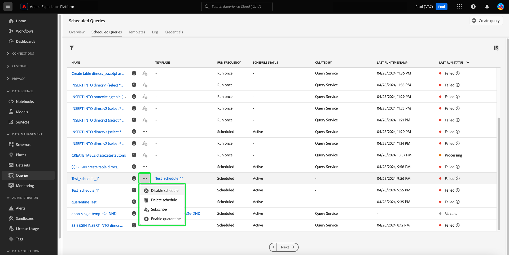

# Monitorar consultas programadas

O Adobe Experience Platform oferece maior visibilidade do status de todos os trabalhos de consulta por meio da interface. No [!UICONTROL Consultas programadas] Agora é possível encontrar informações importantes sobre as execuções de consulta, que incluem status, detalhes da programação e mensagens/códigos de erro caso falhem. Também é possível assinar alertas para consultas com base em seu status por meio da interface do para qualquer uma dessas consultas por meio do [!UICONTROL Consultas programadas] guia.

## [!UICONTROL Consultas programadas]

A variável [!UICONTROL Consultas programadas] A guia fornece uma visão geral de todas as consultas de CTAS e ITAS programadas. Os detalhes da execução podem ser encontrados para todas as consultas programadas, bem como códigos de erro e mensagens para quaisquer consultas com falha.

Para navegar até o [!UICONTROL Consultas programadas] selecione **[!UICONTROL Consultas]** na barra de navegação esquerda, seguida por **[!UICONTROL Consultas programadas]**

A tabela abaixo descreve cada coluna disponível.

>[!NOTE]
>
>O ícone de assinaturas de alerta () está contido em cada linha em uma coluna sem título. Consulte a [assinaturas de alerta](#alert-subscription) para obter mais informações.

| Coluna | Descrição |
|---|---|
| **[!UICONTROL Nome]** | O campo name é o nome do template ou os primeiros caracteres da query SQL. Qualquer consulta criada por meio da interface do usuário com o Editor de consultas é nomeada no início. Se a consulta foi criada por meio da API, seu nome se torna um trecho do SQL inicial usado para criar a consulta. Para ver uma lista de todas as execuções associadas à consulta, selecione um item na lista [!UICONTROL Nome] coluna. Para obter mais informações, consulte [detalhes da programação de execuções de consulta](#query-runs) seção. |
| **[!UICONTROL Modelo]** | O nome do modelo da consulta. Selecione um nome de modelo para navegar até o Editor de consultas. O modelo de consulta é exibido no Editor de consultas para conveniência. Se não houver nome do modelo, a linha será marcada com um hífen e não haverá capacidade de redirecionar para o Editor de consultas para exibir a consulta. |
| **[!UICONTROL SQL]** | Um trecho da consulta SQL. |
| **[!UICONTROL Frequência de execução]** | A cadência na qual sua consulta está definida para execução. Os valores disponíveis são `Run once` e `Scheduled`. |
| **[!UICONTROL Criado por]** | O nome do usuário que criou a consulta. |
| **[!UICONTROL Criado]** | O carimbo de data e hora quando a consulta foi criada, em formato UTC. |
| **[!UICONTROL Carimbo de data/hora da última execução]** | O carimbo de data e hora mais recente quando a consulta foi executada. Esta coluna destaca se uma consulta foi executada de acordo com seu agendamento atual. |
| **[!UICONTROL Status da última execução]** | O status da execução de consulta mais recente. Os valores de status são: `Success`, `Failed`, `In progress`, e `No runs`. |
| **[!UICONTROL Status do Calendário]** | O status atual da consulta agendada. Há seis valores em potencial, [!UICONTROL Registrando], [!UICONTROL Ativo], [!UICONTROL Inativo], [!UICONTROL Excluído], um hífen e [!UICONTROL Em quarentena].<ul><li>A variável **[!UICONTROL Registrando]** status indica que o sistema ainda está processando a criação do novo agendamento para a consulta. Observe que você não pode desativar ou excluir uma consulta programada enquanto ela estiver se registrando.</li><li>A variável **[!UICONTROL Ativo]** status indica que a consulta programada foi **ainda não passado** data e hora de conclusão.</li><li>A variável **[!UICONTROL Inativo]** status indica que a consulta programada foi **aprovado** sua data e hora de conclusão ou foi marcado por um usuário para estar em um estado inativo.</li><li>A variável **[!UICONTROL Excluído]** status indica que a programação de consulta foi excluída.</li><li>O hífen indica que a consulta agendada é uma consulta única e não recorrente.</li><li>A variável **[!UICONTROL Em quarentena]** O status indica que a consulta falhou em dez execuções consecutivas e requer sua intervenção antes que qualquer execução adicional possa ocorrer.</li></ul> |

>[!TIP]
>
>Se você navegar até o Editor de consultas, poderá selecionar **[!UICONTROL Consultas]** para retornar ao [!UICONTROL Modelos] guia.

## Personalizar configurações de tabela para consultas programadas {#customize-table}

É possível ajustar as colunas nas [!UICONTROL Consultas programadas] para atender às suas necessidades. Para abrir o [!UICONTROL Personalizar tabela] caixa de diálogo de configurações e editar colunas disponíveis, selecione o ícone de configurações () na parte superior direita da tela.

>[!NOTE]
>
>A variável [!UICONTROL Criado em] A coluna que se refere à data em que o agendamento foi criado fica oculta por padrão.

Alterne as caixas de seleção relevantes para remover ou adicionar uma coluna da tabela. Em seguida, selecione **[!UICONTROL Aplicar]** para confirmar suas escolhas.

>[!NOTE]
>
>Qualquer consulta criada por meio da interface do usuário se torna um modelo nomeado como parte do processo de criação. O nome do template é visto na coluna template. Se a query foi criada por meio da API, a coluna de modelo está em branco.

## Gerenciar consultas programadas com ações integradas {#inline-actions}

A variável [!UICONTROL Consultas programadas] view oferece várias ações em linha para gerenciar todas as consultas programadas de um único local. As ações em linha são indicadas em cada linha com reticências. Selecione as reticências de uma consulta agendada que você deseja gerenciar para ver as opções disponíveis em um menu pop-up. As opções disponíveis incluem [[!UICONTROL Desativar programação]](#disable) ou [!UICONTROL Ativar programação], [[!UICONTROL Excluir programação]](#delete), [[!UICONTROL Assinar]](#alert-subscription) para consultar alertas, e [Ativar ou [!UICONTROL Desativar quarentena]](#quarantined-queries).

### Desativar ou ativar uma consulta programada {#disable}

Para desativar uma consulta programada, selecione as reticências da consulta programada que deseja gerenciar e selecione **[!UICONTROL Desativar programação]** nas opções do menu pop-up. Uma caixa de diálogo é exibida para confirmar a ação. Selecionar **[!UICONTROL Desativar]** para confirmar suas configurações.

Quando uma consulta programada é desativada, você pode ativar a programação por meio do mesmo processo. Selecione as reticências e selecione **[!UICONTROL Ativar programação]** nas opções disponíveis.

>[!NOTE]
>
>Se uma consulta tiver sido colocada em quarentena, você deverá revisar o SQL do modelo antes de ativar sua programação. Isso evita o desperdício de horas de computação se a consulta do modelo ainda tiver problemas.

### Excluir uma consulta agendada {#delete}

Para excluir uma consulta agendada, selecione as reticências da consulta agendada que deseja gerenciar e selecione **[!UICONTROL Excluir programação]** nas opções do menu pop-up. Uma caixa de diálogo é exibida para confirmar a ação. Selecionar **[!UICONTROL Excluir]** para confirmar suas configurações.

Depois que uma consulta programada é excluída, ela é **não** removida da lista de consultas agendadas. As ações em linha fornecidas pelas reticências são removidas e substituídas pelo ícone de assinatura de adição de alerta esmaecido. Não é possível assinar alertas para o agendamento excluído. A linha permanece na interface do usuário para fornecer informações sobre execuções realizadas como parte da consulta programada.

Se quiser programar execuções para esse modelo de consulta, selecione o nome do modelo na linha apropriada para navegar até o Editor de consultas e, em seguida, siga as [instruções para adicionar um agendamento a uma consulta](./query-schedules.md#create-schedule) conforme descrito na documentação.

### Assinar alertas {#alert-subscription}

Para assinar alertas para execuções de consulta programadas, selecione a `...` (reticências) ou ícone de assinatura de alerta () para a consulta agendada que deseja gerenciar. O menu suspenso de ações em linha é exibido. Em seguida, selecione **[!UICONTROL Assinar]** nas opções disponíveis.

A variável [!UICONTROL Alertas] será aberta. A variável [!UICONTROL Alertas] A caixa de diálogo inscreve você em notificações da interface do usuário e alertas de email. Há várias opções de assinatura de alerta disponíveis: `start`, `success`, `failure`, `quarantine`, e `delay`. Marque as caixas apropriadas e selecione **[!UICONTROL Salvar]** para se inscrever.

A tabela abaixo explica os tipos de alerta de consulta aceitos:

| Tipo de alerta | Descrição |
|---|---|
| `start` | Este alerta notifica quando uma execução de consulta programada é iniciada ou começa a ser processada. |
| `success` | Esse alerta informa quando uma execução de consulta programada é concluída com sucesso, indicando que a consulta foi executada sem erros. |
| `failed` | Esse alerta é disparado quando uma execução de consulta agendada encontra um erro ou falha na execução. Isso ajuda a identificar e solucionar problemas prontamente. |
| `quarantine` | Esse alerta é ativado quando uma execução de consulta agendada é colocada em quarentena. Quando as consultas são inscritas no [recurso de quarentena](#quarantined-queries), qualquer consulta programada que falhar dez execuções consecutivas será colocada automaticamente em uma [!UICONTROL Em quarentena] estado. Eles então exigem sua intervenção antes que qualquer outra execução possa ocorrer. |
| `delay` | Este alerta o notifica se houver uma [atraso no resultado de uma execução de consulta](#query-run-delay) além de um limite especificado. Você pode definir um horário personalizado para acionar o alerta quando a consulta for executada por essa duração sem ser concluída ou falhar. |

>[!NOTE]
>
>Para ser notificado de que as execuções de consulta estão em quarentena, primeiro você deve inscrever as execuções de consulta programadas no [recurso de quarentena](#quarantined-queries).

Consulte a [documentação da API de assinaturas de alerta](../api/alert-subscriptions.md) para obter mais informações.

### Exibir os detalhes da consulta {#query-details}

Selecione o ícone de informações () para ver o painel de detalhes da consulta. O painel de detalhes contém todas as informações relevantes sobre a consulta além dos fatos incluídos na tabela de consultas programadas. As informações adicionais incluem a ID da consulta, a data da última modificação, o SQL da consulta, a ID da programação e a programação definida atual.

## Consultas em quarentena {#quarantined-queries}

>[!NOTE]
>
>O alerta de quarentena não está disponível para consultas ad hoc &quot;run-once&quot;. O alerta de quarentena só é aplicável a consultas de lote agendado (CTAS e ITAS).

Quando inscrito no recurso de quarentena, qualquer consulta agendada que falhar dez execuções consecutivas é colocada automaticamente em um [!UICONTROL Em quarentena] status. Uma consulta com esse status fica inativa e não é executada na sua cadência programada. Em seguida, ele requer sua intervenção antes que qualquer outra execução possa ocorrer. Isso protege os recursos do sistema, pois você deve revisar e corrigir os problemas com seu SQL antes que ocorram mais execuções.

Para habilitar uma consulta agendada para o recurso de quarentena, selecione as reticências (`...`) seguido por [!UICONTROL Ativar quarentena] no menu suspenso exibido.

As consultas também podem ser inscritas no recurso de quarentena durante o processo de criação do agendamento. Consulte a [documentação de agendamentos de consulta](./query-schedules.md#quarantine) para obter mais informações.

## Atraso na execução da consulta {#query-run-delay}

Mantenha o controle das horas computacionais definindo alertas para atrasos de consulta. Você poderá monitorar o desempenho da consulta e receber notificações se o status de uma consulta permanecer inalterado após um período específico. Use o &#39;[!UICONTROL Atraso na execução da consulta]&quot;alerta a ser notificado se uma consulta continuar sendo processada após um período específico sem conclusão.

Quando você [assinar alertas](#alert-subscription) para execuções de consulta programadas, um dos alertas disponíveis é o [!UICONTROL Atraso na execução da consulta]. Esse alerta exige que você defina um limite para o tempo gasto na execução, momento em que você será notificado sobre o atraso no processamento.

Para escolher uma duração de limite que aciona a notificação, insira um número no campo de entrada de texto ou use as setas para cima e para baixo para aumentar em incrementos de um minuto. Como o limite é definido em minutos, a duração máxima para observar um atraso de execução de consulta é de 1440 minutos (24 horas). O período padrão para um atraso de execução é de 150 minutos.

>[!NOTE]
>
>Uma execução de consulta só pode ter um tempo de atraso de execução. Se você alterar o limite de atraso, ele será alterado para o usuário que se inscreveu no alerta e para toda a organização.

Consulte a seção assinar alertas para saber como [assinar [!UICONTROL Atraso na execução da consulta] alertas](#alert-subscription).

## Filtrar consultas {#filter}

Você pode filtrar consultas com base na frequência de execução. No [!UICONTROL Consultas programadas] , selecione o ícone de filtro () para abrir a barra lateral do filtro.

Para filtrar a lista de consultas com base em sua frequência de execução, selecione **[!UICONTROL Agendado]** ou **[!UICONTROL Executar uma vez]** filtrar caixas de seleção.

>[!NOTE]
>
>Qualquer consulta executada, mas não agendada, é qualificada como [!UICONTROL Executar uma vez].

Após ativar os critérios de filtro, selecione **[!UICONTROL Ocultar filtros]** para fechar o painel de filtro.

## Detalhes do agendamento de execuções de consulta {#query-runs}

Para abrir a página de detalhes da programação, selecione um nome de consulta na [!UICONTROL Consultas programadas] guia. Essa visualização fornece uma lista de todas as execuções executadas como parte dessa consulta programada. As informações fornecidas incluem a hora de início e término, o status e o conjunto de dados usado.

Essas informações são fornecidas em uma tabela de cinco colunas. Cada linha denota uma execução de consulta.

| Nome da coluna | Descrição |
|---|---|
| **[!UICONTROL ID de execução da consulta]** | A ID de execução da consulta para a execução diária. Selecione o **[!UICONTROL ID de execução da consulta]** para navegar até o [!UICONTROL Visão geral da execução da consulta]. |
| **[!UICONTROL Início da execução da consulta]** | O carimbo de data e hora quando a consulta foi executada. O carimbo de data/hora está no formato UTC. |
| **[!UICONTROL Execução de consulta concluída]** | O carimbo de data e hora quando a consulta foi concluída. O carimbo de data/hora está no formato UTC. |
| **[!UICONTROL Status]** | O status da execução de consulta mais recente. Os valores de status são: `Success`, `Failed`, `In progress`ou `Quarantined`. |
| **[!UICONTROL Conjunto de dados]** | O conjunto de dados envolvido na execução. |

Detalhes da consulta que está sendo agendada podem ser vistos na [!UICONTROL Propriedades] painel. Esse painel inclui a ID de consulta inicial, o tipo de cliente, o nome do modelo, o SQL de consulta e a cadência do agendamento.

Selecione uma ID de execução de consulta para navegar até a página de detalhes da execução e exibir informações da consulta.

## Visão geral da execução da consulta {#query-run-overview}

A variável [!UICONTROL Visão geral da execução da consulta] fornece informações sobre execuções individuais para esta consulta programada e um detalhamento mais detalhado do status de execução. Esta página também inclui as informações do cliente e detalhes de quaisquer erros que possam ter causado a falha da consulta.

A seção status da consulta fornece o código de erro e a mensagem de erro caso a consulta tenha falhado.

Você pode copiar o SQL da consulta para a área de transferência nessa visualização. Para copiar a query, selecione o ícone copiar na parte superior direita do trecho SQL. Uma mensagem pop-up confirma que o código foi copiado.

### Executar detalhes de consultas com bloqueio anônimo {#anonymous-block-queries}

As consultas que usam blocos anônimos para compreender suas instruções SQL são separadas em suas subconsultas individuais. A separação em subconsultas permite inspecionar os detalhes da execução de cada bloco de consulta individualmente.

>[!NOTE]
>
>Os detalhes de execução de um bloco anônimo que usa o comando DROP **não** ser relatada como uma subconsulta separada. Detalhes de execução separados estão disponíveis para consultas CTAS, consultas ITAS e instruções COPY usadas como subconsultas de bloco anônimas. Os detalhes de execução do comando DROP não são suportados no momento.

Blocos anônimos são indicados pelo uso de um `$$` prefixo antes da consulta. Para saber mais sobre blocos anônimos no serviço de query, consulte [documento de bloqueio anônimo](../key-concepts/anonymous-block.md).

As subconsultas de blocos anônimos têm guias à esquerda do status de execução. Selecione uma guia para exibir os detalhes da execução.

Se um query de bloco anônimo falhar, você poderá encontrar o código de erro para esse bloco específico por meio dessa interface.

Selecionar **[!UICONTROL Query]** para retornar à tela de detalhes da programação ou **[!UICONTROL Consultas programadas]** para retornar ao [!UICONTROL Consultas programadas] guia.

