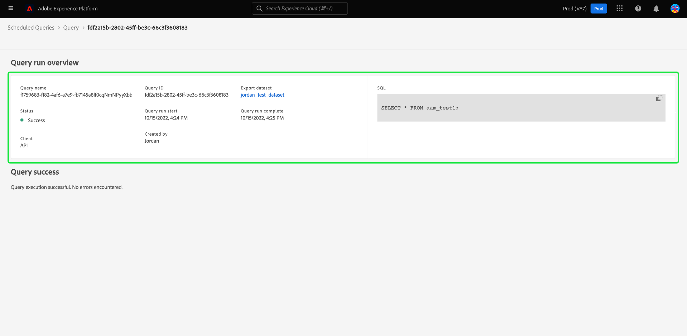

# Monitorar consultas programadas

O Adobe Experience Platform oferece maior visibilidade do status de todos os trabalhos de consulta por meio da interface. De [!UICONTROL Consultas programadas] guia, agora você pode encontrar informações importantes sobre as execuções de consulta, que incluem status, detalhes da programação e mensagens/códigos de erro caso haja falha. Também é possível assinar alertas para consultas com base em seu status por meio da interface do para qualquer uma dessas consultas por meio do [!UICONTROL Consultas programadas] guia.

## [!UICONTROL Consultas programadas]

A variável [!UICONTROL Consultas programadas] A guia fornece uma visão geral de todas as consultas de CTAS e ITAS programadas. Os detalhes da execução podem ser encontrados para todas as consultas programadas, bem como códigos de erro e mensagens para quaisquer consultas com falha.

Para navegar até o [!UICONTROL Consultas programadas] selecione **[!UICONTROL Consultas]** na barra de navegação esquerda, seguida por **[!UICONTROL Consultas programadas]**

A tabela abaixo descreve cada coluna disponível.

>[!NOTE]
>
>O ícone de assinaturas de alerta está contido em cada linha de uma coluna sem título. Consulte a [assinaturas de alerta](#alert-subscription) para obter mais informações.

| Coluna | Descrição |
|---|---|
| **[!UICONTROL Nome]** | O campo name é o nome do template ou os primeiros caracteres da query SQL. Qualquer consulta criada por meio da interface do usuário com o Editor de consultas é nomeada no início. Se a consulta foi criada por meio da API, seu nome se torna um trecho do SQL inicial usado para criar a consulta. Selecione qualquer item no [!UICONTROL Nome] para ver uma lista de todas as execuções associadas à consulta. Para obter mais informações, consulte a [detalhes da programação de execuções de consulta](#query-runs) seção. |
| **[!UICONTROL Modelo]** | O nome do modelo da consulta. Selecione um nome de modelo para navegar até o Editor de consultas. O modelo de consulta é exibido no Editor de consultas para conveniência. Se não houver nome do modelo, a linha será marcada com um hífen e não haverá capacidade de redirecionar para o Editor de consultas para exibir a consulta. |
| **[!UICONTROL SQL]** | Um trecho da consulta SQL. |
| **[!UICONTROL Frequência de execução]** | Esta é a cadência na qual sua consulta está definida para execução. Os valores disponíveis são `Run once` e `Scheduled`. As consultas podem ser filtradas de acordo com a frequência de execução. |
| **[!UICONTROL Criado por]** | O nome do usuário que criou a consulta. |
| **[!UICONTROL Criado]** | O carimbo de data e hora quando a consulta foi criada, em formato UTC. |
| **[!UICONTROL Carimbo de data/hora da última execução]** | O carimbo de data e hora mais recente quando a consulta foi executada. Esta coluna destaca se uma consulta foi executada de acordo com seu agendamento atual. |
| **[!UICONTROL Status da última execução]** | O status da execução de consulta mais recente. Os valores de status são: `Success`, `Failed`, `In progress`, e `No runs`. |

>[!TIP]
>
>Se você navegar até o Editor de consultas, poderá selecionar **[!UICONTROL Consultas]** para retornar ao [!UICONTROL Modelos] guia.

### Personalizar configurações de tabela para consultas programadas

É possível ajustar as colunas nas [!UICONTROL Consultas programadas] para atender às suas necessidades. Selecione o ícone de configurações () para abrir o [!UICONTROL Personalizar tabela] caixa de diálogo de configurações e edite as colunas disponíveis.

Alterne as caixas de seleção relevantes para remover ou adicionar uma coluna da tabela. Em seguida, selecione **[!UICONTROL Aplicar]** para confirmar suas escolhas.

>[!NOTE]
>
>Qualquer consulta criada por meio da interface do usuário se torna um modelo nomeado como parte do processo de criação. O nome do template é visto na coluna template. Se a query foi criada por meio da API, a coluna de modelo está em branco.

### Assinar alertas {#alert-subscription}

Você pode assinar alertas na [!UICONTROL Consultas programadas] guia. Selecione o ícone de notificação de alerta () ao lado de um nome de consulta para abrir o [!UICONTROL Alertas] diálogo. A variável [!UICONTROL Alertas] A caixa de diálogo assina notificações da interface do usuário e alertas de email. Os alertas são baseados no status da consulta. Há três opções disponíveis: `start`, `success`, e `failure`. Marque as caixas apropriadas e selecione **[!UICONTROL Salvar]** para se inscrever.

Consulte a [documentação da API de assinaturas de alerta](../api/alert-subscriptions.md) para obter mais informações.

### Filtrar consultas {#filter}

Você pode filtrar consultas com base na frequência de execução. No [!UICONTROL Consultas programadas] , selecione o ícone de filtro () para abrir a barra lateral do filtro.

Selecione **[!UICONTROL Agendado]** ou **[!UICONTROL Executar uma vez]** execute caixas de seleção de filtro de frequência para filtrar a lista de consultas.

>[!NOTE]
>
>Qualquer consulta executada, mas não agendada, é qualificada como [!UICONTROL Executar uma vez].

Após ativar os critérios de filtro, selecione **[!UICONTROL Ocultar filtros]** para fechar o painel de filtro.

## Detalhes do agendamento de execuções de consulta {#query-runs}

Selecione um nome de consulta para navegar até a página de detalhes da programação. Essa visualização fornece uma lista de todas as execuções executadas como parte dessa consulta programada. As informações fornecidas incluem a hora de início e término, o status e o conjunto de dados usado.

Essas informações são fornecidas em uma tabela de cinco colunas. Cada linha denota uma execução de consulta.

| Nome da coluna | Descrição |
|---|---|
| **[!UICONTROL ID de execução da consulta]** | A ID de execução da consulta para a execução diária. Selecione o **[!UICONTROL ID de execução da consulta]** para navegar até o [!UICONTROL Visão geral da execução da consulta]. |
| **[!UICONTROL Início da execução da consulta]** | O carimbo de data e hora quando a consulta foi executada. Isso está no formato UTC. |
| **[!UICONTROL Execução de consulta concluída]** | O carimbo de data e hora quando a consulta foi concluída. Isso está no formato UTC. |
| **[!UICONTROL Status]** | O status da execução de consulta mais recente. Os três valores de status são: `successful` `failed` ou `in progress`. |
| **[!UICONTROL Conjunto de dados]** | O conjunto de dados envolvido na execução. |

Detalhes da consulta que está sendo agendada podem ser vistos na [!UICONTROL Propriedades] painel. Esse painel inclui a ID de consulta inicial, o tipo de cliente, o nome do modelo, o SQL de consulta e a cadência do agendamento.

Selecione uma ID de execução de consulta para navegar até a página de detalhes da execução e exibir informações da consulta.

## Visão geral da execução da consulta {#query-run-overview}

A variável [!UICONTROL Visão geral da execução da consulta] fornece informações sobre execuções individuais para esta consulta programada e um detalhamento mais detalhado do status de execução. Esta página também inclui as informações do cliente e detalhes de quaisquer erros que possam ter causado a falha da consulta.

A seção status da consulta fornece o código de erro e a mensagem de erro caso a consulta tenha falhado.

Você pode copiar o SQL da consulta para a área de transferência nessa visualização. Selecione o ícone de cópia na parte superior direita do trecho SQL para copiar a query. Uma mensagem pop-up confirma que o código foi copiado.

### Executar detalhes de consultas com bloqueio anônimo {#anonymous-block-queries}

As consultas que usam blocos anônimos para compreender suas instruções SQL são separadas em suas consultas individuais. Isso permite que você inspecione os detalhes da execução de cada bloco de consulta individualmente.

Blocos anônimos são indicados pelo uso de um `$$` prefixo antes da consulta. Consulte a [documento de bloqueio anônimo](../essential-concepts/anonymous-block.md) para saber mais sobre blocos anônimos no serviço de consulta.

As consultas de bloco anônimo têm guias à esquerda do status de execução. Selecione uma guia para exibir os detalhes da execução.

Se um query de bloco anônimo falhar, você poderá encontrar o código de erro para esse bloco específico por meio dessa interface.

Selecionar **[!UICONTROL Query]** para retornar à tela de detalhes da programação ou **[!UICONTROL Consultas programadas]** para retornar ao [!UICONTROL Consultas programadas] guia.

