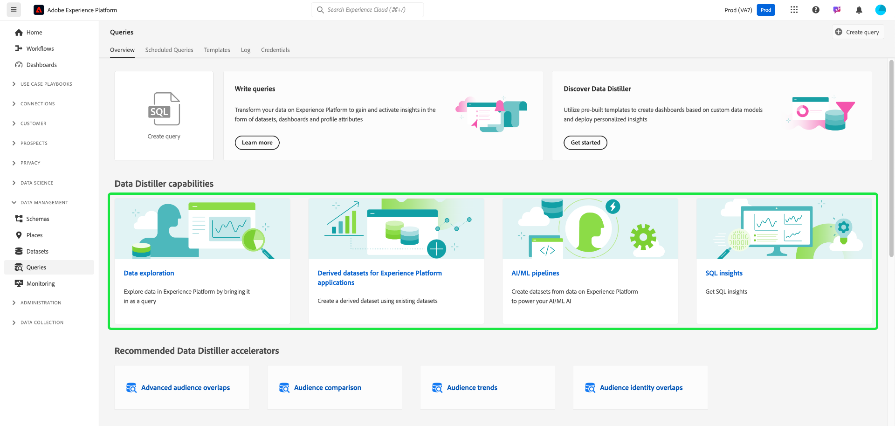
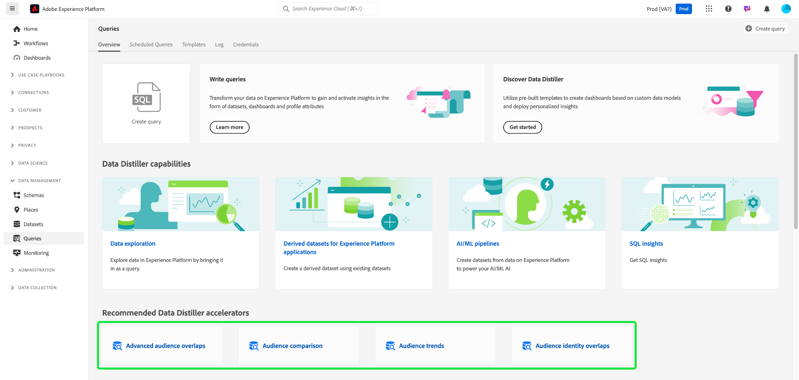
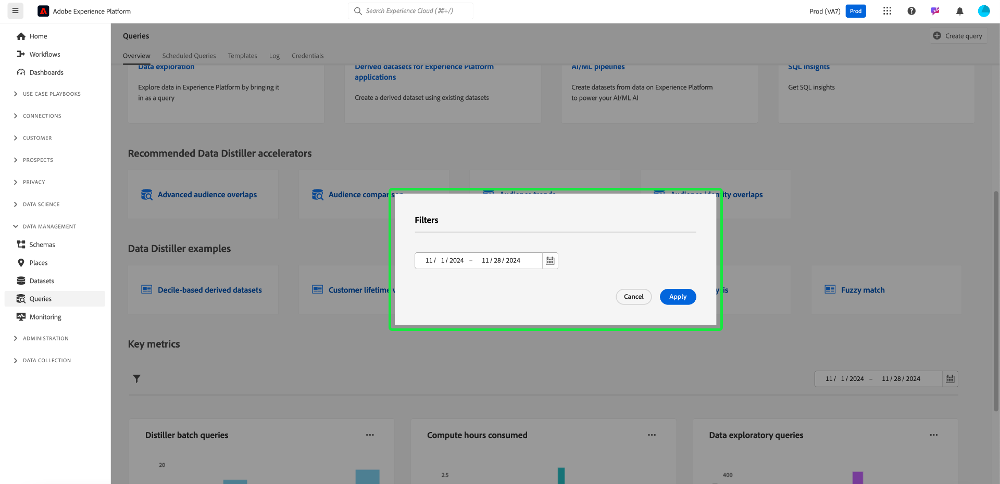

# Guia da interface do usuário do Serviço de consulta

O Serviço de consulta da Adobe Experience Platform fornece uma interface que pode ser usada para gravar e executar consultas, exibir consultas executadas anteriormente e acessar consultas salvas por usuários em sua organização. Para acessar a interface de usuário no [Adobe Experience Platform](https://platform.adobe.com), selecione **[!UICONTROL Consultas]** na navegação à esquerda. A [!UICONTROL Consultas] [!UICONTROL Visão geral] é exibida.

## Visão geral {#overview}

A guia [!UICONTROL Visão geral] fornece um ponto de entrada simplificado para trabalhar com consultas e modelos de Data Distiller. Aqui, você pode acessar todos os recursos necessários para gravar consultas, explorar conjuntos de dados e analisar dados de público-alvo, a fim de garantir um fluxo de trabalho suave para sua análise de dados e insights de público-alvo. Use esta visão geral para saber o que você pode obter com o Data Distiller e descobrir as principais métricas sobre o uso do Serviço de consulta.

### Painéis principais {#main-panels}

A página [!UICONTROL Visão geral] contém várias seções principais para ajudar você a começar:

1. Selecione **[!UICONTROL Criar consulta]** para navegar rapidamente até o Editor de Consultas para gravar e executar novas consultas.
2. Selecione **[!UICONTROL Saiba mais]** para exibir a documentação detalhada sobre como **[!UICONTROL Gravar consultas]**.
3. Selecione **[!UICONTROL Introdução]** na seção **[!UICONTROL Descobrir Distiller de Dados]** para abrir a visão geral do Data Distiller e saber mais sobre os recursos disponíveis.

### Capacidades do destilador de dados {#data-distiller-capabilities}

A seção [!UICONTROL Recursos do Data Distiller] fornece links de documentação para recursos mais avançados do Data Distiller:

- **[[!UICONTROL Exploração de dados]](../use-cases/data-exploration.md)**: saiba como explorar, solucionar problemas e verificar dados assimilados em lote usando SQL.
- **[[!UICONTROL Conjuntos de dados derivados para aplicativos Experience Platform]](../data-distiller/derived-datasets/overview.md)**: saiba como criar conjuntos de dados derivados para dar suporte a casos de uso complexos e diversos que maximizam seu utilitário de dados.
- **[[!UICONTROL Pipelines de IA/ML]](../data-distiller/ml-feature-pipelines/overview.md)**: saiba mais sobre os conceitos importantes por trás de suas ferramentas preferidas de aprendizado de máquina e como criar modelos personalizados que oferecem suporte aos seus casos de uso de marketing. Esta série de guias descreve as etapas necessárias para criar pipelines de recursos que preparam dados do Experience Platform para alimentar modelos personalizados em seu ambiente de aprendizado de máquina.
- **[[!UICONTROL Insights de SQL]](../data-distiller/sql-insights/overview.md)**: conheça os principais recursos e as etapas necessárias para desenvolver um painel de insights do SQL com o Data Distiller.

### Aceleradores recomendados do destilador de dados {#recommended-accelerators}

Selecione um link rápido para navegar até os [!UICONTROL Modelos] relevantes do Data Distiller. Cada acelerador fornece ferramentas e visualizações avançadas para ajudar você a analisar dados de público-alvo, otimizar a segmentação e aprimorar as estratégias de direcionamento.

- **[[!UICONTROL Sobreposições de público-alvo avançadas]](../../dashboards/sql-insights-query-pro-mode/templates/overlaps.md)**: neste painel, você pode analisar as interseções de público-alvo entre vários segmentos de público-alvo para descobrir insights valiosos e otimizar estratégias de segmentação. Você também pode exportar seus insights para fins de análise offline ou relatórios adicionais.
- **[[!UICONTROL Comparação de público-alvo]](../../dashboards/sql-insights-query-pro-mode/templates/comparison.md)**: neste painel, você pode comparar e contrastar as métricas principais de público-alvo lado a lado para analisar dois grupos de público-alvo detalhadamente. Esses insights ajudam a entender o tamanho do público, o crescimento e outros indicadores principais de desempenho, permitindo refinar a segmentação e otimizar as estratégias de direcionamento com decisões orientadas por dados.
- **[[!UICONTROL Tendências do público-alvo]](../../dashboards/sql-insights-query-pro-mode/templates/trends.md)**: use o painel [!UICONTROL Tendências do público-alvo] para visualizar como seus públicos-alvo evoluem com o tempo por meio de métricas principais, como crescimento do público-alvo, contagem de identidades e perfis de identidade única. Rastreie tendências para descobrir insights valiosos sobre o comportamento do público-alvo, permitindo refinar a segmentação, aprimorar o engajamento e otimizar as estratégias de direcionamento para campanhas mais eficazes.
Monitore as métricas de público-alvo ao longo do tempo para monitorar as alterações no tamanho do público-alvo, no crescimento da identidade e no engajamento geral.
- **[[!UICONTROL Sobreposições de identidade de público-alvo]](../../dashboards/sql-insights-query-pro-mode/templates/identity-overlaps.md)**: use o painel Sobreposições de Identidade de Público-alvo para analisar sobreposições de identidade em públicos-alvo selecionados. As visualizações e os dados tabulados fornecem insights para otimizar a identificação, reduzir a redundância e melhorar a segmentação. Esses insights permitem direcionamento mais eficaz, personalização aprimorada e interações simplificadas com o cliente.

### Exemplos do destilador de dados {#data-distiller-examples}

Selecione um cartão para abrir guias de documentação e exemplos para ajudá-lo a aproveitar ao máximo o Data Distiller:

- **[[!UICONTROL Conjuntos de dados derivados baseados em decis]](../use-cases/deciles-use-case.md)**: saiba como criar conjuntos de dados derivados baseados em decis para segmentação e criação de público no Adobe Experience Platform. Usando um cenário de fidelidade de linha aérea, ele abrange design de esquema, cálculos de decis e exemplos de consulta para classificação e agregação de dados.
- **[[!UICONTROL Valor vitalício do cliente]](../use-cases/customer-lifetime-value.md)**: saiba como rastrear e visualizar o valor vitalício do cliente com o Real-Time CDP e painéis personalizados. Use esses insights para desenvolver estratégias de aquisição de novos clientes, manter os existentes e maximizar as margens de lucro.
- **[[!UICONTROL Pontuação de propensão]](../use-cases/propensity-score.md)**: saiba como determinar pontuações de propensão usando modelos preditivos de aprendizado de máquina. Este guia aborda o envio de dados para treinamento, a aplicação de modelos treinados com SQL e a previsão da probabilidade de compra do cliente.
- **[[!UICONTROL Análise de consentimento]](../../dashboards/insights-use-cases/consent-analysis.md)**: saiba como analisar e rastrear o consentimento do cliente usando o Real-Time CDP, o Serviço de consulta e o Data Distiller. Este guia aborda a criação de painéis de consentimento, o refinamento da segmentação, o rastreamento de tendências e a garantia de conformidade, ajudando a criar confiança e a fornecer experiências personalizadas.
- **[[!UICONTROL Correspondência difusa]](../use-cases/fuzzy-match.md)**: saiba como executar uma correspondência &quot;difusa&quot; nos dados do Experience Platform para encontrar correspondências aproximadas e analisar a similaridade da cadeia de caracteres entre conjuntos de dados. Siga este guia para economizar tempo e tornar seus dados mais acessíveis. O exemplo demonstra como corresponder atributos de quartos de hotel entre dois conjuntos de dados de agências de viagens, mostrando como corresponder, comparar e reconciliar com eficiência conjuntos de dados grandes e complexos para fins de consistência e precisão.

### Métricas principais {#key-metrics}

A seção Métricas principais exibe visualizações de dados importantes que ajudam a monitorar o uso do Serviço de consulta. Para cada gráfico, você pode selecionar as reticências (`...`) no canto superior direito, seguidas por [!UICONTROL Exibir mais] para exibir um formulário tabulado dos resultados ou baixar os dados como um arquivo CSV para exibir em uma planilha. Para obter mais detalhes, consulte o [Exibir mais guia](../../dashboards/sql-insights-query-pro-mode/view-more.md).

#### Definir um filtro de datas {#set-date-filter}

Para aplicar um filtro de data global a essas visualizações, selecione o ícone de filtro () e ajuste o intervalo de datas na caixa de diálogo **[!UICONTROL Filtros]**. Aplique este filtro para ajustar as métricas exibidas para um intervalo de tempo específico e aprimorar a relevância da sua análise.

#### [!UICONTROL Consultas em lote do Distiller] {#distiller-batch-queries}

O gráfico [!UICONTROL consultas em lote do Distiller] fornece um detalhamento da atividade de consulta por dia, destacando o número de consultas CTAS e ITAS (interativas e agendadas) processadas. O gráfico destaca padrões, como picos em consultas interativas em determinados dias e o uso pouco frequente de consultas programadas. Use esses insights para otimizar o desempenho, identificando períodos de pico de atividade, refinando estratégias de agendamento e equilibrando a execução de consultas para melhorar a eficiência do fluxo de trabalho e a utilização de recursos.

#### [!UICONTROL Horas de computação consumidas] {#compute-hours-consumed}

O gráfico [!UICONTROL Horas de computação consumidas] fornece uma visualização dia a dia das horas de computação usadas para processar operações do Serviço de Consulta. Use essas tendências de horas de computação para monitorar o consumo de recursos, identificar períodos de alta demanda e otimizar a execução de consultas para garantir a alocação e o desempenho eficientes dos recursos.

#### [!UICONTROL Consultas exploratórias de dados]

O gráfico [!UICONTROL Consultas exploratórias de dados] exibe o número de consultas SELECT processadas sob demanda a cada dia. Essa visualização destaca as tendências da atividade de consulta, como picos de uso em dias específicos, para ajudar você a entender quando seus esforços de exploração de dados estão mais ativos. Use esses insights para monitorar os padrões de uso de consultas, equilibrar cargas de trabalho e otimizar a alocação de recursos para a análise exploratória de dados. Essa análise garante um uso mais eficiente do Serviço de consulta e um planejamento aprimorado para períodos de alta demanda.

## Editor de consultas

Use o Editor de consultas para gravar e executar consultas sem usar um cliente externo. Selecione **[!UICONTROL Criar consulta]** para abrir o Editor de consultas e criar uma nova consulta. Você também pode acessar o Editor de consultas selecionando uma consulta nas guias **[!UICONTROL Log]** ou **[!UICONTROL Modelos]**. Se você selecionar uma consulta executada ou salva anteriormente, o Editor de consultas abrirá e exibirá o SQL para a consulta selecionada.

À medida que você digita no Editor de consultas, o editor automaticamente conclui palavras reservadas SQL, tabelas e nomes de campos nas tabelas. Quando terminar de gravar a consulta, selecione o ícone de reprodução () para executar a consulta. A guia **[!UICONTROL Console]** abaixo do editor mostra o que o Serviço de Consulta está fazendo no momento e indica quando uma consulta foi retornada. A guia **[!UICONTROL Resultado]**, ao lado de [!UICONTROL Console], exibe os resultados da consulta. Consulte o [Guia do Editor de Consultas](./user-guide.md) para obter mais informações sobre o uso do Editor de Consultas.

## Consultas programadas {#scheduled-queries}

As consultas que já foram salvas como um modelo podem ser agendadas para execução em uma cadência regular. Ao agendar uma consulta, você pode escolher a frequência de execuções, as datas de início e término, o dia da semana em que a consulta agendada é executada, bem como o conjunto de dados para o qual exportar a consulta. Os agendamentos de consulta são definidos com o Editor de consultas.

Para saber como agendar uma consulta por meio da interface, consulte o [guia de consultas agendadas](./user-guide.md#scheduled-queries). Para saber como adicionar agendamentos usando a API, leia o [manual de endpoint de consultas agendadas](../api/scheduled-queries.md).

Depois que uma consulta é agendada, ela aparece na lista de consultas agendadas na guia [!UICONTROL Consultas agendadas]. Detalhes completos sobre a consulta, execuções, criador e horários podem ser encontrados selecionando uma consulta agendada na lista.

<!--  -->

| Coluna | Descrição |
| --- | --- |
| **[!UICONTROL Nome]** | O campo name é o nome do template ou os primeiros caracteres da query SQL. Qualquer consulta criada por meio da interface do usuário com o Editor de consultas é nomeada no início. Se a query foi criada por meio da API, o nome da query é um trecho do SQL inicial usado para criar a query. |
| **[!UICONTROL Modelo]** | O nome do modelo da consulta. Selecione um nome de modelo para navegar até o Editor de consultas. O modelo de consulta é exibido no Editor de consultas para conveniência. Se não houver nome do modelo, a linha será marcada com um hífen e não haverá capacidade de redirecionar para o Editor de consultas para exibir a consulta. |
| **[!UICONTROL SQL]** | Um trecho da consulta SQL. |
| **[!UICONTROL Frequência de execução]** | Essa coluna indica a cadência na qual sua consulta está definida para execução. Os valores disponíveis são `Run once` e `Scheduled`. As consultas podem ser filtradas de acordo com a frequência de execução. |
| **[!UICONTROL Criado por]** | O nome do usuário que criou a consulta. |
| **[!UICONTROL Criado]** | O carimbo de data e hora quando a consulta foi criada, em formato UTC. |
| **[!UICONTROL Carimbo de data/hora da última execução]** | O carimbo de data e hora mais recente quando a consulta foi executada. Esta coluna destaca se uma consulta foi executada de acordo com seu agendamento atual. |
| **[!UICONTROL Status da última execução]** | O status da execução de consulta mais recente. Os três valores de status são: `successful` `failed` ou `in progress`. |

Consulte a documentação para obter mais informações sobre como [monitorar consultas por meio da interface do Serviço de Consulta](./monitor-queries.md).

## Modelos {#browse}

A guia **[!UICONTROL Modelos]** mostra consultas salvas por usuários em sua organização. É útil imaginá-los como projetos de consulta, já que as consultas salvas aqui ainda podem estar em construção. As consultas exibidas na guia **[!UICONTROL Modelos]** também serão exibidas como consultas de execução na guia **[!UICONTROL Log]** se tiverem sido executadas anteriormente pelo Serviço de consulta.

| Coluna | Descrição |
| --- | --- |
| **[!UICONTROL Nome]** | O campo name é o nome da consulta criada pelo usuário ou os primeiros caracteres da consulta SQL. Qualquer consulta criada por meio da interface do usuário com o Editor de consultas é nomeada no início. Se a consulta foi criada por meio da API, o nome da consulta é um trecho do SQL inicial usado para criar a consulta. Você pode selecionar o nome da consulta para abri-la no Editor de consultas. Você também pode usar a barra de pesquisa para procurar o [!UICONTROL Nome] de uma consulta. As pesquisas diferenciam maiúsculas de minúsculas. |
| **[!UICONTROL SQL]** | Os primeiros caracteres da consulta SQL. Passar o mouse sobre o código exibe a consulta completa. |
| **[!UICONTROL Modificado por]** | O último usuário que modificou a consulta. Qualquer usuário na organização com acesso ao Serviço de consulta pode modificar consultas. |
| **[!UICONTROL Última modificação]** | A data e a hora da última modificação no query, no fuso horário do navegador. |

Consulte a documentação dos [modelos de consulta](./query-templates.md) para obter mais informações sobre modelos na interface do usuário da Platform.

## Log {#log}

A guia **[!UICONTROL Log]** fornece uma lista de consultas que foram executadas anteriormente. Por padrão, o log lista as consultas na cronologia reversa.

| Coluna | Descrição |
| --- | --- |
| **[!UICONTROL Nome]** | O nome da consulta, que consiste nos primeiros caracteres da consulta SQL. Selecione o nome do modelo para abrir a exibição [!UICONTROL Detalhes do log de consulta] para essa execução. Você pode usar a barra de pesquisa para pesquisar pelo nome de uma consulta. As pesquisas diferenciam maiúsculas de minúsculas. |
| **[!UICONTROL Hora de início]** | A hora em que a consulta foi executada. |
| **[!UICONTROL Hora de conclusão]** | A hora em que a execução da consulta foi concluída. |
| **[!UICONTROL Status]** | O status atual da consulta. |
| **[!UICONTROL Conjunto de dados]** | O conjunto de dados de entrada usado pela consulta. Selecione o conjunto de dados para acessar a tela de detalhes do conjunto de dados de entrada. |
| **[!UICONTROL Cliente]** | O cliente usado para a consulta. |
| **[!UICONTROL Criado por]** | O nome da pessoa que criou a consulta. |

>
>
>Selecione o ícone de lápis () de qualquer linha do log de consultas para navegar até o Editor de Consultas. A consulta é pré-preenchida para edição conveniente.

Consulte a [documentação dos logs de consulta](./query-logs.md) para obter mais informações sobre os arquivos de log gerados automaticamente por um evento de consulta.

## Credenciais

A guia **[!UICONTROL Credenciais]** exibe suas credenciais com e sem expiração. Para obter mais informações sobre como usar essas credenciais para conexão com clientes externos, leia o [guia de credenciais](../clients/overview.md).

## Próximas etapas

Agora que você está familiarizado com a interface de usuário do Serviço de Consulta em [!DNL Platform], pode acessar o Editor de Consultas para começar a criar seus próprios projetos de consulta para compartilhar com outros usuários em sua organização. Para obter mais informações sobre a criação e execução de consultas no Editor de Consultas, consulte o [guia do usuário do Editor de Consultas](./user-guide.md).

