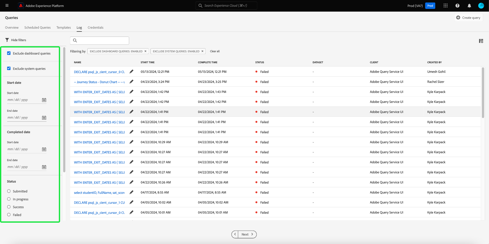

# Logs de consulta

O Adobe Experience Platform mantém um log de todos os eventos de consulta que ocorrem por meio da API e da interface do usuário. Essas informações estão disponíveis na interface do Serviço de consulta na guia [!UICONTROL Logs].

Os arquivos de log são gerados automaticamente por qualquer evento de consulta e contêm informações, incluindo o SQL usado, o status da consulta, quanto tempo ela levou e o último tempo de execução. Você pode usar os dados do log de consultas como uma ferramenta poderosa para solucionar problemas de consultas ineficientes ou com problemas. Informações de log mais abrangentes são mantidas como parte do recurso de log de auditoria e podem ser encontradas na [documentação do log de auditoria](../../landing/governance-privacy-security/audit-logs/overview.md).

## Verificar logs de consulta {#check-query-logs}

Para verificar os logs de consulta, selecione [!UICONTROL Consultas] para navegar até o espaço de trabalho do Serviço de Consulta e selecione [!UICONTROL Log] entre as opções disponíveis.

>[!NOTE]
>
>As consultas do sistema e do painel são excluídas por padrão. Consulte a seção [filtros](#filter-logs) para obter informações sobre como refinar os logs exibidos com base em suas configurações.

## Personalizar e pesquisar {#customize-and-search}

Os logs do Serviço de consulta são apresentados em um formato de tabela personalizável. Para personalizar as colunas da tabela, selecione o ícone de configurações () à direita da tela. Uma caixa de diálogo [!UICONTROL Personalizar Tabela] é exibida, onde cada coluna pode ser desmarcada.

Você também pode pesquisar logs relacionados a modelos de consulta específicos digitando o nome do modelo no campo de pesquisa.

Uma [descrição para cada uma das colunas da tabela de log](./overview.md#log) pode ser encontrada na seção Log da visão geral do Serviço de Consulta.

## Descobrir dados de log

Cada linha representa dados de log para uma execução de consulta associada a um modelo de consulta. Selecione qualquer linha da tabela para preencher a barra lateral direita com dados de log para essa execução.

No painel de detalhes do log, é possível executar várias ações. Você pode executar a consulta como CTAS, que cria um novo conjunto de dados de saída, ver ou copiar a consulta SQL completa que foi usada na execução ou excluir a consulta.

>[!NOTE]
>
>A opção para [!UICONTROL Executar como CTAS] só está disponível para uma consulta SELECT.

Você também pode selecionar um nome de modelo de consulta na coluna [!UICONTROL Nome] para navegar diretamente para a exibição [!UICONTROL Detalhes do log de consulta].

>[!NOTE]
>
>Se a consulta foi criada usando a API e nenhum nome de template foi fornecido durante a inicialização, as primeiras dezenas de caracteres da consulta SQL são exibidos.

## Editar logs {#edit-logs}

Ao lado do nome do modelo de cada linha ou do trecho SQL há um ícone de lápis () que você pode usar para navegar até o Editor de Consultas. A consulta é então preenchida previamente no editor para edição.

## Filtrar logs {#filter-logs}

Você pode filtrar a lista de logs de consulta com base em várias configurações. Selecione o ícone de filtro () na parte superior esquerda do espaço de trabalho para abrir um conjunto de opções de filtro no painel esquerdo.

A lista de filtros disponíveis é exibida.

A tabela a seguir fornece uma descrição de cada filtro.

| Filtro | Descrição |
| ------ | ----------- |
| [!UICONTROL Excluir consultas do painel] | Essa caixa de seleção está ativada por padrão e exclui logs gerados pelas consultas usadas para gerar insights. Essas consultas são geradas pelo sistema e obscurecem os registros de logs gerados pelo usuário necessários para monitoramento, administração e solução de problemas. Para exibir logs gerados pelo sistema, desmarque a caixa de seleção. |
| [!UICONTROL Excluir consultas do sistema] | Essa caixa de seleção é ativada por padrão e exclui logs gerados pelo sistema. As consultas geradas pelo sistema geralmente incluem tarefas em segundo plano ou operações de manutenção que podem não ser relevantes para monitoramento, administração ou solução de problemas do usuário. Se você precisar inspecionar registros gerados pelo sistema, desmarque essa caixa de seleção para incluí-los na visualização de log. |
| [!UICONTROL Data de início] | Para filtrar os logs de consultas criadas durante um período específico, defina as datas [!UICONTROL Início] e [!UICONTROL Fim] na seção [!UICONTROL Data de início]. |
| [!UICONTROL Data de conclusão] | Para filtrar os logs de consultas concluídas durante um período específico, defina as datas [!UICONTROL Início] e [!UICONTROL Fim] na seção [!UICONTROL Data de conclusão]. |
| [!UICONTROL Status] | Para filtrar logs com base no [!UICONTROL Status] da consulta, selecione o botão de opção apropriado. As opções disponíveis incluem [!UICONTROL Enviado], [!UICONTROL Em andamento], [!UICONTROL Sucesso] e [!UICONTROL Falha]. Você só pode filtrar logs com base em uma condição de status por vez. |
| [!UICONTROL Cliente] | Para filtrar logs com base no cliente de consulta usado, insira um dos seguintes valores aceitos no campo de texto livre: `API`, `Adobe Query Service UI` ou `QsAccel`. |
| [!UICONTROL Minhas consultas] | Use a opção [!UICONTROL Minhas consultas] para filtrar os logs de consultas executadas por você. |
| [!UICONTROL ID do log de consulta] | Para filtrar com base na ID de log exclusiva de um query, insira a ID de log no campo de texto livre. Essas informações podem ser encontradas nos [!UICONTROL Detalhes do log]. |

Todos os filtros aplicados são exibidos acima dos resultados do log filtrado.

## Próximas etapas

Ao ler este documento, agora é possível entender melhor como os logs de consulta são acessados e usados na interface do usuário do serviço de consulta.

Consulte a [visão geral da interface](./overview.md) ou o [Guia da API do Serviço de Consulta](../api/getting-started.md) para saber mais sobre os recursos do Serviço de Consulta.

Consulte o [documento de monitoramento de consultas](./monitor-queries.md) para saber como o Serviço de Consulta melhora a visibilidade das execuções de consultas agendadas.
