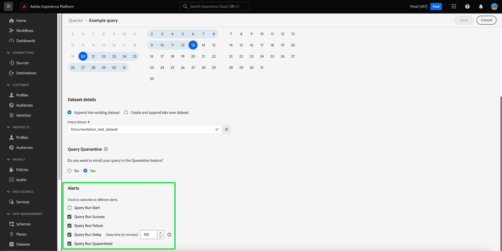

# Agendamentos de consulta

Você pode automatizar as execuções de consulta criando programações de consulta. As consultas programadas são executadas em uma cadência personalizada para gerenciar seus dados com base na frequência, data e hora. Você também pode escolher um conjunto de dados de saída para seus resultados, se necessário. As consultas que foram salvas como um modelo podem ser agendadas no Editor de consultas.

>[!IMPORTANT]
>
>Você só pode adicionar um agendamento a uma consulta que já foi criada e salva.

## Requisitos de conta para consultas agendadas {#technical-account-user-requirements}

Para ajudar na execução confiável das consultas agendadas, a Adobe recomenda que os administradores provisionem uma conta técnica (usando as credenciais de servidor para servidor do OAuth) para criar consultas agendadas. As consultas programadas também podem ser criadas com uma conta de usuário pessoal, mas as consultas criadas dessa maneira deixarão de ser executadas se o acesso desse usuário for removido ou desativado.

Para obter detalhes sobre como configurar contas técnicas e atribuir as permissões necessárias, consulte os [pré-requisitos do guia de credenciais](./credentials.md#prerequisites) e a [autenticação de API](../../landing/api-authentication.md).

Para obter orientação adicional sobre como criar e configurar uma conta técnica, consulte:

- [Configuração do Developer Console](https://experienceleague.adobe.com/en/docs/platform-learn/getting-started-for-data-architects-and-data-engineers/set-up-developer-console-and-postman): instruções passo a passo para configurar o Adobe Developer Console e obter credenciais do OAuth.
- [Configuração completa de conta técnica](https://experienceleague.adobe.com/en/docs/platform-learn/tutorial-comprehensive-technical/setup): uma apresentação detalhada para criar e configurar uma conta técnica no Adobe Experience Platform.

Se você usar apenas a interface do Serviço de consulta, verifique se tem as permissões necessárias ou coordene com um administrador que gerencia contas técnicas. Quaisquer consultas agendadas são adicionadas à lista na guia [!UICONTROL Scheduled queries], onde você pode monitorar o status, os detalhes do agendamento e as mensagens de erro de todos os trabalhos de consultas agendadas, bem como assinar alertas. Para obter mais informações sobre o monitoramento e o gerenciamento de consultas, consulte o [documento de consultas agendadas do monitor](./monitor-queries.md).

Esse fluxo de trabalho abrange o processo de agendamento na interface do usuário do serviço de consulta. Para saber como adicionar agendamentos usando a API, consulte o [manual de endpoint de consultas agendadas](../api/scheduled-queries.md).

>[!NOTE]
>
>Use uma conta técnica para garantir que as consultas programadas continuem sendo executadas mesmo se os usuários deixarem a organização ou suas funções forem alteradas. Escolha uma conta técnica sempre que possível para automação de consulta ininterrupta.

## Criar um agendamento de consulta {#create-schedule}

Para agendar uma consulta, selecione um modelo de consulta na guia [!UICONTROL Templates] ou na coluna [!UICONTROL Template] da guia [!UICONTROL Scheduled Queries]. A seleção do nome do modelo leva você ao Editor de consultas.

Se você acessar uma consulta salva no Editor de consultas, poderá criar uma programação para a consulta ou exibir a programação da consulta no painel de detalhes.

>[!TIP]
>
>Selecione **[!UICONTROL View schedule]** para navegar para o espaço de trabalho de agendamentos e ver as execuções de consultas agendadas rapidamente.

![O Editor de Consultas com [!UICONTROL View schedule] e [!UICONTROL Add schedule] realçados.](../images/ui/query-schedules/view-add-schedule.png)

Selecione **[!UICONTROL Add schedule]** para navegar até a [página de detalhes da programação](#schedule-details).

Como alternativa, selecione a guia **[!UICONTROL Schedules]** abaixo do nome da consulta.

O espaço de trabalho de agendamentos é exibido. A interface do usuário exibe uma lista de todas as execuções agendadas às quais o modelo está associado. Selecione **[!UICONTROL Add Schedule]** para criar um agendamento.

### Adicionar detalhes da programação {#schedule-details}

A página de detalhes da programação é exibida. Nesta página, você pode editar diversos detalhes da consulta programada. Os detalhes incluem a [frequência e o dia da semana da execução da consulta agendada](#scheduled-query-frequency), as datas de início e término, o conjunto de dados para o qual exportar os resultados e [alertas de status da consulta](#alerts-for-query-status).

>[!IMPORTANT]
>
>A interface do agendador de consultas não oferece suporte a agendamento indefinido ou permanente. Uma data de término deve ser especificada. Não há limite superior para a data final.

#### Frequência de consulta agendada {#scheduled-query-frequency}

Você pode escolher as seguintes opções para **[!UICONTROL Frequency]**:

- **[!UICONTROL Hourly]**: A consulta agendada será executada a cada hora para o período de data selecionado.
- **[!UICONTROL Daily]**: A consulta agendada será executada a cada X dias na hora e no período de data selecionados. Observe que a hora selecionada está em **UTC**, e não em seu fuso horário local.
- **[!UICONTROL Weekly]**: A consulta selecionada será executada nos dias da semana, hora e data que você selecionou. Observe que a hora selecionada está em **UTC**, e não em seu fuso horário local.
- **[!UICONTROL Monthly]**: A consulta selecionada será executada mensalmente no dia, hora e período de data selecionados. Observe que a hora selecionada está em **UTC**, e não em seu fuso horário local.
- **[!UICONTROL Yearly]**: A consulta selecionada será executada todos os anos no dia, mês, hora e período de data selecionados. Observe que a hora selecionada está em **UTC**, e não em seu fuso horário local.

### Fornecer detalhes do conjunto de dados {#dataset-details}

Gerencie os resultados da consulta anexando os dados a um conjunto de dados existente ou criando um novo conjunto de dados e anexando os dados a ele.

Selecione **[!UICONTROL Create and append into new dataset]** para criar um conjunto de dados ao executar uma consulta pela primeira vez. As execuções subsequentes continuam a inserir dados nesse conjunto de dados. Por fim, forneça um nome e uma descrição para o conjunto de dados.

>[!IMPORTANT]
>
> Como você está usando um conjunto de dados existente ou criando um novo, **não** precisa incluir `INSERT INTO` ou `CREATE TABLE AS SELECT` como parte da consulta, já que os conjuntos de dados já estão definidos. Incluir `INSERT INTO` ou `CREATE TABLE AS SELECT` como parte de suas consultas agendadas resultará em um erro.

![O painel Detalhes do agendamento com detalhes do conjunto de dados e as [!UICONTROL Create and append into new dataset] opções realçadas.](../images/ui/query-schedules/dataset-details-create-and-append.png)

Como alternativa, selecione **[!UICONTROL Append into existing dataset]** seguido pelo ícone do conjunto de dados ().

A caixa de diálogo **[!UICONTROL Select output dataset]** é exibida.

Em seguida, navegue pelos conjuntos de dados existentes ou use o campo de pesquisa para filtrar as opções. Selecione a linha do conjunto de dados que deseja usar. Os detalhes do conjunto de dados são exibidos no painel à direita. Selecione **[!UICONTROL Done]** para confirmar sua escolha.

### Colocar consultas em quarentena se elas falharem continuamente {#quarantine}

Ao criar um agendamento, você pode inscrever seu query no recurso de quarentena para proteger recursos do sistema e evitar possíveis interrupções. O recurso de quarentena identifica e isola automaticamente as consultas que falham repetidamente, colocando-as em um estado [!UICONTROL Quarantined]. Colocando consultas em quarentena após dez falhas consecutivas, é possível intervir, revisar e corrigir problemas antes de permitir mais execuções. Isso ajuda a manter a eficiência operacional e a integridade dos dados.

![O espaço de trabalho Calendários de Consultas com [!UICONTROL Query Quarantine] realçado e Sim selecionado.](../images/ui/query-schedules/quarantine-enroll.png)

Depois que uma consulta é inscrita no recurso de quarentena, você pode assinar alertas para essa alteração de status de consulta. Se uma consulta agendada não estiver inscrita na quarentena, ela não aparecerá como uma opção na [caixa de diálogo Alertas](./monitor-queries.md#alert-subscription).

Você também pode inscrever uma consulta agendada no recurso de quarentena a partir das ações embutidas da guia [!UICONTROL Scheduled Queries]. Consulte a [documentação de consultas do monitor](./monitor-queries.md#alert-subscription) para obter mais detalhes.

### Definir alertas para um status de consulta agendada {#alerts-for-query-status}

Você também pode assinar alertas de consulta como parte das configurações de consulta programada. Você pode definir suas configurações para receber notificações para uma variedade de situações. Os alertas podem ser definidos para um estado em quarentena, atrasos no processamento da consulta ou uma alteração no status da consulta. As opções de alerta de estado de consulta disponíveis incluem início, sucesso e falha. Os alertas podem ser recebidos como notificações pop-up ou emails. Marque a caixa de seleção para assinar alertas para esse status de consulta agendada.

A tabela abaixo explica os tipos de alerta de consulta aceitos:

| Tipo de alerta | Descrição |
|---|---|
| `start` | Este alerta notifica quando uma execução de consulta programada é iniciada ou começa a ser processada. |
| `success` | Esse alerta informa quando uma execução de consulta programada é concluída com sucesso, indicando que a consulta foi executada sem erros. |
| `failed` | Esse alerta é disparado quando uma execução de consulta agendada encontra um erro ou falha na execução. Isso ajuda a identificar e solucionar problemas prontamente. |
| `quarantine` | Esse alerta é ativado quando uma execução de consulta agendada é colocada em quarentena. Quando uma consulta for [inscrita no recurso de quarentena](#quarantine), qualquer consulta agendada que falhar dez execuções consecutivas será colocada automaticamente em um estado [!UICONTROL Quarantined]. Uma consulta em quarentena exige sua intervenção antes que qualquer outra execução possa ocorrer. Observação: as consultas devem ser inscritas no recurso de quarentena para que você possa assinar alertas de quarentena. |
| `delay` | Este alerta notifica se há um [atraso no resultado de uma execução de consulta agendada](./monitor-queries.md#query-run-delay) além de um limite especificado. Você pode definir um horário personalizado que acione o alerta quando a consulta for executada por essa duração sem ser concluída ou falhar. O comportamento padrão define um alerta por 150 minutos após o início do processamento da consulta. |

>[!NOTE]
>
>Se você optar por definir um alerta [!UICONTROL Query Run Delay], defina o tempo de atraso desejado em minutos na interface do usuário do Experience Platform. Insira a duração em minutos. O atraso máximo é de 24 horas (1440 minutos).

Para obter uma visão geral dos alertas no Adobe Experience Platform, incluindo a estrutura de como as regras de alerta são definidas, consulte a [visão geral dos alertas](../../observability/alerts/overview.md). Para obter orientação sobre como gerenciar alertas e regras de alerta na interface do usuário do Adobe Experience Platform, consulte o [Guia da interface de alertas](../../observability/alerts/ui.md).

### Definir parâmetros para uma consulta parametrizada programada {#set-parameters}

Se você estiver criando uma consulta programada para uma consulta parametrizada, deverá definir os valores de parâmetro para essas execuções de consulta.

Depois de confirmar os detalhes da agenda, selecione **[!UICONTROL Save]** para criar uma agenda. Você retornará à guia Agendamentos do modelo. Este espaço de trabalho exibe detalhes do agendamento recém-criado, incluindo a ID do agendamento, o próprio agendamento e o conjunto de dados de saída do agendamento.

## Exibir execuções de consulta programada {#scheduled-query-runs}

Na guia [!UICONTROL Schedules] do modelo, selecione a ID de agendamento para navegar até a lista de execuções de consulta para sua consulta recém-agendada.

Como alternativa, para exibir uma lista de execuções agendadas de um modelo de consulta, navegue até a guia **[!UICONTROL Scheduled queries]** e selecione um nome de modelo na lista disponível.

A lista de execuções de consulta para a consulta programada é exibida.

### Computar horas no nível do trabalho {#compute-hours}

Rastreie as horas de cálculo consumidas no nível de execução da consulta para as consultas em lote CTAS/ITAS. Esse recurso oferece informações sobre o uso do computador, ajudando você a otimizar a alocação de recursos e a melhorar o desempenho da consulta.

>[!AVAILABILITY]
>
>A funcionalidade Horas de Computação é exclusiva para usuários que compraram a [SKU do Data Distiller](../data-distiller/overview.md). Entre em contato com o representante da Adobe para obter mais informações.

A tabela a seguir fornece descrições de cada coluna disponível na seção de detalhes que lista execuções de consulta programadas.

| Título da coluna | Descrição |
|---------------------|----------------------------------|
| [!UICONTROL Query Run ID] | Exibe um identificador exclusivo para cada execução de consulta, permitindo rastrear e fazer referência a execuções individuais de suas consultas programadas. |
| [!UICONTROL Query Run Start] | Indica a data e a hora de início da execução da consulta, para ajudá-lo a monitorar o início de cada execução. |
| [!UICONTROL Query Run Complete] | Mostra a data e a hora de conclusão da execução da consulta, para fornecer o insight sobre a duração e o status da execução. |
| [!UICONTROL Status] | Exibe o status atual da execução da consulta, como `Completed,` `Running,` ou `Failed,` para avaliar o resultado rapidamente. |
| [!UICONTROL Datasets] | Lista os conjuntos de dados usados na execução da consulta para mostrar quais fontes de dados estavam envolvidas na execução. |
| [!UICONTROL Compute Hours] | Mostra o tempo de cálculo usado para cada execução de consulta, medido em horas. Isso ajuda a rastrear o uso de recursos e otimizar o desempenho da consulta. |

{style="table-layout:auto"}

>[!NOTE]
>
>Os dados de Horas de computação estão disponíveis em 15/08/2024. Os dados anteriores a essa data aparecem como &#39;Não disponível&#39;.

Consulte o [guia consultado agendado do monitor](./monitor-queries.md#inline-actions) para obter informações completas sobre como monitorar o status de todos os trabalhos de consulta por meio da interface.

Selecione um **[!UICONTROL Query run ID]** na lista para navegar até a visão geral da execução da consulta. Para obter um detalhamento completo das informações disponíveis na [visão geral da execução da consulta](./monitor-queries.md#query-run-overview), consulte a documentação do monitoramento de consultas agendadas.

Para monitorar consultas agendadas usando a API de Serviço de Consulta, consulte o [guia de pontos de extremidade de execução de consulta agendada](../api/runs-scheduled-queries.md).

## Ativar, desativar ou excluir um agendamento {#delete-schedule}

Você pode habilitar, desabilitar ou excluir um agendamento do espaço de trabalho de agendamentos de uma determinada consulta ou do espaço de trabalho [!UICONTROL Scheduled Queries] que lista todas as consultas agendadas.

Para acessar a guia [!UICONTROL Schedules] da consulta escolhida, selecione o nome de um modelo de consulta na guia [!UICONTROL Templates] ou na guia [!UICONTROL Scheduled Queries]. Isso navega até o Editor de consultas para essa consulta. No Editor de Consultas, selecione **[!UICONTROL Schedules]** para acessar o espaço de trabalho de agendamentos.

Selecione um agendamento nas linhas de agendamentos disponíveis para preencher o painel de detalhes. Use o botão para desativar (ou ativar) a consulta programada.

### Excluir consultas desabilitadas

>[!IMPORTANT]
>
>Você deve desativar o agendamento antes de excluir um agendamento de uma consulta.

Uma caixa de diálogo de confirmação é exibida. Selecione **[!UICONTROL Disable]** para confirmar a ação.

Selecione **[!UICONTROL Delete a schedule]** para excluir o cronograma desabilitado.

Como alternativa, a guia [!UICONTROL Scheduled Queries] oferece uma coleção de ações embutidas para cada consulta agendada. As ações embutidas disponíveis incluem [!UICONTROL Disable schedule] ou [!UICONTROL Enable schedule], [!UICONTROL Delete schedule] e [!UICONTROL Subscribe] para alertas da consulta agendada. Para obter instruções completas sobre como excluir ou desabilitar uma consulta agendada por meio da guia Consultas agendadas, consulte o [guia de consulta agendada do monitor](./monitor-queries.md#inline-actions).
