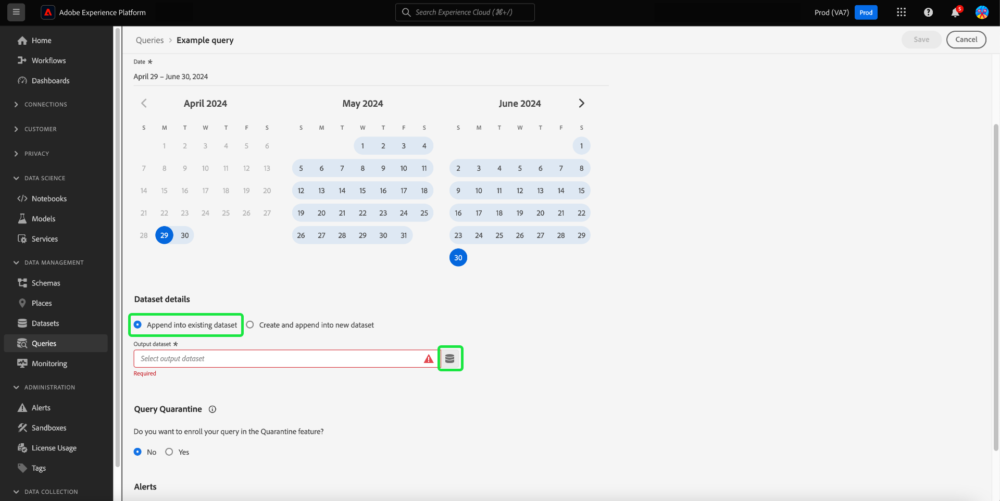

# Agendamentos de consulta

Você pode automatizar as execuções de consulta criando programações de consulta. As consultas programadas são executadas em uma cadência personalizada para gerenciar seus dados com base na frequência, data e hora. Você também pode escolher um conjunto de dados de saída para seus resultados, se necessário. As consultas que foram salvas como um modelo podem ser agendadas no Editor de consultas.

>[!IMPORTANT]
>
>Você só pode adicionar um agendamento a uma consulta que já foi criada e salva.

Quaisquer consultas agendadas são adicionadas à lista na guia [!UICONTROL Consultas agendadas]. Nesse espaço de trabalho, é possível monitorar o status de todos os trabalhos de consulta agendados por meio da interface do usuário. Na guia [!UICONTROL Consultas agendadas], você pode encontrar informações importantes sobre a execução de consultas e assinar alertas. As informações disponíveis incluem o status, os detalhes da programação e as mensagens/códigos de erro em caso de falha na execução. Consulte o [Documento de monitoramento de consultas agendadas](./monitor-queries.md) para obter mais informações.

Esse fluxo de trabalho abrange o processo de agendamento na interface do usuário do serviço de consulta. Para saber como adicionar agendamentos usando a API, leia o [manual de endpoint de consultas agendadas](../api/scheduled-queries.md).

## Criar um agendamento de consulta {#create-schedule}

Para agendar uma consulta, selecione um modelo de consulta na guia [!UICONTROL Modelos] ou na coluna [!UICONTROL Modelo] da guia [!UICONTROL Consultas Agendadas]. A seleção do nome do modelo leva você ao Editor de consultas.

Se você acessar uma consulta salva no Editor de consultas, poderá criar uma programação para a consulta ou exibir a programação da consulta no painel de detalhes.

>[!TIP]
>
>Selecione **[!UICONTROL Exibir agendamento]** para navegar até o espaço de trabalho de agendamentos e ver as execuções de consultas agendadas rapidamente.

![O Editor de Consultas com [!UICONTROL Exibir agendamento] e [!UICONTROL Adicionar agendamento] foi realçado.](../images/ui/query-schedules/view-add-schedule.png)

Selecione **[!UICONTROL Adicionar programação]** para navegar até a [página de detalhes da programação](#schedule-details).

Como alternativa, selecione a guia **[!UICONTROL Agendamentos]** abaixo do nome da consulta.

O espaço de trabalho de agendamentos é exibido. A interface do usuário exibe uma lista de todas as execuções agendadas às quais o modelo está associado. Selecione **[!UICONTROL Adicionar Agendamento]** para criar um agendamento.

### Adicionar detalhes da programação {#schedule-details}

A página de detalhes da programação é exibida. Nesta página, você pode editar diversos detalhes da consulta programada. Os detalhes incluem a [frequência e o dia da semana da execução da consulta agendada](#scheduled-query-frequency), as datas de início e término, o conjunto de dados para o qual exportar os resultados e [alertas de status da consulta](#alerts-for-query-status).

>[!IMPORTANT]
>
>A interface do agendador de consultas não oferece suporte a agendamento indefinido ou permanente. Uma data de término deve ser especificada. Não há limite superior para a data final.

#### Frequência de consulta agendada {#scheduled-query-frequency}

Você pode escolher as seguintes opções para **[!UICONTROL Frequência]**:

- **[!UICONTROL Por hora]**: a consulta agendada será executada a cada hora para o período de data selecionado.
- **[!UICONTROL Diariamente]**: a consulta agendada será executada a cada X dias na hora e no período de data selecionados. Observe que a hora selecionada está em **UTC**, e não em seu fuso horário local.
- **[!UICONTROL Semanalmente]**: a consulta selecionada será executada nos dias da semana, hora e período de data selecionados. Observe que a hora selecionada está em **UTC**, e não em seu fuso horário local.
- **[!UICONTROL Mensal]**: a consulta selecionada será executada mensalmente no dia, hora e período de data selecionados. Observe que a hora selecionada está em **UTC**, e não em seu fuso horário local.
- **[!UICONTROL Anualmente]**: a consulta selecionada será executada todos os anos no dia, mês, hora e período de data selecionados. Observe que a hora selecionada está em **UTC**, e não em seu fuso horário local.

### Fornecer detalhes do conjunto de dados {#dataset-details}

Gerencie os resultados da consulta anexando os dados a um conjunto de dados existente ou criando um novo conjunto de dados e anexando os dados a ele.

Selecione **[!UICONTROL Criar e anexar ao novo conjunto de dados]** para criar um conjunto de dados ao executar uma consulta pela primeira vez. As execuções subsequentes continuam a inserir dados nesse conjunto de dados. Por fim, forneça um nome e uma descrição para o conjunto de dados.

>[!IMPORTANT]
>
> Como você está usando um conjunto de dados existente ou criando um novo, **não** precisa incluir `INSERT INTO` ou `CREATE TABLE AS SELECT` como parte da consulta, já que os conjuntos de dados já estão definidos. Incluir `INSERT INTO` ou `CREATE TABLE AS SELECT` como parte de suas consultas agendadas resultará em um erro.

![O painel Detalhes do agendamento com detalhes do conjunto de dados e as opções [!UICONTROL Criar e anexar em novo conjunto de dados] destacadas.](../images/ui/query-schedules/dataset-details-create-and-append.png)

Como alternativa, selecione **[!UICONTROL Anexar ao conjunto de dados existente]** seguido pelo ícone do conjunto de dados ().

A caixa de diálogo **[!UICONTROL Selecionar conjunto de dados de saída]** é exibida.

Em seguida, navegue pelos conjuntos de dados existentes ou use o campo de pesquisa para filtrar as opções. Selecione a linha do conjunto de dados que deseja usar. Os detalhes do conjunto de dados são exibidos no painel à direita. Selecione **[!UICONTROL Concluído]** para confirmar sua escolha.

### Colocar consultas em quarentena se elas falharem continuamente {#quarantine}

Ao criar um agendamento, você pode inscrever seu query no recurso de quarentena para proteger recursos do sistema e evitar possíveis interrupções. O recurso de quarentena identifica e isola automaticamente as consultas que falham repetidamente, colocando-as em um estado [!UICONTROL Em quarentena]. Colocando consultas em quarentena após dez falhas consecutivas, é possível intervir, revisar e corrigir problemas antes de permitir mais execuções. Isso ajuda a manter a eficiência operacional e a integridade dos dados.

![O espaço de trabalho Calendários de Consultas com [!UICONTROL Quarentena de Consulta] realçado e Sim selecionado.](../images/ui/query-schedules/quarantine-enroll.png)

Depois que uma consulta é inscrita no recurso de quarentena, você pode assinar alertas para essa alteração de status de consulta. Se uma consulta agendada não estiver inscrita na quarentena, ela não aparecerá como uma opção na [caixa de diálogo Alertas](./monitor-queries.md#alert-subscription).

Você também pode inscrever uma consulta agendada no recurso de quarentena a partir das ações embutidas da guia [!UICONTROL Consultas agendadas]. Consulte a [documentação de consultas do monitor](./monitor-queries.md#alert-subscription) para obter mais detalhes.

### Definir alertas para um status de consulta agendada {#alerts-for-query-status}

Você também pode assinar alertas de consulta como parte das configurações de consulta programada. Você pode definir suas configurações para receber notificações para uma variedade de situações. Os alertas podem ser definidos para um estado em quarentena, atrasos no processamento da consulta ou uma alteração no status da consulta. As opções de alerta de estado de consulta disponíveis incluem início, sucesso e falha. Os alertas podem ser recebidos como notificações pop-up ou emails. Marque a caixa de seleção para assinar alertas para esse status de consulta agendada.

A tabela abaixo explica os tipos de alerta de consulta aceitos:

| Tipo de alerta | Descrição |
|---|---|
| `start` | Este alerta notifica quando uma execução de consulta programada é iniciada ou começa a ser processada. |
| `success` | Esse alerta informa quando uma execução de consulta programada é concluída com sucesso, indicando que a consulta foi executada sem erros. |
| `failed` | Esse alerta é disparado quando uma execução de consulta agendada encontra um erro ou falha na execução. Isso ajuda a identificar e solucionar problemas prontamente. |
| `quarantine` | Esse alerta é ativado quando uma execução de consulta agendada é colocada em quarentena. Assim que uma consulta for [inscrita no recurso de quarentena](#quarantine), qualquer consulta agendada que falhar dez execuções consecutivas será colocada automaticamente em um estado [!UICONTROL Em quarentena]. Uma consulta em quarentena exige sua intervenção antes que qualquer outra execução possa ocorrer. Observação: as consultas devem ser inscritas no recurso de quarentena para que você possa assinar alertas de quarentena. |
| `delay` | Este alerta notifica se há um [atraso no resultado de uma execução de consulta agendada](./monitor-queries.md#query-run-delay) além de um limite especificado. Você pode definir um horário personalizado que acione o alerta quando a consulta for executada por essa duração sem ser concluída ou falhar. O comportamento padrão define um alerta por 150 minutos após o início do processamento da consulta. |

>[!NOTE]
>
>Se você optar por definir um alerta de [!UICONTROL Atraso na execução da consulta], defina o tempo de atraso desejado em minutos na interface do Experience Platform. Insira a duração em minutos. O atraso máximo é de 24 horas (1440 minutos).

Para obter uma visão geral dos alertas no Adobe Experience Platform, incluindo a estrutura de como as regras de alerta são definidas, consulte a [visão geral dos alertas](../../observability/alerts/overview.md). Para obter orientação sobre como gerenciar alertas e regras de alerta na interface do usuário do Adobe Experience Platform, consulte o [Guia da interface de alertas](../../observability/alerts/ui.md).

### Definir parâmetros para uma consulta parametrizada programada {#set-parameters}

Se você estiver criando uma consulta programada para uma consulta parametrizada, deverá definir os valores de parâmetro para essas execuções de consulta.

Depois de confirmar os detalhes da agenda, selecione **[!UICONTROL Salvar]** para criar uma agenda. Você retornará à guia Agendamentos do modelo. Este espaço de trabalho exibe detalhes do agendamento recém-criado, incluindo a ID do agendamento, o próprio agendamento e o conjunto de dados de saída do agendamento.

## Exibir execuções de consulta programada {#scheduled-query-runs}

Na guia [!UICONTROL Agendamentos] do modelo, selecione a ID de agendamento para navegar até a lista de execuções de consulta para sua consulta recém-agendada.

Como alternativa, para exibir uma lista de execuções agendadas de um modelo de consulta, navegue até a guia **[!UICONTROL Consultas agendadas]** e selecione um nome de modelo na lista disponível.

A lista de execuções de consulta para a consulta programada é exibida.

### Computar horas no nível do trabalho {#compute-hours}

Rastreie as horas de cálculo consumidas no nível de execução da consulta para as consultas em lote CTAS/ITAS. Esse recurso oferece informações sobre o uso do computador, ajudando você a otimizar a alocação de recursos e a melhorar o desempenho da consulta.

>[!AVAILABILITY]
>
>A funcionalidade Horas de Computação é exclusiva para usuários que compraram a [SKU do Data Distiller](../data-distiller/overview.md). Entre em contato com seu representante da Adobe para obter mais informações.

A tabela a seguir fornece descrições de cada coluna disponível na seção de detalhes que lista execuções de consulta programadas.

| Título da coluna | Descrição |
|---------------------|----------------------------------|
| [!UICONTROL ID de Execução da Consulta] | Exibe um identificador exclusivo para cada execução de consulta, permitindo rastrear e fazer referência a execuções individuais de suas consultas programadas. |
| [!UICONTROL Início da Execução da Consulta] | Indica a data e a hora de início da execução da consulta, para ajudá-lo a monitorar o início de cada execução. |
| [!UICONTROL Execução de Consulta Concluída] | Mostra a data e a hora de conclusão da execução da consulta, para fornecer o insight sobre a duração e o status da execução. |
| [!UICONTROL Status] | Exibe o status atual da execução da consulta, como `Completed,` `Running,` ou `Failed,` para avaliar o resultado rapidamente. |
| [!UICONTROL Conjuntos de dados] | Lista os conjuntos de dados usados na execução da consulta para mostrar quais fontes de dados estavam envolvidas na execução. |
| [!UICONTROL Horas de Computação] | Mostra o tempo de cálculo usado para cada execução de consulta, medido em horas. Isso ajuda a rastrear o uso de recursos e otimizar o desempenho da consulta. |

{style="table-layout:auto"}

>[!NOTE]
>
>Os dados de Horas de computação estão disponíveis em 15/08/2024. Os dados anteriores a essa data aparecem como &#39;Não disponível&#39;.

Consulte o [guia consultado agendado do monitor](./monitor-queries.md#inline-actions) para obter informações completas sobre como monitorar o status de todos os trabalhos de consulta por meio da interface.

Selecione uma **[!UICONTROL ID de execução da consulta]** na lista para navegar até a visão geral de execução da consulta. Para obter um detalhamento completo das informações disponíveis na [visão geral da execução da consulta](./monitor-queries.md#query-run-overview), consulte a documentação do monitoramento de consultas agendadas.

Para monitorar consultas agendadas usando a API de Serviço de Consulta, consulte o [guia de pontos de extremidade de execução de consulta agendada](../api/runs-scheduled-queries.md).

## Ativar, desativar ou excluir um agendamento {#delete-schedule}

Você pode habilitar, desabilitar ou excluir um agendamento do espaço de trabalho de agendamentos de uma determinada consulta ou do espaço de trabalho [!UICONTROL Consultas Agendadas] que lista todas as consultas agendadas.

Para acessar a guia [!UICONTROL Agendamentos] da consulta escolhida, selecione o nome de um modelo de consulta na guia [!UICONTROL Modelos] ou na guia [!UICONTROL Consultas Agendadas]. Isso navega até o Editor de consultas para essa consulta. No Editor de consultas, selecione **[!UICONTROL Agendamentos]** para acessar o espaço de trabalho de agendamentos.

Selecione um agendamento nas linhas de agendamentos disponíveis para preencher o painel de detalhes. Use o botão para desativar (ou ativar) a consulta programada.

### Excluir consultas desabilitadas

>[!IMPORTANT]
>
>Você deve desativar o agendamento antes de excluir um agendamento de uma consulta.

Uma caixa de diálogo de confirmação é exibida. Selecione **[!UICONTROL Desabilitar]** para confirmar a ação.

Selecione **[!UICONTROL Excluir um agendamento]** para excluir o agendamento desabilitado.

Como alternativa, a guia [!UICONTROL Consultas agendadas] oferece uma coleção de ações em linha para cada consulta agendada. As ações embutidas disponíveis incluem [!UICONTROL Desabilitar agendamento] ou [!UICONTROL Habilitar agendamento], [!UICONTROL Excluir agendamento] e [!UICONTROL Assinar] para alertas da consulta agendada. Para obter instruções completas sobre como excluir ou desabilitar uma consulta agendada por meio da guia Consultas agendadas, consulte o [guia de consulta agendada do monitor](./monitor-queries.md#inline-actions).
