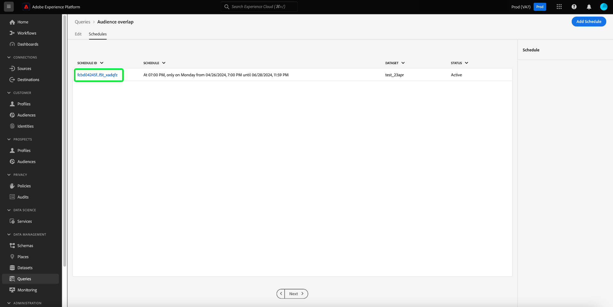

# Agendamentos de query

Você pode automatizar as execuções de query criando agendamentos de query. As consultas programadas são executadas em uma cadência personalizada para gerenciar seus dados com base na frequência, data e hora. Você também pode escolher um conjunto de dados de saída para seus resultados, se necessário. As consultas que foram salvas como modelo podem ser agendadas no Editor de consultas.

>[!IMPORTANT]
>
>Esta é uma lista de limitações para consultas agendadas ao usar o Editor de consultas. Não se aplicam à [!DNL Query Service] API: Você só pode adicionar um agendamento a um query que já tenha sido criado, salvo e executado. Você **cannot** adicione um agendamento a um query parametrizado. Consultas agendadas **cannot** contém um bloco anônimo.

Quaisquer consultas agendadas são adicionadas à lista na [!UICONTROL Consultas agendadas] guia . Desse espaço de trabalho, você pode monitorar o status de todos os trabalhos de consulta agendados por meio da interface do usuário. No [!UICONTROL Consultas agendadas] é possível encontrar informações importantes sobre a execução do query e assinar alertas. As informações disponíveis incluem o status, os detalhes do agendamento e as mensagens/códigos de erro em caso de falha de execução. Consulte a [Monitorar documento de consultas agendadas](./monitor-queries.md) para obter mais informações.

## Criar agendamentos de consulta {#create-schedule}

Para adicionar um agendamento a um query, selecione um template de query a partir da variável [!UICONTROL Modelos] ou a guia [!UICONTROL Consultas agendadas] para navegar até o Editor de consultas.

Para saber como adicionar agendamentos usando a API, leia o [guia do endpoint de consultas agendadas](../api/scheduled-queries.md).

Quando uma consulta salva é acessada no Editor de consultas, a variável [!UICONTROL Agendamentos] é exibida abaixo do nome da consulta. Selecionar **[!UICONTROL Agendamentos]**.

O espaço de trabalho de agendamentos é exibido. Selecionar **[!UICONTROL Adicionar agendamento]** para criar um agendamento.

A página de detalhes do agendamento é exibida. Nesta página, você pode escolher a frequência do query agendado, a data de início e de término, o dia da semana em que o query agendada será executado, bem como o conjunto de dados para o qual exportar o query.

Você pode escolher as seguintes opções para **[!UICONTROL Frequência]**:

- **[!UICONTROL Por hora]**: A consulta agendada será executada a cada hora para o período de datas selecionado.
- **[!UICONTROL Diariamente]**: A consulta agendada será executada a cada X dias no momento e no período de datas selecionado. Observe que o tempo selecionado está em **UTC**, e não seu fuso horário local.
- **[!UICONTROL Semanalmente]**: A consulta selecionada será executada nos dias da semana, da hora e do período de datas selecionado. Observe que o tempo selecionado está em **UTC**, e não seu fuso horário local.
- **[!UICONTROL Mensalmente]**: A consulta selecionada será executada todos os meses no dia, hora e período de datas selecionado. Observe que o tempo selecionado está em **UTC**, e não seu fuso horário local.
- **[!UICONTROL Anualmente]**: A consulta selecionada será executada todos os anos no dia, mês, hora e período de datas selecionado. Observe que o tempo selecionado está em **UTC**, e não seu fuso horário local.

Para o conjunto de dados de saída, você tem a opção de usar um conjunto de dados existente ou criar um novo conjunto de dados.

>[!IMPORTANT]
>
> Como você está usando um conjunto de dados existente ou está criando um novo, **not** precisa incluir `INSERT INTO` ou `CREATE TABLE AS SELECT` como parte do query, já que os conjuntos de dados já estão definidos. Incluindo `INSERT INTO` ou `CREATE TABLE AS SELECT` como parte das consultas agendadas, resultará em um erro.

Depois de confirmar todos esses detalhes, selecione **[!UICONTROL Salvar]** para criar um agendamento. Você é retornado ao espaço de trabalho de agendamentos que exibe detalhes do agendamento recém-criado, incluindo a ID da agenda, o próprio agendamento e o conjunto de dados de saída do agendamento. Você pode usar a ID de agendamento para pesquisar mais informações sobre as execuções do próprio query agendado. Para saber mais, leia o [guia de endpoints de execução de query agendada](../api/runs-scheduled-queries.md).

## Excluir ou desativar uma programação {#delete-schedule}

Você pode excluir ou desabilitar um agendamento do espaço de trabalho de agendamentos. Você deve selecionar um template de query do [!UICONTROL Modelos] ou a guia [!UICONTROL Consultas agendadas] para navegar até o Editor de consultas e selecionar **[!UICONTROL Agendar]** para acessar o espaço de trabalho de agendamentos.

Selecione um agendamento nas linhas de agendamentos disponíveis. Você pode usar a alternância para desativar ou ativar a consulta agendada.

>[!IMPORTANT]
>
>Você deve desativar o agendamento antes de poder excluir um agendamento para uma consulta.

Selecionar **[!UICONTROL Excluir um agendamento]** para excluir o agendamento desativado.

