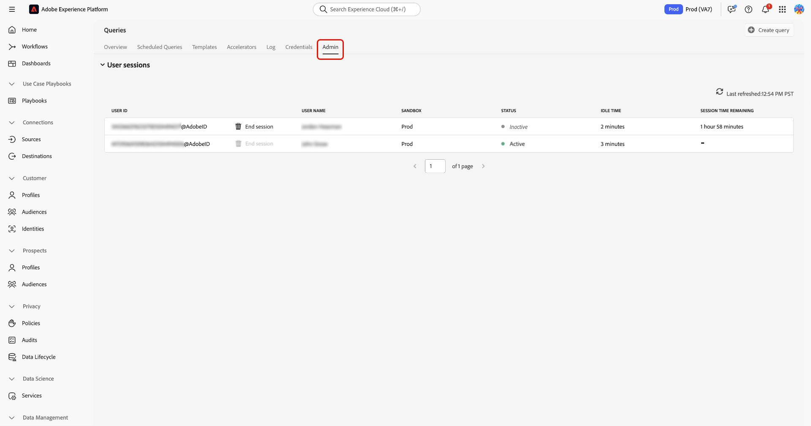
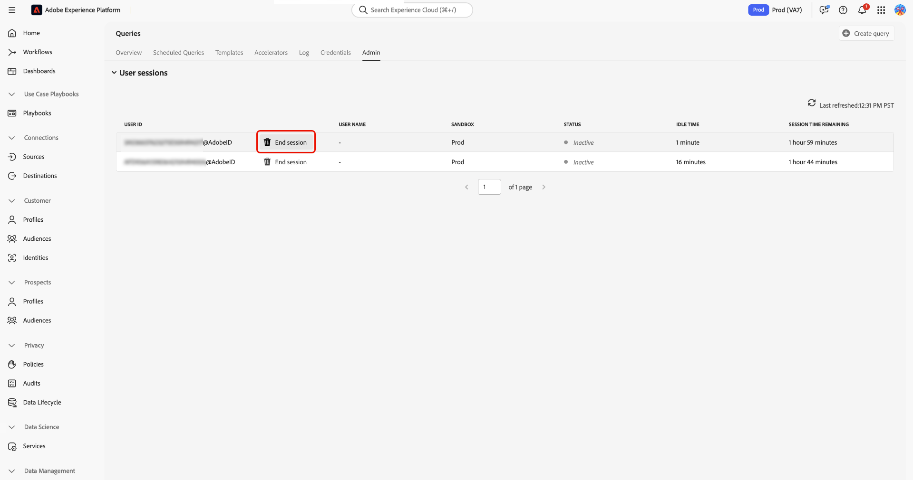

# Gerenciar sessões do Serviço de consulta

>[!AVAILABILITY]
>
>O gerenciamento de sessões para o Serviço de consulta está atualmente com disponibilidade limitada e só está disponível para organizações com direitos de **Data Distiller**. Para solicitar acesso, entre em contato com a equipe de conta da Adobe.

Use este guia para gerenciar sessões ativas do Serviço de consulta na interface do usuário do Adobe Experience Platform. O gerenciamento de sessões ajuda os administradores a monitorar sessões simultâneas do Editor de consultas em sandboxes e capacidade livre quando os usuários deixam as sessões abertas.

## Permissões necessárias para o gerenciamento de sessão {#permissions}

>[!IMPORTANT]
>
>Esse recurso destina-se aos administradores do. Os usuários finais que executam consultas não podem gerenciar sessões.

Para exibir e encerrar sessões, você deve pertencer a uma organização com acesso ao Data Distiller e ter a permissão **[!UICONTROL Manage Query Session]** atribuída. Os usuários sem as permissões necessárias podem acessar o Serviço de consulta, mas não podem exibir ou gerenciar sessões ativas.

## Exibir sessões ativas {#view-active-sessions}

Os administradores podem exibir todas as sessões ativas do Serviço de consulta em sandboxes em sua organização. No Experience Platform, selecione **[!UICONTROL Queries]** na navegação à esquerda para abrir o espaço de trabalho do Serviço de consulta e selecione a guia **[!UICONTROL Admin]** para acessar o gerenciamento de sessão.

A tabela de gerenciamento de sessão é atualizada automaticamente em tempo real e lista todas as sessões que atualmente consomem a capacidade de sessão concorrente do Serviço de consulta atribuída à sua organização. Cada linha representa uma única sessão aberta no Editor de consultas.

## Status da sessão e tempo ocioso {#session-status}

A tabela sessão fornece informações para ajudá-lo a decidir se uma sessão pode ser encerrada com segurança.

| Coluna | Descrição |
| --- | --- |
| ID de usuário | A Adobe ID do usuário proprietário da sessão |
| Nome de usuário | O nome associado à Adobe ID |
| Sandbox | Indica a sandbox onde a sessão está em execução |
| Status da sessão | Mostra se a sessão é **[!UICONTROL Active]** ou **[!UICONTROL Inactive]** |
| Tempo ocioso | Exibe por quanto tempo a sessão ficou aberta sem interação |
| Tempo restante da sessão | Indica quanto tempo a sessão pode permanecer aberta antes da expiração automática |

### Status da sessão

**[!UICONTROL Inactive]** indica que o usuário não está executando ativamente uma consulta; essas sessões podem ser encerradas. **[!UICONTROL Active]** indica que uma consulta está em execução no momento; o controle **[!UICONTROL End session]** não estará disponível até que a execução da consulta seja concluída.

### Tempo ocioso e tempo restante da sessão

O tempo ocioso mostra há quanto tempo uma sessão foi aberta sem interação com o usuário. O tempo restante da sessão indica quanto tempo a sessão pode permanecer aberta antes de ser fechada automaticamente pelo sistema. As sessões expiram automaticamente após a duração máxima permitida (duas horas de inatividade). Essa duração é definida pelo sistema e não pode ser configurada.

## Encerrar sessões ociosas {#end-idle-sessions}

Você pode encerrar sessões ociosas para liberar a capacidade de sessões simultâneas para outros usuários. Considere o encerramento de sessões com alto tempo de inatividade quando os usuários não estiverem mais trabalhando ativamente.

Na tabela de gerenciamento de sessões, selecione **[!UICONTROL End session]** para escolher a sessão inativa que deseja encerrar.

Uma caixa de diálogo de confirmação é exibida para impedir o encerramento acidental. Selecione **[!UICONTROL End session]** no diálogo para confirmar a ação.

Após o término da sessão, ela é removida da tabela, a capacidade fica disponível imediatamente e a ação é registrada para auditoria.

>[!NOTE]
>
>Sessões com o status **[!UICONTROL Active]** não podem ser encerradas. Essa proteção impede a interrupção de cargas de trabalho em andamento.

## Comportamento da sessão após o encerramento {#session-behavior-after-termination}

Quando um administrador encerra uma sessão, o código do usuário afetado permanece no editor sem perder o trabalho. Se o usuário tentar executar uma consulta após o encerramento, o sistema detectará a sessão encerrada, restabelecerá a conexão automaticamente e manterá o conteúdo do Editor de consultas intacto.

Esse comportamento garante que os usuários não percam o trabalho escrito no editor e possam continuar assim que uma nova sessão for estabelecida.

## Logs de auditoria para gerenciamento de sessão {#audit-logs}

O sistema registra as ações de gerenciamento de sessão para fornecer visibilidade e responsabilidade. Os logs de auditoria registram a ID da sessão, o usuário cuja sessão foi encerrada, o administrador que executou a ação e o horário da ação.

Use logs de auditoria para revisar o histórico de encerramento da sessão e investigar desconexões inesperadas.

Para obter mais informações sobre a exibição de logs de auditoria, consulte o [guia de log de auditoria do Serviço de Consulta](../data-governance/audit-log-guide.md).

## Próximas etapas {#next-steps}

Considere os seguintes recursos para estender o uso do Serviço de consulta e do Data Distiller:

* [Saiba como os usuários criam e executam consultas no guia do usuário do Editor de consultas](user-guide.md)
* [Monitore cargas de trabalho agendadas usando a documentação de monitoramento de consultas agendadas](monitor-queries.md)
