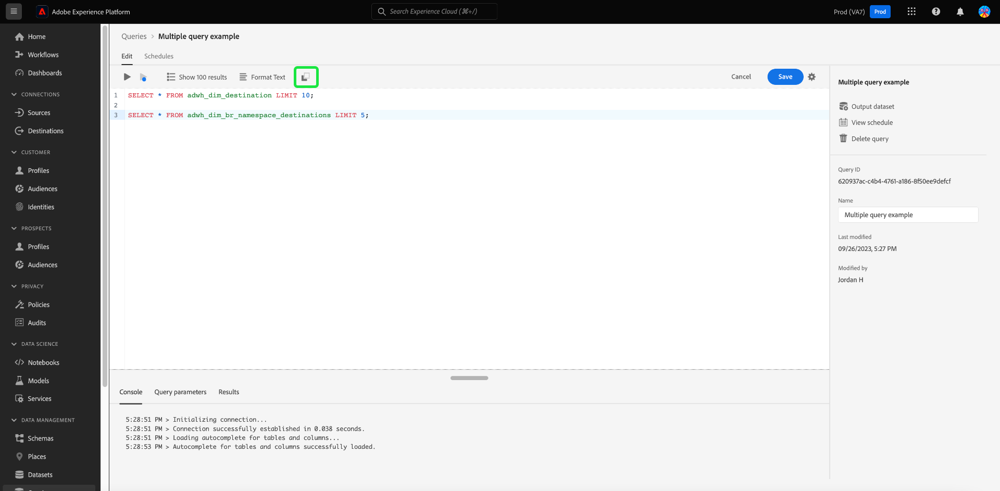

# [!DNL Query Editor] Guia da interface do usuário

[!DNL Query Editor] é uma ferramenta interativa fornecida pelo Adobe Experience Platform [!DNL Query Service], que permite gravar, validar e executar consultas para dados de experiência do cliente na [!DNL Experience Platform] interface do usuário. [!DNL Query Editor] O oferece suporte ao desenvolvimento de consultas para análise e exploração de dados e permite executar consultas interativas para fins de desenvolvimento, bem como consultas não interativas para preencher conjuntos de dados no [!DNL Experience Platform].

Para obter mais informações sobre os conceitos e recursos do [!DNL Query Service], consulte o [Visão geral do Serviço de consulta](../home.md). Para saber mais sobre como navegar na interface do usuário do Serviço de consulta em [!DNL Platform], consulte o [Visão geral da interface do usuário do serviço de consulta](./overview.md).

>[!NOTE]
>
>Determinadas funcionalidades do Serviço de consulta não são fornecidas pela versão herdada do Editor de consultas. As capturas de tela usadas neste documento são tiradas usando a versão aprimorada do Editor de consultas, a menos que declarado o contrário. Consulte a seção sobre o [Editor de consultas aprimorado](#enhanced-editor-toggle) para obter mais detalhes.

## Introdução {#getting-started}

[!DNL Query Editor] oferece execução flexível de consultas conectando-se a [!DNL Query Service], e as consultas só serão executadas enquanto essa conexão estiver ativa.

## Acessar o [!DNL Query Editor] {#accessing-query-editor}

No [!DNL Experience Platform] Interface, selecione **[!UICONTROL Consultas]** no menu de navegação esquerdo, para abrir a [!DNL Query Service] espaço de trabalho. Em seguida, para começar a gravar consultas, selecione **[!UICONTROL Criar consulta]** na parte superior direita da tela. Esse link está disponível em qualquer uma das páginas no [!DNL Query Service] espaço de trabalho.

### Conectando ao [!DNL Query Service] {#connecting-to-query-service}

O Editor de consultas demora alguns segundos para inicializar e se conectar ao Serviço de consulta quando ele é aberto. O console informa quando está conectado, conforme mostrado abaixo. Se você tentar executar uma consulta antes que o editor se conecte, a execução será atrasada até que a conexão seja concluída.

### Como as consultas são executadas a partir de [!DNL Query Editor] {#run-a-query}

Consultas executadas a partir de [!DNL Query Editor] executar interativamente, o que significa que se você fechar o navegador ou sair, a consulta será cancelada. O mesmo é verdadeiro para consultas feitas para gerar conjuntos de dados a partir de saídas de consulta.

A edição aprimorada do Editor de consultas permite escrever mais de uma consulta no Editor de consultas e executar todas as consultas sequencialmente. Consulte a seção sobre [execução de várias consultas sequenciais](#execute-multiple-sequential-queries) para obter mais informações.

## Criação de consulta usando [!DNL Query Editor] {#query-authoring}

Usar [!DNL Query Editor], você pode gravar, executar e salvar consultas para dados de experiência do cliente. Todas as consultas executadas ou salvas em [!DNL Query Editor] estão disponíveis para todos os usuários em sua organização com acesso ao [!DNL Query Service].

>[!IMPORTANT]
>
>O editor herdado será desativado em 01-abril-2024 e não estará mais disponível para uso.

## Controle de alternância aprimorado no editor de consultas {#enhanced-editor-toggle}

>[!CONTEXTUALHELP]
>id="platform_queryService_queryEditor_enhancedEditorToggle"
>title="Botão de alternância do editor aprimorado"
>abstract="Alterne entre a versão herdada e a versão aprimorada do Editor de consultas. A versão herdada é habilitada por padrão, embora a versão aprimorada forneça melhor acessibilidade e compatibilidade com multitemas. Para saber mais sobre essas alterações, consulte a documentação."

Um botão de alternância de interface permite alternar entre a versão herdada e a versão aprimorada do Editor de consultas. A versão herdada é habilitada por padrão, embora a versão aprimorada forneça melhor acessibilidade e compatibilidade com multitemas. Ative a versão aprimorada para acessar as configurações do Editor de consultas.

A ativação do botão alterna o editor para o tema claro e melhora a legibilidade da sintaxe. Um ícone de configurações também aparece acima do campo de entrada do Editor de consultas que incorpora a opção de preenchimento automático. No ícone de configurações, é possível ativar o tema escuro ou desativar/ativar o preenchimento automático.

>[!TIP]
>
>Com o Editor de consultas aprimorado, você pode [!UICONTROL Desativar preenchimento automático de sintaxe] ao criar uma consulta sem perder seu progresso. Normalmente, se você desativar o recurso de preenchimento automático durante a edição, todas as alterações no query serão perdidas.

Para ativar temas escuros ou claros, selecione o ícone de configurações () seguido pela opção no menu suspenso que é exibida.

### Executar várias consultas sequenciais {#execute-multiple-sequential-queries}

A edição aprimorada do Editor de consultas permite escrever mais de uma consulta no Editor de consultas e executar todas as consultas de maneira sequencial.

A execução de várias consultas em uma sequência gera uma entrada de log. No entanto, somente os resultados da primeira consulta são exibidos no console do Editor de consultas. Verifique o log de consultas se precisar solucionar problemas ou confirmar as consultas executadas. Consulte a [documentação dos logs de consulta](./query-logs.md) para obter mais informações.

>[!NOTE]
> 
>Se uma consulta CTAS for executada após a primeira consulta no Editor de consultas, uma tabela ainda será criada, no entanto, não há saída no console do Editor de consultas.

### Executar consulta selecionada {#execute-selected-query}

Se tiver escrito várias consultas, mas precisar executar apenas uma, destaque a consulta escolhida e selecione a variável
[!UICONTROL Executar consulta selecionada] ícone. Esse ícone é desativado por padrão até que você selecione a sintaxe de consulta no editor.

![O Editor de consultas com o [!UICONTROL Executar consulta selecionada] ícone realçado.](../images/ui/query-editor/run-selected-query.png)

### Contagem de resultados {#result-count}

O Editor de consultas tem uma saída máxima de 50.000 linhas. Você pode escolher o número de linhas que são exibidas ao mesmo tempo no console do Editor de consultas. Para alterar o número de linhas exibidas no console, selecione a variável **[!UICONTROL Contagem de resultados]** e selecione entre as opções 50, 100, 150, 300 e 500.

## Gravação de consultas {#writing-queries}

[!UICONTROL Editor de consultas] O é organizado para facilitar ao máximo a criação de consultas. A captura de tela abaixo mostra como o editor aparece na interface do usuário, com o campo de entrada SQL e **Reproduzir** destacado.

Para minimizar o tempo de desenvolvimento, é recomendável desenvolver consultas com limites no número de linhas retornadas. Por exemplo, `SELECT fields FROM table WHERE conditions LIMIT number_of_rows`. Após verificar que sua consulta produz a saída esperada, remova os limites e execute a consulta com `CREATE TABLE tablename AS SELECT` para gerar um conjunto de dados com a saída.

## Gravando ferramentas em [!DNL Query Editor] {#writing-tools}

- **Realce automático da sintaxe:** Facilita a leitura e a organização do SQL.

- **Preenchimento automático de palavra-chave SQL:** Comece a digitar o query, use as teclas de seta para navegar até o termo desejado e pressione **Enter**.

- **Preenchimento automático de tabela e campo:** Comece a digitar o nome da tabela que deseja `SELECT` do, em seguida, use as teclas de seta para navegar até a tabela que você está procurando e pressione **Enter**. Depois que uma tabela é selecionada, o preenchimento automático reconhece os campos nessa tabela.

### Formatar texto {#format-text}

A variável [!UICONTROL Formatar texto] Esse recurso torna a consulta mais legível adicionando um estilo de sintaxe padronizado. Selecionar **[!UICONTROL Formatar texto]** para padronizar todo o texto no Editor de consultas.

>[!NOTE]
>
>A variável [!UICONTROL Formatar texto] O recurso não funciona com blocos anônimos. Para saber como encadear uma ou mais instruções SQL sequencialmente, consulte [documentação de bloqueio anônimo](../key-concepts/anonymous-block.md).

![O Editor de consultas com [!UICONTROL Formatar texto] e as instruções SQL destacadas.](../images/ui/query-editor/format-text.png)

<!-- ### Undo text {#undo-text}

If you format your SQL in the Query Editor, you can undo the formatting applied by the [!UICONTROL Format text] feature. To return your SQL back to its original form, select **[!UICONTROL Undo text]**.

![The Query Editor with [!UICONTROL Undo text] and the SQL statements highlighted.](../images/ui/query-editor/undo-text.png) -->

### Copiar SQL {#copy-sql}

Selecione o ícone de cópia para copiar o SQL do Editor de consultas para a área de transferência. Esse recurso de cópia está disponível para modelos de consulta e consultas recém-criadas no Editor de consultas.

### Alternância de configuração da interface de preenchimento automático {#auto-complete}

A variável [!DNL Query Editor] A sugere automaticamente possíveis palavras-chave SQL junto com detalhes de tabela ou coluna para a consulta à medida que ela é escrita. O recurso de preenchimento automático é ativado por padrão e pode ser desativado ou ativado a qualquer momento selecionando o [!UICONTROL Sintaxe de preenchimento automático] Alterne para a parte superior direita do Editor de consultas.

A definição de configuração de preenchimento automático é por usuário e lembrada pelos logons consecutivos desse usuário.

>[!NOTE]
>
>A opção de preenchimento automático de sintaxe só está disponível para a versão herdada do Editor de consultas.

A desativação desse recurso impede que vários comandos de metadados sejam processados e fornece recomendações que normalmente beneficiam a velocidade do autor ao editar consultas.

Quando você usa o botão para ativar o recurso de preenchimento automático, as sugestões recomendadas para nomes de tabela e coluna, bem como palavras-chave SQL, ficam disponíveis após uma pequena pausa. Uma mensagem de sucesso no console, abaixo do Editor de consultas, indica que o recurso está ativo.

Se você desativar o recurso de preenchimento automático, será necessária uma atualização de página para que o recurso entre em vigor. Uma caixa de diálogo de confirmação é exibida com três opções quando você desativa o [!UICONTROL Sintaxe de preenchimento automático] alternar:

- [!UICONTROL Cancelar]
- [!UICONTROL Salvar alterações e atualizar]
- [!UICONTROL Atualizar sem salvar as alterações]

>[!IMPORTANT]
>
>Se estiver gravando ou editando uma consulta ao desabilitar este recurso, salve as alterações na consulta antes de atualizar a página, caso contrário todo o progresso será perdido.

Para desativar o recurso de preenchimento automático, selecione a opção de confirmação apropriada.

### Detecção de erro {#error-detection}

[!DNL Query Editor] valida automaticamente uma consulta à medida que ela é gravada, fornecendo validação de SQL genérica e validação de execução específica. Se um sublinhado vermelho aparecer abaixo da consulta (como mostrado na imagem abaixo), ele representa um erro na consulta.

<!-- ... Image below needs updating couldn't replicate the effect -->

Quando erros são detectados, é possível exibir as mensagens de erro específicas ao passar o mouse sobre o código SQL.

<!-- ... Image below needs updating couldn't replicate the effect -->

### Detalhes da consulta {#query-details}

Para exibir uma consulta no Editor de consultas, selecione qualquer modelo salvo na [!UICONTROL Modelos] guia. O painel de detalhes da consulta fornece mais informações e ferramentas para gerenciar a consulta selecionada. Ela também mostra metadados úteis, como a última vez que a consulta foi modificada e quem a modificou, se aplicável.

>[!NOTE]
>
>A variável [!UICONTROL Exibir programação], [!UICONTROL Adicionar programação] e [!UICONTROL Excluir consulta] As opções só estarão disponíveis depois que a consulta for salva como template. A variável [!UICONTROL Adicionar programação] leva você diretamente para o construtor de agendamentos a partir do Editor de consultas. A variável [!UICONTROL Exibir programação] a opção leva você diretamente ao inventário de programação para essa consulta. Consulte a documentação dos cronogramas de consulta para saber como [criar agendamentos de consulta na interface](./query-schedules.md#create-schedule).

No painel de detalhes, é possível gerar um conjunto de dados de saída diretamente da interface do usuário, excluir ou nomear a consulta exibida, exibir o agendamento de execução da consulta e adicionar a consulta a um agendamento.

Para gerar um conjunto de dados de saída, selecione **[!UICONTROL Executar como CTAS]**. A variável **[!UICONTROL Inserir detalhes do conjunto de dados de saída]** será exibida. Insira um nome e uma descrição, depois selecione **[!UICONTROL Executar como CTAS]**. O novo conjunto de dados é exibido na **[!UICONTROL Conjuntos de dados]** Guia Procurar. Consulte [a documentação exibir conjuntos de dados](../../catalog/datasets/user-guide.md#view-datasets) para saber mais sobre conjuntos de dados disponíveis para sua organização.

>[!NOTE]
>
>A variável [!UICONTROL Executar como CTAS] A opção só estará disponível se a consulta tiver **não** foi programado.

![A variável [!UICONTROL Inserir detalhes do conjunto de dados de saída] diálogo.](../images/ui/query-editor/output-dataset-details.png)

Depois de executar o **[!UICONTROL Executar como CTAS]** ação, uma mensagem de confirmação será exibida para notificá-lo sobre a ação bem-sucedida. Esta mensagem pop-up contém um link que fornece uma maneira conveniente de navegar até o espaço de trabalho de logs de consulta. Consulte a [documentação dos logs de consulta](./query-logs.md) para obter mais informações sobre logs de consulta.

### Salvamento de consultas {#saving-queries}

A variável [!DNL Query Editor] O fornece uma função salvar que permite salvar uma consulta e trabalhar nela posteriormente. Para salvar uma consulta, selecione **[!UICONTROL Salvar]** no canto superior direito de [!DNL Query Editor]. Para que uma consulta possa ser salva, um nome deve ser fornecido para ela usando o **[!UICONTROL Detalhes da consulta]** painel.

>[!NOTE]
>
>Consultas nomeadas e salvas no usando o Editor de consultas estão disponíveis como modelos no painel Consulta [!UICONTROL Modelos] guia. Consulte a [documentação de modelos](./query-templates.md) para obter mais informações.

Quando você salva uma consulta no Editor de consultas, uma mensagem de confirmação aparece para notificá-lo sobre a ação bem-sucedida. Esta mensagem pop-up contém um link que fornece uma maneira conveniente de navegar até o espaço de trabalho de agendamento de consultas. Consulte a [documentação de consultas de agendamento](./query-schedules.md) para saber como executar consultas em uma cadência personalizada.

### Consultas programadas {#scheduled-queries}

As consultas que foram salvas como um modelo podem ser agendadas no Editor de consultas. O agendamento de consultas permite automatizar as execuções de consultas em uma cadência personalizada. Você pode agendar consultas com base na frequência, data e hora e também escolher um conjunto de dados de saída para seus resultados, se necessário. Os agendamentos de query também podem ser desativados ou excluídos por meio da interface do usuário.

Os cronogramas são definidos no Editor de consultas. Ao usar o Editor de consultas, você só pode adicionar um agendamento a uma consulta que já tenha sido criada, salva e executada. A mesma limitação não se aplica ao [!DNL Query Service] API:

Consulte a documentação dos cronogramas de consulta para saber como [criar agendamentos de consulta na interface](./query-schedules.md). Como alternativa, para saber como adicionar agendas usando a API, leia o [guia de endpoint de consultas programadas](../api/scheduled-queries.md).

Quaisquer consultas programadas são adicionadas à lista no [!UICONTROL Consultas programadas] guia. Nesse espaço de trabalho, é possível monitorar o status de todos os trabalhos de consulta agendados por meio da interface do usuário. No [!UICONTROL Consultas programadas] você pode encontrar informações importantes sobre as execuções de consulta e assinar alertas. As informações disponíveis incluem status, detalhes da programação e mensagens/códigos de erro se uma execução falhar. Consulte a [Monitorar documento de consultas programadas](./monitor-queries.md) para obter mais informações.

### Como encontrar consultas anteriores {#previous-queries}

Todas as consultas executadas de [!DNL Query Editor] são capturados na tabela Log. Você pode usar a funcionalidade de pesquisa no **[!UICONTROL Log]** para localizar execuções de consulta. As consultas salvas estão listadas no **[!UICONTROL Modelos]** guia.

Se um query foi agendado, a variável [!UICONTROL Consultas programadas] fornece visibilidade aprimorada por meio da interface para esses trabalhos de consulta. Consulte a [documentação de monitoramento de consultas](./monitor-queries.md) para obter mais informações.

>[!NOTE]
>
>As consultas que não são executadas não são salvas pelo Log. Para que a consulta esteja disponível no [!DNL Query Service], ela deve ser executada ou salva em [!DNL Query Editor].

## Execução de consultas usando o Editor de consultas {#executing-queries}

Para executar uma consulta no [!DNL Query Editor], você poderá inserir o SQL no editor ou carregar uma consulta anterior do **[!UICONTROL Log]** ou **[!UICONTROL Modelos]** e selecione **Reproduzir**. O status da execução da consulta é exibido no **[!UICONTROL Console]** e os dados de saída serão mostrados na guia **[!UICONTROL Resultados]** guia.

### Console {#console}

O console fornece informações sobre o status e a operação do [!DNL Query Service]. O console exibe o status da conexão para [!DNL Query Service], operações de consulta que estão sendo executadas e qualquer mensagem de erro que resultar dessas consultas.

>[!NOTE]
>
>O console mostra apenas os erros que resultaram da execução de um query. Ele não mostra os erros de validação de consulta que ocorrem antes da execução de uma consulta.

### Resultados da consulta {#query-results}

Após a conclusão de um query, os resultados são exibidos no **[!UICONTROL Resultados]** , ao lado da guia **[!UICONTROL Console]** guia. Essa exibição mostra a saída tabular do query, exibindo entre 50 e 500 linhas de resultados, dependendo da opção escolhida [contagem de resultados](#result-count). Essa visualização permite verificar se sua consulta produz a saída esperada. Para gerar um conjunto de dados com sua consulta, remova os limites nas linhas retornadas e execute a consulta com `CREATE TABLE tablename AS SELECT` para gerar um conjunto de dados com a saída. Consulte a [tutorial sobre geração de conjuntos de dados](./create-datasets.md) para obter instruções sobre como gerar um conjunto de dados a partir dos resultados da consulta em [!DNL Query Editor].

## Executar consultas com [!DNL Query Service] vídeo tutorial {#query-tutorial-video}

O vídeo a seguir mostra como executar queries na interface do Adobe Experience Platform e em um cliente PSQL. O vídeo também demonstra o uso de propriedades individuais em um objeto XDM, funções definidas por Adobe e como usar consultas CREATE TABLE AS SELECT (CTAS).

>[!VIDEO](https://video.tv.adobe.com/v/29796?quality=12&learn=on)

## Próximas etapas

Agora que você sabe quais recursos estão disponíveis no [!DNL Query Editor] e como navegar no aplicativo, você pode começar a criar suas próprias consultas diretamente no [!DNL Platform]. Para obter mais informações sobre a execução de consultas SQL em conjuntos de dados na [!DNL Data Lake], consulte o guia sobre [execução de consultas](../best-practices/writing-queries.md).
