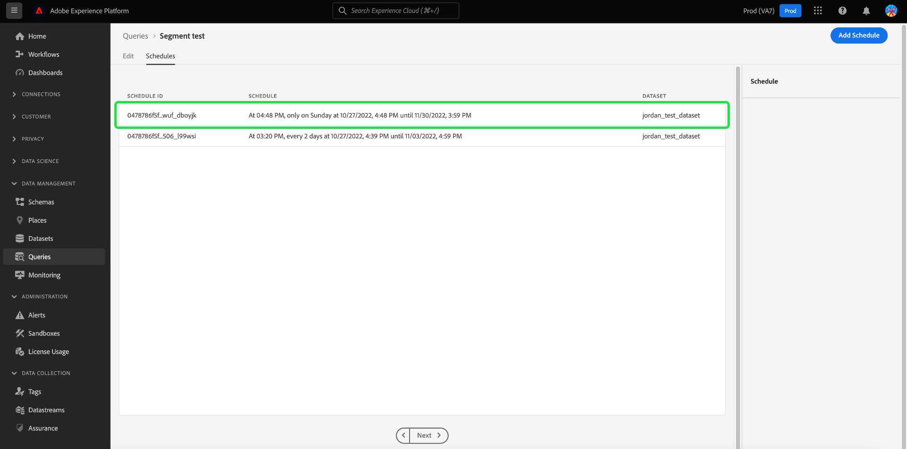

# [!DNL Query Editor] Guia da interface do usuário

[!DNL Query Editor] é uma ferramenta interativa fornecida pela Adobe Experience Platform [!DNL Query Service], que permite gravar, validar e executar consultas para dados de experiência do cliente na [!DNL Experience Platform] interface do usuário. [!DNL Query Editor] O suporta o desenvolvimento de consultas para análise e exploração de dados e permite executar consultas interativas para fins de desenvolvimento, bem como consultas não interativas para preencher conjuntos de dados no [!DNL Experience Platform].

Para obter mais informações sobre os conceitos e os recursos de [!DNL Query Service], consulte o [Visão geral do Serviço de query](../home.md). Para saber mais sobre como navegar na interface do usuário do Serviço de query em [!DNL Platform], consulte o [Visão geral da interface do usuário do serviço de query](./overview.md).

## Introdução {#getting-started}

[!DNL Query Editor] fornece execução flexível de consultas ao conectar-se a [!DNL Query Service]e as consultas só serão executadas enquanto esta conexão estiver ativa.

### Conexão com [!DNL Query Service] {#connecting-to-query-service}

[!DNL Query Editor] leva alguns segundos para inicializar e se conectar [!DNL Query Service] quando for aberto. O console informa quando está conectado, como mostrado abaixo. Se você tentar executar uma query antes que o editor esteja conectado, a execução será adiada até que a conexão seja concluída.

### Como as consultas são executadas a partir de [!DNL Query Editor] {#run-a-query}

Consultas executadas de [!DNL Query Editor] executar interativamente. Isso significa que se você fechar o navegador ou sair, a consulta será cancelada. Isso também é verdadeiro para queries feitos para gerar conjuntos de dados de saídas de query.

## Criação de query usando [!DNL Query Editor] {#query-authoring}

Usando [!DNL Query Editor], você pode gravar, executar e salvar consultas para dados de experiência do cliente. Todas as consultas executadas ou salvas em [!DNL Query Editor] estão disponíveis para todos os usuários em sua organização com acesso a [!DNL Query Service].

### Acessar o [!DNL Query Editor] {#accessing-query-editor}

No [!DNL Experience Platform] UI, selecione **[!UICONTROL Queries]** no menu de navegação esquerdo para abrir o [!DNL Query Service] espaço de trabalho. Em seguida, selecione **[!UICONTROL Criar Consulta]** na parte superior direita da tela para começar a gravar queries. Esse link está disponível em qualquer uma das páginas no [!DNL Query Service] espaço de trabalho.

### Gravação de queries {#writing-queries}

[!UICONTROL Editor de consultas] O é organizado para facilitar ao máximo a gravação de consultas. A captura de tela abaixo mostra como o editor aparece na interface do usuário, com o campo de entrada SQL e **Reproduzir** destacado.

Para minimizar o tempo de desenvolvimento, é recomendável desenvolver as consultas com limites nas linhas retornadas. Por exemplo, `SELECT fields FROM table WHERE conditions LIMIT number_of_rows`. Depois de verificar se a consulta produz a saída esperada, remova os limites e execute a consulta com `CREATE TABLE tablename AS SELECT` para gerar um conjunto de dados com a saída.

### Ferramentas de escrita em [!DNL Query Editor] {#writing-tools}

- **Realce automático da sintaxe:** Facilita a leitura e a organização do SQL.

- **Preenchimento automático de palavra-chave SQL:** Comece a digitar sua consulta, use as teclas de seta para navegar até o termo desejado e pressione **Enter**.

- **Preenchimento automático de tabela e campo:** Comece a digitar o nome da tabela que deseja `SELECT` em seguida, use as teclas de seta para navegar até a tabela que está procurando e pressione **Enter**. Depois que uma tabela é selecionada, o preenchimento automático reconhecerá os campos nessa tabela.

### Alternância de configuração da interface de usuário de preenchimento automático {#auto-complete}

O [!DNL Query Editor] sugere automaticamente possíveis palavras-chave SQL, juntamente com detalhes da tabela ou coluna para a consulta à medida que você a escreve. O recurso de preenchimento automático é ativado por padrão e pode ser desativado ou ativado a qualquer momento selecionando o [!UICONTROL Preenchimento automático da sintaxe] alterne para a parte superior direita do Editor de consultas.

A configuração de preenchimento automático é por usuário e é lembrada pelos logons consecutivos desse usuário.

Desativar esse recurso impede que vários comandos de metadados sejam processados e fornece recomendações que normalmente beneficiam a velocidade do autor ao editar consultas.

Ao usar a alternância para ativar o recurso de preenchimento automático, as sugestões recomendadas para nomes de tabela e coluna, bem como palavras-chave SQL, ficam disponíveis após uma breve pausa. Uma mensagem de sucesso no console, abaixo do Editor de consultas, indica que o recurso está ativo.

Se você desativar o recurso de preenchimento automático, será necessária uma atualização de página para que o recurso entre em vigor. Uma caixa de diálogo de confirmação é exibida com três opções quando você desativa a variável [!UICONTROL Preenchimento automático da sintaxe] alternar :

- [!UICONTROL Cancelar]
- [!UICONTROL Salvar alterações e atualizar]
- [!UICONTROL Atualizar sem salvar as alterações]

>[!IMPORTANT]
>
>Se estiver gravando ou editando uma consulta ao desativar esse recurso, será necessário salvar as alterações feitas na consulta antes de atualizar a página ou se todo o progresso for perdido.

Selecione a opção apropriada para desativar o recurso de conclusão automática.

### Detecção de erros {#error-detection}

[!DNL Query Editor] O valida automaticamente uma query à medida que você a escreve, fornecendo validação genérica de SQL e validação de execução específica. Se um sublinhado vermelho aparecer abaixo da query (como mostrado na imagem abaixo), ele representará um erro no query.

Quando os erros são detectados, é possível exibir as mensagens de erro específicas passando o mouse sobre o código SQL.

### Detalhes da consulta {#query-details}

Selecione qualquer modelo salvo no [!UICONTROL Modelos] para exibi-la no Editor de consultas. O painel Detalhes da consulta fornece mais informações e ferramentas para gerenciar a consulta selecionada.

Esse painel permite gerar um conjunto de dados de saída diretamente da interface do usuário, excluir ou nomear a consulta exibida e adicionar um agendamento à consulta.

Esse painel também mostra metadados úteis, como a última vez que a query foi modificada e quem a modificou, se aplicável. Para gerar um conjunto de dados, selecione **[!UICONTROL Conjunto de dados de saída]**. O **[!UICONTROL Conjunto de dados de saída]** será exibida. Insira um nome e uma descrição, em seguida, selecione **[!UICONTROL Executar Consulta]**. O novo conjunto de dados é exibido na variável **[!UICONTROL Conjuntos de dados]** na guia [!DNL Query Service] interface do usuário em [!DNL Platform].

### Consultas agendadas {#scheduled-queries}

>[!IMPORTANT]
>
>Esta é uma lista de limitações para consultas agendadas ao usar o Editor de consultas. Não se aplicam à [!DNL Query Service] API: Você só pode adicionar um agendamento a um query que já tenha sido criado, salvo e executado. Você **cannot** adicione um agendamento a um query parametrizado. Consultas agendadas **cannot** contém um bloco anônimo.

As programações são definidas no Editor de consultas. No entanto, somente as consultas que já foram salvas como um modelo podem ser agendadas. Para adicionar um agendamento a um query, selecione um template de query a partir da variável [!UICONTROL Modelos] ou a guia [!UICONTROL Consultas agendadas] para navegar até o Editor de consultas.

Para saber como adicionar agendamentos usando a API, leia o [guia do endpoint de consultas agendadas](../api/scheduled-queries.md).

Quando uma consulta salva é acessada no Editor de consultas, a variável [!UICONTROL Agendamentos] é exibida abaixo do nome da consulta. Selecionar **[!UICONTROL Agendamentos]**.

O espaço de trabalho de agendamentos é exibido. Selecionar **[!UICONTROL Adicionar agendamento]** para criar um agendamento.

A página de detalhes do agendamento é exibida. Nesta página, você pode escolher a frequência do query agendado, a data de início e de término, o dia da semana em que o query agendada será executado, bem como o conjunto de dados para o qual exportar o query.

Você pode escolher as seguintes opções para **[!UICONTROL Frequência]**:

- **[!UICONTROL Por hora]**: A consulta agendada será executada a cada hora para o período de datas selecionado.
- **[!UICONTROL Diariamente]**: A consulta agendada será executada a cada X dias no momento e no período de datas selecionado. Observe que o tempo selecionado está em **UTC**, e não seu fuso horário local.
- **[!UICONTROL Semanalmente]**: A consulta selecionada será executada nos dias da semana, da hora e do período de datas selecionado. Observe que o tempo selecionado está em **UTC**, e não seu fuso horário local.
- **[!UICONTROL Mensalmente]**: A consulta selecionada será executada todos os meses no dia, hora e período de datas selecionado. Observe que o tempo selecionado está em **UTC**, e não seu fuso horário local.
- **[!UICONTROL Anualmente]**: A consulta selecionada será executada todos os anos no dia, mês, hora e período de datas selecionado. Observe que o tempo selecionado está em **UTC**, e não seu fuso horário local.

Para o conjunto de dados, você tem a opção de usar um conjunto de dados existente ou criar um novo conjunto de dados.

>[!IMPORTANT]
>
> Como você está usando um conjunto de dados existente ou está criando um novo, **not** precisa incluir `INSERT INTO` ou `CREATE TABLE AS SELECT` como parte do query, já que os conjuntos de dados já estão definidos. Incluindo `INSERT INTO` ou `CREATE TABLE AS SELECT` como parte das consultas agendadas, resultará em um erro.

Depois de confirmar todos esses detalhes, selecione **[!UICONTROL Salvar]** para criar um agendamento. Você é retornado ao espaço de trabalho de agendamentos que exibe detalhes do agendamento recém-criado, incluindo a ID da agenda, o próprio agendamento e o conjunto de dados de saída do agendamento. Você pode usar a ID de agendamento para pesquisar mais informações sobre as execuções do próprio query agendado. Para saber mais, leia o [guia de endpoints de execução de query agendada](../api/runs-scheduled-queries.md).

#### Excluir ou desativar uma programação {#delete-schedule}

Você pode excluir ou desabilitar um agendamento do espaço de trabalho de agendamentos. Você deve selecionar um template de query do [!UICONTROL Modelos] ou a guia [!UICONTROL Consultas agendadas] para navegar até o Editor de consultas e selecionar **[!UICONTROL Agendar]** para acessar o espaço de trabalho de agendamentos.

Selecione um agendamento nas linhas de agendamentos disponíveis. Você pode usar a alternância para desativar ou ativar a consulta agendada.

>[!IMPORTANT]
>
>Você deve desativar o agendamento antes de poder excluir um agendamento para uma consulta.

Selecionar **[!UICONTROL Excluir um agendamento]** para excluir o agendamento desativado.

### Salvar consultas {#saving-queries}

O [!DNL Query Editor] O fornece uma função save que permite salvar um query e trabalhar nele posteriormente. Para salvar um query, selecione **[!UICONTROL Salvar]** no canto superior direito de [!DNL Query Editor]. Antes que um query possa ser salvo, um nome deve ser fornecido para o query usando o **[!UICONTROL Detalhes da consulta]** painel.

>[!NOTE]
>
>Consultas nomeadas e salvas no usando o Editor de consultas estão disponíveis como modelos no painel Consulta [!UICONTROL Modelos] guia . Consulte a [documentação dos modelos](./query-templates.md) para obter mais informações.

### Como encontrar consultas anteriores {#previous-queries}

Todas as consultas executadas de [!DNL Query Editor] são capturados na tabela Log. Você pode usar a funcionalidade de pesquisa no **[!UICONTROL Log]** para localizar execuções de query. As consultas salvas são listadas na variável **[!UICONTROL Modelos]** guia .

Consulte a [Visão geral da interface do usuário do serviço de query](./overview.md) para obter mais informações.

>[!NOTE]
>
>As consultas que não são executadas não são salvas pelo Log. Para que o query esteja disponível em [!DNL Query Service], ele deve ser executado ou salvo em [!DNL Query Editor].

## Execução de consultas usando o Editor de consultas {#executing-queries}

Para executar um query em [!DNL Query Editor], você pode inserir SQL no editor ou carregar uma query anterior do **[!UICONTROL Log]** ou **[!UICONTROL Modelos]** e selecione **Reproduzir**. O status da execução da consulta é exibido na variável **[!UICONTROL Console]** guia abaixo, e os dados de saída são mostrados na guia **[!UICONTROL Resultados]** guia .

### Console {#console}

O console fornece informações sobre o status e a operação do [!DNL Query Service]. O console exibe o status da conexão com [!DNL Query Service], as operações de query sendo executadas e qualquer mensagem de erro que resulte dessas consultas.

>[!NOTE]
>
>O console mostra apenas erros que resultaram da execução de um query. Ele não mostra erros de validação de consulta antes da execução de um query.

### Resultados da consulta {#query-results}

Depois que um query é concluído, os resultados são exibidos na variável **[!UICONTROL Resultados]** , ao lado do **[!UICONTROL Console]** guia . Esta exibição mostra a saída em tabela de seu query, exibindo até 100 linhas. Essa visualização permite verificar se o query produz a saída esperada. Para gerar um conjunto de dados com sua consulta, remova os limites das linhas retornadas e execute a consulta com `CREATE TABLE tablename AS SELECT` para gerar um conjunto de dados com a saída. Consulte a [tutorial de geração de conjuntos de dados](./create-datasets.md) para obter instruções sobre como gerar um conjunto de dados a partir dos resultados do query, [!DNL Query Editor].

## Execute consultas com [!DNL Query Service] vídeo tutorial {#query-tutorial-video}

O vídeo a seguir mostra como executar consultas na interface do Adobe Experience Platform e em um cliente PSQL. Além disso, é demonstrado o uso de propriedades individuais em um objeto XDM, usando funções definidas pelo Adobe e usando CREATE TABLE AS SELECT (CTAS).

>[!VIDEO](https://video.tv.adobe.com/v/29796?quality=12&learn=on)

## Próximas etapas

Agora que você sabe quais recursos estão disponíveis no [!DNL Query Editor] e como navegar no aplicativo, você pode começar a criar suas próprias consultas diretamente em [!DNL Platform]. Para obter mais informações sobre a execução de queries SQL em relação a conjuntos de dados em [!DNL Data Lake], consulte o guia em [execução de consultas](../best-practices/writing-queries.md).
