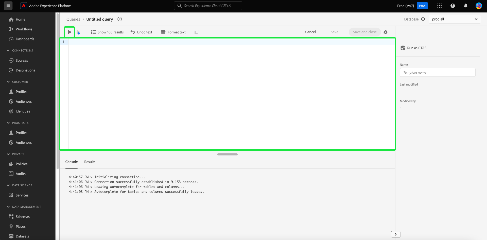

# [!DNL Query Editor] Guia da interface do usuário

[!DNL Query Editor] é uma ferramenta interativa fornecida pela Adobe Experience Platform  [!DNL Query Service], que permite gravar, validar e executar consultas para dados de experiência do cliente na interface do  [!DNL Experience Platform] usuário. [!DNL Query Editor] O suporta o desenvolvimento de consultas para análise e exploração de dados e permite executar consultas interativas para fins de desenvolvimento, bem como consultas não interativas para preencher conjuntos de dados no  [!DNL Experience Platform].

Para obter mais informações sobre os conceitos e os recursos de [!DNL Query Service], consulte a [Visão geral do serviço de consulta](../home.md). Para saber mais sobre como navegar na interface do usuário do Serviço de query em [!DNL Platform], consulte a [Visão geral da interface do usuário do Serviço de query](./overview.md).

## Introdução

[!DNL Query Editor] O fornece execução flexível de consultas ao conectar-se a  [!DNL Query Service], e as consultas só serão executadas enquanto essa conexão estiver ativa.

### Conectando a [!DNL Query Service]

[!DNL Query Editor] leva alguns segundos para inicializar e se conectar  [!DNL Query Service] quando é aberto. O Console informa quando ele está conectado, como mostrado abaixo. Se você tentar executar uma query antes que o editor esteja conectado, a execução será adiada até que a conexão seja concluída.

### Como as consultas são executadas a partir de [!DNL Query Editor]

Consultas executadas a partir de [!DNL Query Editor] são executadas interativamente. Isso significa que se você fechar o navegador ou sair, a consulta será cancelada. Isso também é verdadeiro para queries feitos para gerar conjuntos de dados de saídas de query.

## Criação de query usando [!DNL Query Editor]

Usando [!DNL Query Editor], você pode gravar, executar e salvar consultas para dados de experiência do cliente. Todas as consultas executadas em [!DNL Query Editor], ou salvas, estão disponíveis para todos os usuários em sua organização com acesso a [!DNL Query Service].

### Acesso ao [!DNL Query Editor]

Na interface [!DNL Experience Platform], selecione **[!UICONTROL Queries]** no menu de navegação esquerdo para abrir o espaço de trabalho [!DNL Query Service]. Em seguida, selecione **[!UICONTROL Criar consulta]** na parte superior direita da tela para começar a gravar consultas. Esse link está disponível em qualquer página no espaço de trabalho [!DNL Query Service].

### Gravação de queries

[!UICONTROL O Query ] Editor é organizado para facilitar ao máximo a gravação de consultas. A captura de tela abaixo mostra como o editor aparece na interface do usuário, com o botão **Play** e o campo de entrada SQL realçado.

Para minimizar o tempo de desenvolvimento, é recomendável desenvolver as consultas com limites nas linhas retornadas. Por exemplo, `SELECT fields FROM table WHERE conditions LIMIT number_of_rows`. Depois de verificar se a consulta produz a saída esperada, remova os limites e execute a consulta com `CREATE TABLE tablename AS SELECT` para gerar um conjunto de dados com a saída.

### A escrever ferramentas em [!DNL Query Editor]

- **Realce automático da sintaxe:** facilita a leitura e a organização do SQL.

- **Preenchimento automático da palavra-chave SQL:** Comece a digitar sua consulta, use as teclas de seta para navegar até o termo desejado e pressione  **Enter**.

- **Preenchimento automático de tabela e campo:** Comece a digitar o nome  `SELECT` da tabela de onde deseja criar, use as teclas de seta para navegar até a tabela que está procurando e pressione  **Enter**. Depois que uma tabela é selecionada, o preenchimento automático reconhecerá os campos nessa tabela.

### Detecção de erros

[!DNL Query Editor] O valida automaticamente uma query à medida que você a escreve, fornecendo validação genérica de SQL e validação de execução específica. Se um sublinhado vermelho aparecer abaixo da query (como mostrado na imagem abaixo), ele representará um erro no query.

Quando os erros são detectados, é possível exibir as mensagens de erro específicas passando o mouse sobre o código SQL.

### Detalhes da consulta

Enquanto você exibe um query em [!DNL Query Editor], o painel **[!UICONTROL Detalhes da consulta]** fornece ferramentas para gerenciar a query selecionada.

Esse painel permite gerar um conjunto de dados de saída diretamente da interface do usuário, excluir ou nomear a consulta exibida e adicionar um agendamento à consulta.

Esse painel também mostra metadados úteis, como a última vez que a query foi modificada e quem a modificou, se aplicável. Para gerar um conjunto de dados, selecione **[!UICONTROL Conjunto de dados de saída]**. A caixa de diálogo **[!UICONTROL Conjunto de dados de saída]** é exibida. Insira um nome e uma descrição, depois selecione **[!UICONTROL Executar Consulta]**. O novo conjunto de dados é exibido na guia **[!UICONTROL Conjuntos de dados]** na interface do usuário [!DNL Query Service] em [!DNL Platform].

### Consultas agendadas {#scheduled-queries}

>[!NOTE]
>
> Você só pode adicionar um agendamento a um query que já tenha sido criado, salvo e executado. Além disso, você **not** poderá adicionar um agendamento a uma consulta parametrizada.

Para adicionar um agendamento a um query, selecione **[!UICONTROL Adicionar agendamento]**.

A página **[!UICONTROL Schedule details]** é exibida. Nesta página, você pode escolher a frequência do query agendado, as datas em que o query agendado será executado, bem como o conjunto de dados para o qual exportar o query.

Você pode escolher as seguintes opções para **[!UICONTROL Frequency]**:

- **[!UICONTROL Por hora]**: A consulta agendada será executada a cada hora para o período de datas selecionado.
- **[!UICONTROL Diariamente]**: A consulta agendada será executada a cada X dias no momento e no período de datas selecionado. Observe que a hora selecionada está em **UTC**, e não seu fuso horário local.
- **[!UICONTROL Semanalmente]**: A consulta selecionada será executada nos dias da semana, da hora e do período de datas selecionado. Observe que a hora selecionada está em **UTC**, e não seu fuso horário local.
- **[!UICONTROL Mensalmente]**: A consulta selecionada será executada todos os meses no dia, hora e período de datas selecionado. Observe que a hora selecionada está em **UTC**, e não seu fuso horário local.
- **[!UICONTROL Anualmente]**: A consulta selecionada será executada todos os anos no dia, mês, hora e período de datas selecionado. Observe que a hora selecionada está em **UTC**, e não seu fuso horário local.

Para o conjunto de dados, você tem a opção de usar um conjunto de dados existente ou criar um novo conjunto de dados.

>[!IMPORTANT]
>
> Como você está usando um conjunto de dados existente ou criando um novo, **not** precisa incluir `INSERT INTO` ou `CREATE TABLE AS SELECT` como parte da consulta, já que os conjuntos de dados já estão definidos. A inclusão de `INSERT INTO` ou `CREATE TABLE AS SELECT` como parte das consultas agendadas resultará em um erro.

Depois de confirmar todos esses detalhes, selecione **[!UICONTROL Save]** para criar um agendamento.

A página de detalhes da consulta é exibida novamente e agora mostra os detalhes do agendamento recém-criado, incluindo a ID do agendamento, o próprio agendamento e o conjunto de dados de saída do agendamento. Você pode usar a ID de agendamento para pesquisar mais informações sobre as execuções do próprio query agendado. Para saber mais, leia o [guia de endpoints de execução de consulta agendados](../api/runs-scheduled-queries.md).

>[!NOTE]
>
> Você só pode agendar **um** modelo de consulta usando a interface do usuário. Se quiser adicionar agendamentos adicionais a um template de query, será necessário usar a API . Se um agendamento já tiver sido adicionado usando a API, você **not** será adicionado a agendamentos adicionais usando a interface do usuário. Se vários agendamentos já estiverem anexados a um template de query, somente o agendamento mais antigo será exibido. Para saber como adicionar agendamentos usando a API, leia o [guia do endpoint de consultas agendadas](../api/scheduled-queries.md).
>
> Além disso, você deve atualizar a página se quiser garantir que tenha o estado mais recente do agendamento que está visualizando.

#### Excluir um agendamento

Você pode excluir um agendamento selecionando **[!UICONTROL Excluir um agendamento]**.

>[!IMPORTANT]
>
> Se quiser excluir um agendamento para um query, desative o agendamento primeiro.

### Salvar consultas

[!DNL Query Editor] O fornece uma função save que permite salvar um query e trabalhar nele posteriormente. Para salvar um query, selecione **[!UICONTROL Save]** no canto superior direito de [!DNL Query Editor]. Antes que uma consulta possa ser salva, um nome deve ser fornecido para a consulta usando o painel **[!UICONTROL Detalhes da consulta]**.

### Como encontrar consultas anteriores

Todas as consultas executadas de [!DNL Query Editor] são capturadas na tabela Log. Você pode usar a funcionalidade de pesquisa na guia **[!UICONTROL Log]** para localizar execuções de consulta. As consultas salvas são listadas na guia **[!UICONTROL Browse]**.

Consulte a [Visão geral da interface do usuário do serviço de consulta](./overview.md) para obter mais informações.

>[!NOTE]
>
>As consultas que não são executadas não são salvas pelo Log. Para que a consulta esteja disponível em [!DNL Query Service], ela deve ser executada ou salva em [!DNL Query Editor].

## Execução de consultas usando o Editor de consultas

Para executar uma consulta em [!DNL Query Editor], você pode inserir SQL no editor ou carregar uma consulta anterior da guia **[!UICONTROL Log]** ou **[!UICONTROL Browse]** e selecionar **Play**. O status da execução da consulta é exibido na guia **[!UICONTROL Console]** abaixo, e os dados de saída são mostrados na guia **[!UICONTROL Results]**.

### Console

O console fornece informações sobre o status e a operação de [!DNL Query Service]. O console exibe o status da conexão com [!DNL Query Service], as operações de consulta que estão sendo executadas e quaisquer mensagens de erro que resultem dessas consultas.

>[!NOTE]
>
>O console mostra apenas erros que resultaram da execução de um query. Ele não mostra erros de validação de consulta antes da execução de um query.

### Resultados da consulta

Após a conclusão de um query, os resultados são exibidos na guia **[!UICONTROL Results]**, ao lado da guia **[!UICONTROL Console]**. Esta exibição mostra a saída em tabela de seu query, exibindo até 100 linhas. Essa visualização permite verificar se o query produz a saída esperada. Para gerar um conjunto de dados com sua consulta, remova os limites nas linhas retornadas e execute a consulta com `CREATE TABLE tablename AS SELECT` para gerar um conjunto de dados com a saída. Consulte o [tutorial de geração de conjuntos de dados](./create-datasets.md) para obter instruções sobre como gerar um conjunto de dados a partir de resultados de query em [!DNL Query Editor].

## Executar consultas com vídeo tutorial [!DNL Query Service]

O vídeo a seguir mostra como executar consultas na interface do Adobe Experience Platform e em um cliente PSQL. Além disso, é demonstrado o uso de propriedades individuais em um objeto XDM, usando funções definidas pelo Adobe e usando CREATE TABLE AS SELECT (CTAS).

>[!VIDEO](https://video.tv.adobe.com/v/29796?quality=12&learn=on)

## Próximas etapas

Agora que você sabe quais recursos estão disponíveis em [!DNL Query Editor] e como navegar no aplicativo, é possível começar a criar suas próprias consultas diretamente em [!DNL Platform]. Para obter mais informações sobre como executar consultas SQL em relação a conjuntos de dados em [!DNL Data Lake], consulte o guia em [executar consultas](../best-practices/writing-queries.md).
