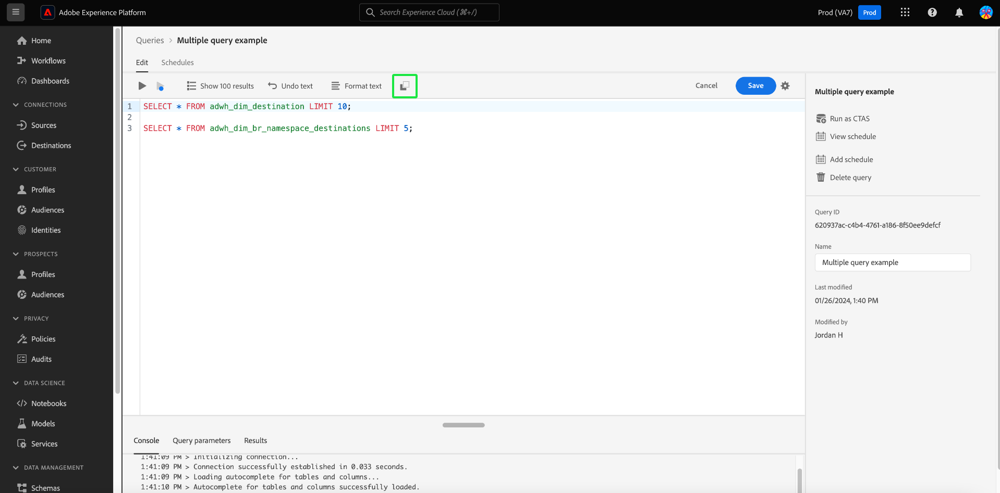

# Guia da interface do Editor de consultas

>[!NOTE]
>
>O editor herdado foi descontinuado em 24 de maio de 2024. Ele não está mais acessível para uso. Agora você pode usar o [Enhanced Query Editor](#enhanced-editor-toggle) para gravar, validar e executar suas consultas

O Editor de Consultas é uma ferramenta interativa fornecida pelo Serviço de Consulta da Adobe Experience Platform, que permite gravar, validar e executar consultas para dados de experiência do cliente na interface do usuário do [!DNL Experience Platform]. O Editor de Consultas oferece suporte ao desenvolvimento de consultas para análise e exploração de dados, e permite executar consultas interativas para fins de desenvolvimento, bem como consultas não interativas para popular conjuntos de dados no [!DNL Experience Platform].

Para obter mais informações sobre os conceitos e recursos do Serviço de consulta, consulte a [visão geral do Serviço de consulta](../home.md). Para saber mais sobre como navegar na interface do usuário do Serviço de Consulta em [!DNL Platform], consulte a [visão geral da interface do usuário do Serviço de Consulta](./overview.md).

## Introdução {#getting-started}

O Editor de consultas fornece execução flexível de consultas conectando-se ao Serviço de consulta, e as consultas somente são executadas enquanto essa conexão está ativa.

## Acesso ao Editor de consultas {#accessing-query-editor}

Na interface do usuário do [!DNL Experience Platform], selecione **[!UICONTROL Consultas]** no menu de navegação esquerdo para abrir o espaço de trabalho Serviço de Consulta. Em seguida, para começar a gravar consultas, selecione **[!UICONTROL Criar consulta]** na parte superior direita da tela. Esse link está disponível em qualquer uma das páginas no espaço de trabalho do Serviço de consulta.

### Conexão com o Serviço de consulta {#connecting-to-query-service}

O Editor de consultas demora alguns segundos para inicializar e se conectar ao Serviço de consulta quando ele é aberto. O console informa quando está conectado, conforme mostrado abaixo. Se você tentar executar uma consulta antes que o editor se conecte, a execução será atrasada até que a conexão seja concluída.

### Como as consultas são executadas no Editor de consultas {#run-a-query}

As consultas executadas no Editor de consultas são executadas interativamente, o que significa que, se você fechar o navegador ou sair, a consulta será cancelada. O mesmo é verdadeiro para consultas feitas para gerar conjuntos de dados a partir de saídas de consulta.

## Criação de consultas usando o Editor de consultas aprimorado {#query-authoring}

>[!NOTE]
>
>O editor herdado foi descontinuado em 24 de maio de 2024. Ele não está mais acessível para uso. Agora você pode usar o Editor de consultas aprimorado para gravar, validar e executar suas consultas.

Usando o Editor de consultas, você pode gravar, executar e salvar consultas para dados de experiência do cliente. Todas as consultas executadas ou salvas no Editor de consultas estão disponíveis para todos os usuários em sua organização com acesso ao Serviço de consulta.

### Configurações {#settings}

Um ícone de configurações acima do campo de entrada do Editor de consultas inclui uma opção para ativar/desativar o tema escuro ou desativar/ativar o preenchimento automático.

>[!TIP]
>
>Você pode [!UICONTROL Desabilitar o preenchimento automático da sintaxe] ao criar uma consulta sem perder seu progresso.

Para habilitar temas escuros ou claros, selecione o ícone de configurações () seguido pela opção no menu suspenso que aparece.

#### Preenchimento automático {#auto-complete}

O Editor de consultas sugere automaticamente possíveis palavras-chave SQL, juntamente com detalhes de tabela ou coluna para a consulta à medida que ela é gravada. O recurso de preenchimento automático é ativado por padrão e pode ser desativado ou ativado a qualquer momento nas configurações do Editor de consultas.

A definição de configuração de preenchimento automático é por usuário e lembrada pelos logons consecutivos desse usuário. A desativação desse recurso impede que vários comandos de metadados sejam processados e fornece recomendações que normalmente beneficiam a velocidade do autor ao editar consultas.

<!-- Currently editing the auto complete setting info. -->

### Executar várias consultas sequenciais {#execute-multiple-sequential-queries}

Use o Editor de consultas aprimorado para gravar mais de uma consulta e executar todas as consultas de maneira sequencial. A execução de várias consultas em uma sequência gera uma entrada de log. No entanto, somente os resultados da primeira consulta são exibidos no console do Editor de consultas. Verifique o log de consultas se precisar solucionar problemas ou confirmar as consultas executadas. Consulte a [documentação dos logs de consulta](./query-logs.md) para obter mais informações.

>[!NOTE]
> 
>Se uma consulta CTAS for executada após a primeira consulta no Editor de consultas, uma tabela ainda será criada, no entanto, não há saída no console do Editor de consultas.

### Executar consulta selecionada {#execute-selected-query}

Se tiver escrito várias consultas, mas precisar executar apenas uma, destaque a consulta escolhida e selecione a variável
Ícone [!UICONTROL Executar consulta selecionada]. Esse ícone é desativado por padrão até que você selecione a sintaxe de consulta no editor.

![O Editor de Consultas com o ícone [!UICONTROL Executar consulta selecionada] realçado.](../images/ui/query-editor/run-selected-query.png)

### Cancelar sessão do Editor de consultas {#cancel-query}

Assuma o controle da execução de consultas e melhore sua produtividade cancelando consultas de longa execução. Essa ação limpa o Editor de consultas durante uma execução de consulta. Esteja ciente de que a consulta continua a ser executada em segundo plano. Se for uma consulta CTAS, ela ainda gerará um conjunto de dados de saída. Para cancelar a execução no editor e continuar compondo uma instrução SQL, selecione **[!UICONTROL Cancelar consulta]** após executar uma consulta.

![O Editor de Consultas com [!UICONTROL Cancelar consulta] foi realçado.](../images/ui/query-editor/cancel-query-run.png)

Uma caixa de diálogo de confirmação é exibida. Selecione **[!UICONTROL Confirmar]** para cancelar a execução da consulta.

### Contagem de resultados {#result-count}

O Editor de consultas tem uma saída máxima de 50.000 linhas. Você pode escolher o número de linhas que são exibidas ao mesmo tempo no console do Editor de consultas. Para alterar o número de linhas exibidas no console, selecione a lista suspensa **[!UICONTROL Contagem de resultados]** e selecione nas opções 50, 100, 150, 300 e 500.

## Gravação de consultas {#writing-queries}

O [!UICONTROL Editor de Consultas] está organizado para facilitar ao máximo a criação de consultas. A captura de tela abaixo mostra como o editor aparece na interface do usuário, com o campo de entrada SQL e **Reproduzir** destacados.

Para minimizar o tempo de desenvolvimento, é recomendável desenvolver consultas com limites no número de linhas retornadas. Por exemplo, `SELECT fields FROM table WHERE conditions LIMIT number_of_rows`. Após verificar que sua consulta produz a saída esperada, remova os limites e execute a consulta com `CREATE TABLE tablename AS SELECT` para gerar um conjunto de dados com a saída.

## Ferramentas de escrita no Editor de consultas {#writing-tools}

- **Realce automático da sintaxe:** facilita a leitura e a organização do SQL.

- **Preenchimento automático de palavra-chave SQL:** Comece a digitar sua consulta, em seguida, use as teclas de seta para navegar até o termo desejado e pressione **Enter**.

- **Preenchimento automático de tabela e campo:** Comece digitando o nome da tabela da qual deseja `SELECT`. Em seguida, use as teclas de seta para navegar até a tabela que você está procurando e pressione **Enter**. Depois que uma tabela é selecionada, o preenchimento automático reconhece os campos nessa tabela.

### Formatar texto {#format-text}

O recurso [!UICONTROL Formatar texto] torna sua consulta mais legível ao adicionar um estilo de sintaxe padronizado. Selecione **[!UICONTROL Formatar texto]** para padronizar todo o texto no Editor de Consultas.

>[!NOTE]
>
>O recurso [!UICONTROL Formatar texto] não funciona com blocos anônimos. Para saber como encadear uma ou mais instruções SQL sequencialmente, consulte a [documentação de bloqueio anônimo](../key-concepts/anonymous-block.md).

![O Editor de Consultas com [!UICONTROL Formatar texto] e as instruções SQL realçadas.](../images/ui/query-editor/format-text.png)

<!-- ### Undo text {#undo-text}

If you format your SQL in the Query Editor, you can undo the formatting applied by the [!UICONTROL Format text] feature. To return your SQL back to its original form, select **[!UICONTROL Undo text]**.

![The Query Editor with [!UICONTROL Undo text] and the SQL statements highlighted.](../images/ui/query-editor/undo-text.png) -->

### Copiar SQL {#copy-sql}

Selecione o ícone de cópia para copiar o SQL do Editor de consultas para a área de transferência. Esse recurso de cópia está disponível para modelos de consulta e consultas recém-criadas no Editor de consultas.

### Detalhes da consulta {#query-details}

Para exibir uma consulta no Editor de Consultas, selecione qualquer modelo salvo na guia [!UICONTROL Modelos]. O painel de detalhes da consulta fornece mais informações e ferramentas para gerenciar a consulta selecionada. Ela também mostra metadados úteis, como a última vez que a consulta foi modificada e quem a modificou, se aplicável.

>[!NOTE]
>
>As opções [!UICONTROL Exibir agendamento], [!UICONTROL Adicionar agendamento] e [!UICONTROL Excluir consulta] só estarão disponíveis depois que a consulta for salva como modelo. A opção [!UICONTROL Adicionar agendamento] direciona você ao construtor de agendamentos a partir do Editor de Consultas. A opção [!UICONTROL Exibir agendamento] leva você diretamente para o inventário de agendamento para essa consulta. Consulte a documentação de agendamentos de consulta para saber como [criar agendamentos de consulta na interface do usuário](./query-schedules.md#create-schedule).

No painel de detalhes, é possível gerar um conjunto de dados de saída diretamente da interface do usuário, excluir ou nomear a consulta exibida, exibir o agendamento de execução da consulta e adicionar a consulta a um agendamento.

Para gerar um conjunto de dados de saída, selecione **[!UICONTROL Executar como CTAS]**. A caixa de diálogo **[!UICONTROL Inserir detalhes do conjunto de dados de saída]** é exibida. Digite um nome e uma descrição e selecione **[!UICONTROL Executar como CTAS]**. O novo conjunto de dados é exibido na guia Procurar **[!UICONTROL Conjuntos de Dados]**. Consulte [a documentação Exibir conjuntos de dados](../../catalog/datasets/user-guide.md#view-datasets) para saber mais sobre os conjuntos de dados disponíveis para sua organização.

>[!NOTE]
>
>A opção [!UICONTROL Executar como CTAS] só estará disponível se a consulta **não** tiver sido agendada.

![A caixa de diálogo [!UICONTROL Inserir detalhes do conjunto de dados de saída].](../images/ui/query-editor/output-dataset-details.png)

Após executar a ação **[!UICONTROL Executar como CTAS]**, uma mensagem de confirmação será exibida para notificá-lo sobre a ação bem-sucedida. Esta mensagem pop-up contém um link que fornece uma maneira conveniente de navegar até o espaço de trabalho de logs de consulta. Consulte a [documentação dos logs de consulta](./query-logs.md) para obter mais informações sobre logs de consulta.

### Salvamento de consultas {#saving-queries}

O Editor de consultas fornece uma função salvar que permite salvar uma consulta e trabalhar nela posteriormente. Para salvar uma consulta, selecione **[!UICONTROL Salvar]** no canto superior direito do Editor de Consultas. Antes de salvar uma consulta, é necessário fornecer um nome para ela usando o painel **[!UICONTROL Detalhes da Consulta]**.

>[!NOTE]
>
>Consultas nomeadas e salvas no usando o Editor de consultas estão disponíveis como modelos na guia [!UICONTROL Modelos] do painel de consulta. Consulte a [documentação de modelos](./query-templates.md) para obter mais informações.

Quando você salva uma consulta no Editor de consultas, uma mensagem de confirmação aparece para notificá-lo sobre a ação bem-sucedida. Esta mensagem pop-up contém um link que fornece uma maneira conveniente de navegar até o espaço de trabalho de agendamento de consultas. Consulte a [documentação de consultas de agendamento](./query-schedules.md) para saber como executar consultas em uma cadência personalizada.

### Consultas programadas {#scheduled-queries}

As consultas que foram salvas como um modelo podem ser agendadas no Editor de consultas. O agendamento de consultas permite automatizar as execuções de consultas em uma cadência personalizada. Você pode agendar consultas com base na frequência, data e hora e também escolher um conjunto de dados de saída para seus resultados, se necessário. Os agendamentos de query também podem ser desativados ou excluídos por meio da interface do usuário.

Os cronogramas são definidos no Editor de consultas. Ao usar o Editor de consultas, você só pode adicionar um agendamento a uma consulta que já foi criada e salva. A mesma limitação não se aplica à API do Serviço de consulta.

>[!NOTE]
>
>Consultas agendadas com falha em dez execuções consecutivas são colocadas automaticamente em um status [!UICONTROL Em quarentena]. Uma consulta com esse status requer sua intervenção antes que qualquer outra execução possa ocorrer. Consulte a documentação das [consultas em quarentena](./monitor-queries.md#quarantined-queries) para obter mais detalhes.

Consulte a documentação de agendamentos de consulta para saber como [criar agendamentos de consulta na interface do usuário](./query-schedules.md). Como alternativa, para saber como adicionar agendamentos usando a API, leia o [manual de ponto de extremidade de consultas agendadas](../api/scheduled-queries.md).

Quaisquer consultas agendadas são adicionadas à lista na guia [!UICONTROL Consultas agendadas]. Nesse espaço de trabalho, é possível monitorar o status de todos os trabalhos de consulta agendados por meio da interface do usuário. Na guia [!UICONTROL Consultas agendadas], você pode encontrar informações importantes sobre a execução de consultas e assinar alertas. As informações disponíveis incluem status, detalhes da programação e mensagens/códigos de erro se uma execução falhar. Consulte o [Documento de monitoramento de consultas agendadas](./monitor-queries.md) para obter mais informações.

### Como encontrar consultas anteriores {#previous-queries}

Todas as consultas executadas no Editor de consultas são capturadas na tabela Log. Você pode usar a funcionalidade de pesquisa na guia **[!UICONTROL Log]** para localizar execuções de consulta. As consultas salvas estão listadas na guia **[!UICONTROL Modelos]**.

Se uma consulta foi agendada, a guia [!UICONTROL Consultas agendadas] oferece maior visibilidade por meio da interface do usuário para esses trabalhos de consulta. Consulte a [documentação de monitoramento da consulta](./monitor-queries.md) para obter mais informações.

>[!NOTE]
>
>As consultas que não são executadas não são salvas pelo Log. Para que a consulta esteja disponível no Serviço de consulta, ela deve ser executada ou salva no Editor de consultas.

## Execução de consultas usando o Editor de consultas {#executing-queries}

Para executar uma consulta no Editor de Consultas, você pode inserir SQL no editor ou carregar uma consulta anterior da guia **[!UICONTROL Log]** ou **[!UICONTROL Modelos]** e selecionar **Reproduzir**. O status da execução da consulta é exibido na guia **[!UICONTROL Console]** abaixo, e os dados de saída são mostrados na guia **[!UICONTROL Resultados]**.

### Console {#console}

O console fornece informações sobre o status e a operação do Serviço de consulta. O console exibe o status da conexão com o Serviço de consulta, as operações de consulta que estão sendo executadas e as mensagens de erro resultantes dessas consultas.

>[!NOTE]
>
>O console mostra apenas os erros que resultaram da execução de um query. Ele não mostra os erros de validação de consulta que ocorrem antes da execução de uma consulta.

### Resultados da consulta {#query-results}

Após a conclusão de uma consulta, os resultados serão exibidos na guia **[!UICONTROL Resultados]**, ao lado da guia **[!UICONTROL Console]**. Este modo de exibição mostra a saída tabular da sua consulta, exibindo entre 50 e 500 linhas de resultados, dependendo da sua [contagem de resultados](#result-count) escolhida. Essa visualização permite verificar se sua consulta produz a saída esperada. Para gerar um conjunto de dados com sua consulta, remova os limites nas linhas retornadas e execute a consulta com `CREATE TABLE tablename AS SELECT` para gerar um conjunto de dados com a saída. Consulte o [tutorial de geração de conjuntos de dados](./create-datasets.md) para obter instruções sobre como gerar um conjunto de dados a partir dos resultados da consulta no Editor de consultas.

## Casos de uso {#use-cases}

O Serviço de consulta fornece soluções para uma variedade de casos de uso em todos os setores e cenários de negócios. Esses exemplos práticos demonstram a flexibilidade e o impacto do serviço em atender a diversas necessidades. Para [descobrir como o Serviço de consulta pode agregar valor às suas necessidades comerciais específicas](../use-cases/overview.md), explore a coleção abrangente de documentos de casos de uso. Saiba como usar o Serviço de consulta para fornecer insights e soluções para melhorar a eficiência operacional e o sucesso dos negócios.

<!-- This video is from 2019. The logic is sounds but the workflow is too outdated. -->

## Vídeo tutorial Executar consultas com o Serviço de consulta {#query-tutorial-video}

O vídeo a seguir mostra como executar queries na interface do Adobe Experience Platform e em um cliente PSQL. O vídeo também demonstra o uso de propriedades individuais em um objeto XDM, funções definidas por Adobe e como usar consultas CREATE TABLE AS SELECT (CTAS).

>[!NOTE]
>
>A interface do usuário descrita no vídeo está desatualizada, mas a lógica usada no fluxo de trabalho permanece a mesma.

>[!VIDEO](https://video.tv.adobe.com/v/29796?quality=12&learn=on)

## Próximas etapas

Agora que você sabe quais recursos estão disponíveis no Editor de Consultas e como navegar pelo aplicativo, pode começar a criar suas próprias consultas diretamente no [!DNL Platform]. Para obter mais informações sobre como executar consultas SQL em conjuntos de dados no [!DNL Data Lake], consulte o manual em [executando consultas](../best-practices/writing-queries.md).
