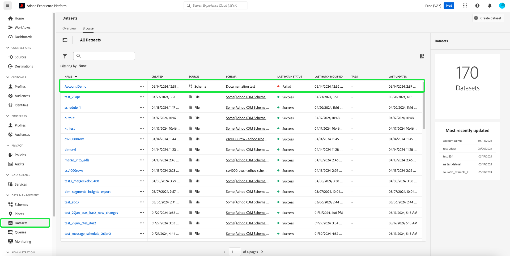
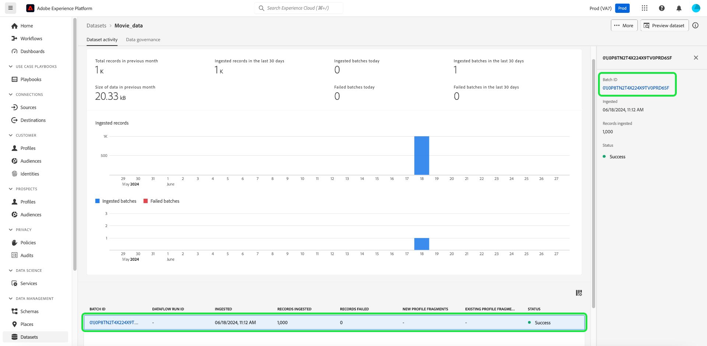

# Explore, solucione problemas e verifique a assimilação em lote com o SQL

Este documento explica como verificar e validar registros em lotes assimilados com o SQL. Este documento ensina como:

- Lidar com erros que podem surgir durante o processo de assimilação
- Acessar metadados em lote do conjunto de dados
- Solucionar problemas e garantir a integridade dos dados consultando lotes

>[!NOTE]
>
>Algumas capturas de tela neste guia foram tiradas de [!DNL DBVisualizer]. Para saber como [conectar o Serviço de Consulta com DBVisualizer](../clients/dbvisulaizer.md) ou outras [ferramentas de BI de terceiros](../clients/overview.md), consulte a documentação vinculada.

## Pré-requisitos

Para ajudar na compreensão dos conceitos discutidos neste documento, você deve ter conhecimento dos seguintes tópicos:

- **Assimilação de dados**: consulte a [visão geral da assimilação de dados](../../ingestion/home.md) para saber as noções básicas de como os dados são assimilados na plataforma, incluindo os diferentes métodos e processos envolvidos.
- **Assimilação em lote**: consulte a [visão geral da API de assimilação em lote](../../ingestion/batch-ingestion/overview.md) para saber mais sobre os conceitos básicos de assimilação em lote. Especificamente, o que é um &quot;lote&quot; e como ele funciona no processo de assimilação de dados da plataforma.
- **Tratamento de erros na assimilação de dados**: saiba mais sobre os [diferentes tipos de erros que podem ocorrer](../../ingestion/quality/error-diagnostics.md#retrieve-errors) durante a assimilação de dados e [como lidar com eles](../../ingestion/batch-ingestion/troubleshooting.md#what-if-a-batch-fails).
- **Metadados do sistema em conjuntos de dados**: consulte a [visão geral do Serviço de Catálogo](../../catalog/home.md) para saber como os campos de metadados do sistema são usados para rastrear e consultar dados assimilados.
- **Experience Data Model (XDM)**: consulte a [visão geral da interface do usuário de esquemas](../../xdm/ui/overview.md) e as [&#39;noções básicas da composição de esquema&#39;](../../xdm/schema/composition.md) para saber mais sobre esquemas XDM e como eles representam e validam a estrutura e o formato dos dados assimilados na Platform.

## Acessar metadados em lote do conjunto de dados {#access-dataset-batch-metadata}

Para garantir que as colunas do sistema (colunas de metadados) sejam incluídas nos resultados da consulta, use o comando SQL `set drop_system_columns=false` no Editor de Consultas. Isso configura o comportamento da sessão de consulta SQL. Esta entrada deve ser repetida se você iniciar uma nova sessão.

Em seguida, para exibir os campos de sistema do conjunto de dados, execute uma instrução SELECT all para exibir os resultados do conjunto de dados, por exemplo `select * from movie_data`. Os resultados incluem duas novas colunas no lado direito `_acp_system_metadata` e `_ACP_BATCHID`. As colunas de metadados `_acp_system_metadata` e `_ACP_BATCHID` ajudam a identificar as partições lógica e física dos dados assimilados.


Quando os dados são assimilados na Platform, uma partição lógica é atribuída com base nos dados recebidos. Esta partição lógica é representada por `_acp_system_metadata.sourceBatchId`. Essa ID ajuda a agrupar e identificar os lotes de dados logicamente antes de serem processados e armazenados.

Depois que os dados forem processados e assimilados no data lake, ele receberá uma partição física representada por `_ACP_BATCHID`. Essa ID reflete a partição de armazenamento real no data lake onde os dados assimilados residem.

### Usar SQL para compreender partições lógicas e físicas {#understand-partitions}

Para ajudar a entender como os dados são agrupados e distribuídos após a assimilação, use a consulta a seguir para contar o número de partições físicas distintas (`_ACP_BATCHID`) para cada partição lógica (`_acp_system_metadata.sourceBatchId`).

```SQL
SELECT  _acp_system_metadata, COUNT(DISTINCT _ACP_BATCHID) FROM movie_data
GROUP BY _acp_system_metadata
```

Os resultados desse query são mostrados na imagem abaixo.


Esses resultados demonstram que o número de lotes de entrada não corresponde necessariamente ao número de lotes de saída, pois o sistema determina a maneira mais eficiente de colocar em lote e armazenar os dados no data lake.

O exemplo a seguir usa um conjunto de dados diferente para ilustrar esse ponto.

>[!NOTE]
>
>Se quiser experimentar este exemplo, você pode assimilar o arquivo de amostra fornecido ([`drug_checkout_data`](../images/use-cases/drug_checkout_data.zip)) na Platform e configurar o mapeamento do esquema.

O arquivo `drug_checkout_data` é um conjunto profundamente aninhado de 35.000 registros. Use a instrução SQL `SELECT * FROM drug_orders;` para visualizar o primeiro conjunto de registros no conjunto de dados `drug_orders` baseado em JSON.

A imagem abaixo mostra uma pré-visualização do arquivo e seus registros.


### Usar o SQL para gerar insights sobre o processo de assimilação em lote {#sql-insights-on-batch-ingestion}

Use a instrução SQL abaixo para fornecer insights sobre como o processo de assimilação de dados agrupou e processou os registros de entrada em lotes.

```sql
SELECT _acp_system_metadata,
       Count(DISTINCT _acp_batchid) AS numoutputbatches,
       Count(_acp_batchid)          AS recordcount
FROM   drug_orders
GROUP  BY _acp_system_metadata 
```

Os resultados do query são vistos na imagem abaixo.


Os resultados demonstram a eficiência e o comportamento do processo de assimilação de dados. Embora três lotes de entrada tenham sido criados — cada um contendo 2000, 24000 e 9000 registros — quando os registros foram combinados e desduplicados, restou apenas um único lote.

>[!NOTE]
>
>Todos os registros visíveis em um conjunto de dados são aqueles que foram assimilados com êxito. Uma assimilação em lote bem-sucedida não significa que todos os registros enviados da entrada de origem estão presentes. Você deve verificar se há falhas de assimilação de dados para encontrar os lotes/registros que não entraram.

## Validar um lote com SQL {#validate-a-batch-with-SQL}

Em seguida, valide e verifique os registros que foram assimilados no conjunto de dados com o SQL.

>[!TIP]
>
>Para recuperar a ID do lote e os registros de consulta associados a essa ID do lote, primeiro você deve criar um lote na Platform. Se quiser testar o processo sozinho, você pode assimilar dados CSV na Platform. Leia o guia sobre como [mapear um arquivo CSV para um esquema XDM existente usando recomendações geradas por IA](../../ingestion/tutorials/map-csv/recommendations.md). Um [arquivo CSV de perfil de exemplo](../images/use-cases/sample-profiles.csv) está disponível aqui para sua conveniência.

Depois de assimilar um lote, você deve navegar até a [!UICONTROL guia de atividade de conjuntos de dados] para o conjunto de dados no qual assimilou dados.

Na interface do usuário do Experience Platform, selecione **[!UICONTROL Conjuntos de dados]** no menu de navegação esquerdo para abrir o painel [!UICONTROL Conjuntos de dados]. Em seguida, selecione o nome do conjunto de dados na guia [!UICONTROL Procurar] para acessar a tela [!UICONTROL Atividade do conjunto de dados].



A exibição [!UICONTROL Atividade do conjunto de dados] aparece. Essa exibição contém detalhes do conjunto de dados selecionado. Inclui todos os lotes assimilados exibidos em formato de tabela.

Selecione um lote na lista de lotes disponíveis e copie a [!UICONTROL ID do lote] no painel de detalhes à direita.



Em seguida, use a seguinte consulta para recuperar todos os registros incluídos no conjunto de dados como parte desse lote:

```sql
SELECT * FROM movie_data
WHERE  _acp_batchid='01H00BKCTCADYRFACAAKJTVQ8P' 
LIMIT 1;
```

A palavra-chave `_ACP_BATCHID` é usada para filtrar a [!UICONTROL ID do Lote].

>[!TIP]
>
>A cláusula `LIMIT` é útil se você quiser restringir o número de linhas exibidas, mas uma condição de filtro é mais desejável.

Ao executar essa consulta no Editor de consultas, os resultados são truncados para 100 linhas. O Editor de consultas foi projetado para visualizações e investigações rápidas. Para recuperar até 50.000 linhas, você pode usar uma ferramenta de terceiros, como DBVisualizer ou DBeaver.

## Próximas etapas {#next-steps}

Ao ler este documento, você aprendeu os conceitos básicos de verificação e validação de registros em lotes assimilados como parte do processo de assimilação de dados. Você também obteve insights sobre como acessar metadados em lote do conjunto de dados, entender partições lógicas e físicas e consultar lotes específicos usando comandos SQL. Esse conhecimento pode ajudá-lo a garantir a integridade dos dados e otimizar seu armazenamento de dados na Platform.

Em seguida, pratique a assimilação de dados para aplicar os conceitos aprendidos. Assimile um conjunto de dados de amostra na Platform com os arquivos de amostra fornecidos ou com seus próprios dados. Se ainda não tiver feito isso, leia o tutorial sobre como [assimilar dados no Adobe Experience Platform](../../ingestion/tutorials/ingest-batch-data.md).

Como alternativa, você pode aprender a [conectar e verificar o Serviço de Consulta com vários aplicativos de cliente de desktop](../clients/overview.md) para aprimorar seus recursos de análise de dados.
