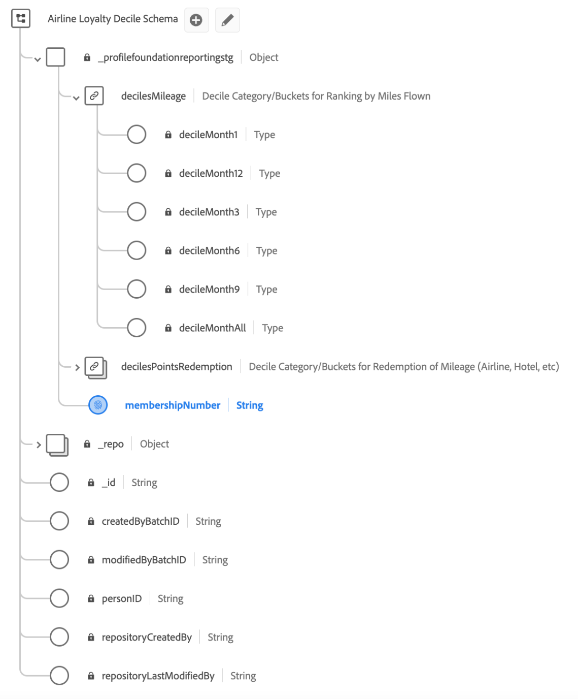

# Caso de uso de conjuntos de dados derivados com base em decis

Os conjuntos de dados derivados facilitam casos de uso complicados para analisar dados do data lake que podem ser usados com outros serviços downstream da Platform ou publicados nos dados do Perfil do cliente em tempo real.

Este exemplo de caso de uso demonstra como criar conjuntos de dados derivados baseados em decis para uso com seus dados de Perfil do cliente em tempo real. Usando um cenário de fidelidade da companhia aérea como exemplo, este guia informa como criar um conjunto de dados que usa decis categóricos para segmentar e criar públicos com base em atributos classificados.

Os principais conceitos são ilustrados a seguir:

* Criação de esquema para classificação de decis.
* Criação de decis categórica.
* Criação de conjuntos de dados derivados complexos.
* Cálculo de decis em um período de pesquisa.
* Um exemplo de consulta para demonstrar agregação, classificação e adição de identidades exclusivas para permitir que os públicos-alvo sejam gerados com base nesses intervalos de decis.

## Introdução

Este guia requer uma compreensão funcional de [execução da consulta no Serviço de consulta](../best-practices/writing-queries.md) e os seguintes componentes do Adobe Experience Platform:

* [Visão geral do Perfil do cliente em tempo real](../../profile/home.md): fornece um perfil de consumidor unificado em tempo real com base em dados agregados de várias fontes.
* [Noções básicas da composição do esquema](../../xdm/schema/composition.md): uma introdução aos esquemas do Experience Data Model (XDM) e aos componentes, princípios e práticas recomendadas para a composição de esquemas.
* [Como ativar um esquema para o Perfil do cliente em tempo real](../../profile/tutorials/add-profile-data.md): este tutorial descreve as etapas necessárias para adicionar dados ao Perfil do cliente em tempo real.
* [Como definir um tipo de dados personalizado](../../xdm/api/data-types.md): os tipos de dados são usados como campos do tipo referência em classes ou grupos de campos de esquema e permitem o uso consistente de uma estrutura de vários campos que pode ser incluída em qualquer lugar do esquema.

## Objetivos

O exemplo fornecido neste documento usa decis para criar conjuntos de dados derivados para classificar dados de um esquema de fidelidade de linha aérea. Os conjuntos de dados derivados permitem maximizar a utilidade dos dados identificando um público com base no maior &quot;n&quot; % de uma categoria escolhida.

## Criar conjuntos de dados derivados baseados em decil

Para definir a classificação de decis com base em uma dimensão específica e uma métrica correspondente, um esquema deve ser projetado para permitir a classificação de decis.

Este guia usa um conjunto de dados de fidelidade de linha aérea para demonstrar como usar o Serviço de consulta para criar decis com base nas milhas percorridas em vários períodos de pesquisa.

## Usar o Serviço de consulta para criar decis

Usando o Serviço de consulta, você pode criar um conjunto de dados que contenha decis categóricos, que podem ser segmentados para criar públicos-alvo com base na classificação de atributos. Os conceitos exibidos nos exemplos a seguir podem ser aplicados para criar outros conjuntos de dados de bucket de decil, desde que uma categoria esteja definida e uma métrica esteja disponível.

O exemplo de dados de fidelidade aérea usa um [Classe XDM ExperienceEvents](../../xdm/classes/experienceevent.md). Cada evento é um registro de uma transação comercial por quilometragem, creditada ou debitada, e o status de fidelidade do membro de &quot;Flyer&quot;, &quot;Frequent&quot;, &quot;Silver&quot; ou &quot;Gold&quot;. O campo de identidade principal é `membershipNumber`.

### Conjuntos de dados de exemplo

O conjunto de dados inicial de fidelidade da companhia aérea para este exemplo é &quot;Dados de fidelidade da companhia aérea&quot; e tem o seguinte esquema. Observe que a identidade principal do esquema é `_profilefoundationreportingstg.membershipNumber`.


**Dados de exemplo**

A tabela a seguir exibe os dados de exemplo contidos na variável `_profilefoundationreportingstg` objeto usado para este exemplo. Ele fornece contexto para o uso de buckets decis para criar conjuntos de dados derivados complexos.

>[!NOTE]
>
>Por uma questão de brevidade, a ID do locatário `_profilefoundationreportingstg` foi omitido do início do namespace nos títulos das colunas e nas menções subsequentes em todo o documento.

| `.membershipNumber` | `.emailAddress.address` | `.transactionDate` | `.transactionType` | `.transactionDetails` | `.mileage` | `.loyaltyStatus` |
|---|---|---|---|---|---|---|
| C435678623 | sfeldmark1vr@studiopress.com | 01-01-2022 | STATUS_MILES | Novo membro | 5000 | PANFLETO |
| B789279247 | pgalton32n@barnesandnoble.com | 01/02/2022 | AWARD_MILES | JFK-FRA | 7500 | PRATA |
| B789279247 | pgalton32n@barnesandnoble.com | 01/02/2022 | STATUS_MILES | JFK-FRA | 7500 | PRATA |
| B789279247 | pgalton32n@barnesandnoble.com | 2022-02-10 | AWARD_MILES | FRA-JFK | 5000 | PRATA |
| A123487284 | rritson1zn@sciencedaily.com | 01-2022-07 | STATUS_MILES | Novo cartão de crédito | 10000 | PANFLETO |

{style="table-layout:auto"}

## Gerar conjuntos de dados decis

Nos dados de fidelidade da companhia aérea `.mileage` contém o número de milhas voadas por um membro para cada voo individual realizado. Esses dados são usados para criar decis para o número de milhas percorridas em retrospectivas de vida útil e uma variedade de períodos de retrospectiva. Para essa finalidade, é criado um conjunto de dados que contém decis em um tipo de dados de mapa para cada período de pesquisa e um decil apropriado para cada período de pesquisa atribuído em `membershipNumber`.

Crie um &quot;Esquema de decil de fidelidade de linha aérea&quot; para criar um conjunto de dados decil usando o Serviço de consulta.



### Ativar o esquema para o Perfil de cliente em tempo real

Os dados assimilados no Experience Platform para uso pelo Perfil do cliente em tempo real devem estar em conformidade com [um esquema do Experience Data Model (XDM) que está ativado para o Perfil](../../xdm/ui/resources/schemas.md). Para que um esquema seja ativado para Perfil, ele deve implementar o Perfil individual XDM ou a classe XDM ExperienceEvent.

[Ative seu esquema para uso no Perfil de cliente em tempo real usando a API do registro de esquema](../../xdm/tutorials/create-schema-api.md) ou o [Interface do usuário do Editor de esquemas](../../xdm/tutorials/create-schema-ui.md).  Instruções detalhadas sobre como ativar um esquema para o Perfil estão disponíveis na respectiva documentação.

Em seguida, crie um tipo de dados que será reutilizado para todos os grupos de campos relacionados a decis. A criação do grupo de campos decis é uma etapa única por sandbox. Ele também pode ser reutilizado para todos os schemas relacionados a decis.

### Criar um namespace de identidade e marcá-lo como o identificador principal {#identity-namespace}

Qualquer esquema criado para uso com decis deve ter uma identidade primária atribuída. Você pode [definir um campo de identidade na interface do usuário de esquemas do Adobe Experience Platform](../../xdm/ui/fields/identity.md#define-an-identity-field)ou por meio da [API do registro de esquema](../../xdm/api/descriptors.md#create).

O Serviço de consulta também permite definir uma identidade ou uma identidade primária para campos de conjunto de dados de esquema ad hoc diretamente pelo SQL. Consulte a documentação em [definição de uma identidade secundária e uma identidade primária em identidades de esquema ad hoc](../data-governance/ad-hoc-schema-identities.md) para obter mais informações.

### Criar uma consulta para calcular decis em um período de pesquisa {#create-a-query}

O exemplo a seguir demonstra a consulta SQL para calcular um decil em um período de lookback.

Um modelo pode ser feito usando o Editor de consultas na interface ou por meio do [API do serviço de consulta](../api/query-templates.md#create-a-query-template).

```sql
CREATE TABLE AS airline_loyality_decile 
{  WITH summed_miles_1 AS (
        SELECT _profilefoundationreportingstg.membershipNumber AS membershipNumber,
            _profilefoundationreportingstg.loyaltyStatus AS loyaltyStatus,
            SUM(_profilefoundationreportingstg.mileage) AS totalMiles
        FROM airline_loyalty_data
        WHERE _profilefoundationreportingstg.transactionDate < (MAKE_DATE(YEAR(CURRENT_DATE), MONTH(CURRENT_DATE), 1) - MAKE_YM_INTERVAL(0, 0))
    GROUP BY 1,2
    ),
    summed_miles_3 AS (
        SELECT _profilefoundationreportingstg.membershipNumber AS membershipNumber,
            _profilefoundationreportingstg.loyaltyStatus AS loyaltyStatus,
            SUM(_profilefoundationreportingstg.mileage) AS totalMiles
        FROM airline_loyalty_data
        WHERE _profilefoundationreportingstg.transactionDate < (MAKE_DATE(YEAR(CURRENT_DATE), MONTH(CURRENT_DATE), 1) - MAKE_YM_INTERVAL(0, 1))
    GROUP BY 1,2
    ),
    summed_miles_6 AS (
        SELECT _profilefoundationreportingstg.membershipNumber AS membershipNumber,
            _profilefoundationreportingstg.loyaltyStatus AS loyaltyStatus,
            SUM(_profilefoundationreportingstg.mileage) AS totalMiles
        FROM airline_loyalty_data
        WHERE _profilefoundationreportingstg.transactionDate < (MAKE_DATE(YEAR(CURRENT_DATE), MONTH(CURRENT_DATE), 1) - MAKE_YM_INTERVAL(0, 4))
    GROUP BY 1,2
    ),
    rankings_1 AS (
        SELECT membershipNumber,
            loyaltyStatus,
            totalMiles,
            NTILE(10) OVER (PARTITION BY loyaltyStatus ORDER BY totalMiles DESC) AS decileBucket
        FROM summed_miles_1
    ),
    rankings_3 AS (
        SELECT membershipNumber,
            loyaltyStatus,
            totalMiles,
            NTILE(10) OVER (PARTITION BY loyaltyStatus ORDER BY totalMiles DESC) AS decileBucket
        FROM summed_miles_3
    ),
    rankings_6 AS (
        SELECT membershipNumber,
            loyaltyStatus,
            totalMiles,
            NTILE(10) OVER (PARTITION BY loyaltyStatus ORDER BY totalMiles DESC) AS decileBucket
        FROM summed_miles_6
    ),
    map_1 AS (
        SELECT membershipNumber,
            MAP_FROM_ARRAYS(COLLECT_LIST(loyaltyStatus), COLLECT_LIST(decileBucket)) AS decileMonth1
        FROM rankings_1
        GROUP BY membershipNumber
    ),
    map_3 AS (
        SELECT membershipNumber,
            MAP_FROM_ARRAYS(COLLECT_LIST(loyaltyStatus), COLLECT_LIST(decileBucket)) AS decileMonth3
        FROM rankings_3
        GROUP BY membershipNumber
    ),
    map_6 AS (
        SELECT membershipNumber,
            MAP_FROM_ARRAYS(COLLECT_LIST(loyaltyStatus), COLLECT_LIST(decileBucket)) AS decileMonth6
        FROM rankings_6
        GROUP BY membershipNumber
    ),
    all_memberships AS (
        SELECT DISTINCT _profilefoundationreportingstg.membershipNumber AS membershipNumber FROM airline_loyalty_data
    )
    SELECT STRUCT(
            all_memberships.membershipNumber AS membershipNumber,
            STRUCT(
                    map_1.decileMonth1 AS decileMonth1,
                    map_3.decileMonth3 AS decileMonth3,
                    map_6.decileMonth6 AS decileMonth6
            ) AS decilesMileage
        ) AS _profilefoundationreportingstg
    FROM all_memberships
        LEFT JOIN map_1 ON  (all_memberships.membershipNumber = map_1.membershipNumber)
        LEFT JOIN map_3 ON  (all_memberships.membershipNumber = map_3.membershipNumber)
        LEFT JOIN map_6 ON  (all_memberships.membershipNumber = map_6.membershipNumber)
    }
```

### Revisão da consulta

As seções do exemplo de consulta são examinadas com mais detalhes abaixo.

#### Períodos de pesquisa

O tipo de dados decile contém um intervalo para lookbacks 1, 3, 6, 9, 12 e tempo de vida. A consulta usa os períodos de pesquisa de 1, 3 e 6 meses, de modo que cada seção conterá algumas consultas &quot;repetidas&quot; para criar tabelas temporárias para cada período de pesquisa.

>[!NOTE]
>
>Se os dados de origem não tiverem uma coluna que possa ser usada para determinar um período de lookback, todas as classificações de classe de decis serão executadas em `decileMonthAll`.

#### Agregação

Use expressões de tabela comuns (CTE) para agregar a quilometragem antes de criar compartimentos de decis. Isso fornece o total de milhas para um período de pesquisa específico. Os CTEs existem temporariamente e só podem ser usados no escopo do query maior.

```sql
summed_miles_1 AS (
    SELECT _profilefoundationreportingstg.membershipNumber AS membershipNumber,
           _profilefoundationreportingstg.loyaltyStatus AS loyaltyStatus,
           SUM(_profilefoundationreportingstg.mileage) AS totalMiles
    FROM airline_loyalty_data
    WHERE _profilefoundationreportingstg.transactionDate < (MAKE_DATE(YEAR(CURRENT_DATE), MONTH(CURRENT_DATE), 1) - MAKE_YM_INTERVAL(0, 0))
    GROUP BY 1,2
)
```

O bloco é repetido duas vezes no modelo (`summed_miles_3` e `summed_miles_6`) com uma alteração no cálculo de data para gerar os dados para os outros períodos de lookback.

É importante observar as colunas de identidade, dimensão e métrica da consulta (`membershipNumber`, `loyaltyStatus` e `totalMiles` respectivamente).

#### Classificação

Deciles permitem executar classificação categórica. Para criar o número de classificação, a variável `NTILE` é usada com um parâmetro de `10` em uma JANELA agrupada pelo `loyaltyStatus` campo. Isso resulta em uma classificação de 1 a 10. Defina o `ORDER BY` da cláusula `WINDOW` para `DESC` para garantir que um valor de classificação de `1` é dada à **maior** dentro da dimensão.

```sql
rankings_1 AS (
    SELECT membershipNumber,
           loyaltyStatus,
           totalMiles,
           NTILE(10) OVER (PARTITION BY loyaltyStatus ORDER BY totalMiles DESC) AS decileBucket
    FROM summed_miles_1
)
```

#### Agregação de mapa

Com vários períodos de pesquisa, é necessário criar os mapas de categorias de decis antecipadamente usando a variável `MAP_FROM_ARRAYS` e `COLLECT_LIST` funções. No trecho de exemplo, `MAP_FROM_ARRAYS` cria um mapa com um par de chaves (`loyaltyStatus`) e valores (`decileBucket`) storages. `COLLECT_LIST` retorna uma matriz com todos os valores na coluna especificada.

```sql
map_1 AS (
    SELECT membershipNumber,
           MAP_FROM_ARRAYS(COLLECT_LIST(loyaltyStatus), COLLECT_LIST(decileBucket)) AS decileMonth1
    FROM rankings_1
    GROUP BY membershipNumber
)
```

>[!NOTE]
>
>A agregação de mapa não é necessária se a classificação de decis for necessária somente por um período da vida útil.

#### Identidades exclusivas

A lista de identidades exclusivas (`membershipNumber`) é necessária para criar uma lista exclusiva de todas as associações.

```sql
all_memberships AS (
    SELECT DISTINCT _profilefoundationreportingstg.membershipNumber AS membershipNumber FROM airline_loyalty_data
)
```

>[!NOTE]
>
>Se a classificação de decis for necessária somente para um período de tempo de vida, essa etapa poderá ser omitida e agregada por `membershipNumber` pode ser feito na etapa final.

#### Unir todos os dados temporários

A etapa final é unir todos os dados temporários em um formulário que seja idêntico à estrutura dos decis no grupo de campos.

```sql
SELECT STRUCT(
           all_memberships.membershipNumber AS membershipNumber,
           STRUCT(
                map_1.decileMonth1 AS decileMonth1,
                map_3.decileMonth3 AS decileMonth3,
                map_6.decileMonth6 AS decileMonth6
           ) AS decilesMileage
       ) AS _profilefoundationreportingstg
FROM all_memberships
    LEFT JOIN map_1 ON  (all_memberships.membershipNumber = map_1.membershipNumber)
    LEFT JOIN map_3 ON  (all_memberships.membershipNumber = map_3.membershipNumber)
    LEFT JOIN map_6 ON  (all_memberships.membershipNumber = map_6.membershipNumber)
```

Se apenas os dados vitalícios estiverem disponíveis, seu query será mostrado da seguinte maneira:

```sql
SELECT STRUCT(
           rankings.membershipNumber AS membershipNumber,
           STRUCT(
                MAP_FROM_ARRAYS(COLLECT_LIST(loyaltyStatus), COLLECT_LIST(decileBucket)) AS decileMonthAll
           ) AS decilesMileage
       ) AS _profilefoundationreportingstg
FROM rankings
GROUP BY rankings.membershipNumber
```

Uma correlação entre o número de classificação e o percentil é garantida nos resultados do query devido ao uso de decis. Cada classificação equivale a 10%, portanto, identificar um público com base nos 30% principais só precisa direcionar as classificações 1, 2 e 3.

### Executar o modelo de consulta

Execute a consulta para preencher o conjunto de dados decile. Você também pode salvar a consulta como um template e agendá-la para ser executada em uma cadência. Quando salva como modelo, a consulta também pode ser atualizada para usar o padrão criar e inserir que faz referência ao `table_exists` comando. Mais informações sobre como usar o `table_exists`comando pode ser encontrado no campo [Guia de sintaxe SQL](../sql/syntax.md#table-exists).

## Próximas etapas

O caso de uso de exemplo fornecido acima destaca as etapas para disponibilizar conjuntos de dados derivados baseados em decil no Perfil do cliente em tempo real. Isso permite que o Serviço de segmentação, por meio de uma interface de usuário ou API RESTful, possa gerar públicos-alvo com base nesses intervalos decis. Consulte a [Visão geral do serviço de segmentação](../../segmentation/home.md) para obter informações sobre como criar, avaliar e acessar segmentos.
