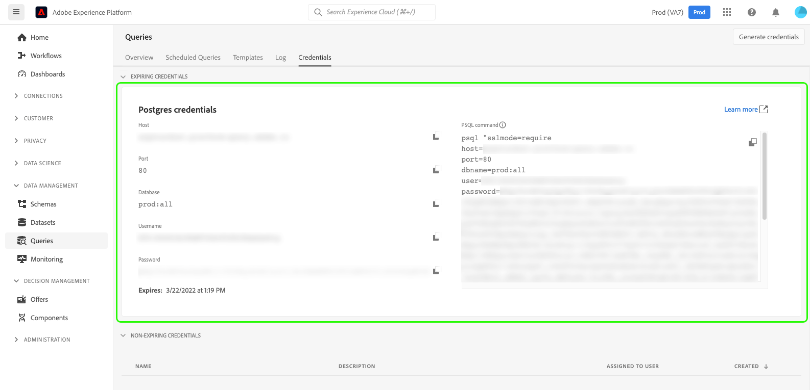

# Gerenciar dados da plataforma usando o [!DNL Python] e [!DNL SQLAlchemy]

Saiba como usar o SQLAlchemy para maior flexibilidade no gerenciamento de seus dados do Adobe Experience Platform. Para aqueles que não estão familiarizados com o SQL, o SQLAlchemy pode melhorar bastante o tempo de desenvolvimento ao trabalhar com bancos de dados relacionais. Este documento fornece instruções e exemplos para conexão [!DNL SQLAlchemy] para consultar o Serviço e começar a usar o Python para interagir com seus bancos de dados.

[!DNL SQLAlchemy] é um Mapeador Relacional de Objeto (ORM) e um [!DNL Python] biblioteca de códigos que pode transferir dados armazenados em um banco de dados SQL para [!DNL Python] objetos. Em seguida, você pode executar operações CRUD em dados mantidos no lago de dados da plataforma usando [!DNL Python] código. Isso remove a necessidade de gerenciar dados usando somente o PSQL.

## Introdução

Para adquirir as credenciais necessárias para conexão [!DNL SQLAlchemy] para o Experience Platform, você deve ter acesso ao espaço de trabalho Consultas na interface do usuário da plataforma. Entre em contato com o administrador da organização caso não tenha acesso ao espaço de trabalho de Consultas.

## [!DNL Query Service] credenciais {#credentials}

Para encontrar suas credenciais, faça logon na interface do usuário da plataforma e selecione **[!UICONTROL Queries]** no menu de navegação esquerdo, seguido por **[!UICONTROL Credenciais]**. Para obter instruções completas sobre como encontrar suas credenciais de logon, leia o [guia de credenciais](../ui/credentials.md).



Embora a porta 80 seja a porta recomendada para uma conexão com o Serviço de query, você também pode usar a porta 5432.

>[!IMPORTANT]
>
>Se você usar credenciais que expiram (como visto na imagem acima) para se conectar ao Serviço de query, a vida útil da sessão da sua conexão expirará após o período definido nas configurações da sua organização. Por padrão, esse período é de 24 horas. Consulte a documentação para saber como [conectar um cliente com credenciais que não estão expirando](../ui/credentials.md#non-expiring-credentials)ou como [altere a vida da sessão para suas credenciais que expiram](../ui/credentials.md#expiring-credentials).

Após ter acesso às suas credenciais de QS, abra o [!DNL Python] editor de escolha.

### Armazenar credenciais no [!DNL Python] {#store-credentials}

Em seu [!DNL Python] , importe o `urllib.parse.quote` e salve cada variável de credencial como um parâmetro. O `urllib.parse` O módulo fornece uma interface padrão para dividir cadeias de caracteres de URL em componentes. A função de aspas substitui caracteres especiais na string do URL para tornar os dados seguros para uso como componentes do URL. Um exemplo do código necessário é visto abaixo:

>[!TIP]
>
>Use [!DNL Python]aspas triplas para inserir a string de senha de várias linhas.

```python
from urllib.parse import quote

host = "<YOUR_HOST>"

port = "<YOUR_PORT>"

dbname = "<YOUR_DATABASE>"

user = "<YOUR_USERNAME>"

password = quote('''
<YOUR_PASSWORD>
''')
```

>[!NOTE]
>
>A senha que você fornece para se conectar [!DNL SQLAlchemy] para o Experience Platform expirará se você usar credenciais que estão expirando. Consulte a [seção credenciais](#credentials) para obter mais informações.

### Criar uma instância de mecanismo [#create-engine]

Após a criação das variáveis, importe o `create_engine` e criar uma sequência de caracteres para compilar e formatar suas credenciais do Serviço de query na SQLAlchemy. O `create_engine` é usada para criar uma instância do mecanismo.

>[!NOTE]
>
>`create_engine`retorna uma instância de um mecanismo. No entanto, ela não abre a conexão com o Serviço de query até que seja chamado um query que exija uma conexão.

O SSL deve ser habilitado ao acessar a Platform usando clientes de terceiros. Como parte do seu mecanismo, use o `connect_args` para inserir argumentos de palavra-chave adicionais. É recomendável definir o modo SSL como `require`. Consulte a [Documentação dos modos SSL](../clients/ssl-modes.md) para obter mais informações sobre valores aceitos.

O exemplo abaixo exibe a variável [!DNL Python] código necessário para inicializar um mecanismo e uma string de conexão.

```python
from sqlalchemy import create_engine

db_string = "postgresql://{user}:{password}@{host}:{port}/{dbname}".format(
    user=user,
    password=password,
    host=host,
    port = port,
    dbname = dbname
)

engine = create_engine(db_string, connect_args={'sslmode':'require'})
```

>[!NOTE]
>
>A senha que você fornece para se conectar [!DNL SQLAlchemy] para o Experience Platform expirará se você usar credenciais que estão expirando. Consulte a [seção credenciais](#credentials) para obter mais informações.

Agora você está pronto para consultar os dados da plataforma usando [!DNL Python]. O exemplo mostrado abaixo retorna uma matriz de nomes de tabela do Serviço de query.

```python
from sqlalchemy import inspect
insp = inspect(engine)
print(insp.get_table_names())
```
