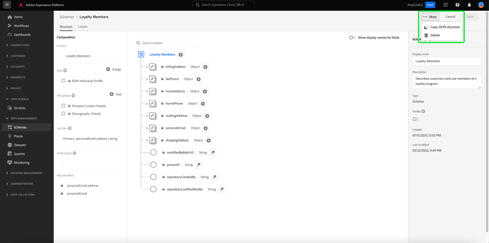

# Notas de versão da Adobe Experience Platform

**Data de lançamento: 28 de setembro de 2023**

Novos recursos na Adobe Experience Platform:

- [Atributos computados](#computed-attributes)

Atualizações dos recursos existentes no Experience Platform:

- [Alertas](#alerts)
- [Painéis](#dashboards)
- [Coleção de dados](#data-collection)
- [Governança de dados](#data-governance)
- [Higiene de dados](#hygiene)
- [Destinos](#destinations)
- [Experience Data Model (XDM)](#xdm)
- [Serviço de identidade](#identity-service)
- [Query Service](#query-service)
- [Serviço de segmentação](#segmentation)
- [Fontes](#sources)

## Atributos computados {#computed-attributes}

Os atributos computados permitem resumir facilmente os dados do evento em atributos de perfil por meio de uma interface intuitiva para segmentação, personalização e ativação avançadas com base em comportamento. Com esse recurso, você pode criar atributos computados de maneira automatizada, gerenciá-los e usá-los na segmentação, destinos do Real-Time CDP ou Adobe Journey Optimizer. Além disso, os atributos computados simplificam a segmentação e os fluxos de trabalho de jornada para ajudá-lo a fornecer experiências relevantes de maneira contínua. Para saber mais sobre atributos computados, leia a [visão geral sobre atributos computados](../../profile/computed-attributes/overview.md).

## Alertas {#alerts}

O Experience Platform permite assinar alertas baseados em eventos para várias atividades da Platform. Você pode assinar diferentes regras de alerta por meio da guia [!UICONTROL Alertas] na interface do usuário da Platform e pode optar por receber mensagens de alerta na própria interface ou por meio de notificações por email.

**Recursos novos ou atualizados**

| Recurso | Descrição |
| --- | --- |
| Guia Histórico de alertas | A guia Alertas [!UICONTROL Histórico] agora incluirá todos os eventos, incluindo atrasos, inicializações, sucesso e falhas. Leia a [documentação da interface do usuário de alertas](../../observability/alerts/ui.md) para obter mais informações sobre a guia histórico. |

{style="table-layout:auto"}

Para saber mais sobre alertas, leia a [[!DNL Observability Insights] visão geral](../../observability/home.md).

## Painéis {#dashboards}

A Adobe Experience Platform fornece vários [!DNL dashboards] através dos quais você pode exibir informações importantes sobre os dados da sua organização, conforme capturados durante os instantâneos diários.

| Recurso | Descrição |
| --- | --- |
| [Aprimoramento do painel de uso da licença](../../dashboards/guides/license-usage.md) | Mantenha o controle de seus contratos de licença com relatórios aprimorados e visualizações de métricas principais relacionadas ao uso de licença de sua organização. Essas melhorias fornecem um alto grau de granularidade sobre as métricas de uso de licença de todos os produtos da Experience Platform que você adquiriu. |

{style="table-layout:auto"}

Para saber mais sobre o painel de uso de licença, consulte a [visão geral do painel de uso de licença](../../dashboards/guides/destinations.md).

## Coleção de dados {#data-collection}

A Adobe Experience Platform fornece um conjunto de tecnologias que permitem coletar dados da experiência do cliente e enviá-los à Rede de borda da Adobe Experience Platform, onde eles podem ser enriquecidos, transformados e distribuídos para destinos da Adobe ou de outras empresas.

**Recursos novos ou atualizados**

| Tipo | Recurso | Descrição |
| --- | --- | --- |
| Sequência de dados | Suporte à pesquisa de dispositivo | Ao configurar um fluxo de dados, agora é possível selecionar o nível de informações de pesquisa de dispositivo a serem coletadas. As informações de pesquisa do dispositivo incluem dados sobre o dispositivo, hardware, sistema operacional e navegador usados para interagir com a página.   As informações de pesquisa do dispositivo não podem ser coletadas junto com o agente do usuário e as dicas do cliente. Optar por coletar informações do dispositivo desativará a coleta de agentes do usuário e dicas do cliente, e vice-versa. Todas as informações de pesquisa do dispositivo são armazenadas no grupo de campos `xdm:device`. Saiba mais na documentação sobre [configuração de sequências de dados](../../datastreams/configure.md#geolocation-device-lookup). |
| Extensões | Extensão de API de eventos da Web do [!DNL TikTok] | A extensão [[!DNL TikTok] API de Eventos da Web](https://exchange.adobe.com/apps/ec/109834/tiktok-web-events-api) permite aproveitar os dados capturados no Adobe Experience Platform Edge Network e enviá-los para [!DNL TikTok] na forma de eventos do lado do servidor usando a API de Eventos da Web [!DNL TikTok]. |

{style="table-layout:auto"}

Para saber mais sobre a coleta de dados, leia a [visão geral da coleta de dados](../../tags/home.md).

## Governança de dados {#data-governance}

A Governança de dados da Adobe Experience Platform é uma série de estratégias e tecnologias usadas para gerenciar dados de clientes e garantir a conformidade com regulamentos, restrições e políticas aplicáveis ao uso de dados. Ela desempenha uma função essencial na Experience Platform em vários níveis, incluindo catalogação, linhagem de dados, rotulagem de uso de dados, políticas de acesso de dados e controle de acesso a dados de ações de marketing.

**Novos recursos**

| Recurso | Descrição |
| --- | --- |
| Novos rótulos de ecossistema de parceiros para dados de terceiros | Novos rótulos de uso de dados para enriquecimento e prospecção de terceiros estão disponíveis. Consulte a [documentação sobre rótulos de ecossistema de parceiros](../../data-governance/labels/reference.md#partner) para obter mais informações. |

{style="table-layout:auto"}

Para saber mais sobre governança de dados, leia a [visão geral da governança de dados](../../data-governance/home.md).

## Higiene de dados {#hygiene}

O Experience Platform fornece um conjunto de recursos de higiene de dados que permitem gerenciar os dados armazenados por meio de exclusões programáticas de registros e conjuntos de dados do consumidor. Usando o espaço de trabalho [!UICONTROL Ciclo de vida dos dados] na interface ou por meio de chamadas para a API de higiene de dados, você pode gerenciar com eficiência seus armazenamentos de dados. Use esses recursos para garantir que as informações sejam usadas conforme esperado, sejam atualizadas quando dados incorretos precisarem de correção e sejam excluídas quando as políticas organizacionais considerarem necessário.

**Novos recursos**

| Recurso | Descrição |
| --- | --- |
| [!BADGE Exclusão de Registro do Beta]{type=Informative} (versão limitada) | Gerencie o ciclo de vida dos dados em todos os armazenamentos de dados para atender aos compromissos do cliente e aos contratos de licença com os recursos avançados de gerenciamento do ciclo de vida dos dados no Adobe Experience Platform: expiração automatizada do conjunto de dados e exclusão de registro. Com a expiração automatizada do conjunto de dados, você pode excluir conjuntos de dados inteiros e definir uma data e hora para o conjunto de dados ser excluído. A Exclusão de Registro permite que você exclua perfis de consumidores individuais direcionando suas identidades primárias. Você pode fornecer as identidades primárias individualmente por meio da interface do usuário ou por meio de upload de arquivo CSV/JSON. Consulte a [documentação de Exclusão de registros](../../hygiene/ui/record-delete.md) para obter mais informações |
| Expirações de conjuntos de dados | Minimize seus dados e mantenha o controle de seus contratos de licença com a Expiração automatizada do conjunto de dados. Reduza os volumes de dados excluindo conjuntos de dados inteiros e defina uma data e hora para o conjunto de dados ser excluído. Consulte a [documentação de expirações do conjunto de dados](../../hygiene/ui/dataset-expiration.md) para obter mais informações. |

{style="table-layout:auto"}

Para obter mais informações sobre os recursos de higiene de dados da Platform, consulte a [visão geral da higiene de dados](../../hygiene/home.md).

## Destinos {#destinations}

[!DNL Destinations] são integrações pré-construídas com plataformas de destino que permitem a ativação perfeita de dados da Adobe Experience Platform. É possível usar destinos para ativar seus dados conhecidos e desconhecidos para campanhas de marketing entre canais, campanhas de email, publicidade direcionada e muitos outros casos de uso.

**Destinos novos ou atualizados** {#new-updated-destinations}

| Destino | Novo ou atualizado | Descrição |
| ----------- |----------------|----------- |
| [[!DNL LiveRamp - Distribution]](../../destinations/catalog/advertising/liveramp-distribution.md) | Novo | Ative públicos integrados anteriormente no [!DNL LiveRamp] para editores premium em mídias para dispositivos móveis, Web, vídeo e TV conectada.   Depois de integrar os públicos-alvo à sua conta do [!DNL LiveRamp] por meio da conexão [LiveRamp - Integração](../../destinations/catalog/advertising/liveramp-onboarding.md), use a nova conexão [[!DNL LiveRamp - Distribution]](../../destinations/catalog/advertising/liveramp-distribution.md) para ativar os públicos-alvo para destinos downstream. |
| [[!DNL HubSpot]](../../destinations/catalog/crm/hubspot.md) | Novo | [[!DNL HubSpot]](https://www.hubspot.com) é uma plataforma de CRM com todos os softwares, integrações e recursos necessários para conectar marketing, vendas, gerenciamento de conteúdo e atendimento ao cliente. Ele permite conectar seus dados, equipes e clientes em uma plataforma de CRM. |
| [[!DNL Microsoft Dynamics 365]](../../destinations/catalog/crm/microsoft-dynamics-365.md) | Atualização dos pacotes | Adicionado suporte para [!DNL Dynamics 365] prefixos de campos personalizados para campos personalizados que não foram criados na solução padrão em [!DNL Dynamics 365]. Um novo campo de entrada, **[!UICONTROL Prefixo de Personalização]**, foi adicionado na etapa [Preencher detalhes de destino](#destination-details). |
| [[!DNL Experience Cloud Audiences]](../../destinations/catalog/adobe/experience-cloud-audiences.md) | Atualização dos pacotes | O destino do Experience Cloud Audiences agora está disponível para o público em geral. Use esse destino para ativar públicos do Real-Time CDP para o Audience Manager e o Adobe Analytics. Você precisa de uma licença do Audience Manager para enviar públicos-alvo para a Adobe Analytics. |

{style="table-layout:auto"}

<!-- 

Add these to release notes as they go out

| [[!DNL Qualtrics]] | New | Use the aggregation of multiple sources of operational data in Adobe Experience Platform as an input in Qualtrics Experience ID to better understand your customers and enable targeted outreach to close the gap when it comes to understanding intent, emotion and experience drivers. | 

-->

**Funcionalidades novas ou atualizadas** {#destinations-new-updated-functionality}

| Funcionalidade | Descrição |
| ----------- | ----------- |
| Exportações de dados no Real-Time CDP | A funcionalidade [exportação do conjunto de dados](../../destinations/ui/export-datasets.md) agora está disponível. Veja [quais conjuntos de dados você pode exportar com base no aplicativo Experience Platform](../../destinations/ui/export-datasets.md#datasets-to-export) que você comprou e verifique as [medidas de proteção para exportar conjuntos de dados](/help/destinations/guardrails.md#dataset-exports). |
| (Beta) Suporte para exportar objetos do tipo matriz | Exporte matrizes de valores primitivos (valores de string, int ou booleanos) como arquivos de esquema simples para destinos de armazenamento na nuvem. Leia mais sobre a funcionalidade na [documentação](../../destinations/ui/export-arrays-maps-objects.md). |
| Seletores de lista suspensa dinâmica no Destination SDK | Ao criar um destino por meio do Destination SDK, agora é possível usar [seletores de lista suspensa dinâmica](../../destinations/destination-sdk/functionality/destination-configuration/customer-data-fields.md#dynamic-dropdown-selectors) para preencher os campos de um seletor de lista suspensa com valores recuperados de uma API. |

**Correções e aprimoramentos** {#destinations-fixes-and-enhancements}

- Use a [transparência de monitoramento](../../dataflows/ui/monitor-destinations.md#dataflow-runs-for-streaming-destinations) agora disponível para destinos da empresa ([API HTTP](../../destinations/catalog/streaming/http-destination.md), [Amazon Kinesis](../../destinations/catalog/cloud-storage/amazon-kinesis.md) e [Hubs de Eventos do Azure](../../destinations/catalog/cloud-storage/azure-event-hubs.md)) no nível de execução do fluxo de dados para monitorar as métricas de ativação e o status na [exibição detalhada do fluxo de dados](../../dataflows/ui/monitor-destinations.md#dataflow-run-details-page), com informações adicionais por meio de códigos de erro e mensagens para solução de problemas.
- Ao atualizar o nome dos públicos mapeados para o [Google Ad Manager](../../destinations/catalog/advertising/google-ad-manager.md), o [Google Display &amp; Video 360](../../destinations/catalog/advertising/google-dv360.md) e outros destinos que usam os [modelos de atualização de público-alvo](../../destinations/destination-sdk/metadata-api/update-audience-template.md), essas alterações de nome serão refletidas downstream no destino.

Para obter informações mais gerais sobre destinos, consulte a [visão geral de destinos](../../destinations/home.md).

## Experience Data Model (XDM) {#xdm}

O XDM é uma especificação de código aberto que fornece estruturas e definições comuns (esquemas) para dados inseridos na Adobe Experience Platform. Ao aderir aos padrões do XDM, todos os dados de experiência do cliente podem ser incorporados em uma representação comum para fornecer insights de maneira mais rápida e integrada. Você pode obter insights valiosos sobre ações de clientes, definir públicos-alvo por meio de segmentos e usar atributos de clientes para fins de personalização.

**Novos recursos**

| Recurso | Descrição |
| --- | --- |
| Ações rápidas adicionadas ao Editor de esquemas | Novas ações rápidas foram adicionadas à tela do Editor de esquemas. Agora você pode copiar a estrutura JSON ou excluir o esquema diretamente do editor. {width="100" zoomable="yes"} |
| Filtrar recursos XDM por criador personalizado ou padrão | As listas de esquemas, grupos de campos, tipos de dados e classes disponíveis agora são pré-filtradas com base em seu método de criação. Isso permite filtrar recursos com base no fato de serem personalizados ou criados pela Adobe. {width="100" zoomable="yes"}   Consulte a [documentação sobre criação e edição de recursos](../../xdm/ui/resources/classes.md#filter.md) para obter mais informações. |

**Recursos atualizados**

| Recurso | Descrição |
| --- | --- |
| Fluxo de trabalho de criação de esquema atualizado | Um novo fluxo de trabalho de criação de esquema foi implementado para simplificar o processo.   {width="100" zoomable="yes"}   Consulte a [documentação sobre criação de esquemas](../../xdm/ui/resources/schemas.md#create) para obter mais informações. |

**Novos componentes do XDM**

| Tipo de componente | Nome | Descrição |
| --- | --- | --- |
| Tipo de dados | [[!UICONTROL Retornar]](https://github.com/adobe/xdm/pull/1773/files) | A RMA (Autorização para devolução de mercadoria) emitida. |
| Tipo de dados | [[!UICONTROL Retornar Item]](https://github.com/adobe/xdm/pull/1773/files) | As informações do item devolvido dentro da RMA (Autorização para devolução de produto). |

{style="table-layout:auto"}

**Componentes de XDM atualizados**

| Tipo de componente | Nome | Atualizar descrição |
| --- | --- | --- |
| Extensão | [!UICONTROL Campos de entidade do AJO] | O sinalizador [[!UICONTROL para multivariante]](https://github.com/adobe/xdm/pull/1774/files) foi adicionado aos [!UICONTROL Campos de Entidade do AJO] para identificar se a variante é multivariante ou não. |
| Tipo de dados | [!UICONTROL Item da lista de produtos] | [[!UICONTROL O Item de Retorno]](https://github.com/adobe/xdm/pull/1773/files) foi adicionado para incluir as informações de Autorização para Devolução de Mercadorias. |
| Tipo de dados | Pedido | [[!UICONTROL As Informações de Retorno]](https://github.com/adobe/xdm/pull/1773/files) foram adicionadas para incluir a RMA (Autorização de Retorno de Merchandise) emitida. |

{style="table-layout:auto"}

Para obter mais informações sobre o XDM na Platform, consulte a [Visão geral do sistema de XDM](../../xdm/home.md)

## Serviço de identidade {#identity-service}

O Serviço de identidade da Adobe Experience Platform fornece uma visão abrangente dos clientes e seu comportamento ao unir identidades entre dispositivos e sistemas, permitindo fornecer experiências digitais pessoais de impacto em tempo real.

**Recursos novos ou atualizados**

| Recurso | Descrição |
| --- | --- |
| Aprimoramentos na interface do usuário do serviço de identidade | Use a ferramenta aprimorada de criação de namespace personalizado na interface do usuário do Experience Platform para gerenciar melhor seus namespaces personalizados e seus tipos de identidade correspondentes. A interface aprimorada do serviço de identidade fornece: <ul><li>Experiência contextual: dicas visuais, clareza e contexto para o que é um namespace de identidade e os tipos de identidade.</li><li>Precisão: melhor tratamento de erros, sem mais nomes de identidade duplicados.</li><li>Capacidade de descoberta: acesso à documentação por meio de uma caixa de diálogo no produto.</li></ul> Para obter mais informações, leia o manual sobre [criação de namespaces personalizados](../../identity-service/features/namespaces.md#create-namespaces). |
| Alterações nos limites do gráfico de identidade | O limite do gráfico de identidade foi alterado de 150 identidades para 50 identidades. Quando uma nova identidade é assimilada em um gráfico completo, a identidade mais antiga com base no carimbo de data e hora de assimilação e no tipo de identidade é excluída. Os tipos de identidade de cookie são priorizados para exclusão. Entre em contato com a equipe de conta da Adobe para solicitar uma alteração no tipo de identidade se a sandbox de produção contiver: <ul><li>um namespace personalizado em que os identificadores de pessoa (como IDs de CRM) são configurados como tipo de identidade de cookie/dispositivo.</li><li>um namespace personalizado em que os identificadores de cookie/dispositivo são configurados como tipo de identidade entre dispositivos.</li></ul> A engenharia do Adobe processará manualmente essas solicitações. Para obter mais informações, leia as [medidas de proteção para dados do Serviço de Identidade](../../identity-service/guardrails.md) e o guia sobre [práticas recomendadas de direito de licença de gerenciamento de dados](../../landing/license-usage-and-guardrails/data-management-best-practices.md). |

{style="table-layout:auto"}

Para saber mais sobre o Serviço de identidade, leia a [visão geral do Serviço de identidade](../../identity-service/home.md).

## Query Service {#query-service}

O Query Service permite usar SQL padrão para consultar dados no [!DNL Data Lake] da Adobe Experience Platform. Você pode ingressar em qualquer conjunto de dados do [!DNL Data Lake] e capturar os resultados da consulta como um novo conjunto de dados para usar em relatórios, no Data Science Workspace ou para assimilação no Perfil do cliente em tempo real.

**Recursos atualizados**

| Recurso | Descrição |
| --- | --- |
| Atualizações da interface do usuário de filtragem de log | A filtragem aprimorada do log de consulta melhora a visibilidade de logs gerados pelo usuário para monitoramento, administração e solução de problemas. Você pode filtrar a lista de logs de consulta com base em várias configurações.   {width="100" zoomable="yes"}   Consulte a [documentação dos logs de consulta](../../query-service/ui/query-logs.md#filter-logs) para obter mais informações. |
| Várias atualizações da interface do Editor de consultas | Agora é possível Executar várias consultas sequenciais no Editor de consultas ou gravar mais de uma consulta e executar todas as consultas de maneira sequencial. Para adicionar mais flexibilidade à execução da consulta, é possível realçar a consulta escolhida e selecionar essa consulta específica para ser executada independentemente das outras. Consulte o [Guia da Interface do Usuário do Editor de Consultas](../../query-service/ui/user-guide.md#execute-multiple-sequential-queries) para obter mais informações. |

{style="table-layout:auto"}

Para obter mais informações sobre o Query Service, acesse a [Visão geral do Query Service](../../query-service/home.md).

## Serviço de segmentação {#segmentation}

O [!DNL Segmentation Service] permite segmentar dados relacionados a indivíduos (como clientes, prospectos, usuários ou organizações) que estão armazenados na [!DNL Experience Platform] em públicos-alvo. Você pode criar públicos-alvo por meio de definições de segmento ou outras fontes a partir dos dados do [!DNL Real-Time Customer Profile]. Esses públicos-alvo são configurados e mantidos de forma centralizada na [!DNL Platform] e podem ser acessados a qualquer momento usando as soluções da Adobe.

**Recursos novos ou atualizados**

| Recurso | Descrição |
| ------- | ----------- |
| Colunas personalizáveis | Agora é possível personalizar o layout do Audience Portal com colunas redimensionáveis. Para obter mais informações sobre esse recurso, leia a [Visão geral do Portal de público-alvo](../../segmentation/ui/audience-portal.md#customize). |
| Atualizar detalhamento de frequência | Agora você pode ver um detalhamento das frequências de atualização dos públicos-alvo em sua organização. Para obter mais informações sobre este recurso, leia o [guia da interface de segmentação](../../segmentation/ui/overview.md#browse). |

Para saber mais sobre o Serviço de segmentação, leia a [Visão geral do serviço de segmentação](../../segmentation/home.md).

## Origens {#sources}

A Experience Platform fornece uma API RESTful e uma interface interativa que permite configurar conexões de origem para vários provedores de dados com facilidade. Essas conexões de origem permitem autenticar e conectar a sistemas de armazenamento externos e serviços de CRM, definir períodos para execuções de assimilação e gerenciar a taxa de transferência de assimilação de dados.

**Recursos novos ou atualizados**

| Recurso | Descrição |
| --- | --- |
| Novos parâmetros para paginação de `offset` em fontes de autoatendimento (SDK em lote) | Agora você pode especificar um `endConditionName` e `endConditionValue` para sua origem ao usar a paginação `offset`. Esses parâmetros permitem indicar a condição que encerrará o loop de paginação na próxima solicitação HTTP. Para obter mais informações, leia o [guia de paginação para Fontes de Autoatendimento (SDK em Lote)](../../sources/sources-sdk/config/sourcespec.md#pagination). |

{style="table-layout:auto"}

Para saber mais sobre fontes, leia a [visão geral das fontes](../../sources/home.md).
