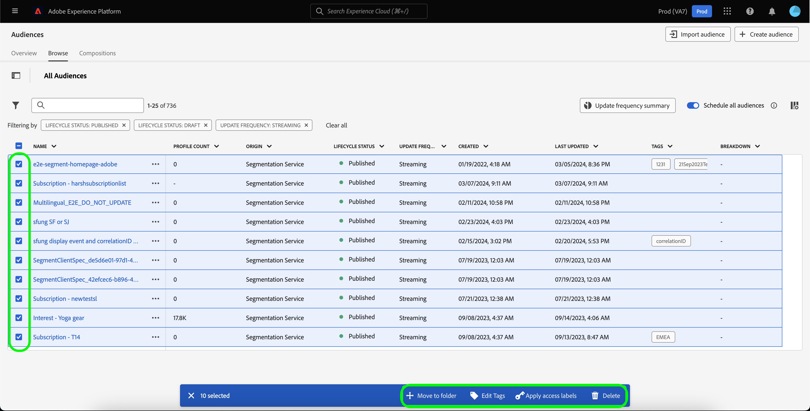

# Notas de versão da Adobe Experience Platform

**Data de lançamento: quarta-feira, 19 de março de 2024**

>[!TIP]
>
>Use o [glossário do Adobe Experience Platform](/help/landing/glossary.md) para se familiarizar com a terminologia usada no Real-Time Customer Data Platform e no Adobe Experience Platform. Se você não conseguir encontrar um termo específico que esteja procurando, use as opções de feedback na página para solicitar que novos termos sejam adicionados ao glossário.

Atualizações dos recursos existentes no Experience Platform:

- [Serviço de catálogo](#catalog-service)
- [Coleção de dados](#data-collection)
- [Preparação de dados](#data-prep)
- [Destinos](#destinations)
- [Experience Data Model (XDM)](#xdm)
- [Serviço de segmentação](#segmentation)
- [Origens](#sources)

## Serviço de catálogo {#catalog-service}

O Serviço de catálogo é o sistema de registro para localização e linhagem de dados na Adobe Experience Platform. Embora todos os dados assimilados na Experience Platform sejam armazenados no data lake como arquivos e diretórios, o Catálogo retém os metadados e a descrição desses arquivos e diretórios para fins de pesquisa e monitoramento.

| Recurso | Descrição |
| --- | --- |
| Mais ações | Para tornar as operações mais flexíveis e ajudar a gerenciar seus dados, agora é possível usar o recurso &quot;Mais ações&quot; na exibição de detalhes para executar tarefas adicionais em um conjunto de dados. Você pode excluir o conjunto de dados ou habilitá-lo para uso com o Perfil de cliente em tempo real na página de detalhes de um conjunto de dados escolhido. **Observação:** se você habilitar um conjunto de dados para assimilação de Perfil, o esquema do conjunto de dados deverá ser compatível com o Perfil de Cliente em Tempo Real. ![O espaço de trabalho dos Conjuntos de Dados com o [!UICONTROL ... Menu suspenso Mais] realçado.](../2024/assets/march/more-actions.png "O espaço de trabalho Conjuntos de Dados com o menu suspenso Mais realçado."){width="100" zoomable="yes"}. Leia a documentação do [guia do usuário dos conjuntos de dados](../../catalog/datasets/user-guide.md) para obter mais informações. |

{style="table-layout:auto"}

Para obter mais informações sobre o serviço de catálogo, consulte a [visão geral do serviço de catálogo](../../catalog/home.md).

## Preparação de dados {#data-prep}

A preparação de dados permite que os engenheiros de dados mapeiem, transformem e validem dados de e para o Experience Data Model (XDM).

**Recursos novos ou atualizados**

| Recurso | Descrição |
| --- | --- |
| Novas funções de mapeador para o Adobe Analytics | Agora você pode usar as seguintes funções para extrair dados do evento do Adobe Analytics: <ul><li>`aa_get_event_id`</li><li>`aa_get_event_value`</li><li>`aa_get_product_categories`</li><li>`aa_get_product_names`</li><li>`aa_get_product_quantities`</li><li>`aa_get_product_prices`</li><li>`aa_get_product_event_values`</li><li>`aa_get_product_evars`</li></ul> Para obter mais informações sobre essas funções, leia o [Guia de funções de Preparo de Dados](../../data-prep/functions.md#analytics-functions) |

{style="table-layout:auto"}

Para obter mais informações sobre Preparo de Dados, leia a [Visão geral do Preparo de Dados](../../data-prep/home.md).

## Coleção de dados {#data-collection}

A Adobe Experience Platform fornece um conjunto de tecnologias que permitem coletar dados da experiência do cliente e enviá-los à Rede de borda da Adobe Experience Platform, onde eles podem ser enriquecidos, transformados e distribuídos para destinos da Adobe ou de outras empresas.

**Novos recursos**

| Tipo | Recurso | Descrição |
| --- | --- | --- |
| Extensões | Extensão de tag [!DNL Merkury] | A [[!DNL Merkury] extensão de tag](https://exchange.adobe.com/apps/ec/600027/merkury-tag) fornece taxas de correspondência líderes do setor para visitantes anônimos de sites com uma ID [!DNL Merkury]. As marcas podem aproveitar o potencial da tag [!DNL Merkury] e do Adobe para fornecer experiências personalizadas de site em tempo real. Além disso, a tag [!DNL Merkury] permite o crescimento de dados digitais primários juntamente com perfis de clientes online e offline conectados. |

{style="table-layout:auto"}

Para saber mais sobre a coleta de dados, leia a [visão geral da coleta de dados](../../tags/home.md).

## Destinos {#destinations}

[!DNL Destinations] são integrações pré-construídas com plataformas de destino que permitem a ativação perfeita de dados da Adobe Experience Platform. É possível usar destinos para ativar seus dados conhecidos e desconhecidos para campanhas de marketing entre canais, campanhas de email, publicidade direcionada e muitos outros casos de uso.

**Destinos novos e atualizados** {#new-updated-destinations}

| Destino | Tipo | Descrição |
| ----------- | --------- | ----------- |
| [(Beta) Conexão de aprimoramento de dados da Acxiom](../../destinations/catalog/data-partner/acxiom-data-enhancement.md) | Novo | Use esse conector para ativar perfis primários da Real-Time CDP para a Acxiom para enriquecimento de dados e uso em canais de marketing. Em seguida, você pode usar a origem Acxiom para importar os perfis com dados aprimorados e trabalhar com eles no Real-Time CDP. |
| [(Beta) Conexão de Supressão de Cliente Potencial da Acxiom](../../destinations/catalog/data-partner/acxiom-prospect-suppression.md) | Novo | Exporte seus públicos-alvo primários para o destino da Acxiom, para permitir que a Acxiom suprima clientes conhecidos ou convertidos. Em seguida, use o conector de origem [Acxiom prospecting data import](../../sources/connectors/data-partners/acxiom-prospecting-data-import.md) para assimilar e ativar listas de clientes potenciais da Acxiom, com seus clientes conhecidos ou convertidos removidos. |
| [Conexão com o Amazon Ads](../../destinations/catalog/advertising/amazon-ads.md) | Atualização | Ao exportar dados para o destino do Amazon Ads, agora é possível roteá-los para o Amazon DSP ou para o Amazon Marketing Cloud (novo). |
| [Conexão de integração do LiveRamp](../../destinations/catalog/advertising/liveramp-onboarding.md) | Atualização | O destino de integração do LiveRamp agora tem suporte para entregas em instâncias [!DNL LiveRamp] [!DNL SFTP] da Europa e Austrália. O tamanho máximo de arquivo exportado também foi aumentado para 10 milhões de linhas (de 5 milhões, anteriormente). |

{style="table-layout:auto"}

<!--

**New or updated functionality** {#destinations-new-updated-functionality}

-->

Para obter informações mais gerais sobre destinos, consulte a [visão geral de destinos](../../destinations/home.md).

## Experience Data Model (XDM) {#xdm}

O XDM é uma especificação de código aberto que fornece estruturas e definições comuns (esquemas) para dados inseridos na Adobe Experience Platform. Ao aderir aos padrões do XDM, todos os dados de experiência do cliente podem ser incorporados em uma representação comum para fornecer insights de maneira mais rápida e integrada. Você pode obter insights valiosos sobre ações de clientes, definir públicos-alvo por meio de segmentos e usar atributos de clientes para fins de personalização.

**Novos recursos**

| Recurso | Descrição |
| --- | --- |
| Suporte a tipo de dados de mapa da interface do usuário do Experience Platform | Personalize ainda mais sua estrutura de dados do Experience Data Model (XDM) definindo campos de mapa na interface do Experience Platform. Agora é possível criar campos de mapa no Editor de esquemas para modelar estruturas de dados flexíveis ou armazenar pares de valores-chave com eficiência. Selecione &quot;Mapear&quot; na lista suspensa Tipo ao definir um novo campo para configurar subcampos e atribuí-los a grupos de campos. Os tipos de valor de mapa compatíveis são string e integer. {width="100" zoomable="yes"}  Para saber como [definir campos de mapa na interface](../../xdm/ui/fields/map.md), consulte o manual da interface. |

{style="table-layout:auto"}

Para obter mais informações sobre o XDM no Experience Platform, consulte a [visão geral do sistema XDM](../../xdm/home.md).

## Serviço de segmentação {#segmentation}

O [!DNL Segmentation Service] permite segmentar dados relacionados a indivíduos (como clientes, prospectos, usuários ou organizações) que estão armazenados na [!DNL Experience Platform] em públicos-alvo. Você pode criar públicos-alvo por meio de definições de segmento ou outras fontes a partir dos dados do [!DNL Real-Time Customer Profile]. Esses públicos-alvo são configurados e mantidos de forma centralizada na [!DNL Experience Platform] e podem ser acessados a qualquer momento usando as soluções da Adobe.

**Novo recurso**

| Recurso | Descrição |
| ------- | ----------- |
| Ações em massa | O inventário de público-alvo agora é compatível com ações em massa. Usando ações em massa, você pode selecionar rapidamente vários públicos-alvo para movê-los para uma pasta, aplicar tags, aplicar rótulos de acesso ou excluir.   {width="100" zoomable="yes"}  Para obter mais informações sobre este recurso, leia a [Visão geral do Portal de Público](../../segmentation/ui/audience-portal.md#bulk-actions). |

{style="table-layout:auto"}

Para saber mais sobre o Serviço de segmentação, leia a [Visão geral do serviço de segmentação](../../segmentation/home.md).

## Origens {#sources}

A Experience Platform fornece uma API RESTful e uma interface interativa que permite configurar conexões de origem para vários provedores de dados com facilidade. Essas conexões de origem permitem autenticar e conectar a sistemas de armazenamento externos e serviços de CRM, definir períodos para execuções de assimilação e gerenciar a taxa de transferência de assimilação de dados.

**Fontes novas e atualizadas**

| Recurso | Tipo | Descrição |
| --- | --- | --- |
| [!BADGE Beta]{type=Informative} [!DNL Acxiom Data Ingestion] | Novo | Use a [[!DNL Acxiom Data Ingestion] origem](../../sources/tutorials/ui/create/data-partners/acxiom-data-ingestion.md) para assimilar dados de [!DNL Acxiom] na Real-Time Customer Data Platform e enriquecer perfis próprios. Em seguida, você pode usar seus perfis primários enriquecidos com [!DNL Acxiom] para melhorar os públicos e ativar em canais de marketing.   {width="100" zoomable="yes"}   Leia a [[!DNL Acxiom Data Ingestion] visão geral](../../sources/connectors/data-partners/acxiom-data-ingestion.md) para obter informações sobre como começar. |
| [!BADGE Beta]{type=Informative} [!DNL Stripe] | Novo | Use a [[!DNL Stripe] origem](../../sources/connectors/payments/stripe.md) para assimilar dados capturados durante o fluxo de compra pelos seus clientes na Experience Platform. Depois de assimilados, você pode usar esses dados para criar ofertas personalizadas e desbloquear insights de negócios mais avançados.   {width="100" zoomable="yes"}   Leia a [[!DNL Stripe] visão geral](../../sources/connectors/payments/stripe.md) para obter informações sobre como começar. |
| Suporte à interface do usuário para [!DNL Snowflake Streaming] | Novo | Agora você pode usar a [[!DNL Snowflake Streaming] origem](../../sources/tutorials/ui/create/databases/snowflake-streaming.md) na interface do usuário do Experience Platform para transmitir dados do banco de dados [!DNL Snowflake].   {width="100" zoomable="yes"}   Leia a [[!DNL Snowflake Streaming] visão geral](../../sources/connectors/databases/snowflake-streaming.md) para obter informações sobre como começar. |

{style="table-layout:auto"}

Para obter mais informações sobre fontes, leia a [visão geral das fontes](../../sources/home.md).
