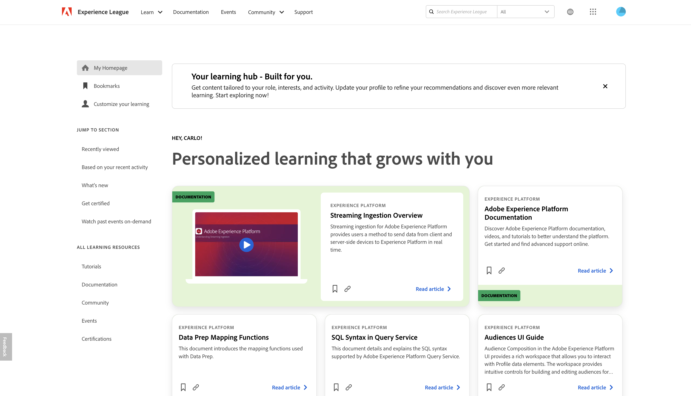

# Notas de versão da Adobe Experience Platform

>[!TIP]
>
>Consulte a documentação a seguir para obter as notas de versão de outros aplicativos da Adobe Experience Platform:
>
>- [Adobe Journey Optimizer](https://experienceleague.adobe.com/pt-br/docs/journey-optimizer/using/whats-new/release-notes)
>- [Adobe Journey Optimizer B2B](https://experienceleague.adobe.com/pt-br/docs/journey-optimizer-b2b/user/release-notes)
>- [Customer Journey Analytics](https://experienceleague.adobe.com/pt-br/docs/analytics-platform/using/releases/latest?lang=pt-BR)
>- [Real-Time CDP Collaboration](https://experienceleague.adobe.com/pt-br/docs/real-time-cdp-collaboration/using/latest)

**Data de lançamento: quarta-feira, 29 de abril de 2025**

Atualizações dos recursos e da documentação existentes no Adobe Experience Platform:

- [Experience League](#experience-league)
- [Coleção de dados](#data-collection)
- [Destinos](#destinations)
- [Experience Data Model](#xdm)
- [Serviço de identidade](#identity)
- [Query Service](#query-service)
- [Sandboxes](#sandboxes)
- [Origens](#sources)
- [Manuais de casos de uso &#x200B;](#use-case-playbooks)

## Experience League {#experience-league}

O Experience League é uma plataforma de aprendizado abrangente, projetada para ajudá-lo a aprimorar suas habilidades com os produtos Adobe. Ele oferece uma variedade de recursos, incluindo: cursos, documentação, páginas da comunidade, eventos e acesso a certificações.

| Recurso | Descrição |
| --- | --- |
| Página inicial personalizada | Acesse e personalize sua página inicial personalizada no [Experience League](https://experienceleague.adobe.com/pt-br/home#). Entre com suas credenciais do Adobe e selecione **[!UICONTROL Experience League]** no menu superior para começar a otimizar sua experiência de aprendizado: <ul><li>**Marcadores**: use o recurso [!UICONTROL Marcadores] para salvar e coletar seus recursos favoritos em um único local. Você pode salvar uma variedade de conteúdo, incluindo listas de reprodução, artigos e tutoriais.</li><li>**Personalize seu aprendizado**: melhore sua experiência de aprendizado atualizando seu perfil do Experience League com as funções, os setores, os produtos e o nível de experiência que melhor atendem às suas necessidades.</li><li>**Recomendações**: exibir conteúdo de aprendizado recomendado com base em sua atividade recente.</li><li>**Visualizado recentemente**: use a seção [!UICONTROL Visualizado recentemente] para voltar rapidamente para conteúdo visualizado recentemente, como documentação e vídeos.</li><li>**Recursos de aprendizado**: use o painel [!UICONTROL Todos os recursos de aprendizado] para navegar até tutoriais, documentação, comunidade, eventos e certificações.</li><li>**Novidades**: veja a seção [!UICONTROL Novidades] para obter um fluxo do conteúdo mais recente no Experience League.</li><li>**Assista a eventos anteriores sob demanda**: assista a fluxos ao vivo previamente gravados em holofotes de produtos, casos de uso e tutoriais com a [!UICONTROL seção Assista a eventos anteriores sob demanda].</li></ul>  {width="250" align="center" zoomable="yes"} |

{style="table-layout:auto"}

## Coleção de dados {#data-collection}

A Adobe Experience Platform fornece um conjunto de tecnologias que permitem coletar dados da experiência do cliente e enviá-los à Rede de borda da Adobe Experience Platform, onde eles podem ser enriquecidos, transformados e distribuídos para destinos da Adobe ou de outras empresas.

**Recursos novos ou atualizados**

| Recurso | Descrição |
| --- | --- |
| Extensão do [!DNL Adform] | A extensão do lado do servidor do [!DNL Adform] permite que as marcas redirecionem facilmente os públicos-alvo para fora do site usando ECIDs. Essa extensão do lado do servidor não depende de cookies de terceiros ou IDs alternativas de cookies. Além disso, como isso é feito totalmente no lado do servidor, não são necessários pixels adicionais ou outras alterações no lado do cliente. Para obter mais informações, consulte a [Visão geral da extensão do Adform](/help/tags/extensions/server/adform/overview.md). |
| Extensão de API de eventos da Web do [!DNL Amazon] | A extensão de API de Conversões do [!DNL Amazon] permite que os anunciantes compartilhem interações de site diretamente com o [!DNL Amazon], fornecendo atribuição aprimorada, confiabilidade de dados e otimização de campanha. Essa extensão é compatível com o encaminhamento de eventos, permitindo enviar eventos de conversão, como compras, adições ao carrinho e muito mais, garantindo a desduplicação adequada para relatórios precisos. Para obter mais informações, consulte a [visão geral da extensão do Amazon](/help/tags/extensions/server/amazon/overview.md). |

{style="table-layout:auto"}

## Destinos {#destinations}

[!DNL Destinations] são integrações pré-construídas com plataformas de destino que permitem a ativação perfeita de dados da Adobe Experience Platform. É possível usar destinos para ativar seus dados conhecidos e desconhecidos para campanhas de marketing entre canais, campanhas de email, publicidade direcionada e muitos outros casos de uso.

**Destinos novos ou atualizados** {#new-updated-destinations}

| Destino | Descrição |
| --- | --- |
| [Sincronização de pessoas do Marketo Engage](/help/destinations/catalog/adobe/marketo-engage-person-sync.md) | A Adobe atualizou o destino [!DNL Marketo Engage Person Sync] para corrigir um problema que afetava os clientes quando vários emails estavam presentes no mapa de identidade. |
| [(V2) Conexão de público-alvo em tempo real do Pega CDH](/help/destinations/catalog/personalization/pega-v2.md) | Use o destino [!DNL (V2) Pega Customer Decision Hub Realtime Audience] no Adobe Experience Platform para enviar atributos de perfil e dados de associação de público-alvo para o Pega Customer Decision Hub para a próxima ação, quando você tiver vários aplicativos do Pega Customer Decision Hub configurados em sua conta do Pega. |

**Funcionalidade nova ou atualizada** {#destinations-new-updated-functionality}

| Recurso | Descrição |
| --- | --- |
| Opções de agendamento de **semanalmente** e **mensalmente** para exportações completas de arquivos | Agora é possível agendar exportações completas de arquivos para pessoas e públicos-alvo potenciais semanal ou mensalmente ao ativar para destinos baseados em arquivos do armazenamento na nuvem. [Leia mais](/help/destinations/ui/activate-batch-profile-destinations.md#export-full-files) sobre opções de agendamento. |

{style="table-layout:auto"}

**Correções, melhorias e outros anúncios** {#destinations-fixes-and-enhancements}

- **Imposição de datas de término da exportação do conjunto de dados atrasada para 1º de setembro de 2025**\
  Como parte da [versão de setembro de 2024](/help/release-notes/2024/september-2024.md#destinations-new-updated-functionality), a Adobe definiu uma data de término padrão para 1 de maio de 2025, para qualquer fluxo de dados de exportação de conjunto de dados criado *antes dessa versão*. A Adobe está estendendo este prazo de imposição para **1 de setembro de 2025** para fornecer aos clientes tempo adicional para atualizar suas agendas. Consulte a seção de agendamento do [tutorial sobre exportação de conjuntos de dados](../../destinations/ui/export-datasets.md#schedule-dataset-export) para obter informações sobre como editar a data de término de um fluxo de dados de exportação do conjunto de dados.

- **Manuseio de transferências SFTP com falha para integração com o LiveRamp** aprimorado\
  A Adobe implementou uma correção para um problema que afeta as exportações de arquivos para o destino [Integração do LiveRamp](/help/destinations/catalog/advertising/liveramp-onboarding.md) via SFTP. Ocasionalmente, as transferências de arquivos falhavam devido a problemas temporários no lado do servidor e os arquivos temporários de tentativas falhas permaneciam no servidor. Esses arquivos não excluíveis bloquearam as tentativas subsequentes, pois o Adobe não tinha permissão para substituí-los.\
  Com a correção, se uma nova tentativa não puder excluir o arquivo temporário, o Adobe gerará um novo arquivo com um sufixo anexado, `attempt2`, para garantir que a nova tentativa seja concluída com êxito.

## Experience Data Model (XDM) {#xdm}

O XDM é uma especificação de código aberto que fornece estruturas e definições comuns (esquemas) para dados inseridos na Adobe Experience Platform. Ao aderir aos padrões do XDM, todos os dados de experiência do cliente podem ser incorporados em uma representação comum para fornecer insights de maneira mais rápida e integrada. Você pode obter insights valiosos sobre ações de clientes, definir públicos-alvo por meio de segmentos e usar atributos de clientes para fins de personalização.

**Componentes de XDM atualizados**

| Recurso | Descrição |
| --- | --- |
| Os campos de sequência de caracteres recebem um valor mínimo de um | Por padrão, os novos campos de sequência recebem um comprimento mínimo de um. Valores nulos para campos não obrigatórios ainda são aceitáveis. Para obter mais informações sobre práticas recomendadas, leia o manual sobre [práticas recomendadas para modelagem de dados](../../xdm/schema/best-practices.md#data-integrity-tips) |

{style="table-layout:auto"}

Para obter mais informações sobre o XDM no Experience Platform, consulte a [visão geral do sistema XDM](../../xdm/home.md).

## Serviço de identidade {#identity}

Use o Serviço de identidade da Adobe Experience Platform para criar uma visão abrangente dos clientes e seus comportamentos pela união de identidades entre dispositivos e sistemas, permitindo fornecer experiências digitais pessoais e impactantes em tempo real.

**Recursos atualizados**

| Recurso | Descrição |
| --- | --- |
| [!BADGE Disponibilidade Limitada]{type=Informative} [!DNL Identity Graph Linking Rules] | As Regras de vinculação do gráfico de identidade agora podem ser acessadas por todos os clientes em sandboxes de desenvolvimento. <ul><li>**Requisitos de ativação**: o recurso permanecerá inativo até que você configure e salve o [!DNL Identity Settings]. Sem essa configuração, o sistema continuará funcionando normalmente, sem alterações no comportamento.</li><li>**Observações importantes**: durante esta fase de Disponibilidade limitada, a segmentação do Edge pode produzir resultados inesperados de associação de segmento. No entanto, o streaming e a segmentação em lote funcionarão conforme esperado.</li><li>**Próximas etapas**: para obter informações sobre como habilitar este recurso em sandboxes de produção, contate a equipe de conta da Adobe.</li></ul> |

{style="table-layout:auto"}

Para obter mais informações, leia a [[!DNL Identity Graph Linking Rules] documentação](../../identity-service/identity-graph-linking-rules/overview.md).

## Query Service {#query-service}

Consultar dados no data lake da Adobe Experience Platform usando SQL padrão com Serviço de consulta. Combine conjuntos de dados facilmente e gere novos a partir dos resultados da consulta para potencializar os relatórios, ativar fluxos de trabalho de ciência de dados ou facilitar a assimilação no Perfil do cliente em tempo real. Por exemplo, você pode mesclar dados de transações de clientes com dados comportamentais para identificar públicos-alvo de alto valor para campanhas de marketing direcionadas.

**Recursos atualizados**

| Recurso | Descrição |
| --- | --- |
| Substituição de público-alvo do SQL | Atualize a associação de público-alvo substituindo os perfis existentes pelos resultados de uma nova consulta SQL. Isso permite gerenciar públicos dinâmicos com mais eficiência, removendo registros desatualizados e inserindo os atualizados em uma única operação. Para obter mais informações, consulte o [guia de extensão de público do SQL](../../query-service/data-distiller-audiences/overview.md#replace-audience). |
| Baixar e copiar resultados da consulta | [Baixe os resultados da consulta diretamente do Editor de Consultas](../../query-service/ui/overview.md#download-query-results) como arquivos CSV, XLSX ou JSON, ou [copie os resultados para a área de transferência](../../query-service/ui/overview.md#copy-results) como valores separados por vírgula (CSV) para uso rápido em aplicativos de planilha, como o Excel. Esses aprimoramentos simplificam a análise offline, os relatórios e os fluxos de trabalho de validação de dados. |
| Exibir Resultados da Consulta em Tela Inteira | [A consulta de visualização resulta em uma caixa de diálogo de tela inteira](../../query-service/ui/overview.md#view-results) para melhorar a legibilidade, verificar facilmente grandes conjuntos de dados e selecionar linhas para cópia. A visualização em tela cheia fornece um layout de grade redimensionável, ajudando a revisar tabelas amplas e saídas detalhadas com mais eficiência. |
| Seleção de Coluna Aprimorada na Previsão do Modelo | Selecione colunas específicas e aplique aliases usando a sintaxe `model_predict` estendida. Recupere resultados de previsão intermediários, como vetores de recursos e pontuações de probabilidade. A seleção aprimorada requer a ativação de um sinalizador de recurso. Consulte [Documentação do ciclo de vida do modelo](../../query-service/advanced-statistics/models.md#select-specific-output-fields) para ver exemplos de sintaxe e detalhes do sinalizador de recurso. |
| Salvar saídas de previsão do modelo usando CREATE TABLE e INSERT INTO | [Salvar saídas de previsão selecionadas em novas tabelas usando CREATE TABLE AS SELECT ou inserir em tabelas existentes usando INSERT INTO SELECT](../../query-service/advanced-statistics/models.md#predict). Se a seleção de coluna aprimorada estiver ativada, resultados intermediários, como vetores de recursos e probabilidades, também poderão ser mantidos junto com as previsões finais. Para obter exemplos de uso, consulte a [documentação sobre sintaxe SQL](../../query-service/sql/syntax.md#create-table-as-select). |

Para obter mais informações sobre [!DNL Query Service], consulte a [[!DNL Query Service] visão geral](../../query-service/home.md).

## Sandboxes {#sandboxes}

O Adobe Experience Platform foi criado para enriquecer aplicativos de experiência digital em escala global. As empresas geralmente executam vários aplicativos de experiência digital em paralelo e precisam atender ao desenvolvimento, ao teste e à implantação desses aplicativos enquanto garantem a conformidade operacional. Para atender a essa necessidade, a Experience Platform fornece sandboxes que particionam uma única instância do Experience Platform em ambientes virtuais separados para ajudar a desenvolver aplicativos de experiência digital.

**Recursos novos ou atualizados**

| Recurso | Descrição |
| --- | --- |
| Expansão de suporte para plug-in de ferramentas de sandbox | As ações personalizadas agora podem ser copiadas como um objeto dependente ao duplicar objetos do Jornada nas ferramentas da sandbox. Além disso, é possível selecionar ações existentes para reutilizar na sandbox de destino. Eles também podem ser adicionados a um pacote independentemente. Para obter informações completas sobre objetos Adobe Journey Optimizer compatíveis, leia o guia [ferramentas de sandbox](../../sandboxes/ui/sandbox-tooling.md#adobe-journey-optimizer-objects). |

{style="table-layout:auto"}

Para obter mais informações sobre sandboxes, leia a [visão geral das sandboxes](../../sandboxes/home.md).

## Origens {#sources}

A Experience Platform fornece uma API RESTful e uma interface interativa que permite configurar conexões de origem para vários provedores de dados com facilidade. Essas conexões de origem permitem autenticar e conectar a sistemas de armazenamento externos e serviços de CRM, definir períodos para execuções de ingestão e gerenciar a taxa de transferência de ingestão de dados.

Use fontes na Experience Platform para assimilar dados de um aplicativo da Adobe ou de uma fonte de dados de terceiros.

**Novas fontes**

| Recurso | Descrição |
| --- | --- |
| [!BADGE Beta]{type=Informative} [!DNL Algolia User Profiles] | A origem [[!DNL Algolia User Profiles]](../../sources/connectors/data-partners/algolia-user-profiles.md) agora está disponível. Use esta fonte para trazer seus dados de afinidades de perfis de usuário do [!DNL Algolia] para a Experience Platform. Você pode usar esses dados para melhorar o engajamento do usuário, as taxas de conversão e a experiência geral do cliente, fornecendo soluções de pesquisa de alto desempenho para sites, plataformas de comércio eletrônico e aplicativos. Para obter mais informações, leia o manual sobre como [assimilar [!DNL Algolia User Profiles] dados para a Experience Platform](../../sources/tutorials/ui/create/data-partners/algolia-user-profiles.md). |
| Suporte à API do [!BADGE Beta]{type=Informative} para [!DNL Azure Databricks] | A origem [!DNL Azure Databricks] agora está disponível na API. Use a API do [!DNL Flow Service] para conectar sua conta do [!DNL Databricks] e trazer seus dados do [!DNL Databricks] para a Experience Platform. Para obter mais informações, leia a documentação sobre [[!DNL Azure Databricks]](../../sources/connectors/databases/databricks.md). |

{style="table-layout:auto"}

**Recursos atualizados**

| Recurso | Descrição |
| --- | --- |
| Atualização de campos XDM para assimilação de dados de mídia de transmissão na Experience Platform. | O novo grupo de campos XDM, `mediaReporting`, agora está disponível para assimilar dados de mídia de streaming na Experience Platform por meio da fonte do Adobe Analytics. Este campo substitui o campo `media.mediaTimed`.   Durante um período de transição de três meses, a assimilação de dados em `media.mediaTimed` campos continuará. No entanto, no final de julho de 2025, os campos `media.mediaTimed` serão totalmente descontinuados e não estarão mais visíveis na interface do esquema do Experience Platform, e os dados serão enviados usando apenas os campos `mediaReporting`.  Se você implementou a fonte do Analytics para coletar dados de mídia de streaming na Platform antes de 22 de abril de 2025, será necessário migrar suas configurações existentes para enviar dados usando o novo grupo de campos. Essa migração deve ser concluída até o final de julho de 2025. Entre em contato com a equipe de conta da Adobe para obter suporte à migração. |
| Novos tipos de autenticação para [!DNL MariaDB] e [!DNL PostgreSQL] | Agora você pode usar a autenticação básica para autenticar suas fontes [!DNL MariaDB] e [!DNL PostgreSQL] no Experience Platform. Leia a documentação a seguir para obter mais informações: <ul><li>[[!DNL MariaDB]](../../sources/connectors/databases/mariadb.md)</li><li>[[!DNL PostgreSQL]](../../sources/connectors/databases/postgres.md) |
| Suporte à filtragem em nível de linha para [!DNL Amazon Redshift] | Você pode usar os recursos de filtragem em nível de linha para os dados do [!DNL Amazon Redshift] no Experience Platform. Para obter mais informações, leia o manual sobre [filtragem de dados de nível de linha para fontes na API](../../sources/tutorials/api/filter.md). |

{style="table-layout:auto"}

Para obter mais informações, leia a [visão geral de fontes](../../sources/home.md).

## Manuais de casos de uso  {#use-case-playbooks}

Os manuais de casos de uso foram originalmente projetados para ajudar a superar desafios na introdução ao Real-Time Customer Data Platform ou Adobe Journey Optimizer. Eles continuam a evoluir e agora permitem que você comece rapidamente os principais casos de uso de marketing e forneça inspiração e ativos pré-criados para testar e entrar em produção.

Os manuais de casos de uso passaram de uma ferramenta de descoberta para uma estrutura colaborativa. Agora, eles ajudam você a criar, gerenciar e compartilhar seus próprios manuais em diferentes organizações.

**Recursos atualizados**

| Recurso | Descrição |
| --- | --- |
| [!BADGE Beta]{type=Informative} Crie e compartilhe seus próprios manuais | Uma nova estrutura de criação de manual permite que você crie, gerencie e compartilhe seus próprios manuais de casos de uso. Isso inclui suporte para captura de metadados principais, edição de mapas de jornada e associação de ativos técnicos relevantes. Você pode compartilhar manuais entre organizações para padronizar abordagens de marketing e manter a consistência. |

{style="table-layout:auto"}

Para saber como criar e compartilhar seus próprios manuais, leia o documento [Criar e compartilhar seus próprios manuais](/help/use-case-playbooks/playbooks/author.md).

Para obter mais informações, leia a [Visão geral dos manuais de caso de uso](/help/use-case-playbooks/playbooks/overview.md), que fornece uma visão geral da funcionalidade dos manuais, sua finalidade e uma demonstração completa, incluindo como criar instâncias e importar ativos gerados em outros ambientes de sandbox.