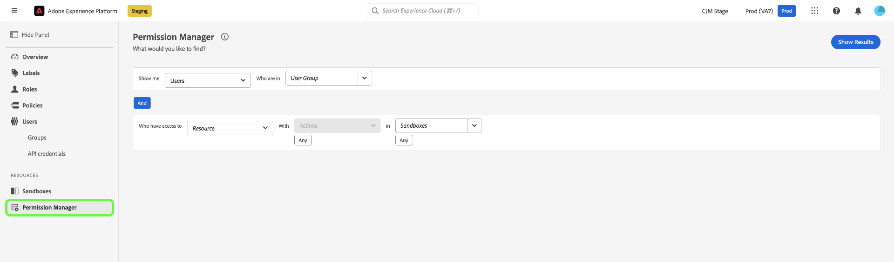

# Notas de versão da Adobe Experience Platform

**Data de lançamento: 20 de agosto de 2024**

>[!TIP]
>
>Veja uma [visão geral da documentação de casos de uso de exemplo](https://experienceleague.adobe.com/en/docs/experience-platform/rtcdp/use-cases/overview) para saber mais sobre vários casos de uso, como prospecção, aquisição e muito mais, que sua organização pode obter com a Real-Time CDP.

Atualizações dos recursos e da documentação existentes no Experience Platform:

- [Controle de acesso baseado em atributos](#abac)
- [Assimilação de dados](#data-ingestion)
- [Destinos](#destinations)
- [Experience Data Model (XDM)](#xdm)
- [Serviço de identidade](#identity-service)
- [Serviço de segmentação](#segmentation)
- [Origens](#sources)

## Controle de acesso baseado em atributos {#abac}

O controle de acesso baseado em atributos é um recurso do Adobe Experience Platform que oferece às marcas preocupadas com a privacidade maior flexibilidade para gerenciar o acesso do usuário. Objetos individuais, como campos de esquema e segmentos, podem ser atribuídos a funções de usuário. Esse recurso permite conceder ou revogar o acesso a objetos individuais para usuários específicos da Platform em sua organização.

Por meio do controle de acesso baseado em atributos, os administradores da sua organização podem controlar o acesso dos usuários a dados pessoais confidenciais (SPD), informações de identificação pessoal (PII) e outros tipos personalizados de dados em todos os fluxos de trabalho e recursos da plataforma. Os administradores podem definir funções de usuário que tenham acesso somente a campos e dados específicos que correspondam a esses campos.

**Novo recurso**

| Atualização de recursos | Descrição |
| --- | --- |
| Novo recurso do Gerenciador de permissões | Agora você pode utilizar o [Gerenciador de Permissões](../../access-control/abac/permission-manager/overview.md) para gerar relatórios usando consultas simples, o que o ajudará a entender o gerenciamento de acesso e economizar tempo verificando permissões de acesso em vários fluxos de trabalho e níveis de granularidade. Para obter mais informações sobre como criar relatórios para usuários e funções, consulte o [guia do usuário do Gerenciador de Permissões](../../access-control/abac/permission-manager/permissions.md). {width="250" align="center" zoomable="yes"} |

{style="table-layout:auto"}

Para obter mais informações sobre o controle de acesso baseado em atributos, consulte a [visão geral do controle de acesso baseado em atributos](../../access-control/abac/overview.md). Para obter um guia abrangente sobre o fluxo de trabalho do controle de acesso baseado em atributos, leia o [guia completo do controle de acesso baseado em atributos](../../access-control/abac/end-to-end-guide.md).

## Assimilação de dados (atualizada em 23 de agosto) {#data-ingestion}

A Adobe Experience Platform fornece um conjunto avançado de recursos para assimilar qualquer tipo e qualquer latência de dados. Você pode assimilar usando APIs de lote ou transmissão, origens construídas pela Adobe, parceiros de integração de dados ou a interface da Adobe Experience Platform.

**Manuseio de formato de data atualizado na assimilação de dados em lote**

Esta versão resolve um problema com a *manipulação de formato de data* na assimilação de dados em lote. Anteriormente, o sistema transformou campos de data inseridos por clientes como `Date` no formato `DateTime`. Isso significava que o fuso horário era adicionado automaticamente aos campos e causava dificuldades para usuários que preferiam ou exigiam o formato `Date`. A partir de agora, o fuso horário não será adicionado automaticamente a campos do tipo `Date`. Essa atualização garante que o formato exportado dos dados corresponda ao formato representado no perfil desse campo, conforme solicitado pelos clientes.

`Date` campos antes da versão: `"birthDate": "2018-01-12T00:00:00Z"`
`Date` campos após o lançamento: `"birthDate": "2018-01-12"`

Leia mais sobre [assimilação em lote](/help/ingestion/batch-ingestion/overview.md).

## Destinos {#destinations}

[!DNL Destinations] são integrações pré-construídas com plataformas de destino que permitem a ativação perfeita de dados da Adobe Experience Platform. É possível usar destinos para ativar seus dados conhecidos e desconhecidos para campanhas de marketing entre canais, campanhas de email, publicidade direcionada e muitos outros casos de uso.

**Destinos novos ou atualizados** {#new-updated-destinations}

| Destino | Descrição |
| ----------- | ----------- |
| [Raio](/help/destinations/catalog/mobile-engagement/braze.md) | [!UICONTROL Braze] gerencia várias instâncias diferentes para seus pontos de extremidade de painel e REST. [!UICONTROL Braze] clientes devem usar o Ponto de Extremidade REST correto com base na instância para a qual você está provisionado. Esta versão adiciona um novo ponto de extremidade US-07 que você pode selecionar ao se conectar ao [!UICONTROL Braze]. |

{style="table-layout:auto"}

**Funcionalidades novas ou atualizadas** {#destinations-new-updated-functionality}

| Recurso | Descrição |
| ----------- | ----------- |
| A exportação de arquivos sob demanda para destinos em lote agora está disponível de modo geral. | A opção de exportar arquivos por demanda para destinos em lote agora está disponível para todos os clientes. Consulte a [documentação dedicada](../../destinations/ui/export-file-now.md) para obter mais detalhes. |
| Edite os agendamentos de exportação para vários públicos exportados na [etapa de agendamento](../../destinations/ui/activate-batch-profile-destinations.md#scheduling). | A opção para editar os agendamentos de exportação para vários públicos-alvo exportados diretamente da etapa de agendamento do fluxo de trabalho de ativação de público-alvo agora está disponível para todos os clientes. {width="250" align="center" zoomable="yes"} |
| Edite nomes de arquivos para vários públicos exportados na [etapa de agendamento](../../destinations/ui/activate-batch-profile-destinations.md#scheduling). | A opção para editar os nomes de vários arquivos exportados diretamente da etapa de agendamento do fluxo de trabalho de ativação de público agora está disponível para todos os clientes. {width="250" align="center" zoomable="yes"} |
| Remova vários públicos-alvo de um fluxo de dados da página [Detalhes do destino](../../destinations/ui/destination-details-page.md#bulk-remove). | A opção de remover vários públicos-alvo de fluxos de dados existentes da página **[!UICONTROL Detalhes do destino]** agora está disponível para todos os clientes. {width="250" align="center" zoomable="yes"} |
| Exporte vários arquivos por demanda para destinos em lote a partir da página [Detalhes do destino](../../destinations/ui/destination-details-page.md#bulk-export). | A opção de exportar vários arquivos por demanda para destinos em lote a partir da página **[!UICONTROL Detalhes do destino]** agora está disponível para todos os clientes. {width="250" align="center" zoomable="yes"} |
| Edite nomes de arquivos para vários públicos exportados da página [Detalhes do destino](../../destinations/ui/destination-details-page.md#bulk-edit-file-names). | Agora é possível editar os nomes de vários arquivos exportados diretamente da página **[!UICONTROL Detalhes do destino]**. {width="250" align="center" zoomable="yes"} |
| Remova vários conjuntos de dados de um fluxo de dados da página [Detalhes do destino](../../destinations/ui/export-datasets.md#remove-dataset). | A opção para remover vários conjuntos de dados de um fluxo de dados agora está disponível para todos os clientes. {width="250" align="center" zoomable="yes"} |

{style="table-layout:auto"}

Para obter mais informações, leia a [visão geral dos destinos](../../destinations/home.md).

## Experience Data Model (XDM) {#xdm}

O XDM é uma especificação de código aberto que fornece estruturas e definições comuns (esquemas) para dados inseridos na Adobe Experience Platform. Ao aderir aos padrões do XDM, todos os dados de experiência do cliente podem ser incorporados em uma representação comum para fornecer insights de maneira mais rápida e integrada. Você pode obter insights valiosos sobre ações de clientes, definir públicos-alvo por meio de segmentos e usar atributos de clientes para fins de personalização.

**Novos recursos**

| Recurso | Descrição |
| --- | --- |
| Fluxo de criação de esquema assistido por ML | Use algoritmos avançados de aprendizado de máquina do para analisar seus arquivos de dados de amostra e criar automaticamente esquemas otimizados usando campos padrão e personalizados. Principais Recursos: <ul><li>Criação de esquema mais rápida: gere esquemas diretamente de arquivos de dados de amostra usando campos XDM recomendados e gerados pelo ML.</li><li>Evolução flexível do esquema: adicione ou atualize facilmente campos no esquema gerado.</li><li>Integração contínua: totalmente integrado ao fluxo de criação do esquema principal no URL do esquema, garantindo uma experiência do usuário perfeita e coesa.</li><li>Revisão e edição eficientes: visualize e atualize rapidamente seu esquema usando o editor de Exibição plana, tornando o processo de criação mais eficiente e fácil de usar.</li></ul> Para saber mais, leia o [Guia de fluxo de trabalho de criação de esquema assistido por ML](../../xdm/ui/ml-assisted-schema-creation.md). |

{style="table-layout:auto"}

Para obter mais informações sobre o XDM na Platform, consulte a [Visão geral do sistema de XDM](../../xdm/home.md).

## Serviço de identidade {#identity-service}

Use o Serviço de identidade da Adobe Experience Platform para criar uma visualização abrangente dos clientes e seus comportamentos, unindo identidades em dispositivos e sistemas, permitindo que você forneça experiências digitais pessoais e de impacto em tempo real.

**Documentação atualizada**

| Recurso | Descrição |
| --- | --- |
| Guia de configurações de gráfico | Leia o [guia de configurações de gráfico](../../identity-service/identity-graph-linking-rules/example-configurations.md) para obter informações sobre cenários de gráficos comuns que você pode encontrar ao trabalhar com regras de vinculação de gráficos de identidade e dados de identidade. O guia de configurações de gráfico fornece exemplos que variam de cenários de gráficos simples para uma única pessoa a cenários de gráficos complexos e hierárquicos para várias pessoas. Você também pode usar o guia para obter exemplos de eventos e configurações de algoritmo que você pode inserir na [interface de simulação de gráfico](../../identity-service/identity-graph-linking-rules/graph-simulation.md), bem como detalhamentos de como as identidades primárias são selecionadas tendo em conta determinados cenários gráficos. |

{style="table-layout:auto"}

Para obter mais informações sobre o Serviço de identidade, leia a [Visão geral do Serviço de identidade](../../identity-service/home.md).

## Serviço de segmentação {#segmentation}

O [!DNL Segmentation Service] permite segmentar dados relacionados a indivíduos (como clientes, prospectos, usuários ou organizações) que estão armazenados na [!DNL Experience Platform] em públicos-alvo. Você pode criar públicos-alvo por meio de definições de segmento ou outras fontes a partir dos dados do [!DNL Real-Time Customer Profile]. Esses públicos-alvo são configurados e mantidos de forma centralizada na [!DNL Platform] e podem ser acessados a qualquer momento usando as soluções da Adobe.

**Recursos atualizados**

| Recurso | Descrição |
| ------- | ----------- |
| Detalhes de assimilação | Para públicos-alvo com a origem de upload personalizada, você pode visualizar os detalhes da assimilação do público-alvo na página de detalhes do público-alvo. Além disso, você pode aplicar rótulos aos atributos de carga selecionando o esquema e os atributos desejados para rotulagem. Mais informações sobre a seção de detalhes da assimilação podem ser encontradas no [Guia do Portal de Público](../../segmentation/ui/audience-portal.md#ingestion-details). |

{style="table-layout:auto"}

Para obter mais informações sobre o [!DNL Segmentation Service], consulte a [Visão geral de segmentação](../../segmentation/home.md).

## Origens

A Experience Platform fornece uma API RESTful e uma interface interativa que permite configurar conexões de origem para vários provedores de dados com facilidade. Essas conexões de origem permitem autenticar e conectar a sistemas de armazenamento externos e serviços de CRM, definir períodos para execuções de assimilação e gerenciar a taxa de transferência de assimilação de dados.

Use fontes no Experience Platform para assimilar dados de um aplicativo Adobe ou de uma fonte de dados de terceiros.

**Recurso atualizado**

| Recurso | Descrição |
| --- | --- |
| Atualizações no conector de origem do Adobe Analytics | A página de atividade do conjunto de dados não exibe informações sobre lotes, pois o Conector Source do Analytics é totalmente gerenciado pelo Adobe. É possível monitorar se os dados estão fluindo observando as métricas sobre registros assimilados. Leia o manual sobre como criar uma [conexão de origem de dados do Analytics](../../sources/tutorials/ui/create/adobe-applications/analytics.md) para obter mais informações. |

**Documentação atualizada**

| Atualização da documentação | Descrição |
| --- | --- |
| Documentação ampliada sobre atualização de fluxos de dados | O guia sobre [atualização de fluxos de dados de fontes existentes na interface](../../sources/tutorials/ui/update-dataflows.md) foi atualizado para fornecer mais informações sobre a variedade de configurações que você pode fazer em um fluxo de dados existente. O guia também foi atualizado para esclarecer o comportamento esperado quando um fluxo de dados desativado é reativado. |

{style="table-layout:auto"}

Para obter mais informações, leia a [visão geral das fontes](../../sources/home.md).