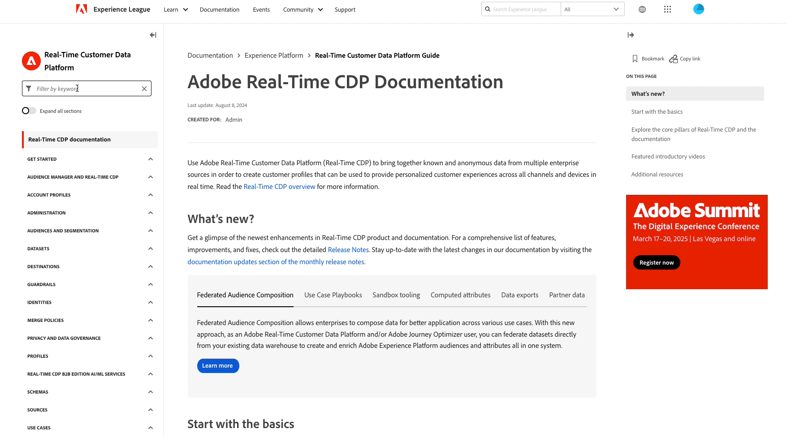

# Notas de versão da Adobe Experience Platform

>[!TIP]
>
>A nova [documentação do produto Assistente de IA](../../ai-assistant/landing.md) está disponível. Use esta página como um hub para todos os recursos relacionados ao Assistente de IA.

**Data de lançamento: 26 de novembro de 2024**

Atualizações dos recursos e da documentação existentes no Adobe Experience Platform:

- [Assistente de IA](#ai-assistant)
- [Destinos](#destinations)
- [Query Service](#query-service)
- [Sandboxes](#sandboxes)
- [Atualizações na documentação](#documentation-updates)
   - [Documentação da API Experience Platform interativa](#interactive-experience-platform-api-documentation)
   - [Novo sumário no Experience League](#new-table-of-contents-on-experience-league)
   - [Nova página de aterrissagem do assistente de IA](#new-ai-assistant-landing-page)

## Assistente de IA {#ai-assistant}

O Assistente de IA no Adobe Experience Platform é uma experiência de conversação que você pode usar para acelerar seus fluxos de trabalho em aplicativos Adobe. Você pode usar o AI Assistant para entender melhor o conhecimento do produto, solucionar problemas ou pesquisar informações e encontrar insights operacionais. O Assistente de IA é compatível com Experience Platform, Real-time Customer Data Platform, Adobe Journey Optimizer e Customer Journey Analytics.

**Novos recursos**

| Recurso | Descrição |
| --- | --- |
| [!BADGE Alpha]{type=Informative} Monitorar alterações significativas e prever o crescimento do público | Use o Assistente de IA para monitorar alterações significativas e fornecer previsões de crescimento para seu público-alvo e tamanhos de conjuntos de dados. Você pode então usar essas informações para garantir a integridade dos dados do público-alvo e oferecer projeções prospetivas para dar suporte à tomada de decisões com base em dados. Para obter mais informações, leia o manual sobre [monitoramento de alterações significativas e previsão do crescimento do público](../../ai-assistant/new-features/audience-forecasting.md). |
| [!BADGE Alpha]{type=Informative} Estimativa da linguagem natural | Use os recursos de estimativa de linguagem natural do Assistente de IA para estimar o tamanho do público e prever as tendências do público com base em perguntas simples e conversacionais. Para obter mais informações, leia o guia em [usando a estimativa em linguagem natural com o Assistente de IA](../../ai-assistant/new-features/natural-language.md). |

{style="table-layout:auto"}

## Destinos {#destinations}

[!DNL Destinations] são integrações pré-construídas com plataformas de destino que permitem a ativação perfeita de dados da Adobe Experience Platform. É possível usar destinos para ativar seus dados conhecidos e desconhecidos para campanhas de marketing entre canais, campanhas de email, publicidade direcionada e muitos outros casos de uso.

**Destinos novos ou atualizados** {#new-updated-destinations}

| Destino | Descrição |
| --- | --- |
| [Magnite Streaming em Tempo Real](/help/destinations/catalog/advertising/magnite-streaming.md) | Exporte públicos para ativação, direcionamento ou supressão na plataforma Magnite Streaming. Observe que para que os públicos-alvo sejam exportados corretamente para o Magnite, você deve usar os destinos em tempo real e em lote. |
| [Lote de Transmissão Magnite](/help/destinations/catalog/advertising/magnite-batch.md) | Exporte públicos para ativação, direcionamento ou supressão na plataforma Magnite Streaming. Observe que para que os públicos-alvo sejam exportados corretamente para o Magnite, você deve usar os destinos em tempo real e em lote. |

{style="table-layout:auto"}

**Funcionalidades novas ou atualizadas** {#destinations-new-updated-functionality}

| Recurso | Descrição |
| --- | --- |
| [Pesquisar atributos de perfil em tempo real na borda](/help/destinations/ui/activate-edge-profile-lookup.md) | Saiba como pesquisar atributos de perfil de borda em tempo real para fornecer experiências de personalização ou informar regras de decisão por meio de aplicativos downstream, usando o destino Personalization personalizado e a API Edge Network. |

{style="table-layout:auto"}

Para obter mais informações, leia a [visão geral de destinos](../../destinations/home.md).

## Query Service {#query-service}

Consultar dados no data lake da Adobe Experience Platform usando SQL padrão com Serviço de consulta. Combine conjuntos de dados facilmente e gere novos a partir dos resultados da consulta para potencializar os relatórios, ativar fluxos de trabalho de ciência de dados ou facilitar a assimilação no Perfil do cliente em tempo real. Por exemplo, você pode mesclar dados de transações de clientes com dados comportamentais para identificar públicos-alvo de alto valor para campanhas de marketing direcionadas.

**Recursos atualizados**

| Recurso | Descrição |
| --- | --- |
| API de autorização do Dater Distiller | Gerencie e aplique restrições de acesso baseadas em IP para sandboxes do Serviço de consulta, para aprimorar a segurança dos dados e garantir a conformidade com as políticas organizacionais. Consulte o [Guia da API de Autorização do Data Distiller](../../query-service/auth-api/overview.md) para obter mais informações sobre seus principais recursos e funcionalidades, ou a [Documentação da OpenAPI](https://developer.adobe.com/experience-platform-apis/references/data-distiller-auth/) para obter informações abrangentes, incluindo detalhes do ponto de extremidade, listas de parâmetros, exemplos de solicitação/resposta e recursos de teste. |

Para obter mais informações sobre [!DNL Query Service], consulte a [[!DNL Query Service] visão geral](../../query-service/home.md).

## Sandboxes {#sandboxes}

O Adobe Experience Platform foi criado para enriquecer aplicativos de experiência digital em escala global. As empresas geralmente executam vários aplicativos de experiência digital em paralelo e precisam atender ao desenvolvimento, ao teste e à implantação desses aplicativos enquanto garantem a conformidade operacional. Para atender a essa necessidade, o Experience Platform fornece sandboxes que particionam uma única instância da Platform em ambientes virtuais separados para ajudar a desenvolver aplicativos de experiência digital.

**Recursos novos ou atualizados**

| Recurso | Descrição |
| --- | --- |
| Compartilhamento de pacotes com a API de ferramentas de sandbox | Use dois novos pontos de extremidade de API, [`/handshake`](../../sandboxes/sandbox-tooling-api/packages.md#org-linking) e [`/transfers`](../../sandboxes/sandbox-tooling-api/packages.md#transfer-packages), para gerenciar o compartilhamento de pacotes entre organizações, como aprovações de solicitações, visibilidade de pacotes e importação de pacotes, usando a API de ferramentas de sandbox. |

Para obter mais informações sobre sandboxes, leia a [visão geral das sandboxes](../../sandboxes/home.md).

## Atualizações na documentação {#documentation-updates}

### Documentação da API Experience Platform interativa {#interactive-api-documentation}

A [documentação da API de Experience Platform](https://developer.adobe.com/experience-platform-apis/) agora é totalmente interativa, permitindo que você autentique e explore APIs diretamente na página de documentação de referência da API. Agora você pode ir para a página de documentação de referência da API desejada, criar ou obter suas credenciais de autenticação da API, colá-las no bloco **[!UICONTROL Experimente]** e executar a chamada. Tudo em uma página. [Leia mais](/help/landing/api-authentication.md#get-credentials-functionality) sobre a funcionalidade.

### Novo sumário no Experience League {#new-table-of-contents-on-experience-league}

O índice das páginas de documentação do Experience League foi aprimorado para fornecer uma experiência aprimorada aos leitores, incluindo um filtro de palavra-chave para descobrir a página exata necessária, a capacidade de expandir todas as páginas e muito mais.   {width="250" align="center" zoomable="yes"}

### Nova página de aterrissagem do assistente de IA {#new-ai-assistant-landing-page}

Use a nova página [documentação de produto do AI Assistant](../../ai-assistant/landing.md) como um hub para tudo do AI Assistant. Consulte a documentação do produto para obter tutoriais em vídeo, documentação técnica, casos de uso e links para publicações do blog sobre o Assistente de IA.