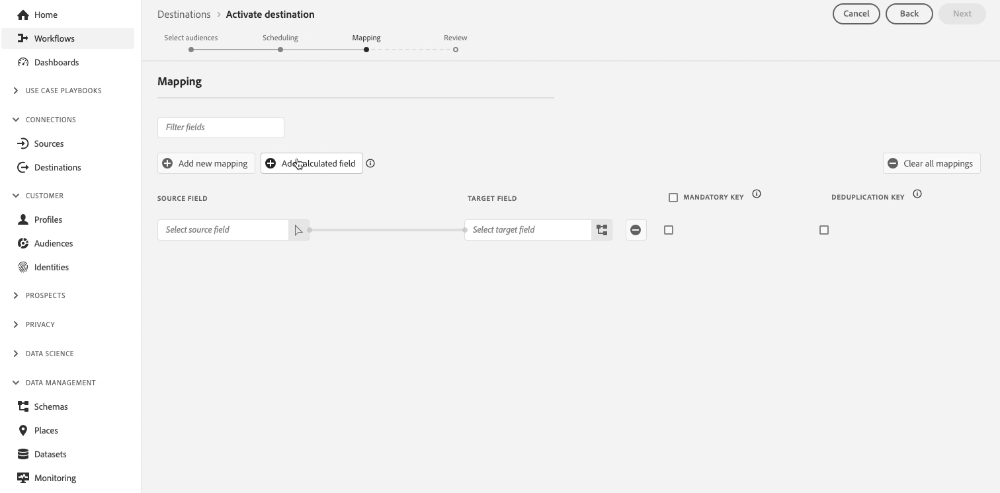

# Notas de versão da Adobe Experience Platform

**Data de lançamento: 29 de outubro de 2024**

Atualizações dos recursos e da documentação existentes no Adobe Experience Platform:

- [Painéis {#dashboards}](#dashboards-dashboards)<!-- omit in toc -->
- [Coleção de dados {#collection}](#data-collection-collection)
- [Destinos {#destinations}](#destinations-destinations)
- [Serviço de segmentação {#segmentation-service}](#segmentation-service-segmentation-service)
- [Sandboxes {#sandboxes}](#sandboxes-sandboxes)
- [Fontes {#sources}](#sources-sources)

## Painéis {#dashboards}

O Experience Platform fornece vários painéis por meio dos quais você pode visualizar insights importantes sobre os dados de sua organização, conforme capturados durante instantâneos diários.

**Recursos novos ou atualizados**

| Recurso | Descrição |
| --- | --- |
| Modelos de dados do Distiller | Explore vários modelos para obter insights estruturados sobre os dados do público-alvo. Use painéis como **Avançado [!UICONTROL Sobreposições de público-alvo]**, **[!UICONTROL Comparação de público-alvo]**, **[!UICONTROL Tendências de público]** e **[!UICONTROL Sobreposições de identidade de público-alvo]** para tomar decisões orientadas por dados, otimizar a segmentação e aprimorar as estratégias de engajamento. Consulte o [Guia de Modelos de Data Distiller](../../dashboards/sql-insights-query-pro-mode/templates/overview.md) para obter mais detalhes. |
| Sobreposições avançadas de público-alvo | Analise rapidamente as interseções de público-alvo para públicos-alvo específicos ou visualize todas as sobreposições para descobrir insights valiosos em todo o conjunto de público-alvo. Use esses insights para refinar a segmentação, reduzir as mensagens redundantes e criar campanhas mais direcionadas para melhorar a eficiência do marketing. Consulte o [Guia de Sobreposições de Público-Alvo Avançado](../../dashboards/sql-insights-query-pro-mode/templates/overlaps.md) para obter mais detalhes. |
| Melhorias na comparação de público-alvo | Exiba uma comparação lado a lado das métricas principais entre diferentes grupos de público-alvo usando o painel **Comparação de público-alvo**. Com esse painel, você pode selecionar intervalos de tempo e KPIs específicos, como tamanho do público-alvo e composição de identidade, para tomar decisões mais informadas sobre a segmentação do público-alvo e estratégias de direcionamento. Leia o [Guia de Comparação de Público-Alvo](../../dashboards/sql-insights-query-pro-mode/templates/comparison.md) para obter mais informações. |
| Visualização de tendências do público | Analise as métricas de público-alvo ao longo do tempo com o painel **[!UICONTROL Tendências de público-alvo]**. Visualize tendências para o tamanho do público, o número de identidades e o número de perfis de identidade única para ajudá-lo a monitorar a evolução do público, medir o crescimento e refinar suas estratégias de envolvimento. Consulte o [Guia de tendências do público-alvo](../../dashboards/sql-insights-query-pro-mode/templates/trends.md) para obter mais detalhes. |
| Análise de sobreposições de identidade | Analise as sobreposições de identidade nos públicos-alvo selecionados com o painel **[!UICONTROL Sobreposições de identidade de público-alvo]**. Visualize tendências e detalhamentos de identidade para entender como diferentes tipos de identidade se relacionam no seu público-alvo, melhorando a identificação de identidades e a precisão da segmentação de clientes. Consulte o [guia de Sobreposições de Identidade de Público-Alvo](../../dashboards/sql-insights-query-pro-mode/templates/identity-overlaps.md) para obter mais detalhes. |

{style="table-layout:auto"}

Para obter mais informações sobre painéis, incluindo como conceder permissões de acesso e criar widgets personalizados, comece lendo a [visão geral dos painéis](../../dashboards/home.md).

## Coleção de dados {#collection}

A Adobe Experience Platform fornece um conjunto de tecnologias que permitem coletar dados de experiência do cliente do lado do cliente e enviá-los para o Edge Network de Experience Platform, onde podem ser enriquecidos, transformados e distribuídos para destinos Adobe ou não Adobe.

**Novos recursos**

| Tipo | Recurso | Descrição |
| --- | --- | --- |
| Tags e extensões | Visualização JSON do Adobe Analytics | Agora você pode usar a extensão de tags da Adobe Analytics para examinar eVars, props e configurações de evento como JSON, que agora pode ser incluído na extensão SDK da Web e exportado para edição. Você também pode carregar ou copiar esses dados e armazená-los em seu dispositivo. Leia a [documentação de extensão do Adobe Analytics](../../tags/extensions/client/analytics/overview.md) para obter mais informações. |

{style="table-layout:auto"}

Para obter mais informações, leia a [visão geral da coleção de dados](../../collection/home.md).

## Destinos {#destinations}

[!DNL Destinations] são integrações pré-construídas com plataformas de destino que permitem a ativação perfeita de dados da Adobe Experience Platform. É possível usar destinos para ativar seus dados conhecidos e desconhecidos para campanhas de marketing entre canais, campanhas de email, publicidade direcionada e muitos outros casos de uso.

**Funcionalidades novas ou atualizadas** {#destinations-new-updated-functionality}

| Recurso | Descrição |
| ----------- | ----------- |
| [Suporte à exportação de matrizes disponível no geral](../../destinations/ui/export-arrays-calculated-fields.md) | Todos os clientes agora podem usar a opção **[!UICONTROL Adicionar campo calculado]** ao ativar públicos-alvo *para destinos baseados em arquivo* para exportar matrizes ou elementos de matrizes inteiras. Observe que ainda é necessário usar a função `array_to_string` para nivelar a matriz em uma cadeia de caracteres no arquivo de destino.   {width="250" align="center" zoomable="yes"} |
| [Aprimoramentos na precisão dos relatórios para destinos de streaming](/help/destinations/ui/export-datasets.md) | A partir de outubro de 2024, o Adobe está lançando uma atualização para aumentar a precisão dos relatórios para destinos de transmissão. Esse aprimoramento garante um melhor alinhamento entre os relatórios da Experience Platform e das plataformas de destino.   Antes desta atualização, **[!UICONTROL Falha nas identidades]** incluiu todas as tentativas de ativação. Após essa atualização, somente a última tentativa de ativação será incluída na contagem total.   Atualmente, este aprimoramento se aplica ao [destino de Correspondência de Cliente do Google](../../destinations/catalog/advertising/google-customer-match.md), mas será gradualmente implantado em outros destinos de streaming de Experience Platform. Após esse aprimoramento, os usuários do [destino de Correspondência do Cliente do Google](../../destinations/catalog/advertising/google-customer-match.md) poderão observar uma queda esperada em sua contagem de **[!UICONTROL Falha nas identidades]**. |
| Implicações flexíveis da avaliação do público-alvo na [ativação do público-alvo em lote](../../destinations/ui/activate-batch-profile-destinations.md#export-full-files) | Se você executar a [avaliação flexível do público-alvo](../../segmentation/ui/audience-portal.md#flexible-audience-evaluation) em públicos que já estão definidos para serem ativados após a avaliação do segmento, os públicos-alvo serão ativados assim que o trabalho de avaliação flexível do público-alvo for concluído, independentemente de quaisquer trabalhos de ativação diários anteriores.   Isso pode resultar na exportação de públicos-alvo várias vezes ao dia, com base em suas ações. |

{style="table-layout:auto"}

Para obter mais informações, leia a [visão geral de destinos](../../destinations/home.md).

## Serviço de segmentação {#segmentation-service}

O [!DNL Segmentation Service] define um subconjunto específico de perfis descrevendo os critérios que distinguem um grupo de pessoas na sua base de clientes que pode ser direcionado por campanhas de marketing. Os segmentos podem ser baseados em dados de registro (como informações demográficas) ou em eventos de séries temporais que representam interações de clientes com sua marca.

**Recursos novos ou atualizados**

| Recurso | Descrição |
| ------- | ----------- |
| [!BADGE Disponibilidade limitada]{type=Informative} Avaliação flexível de público | A avaliação flexível do público-alvo permite criar rapidamente novos públicos-alvo sob demanda para comunicações sensíveis ao tempo. Mais informações sobre este novo recurso podem ser encontradas na [documentação do Portal de Público](../../segmentation/ui/audience-portal.md#flexible-audience-evaluation). |

{style="table-layout:auto"}

Para obter mais informações sobre [!DNL Segmentation Service], leia a [Visão geral da segmentação](../../segmentation/home.md).

## Sandboxes {#sandboxes}

O Adobe Experience Platform foi criado para enriquecer aplicativos de experiência digital em escala global. As empresas geralmente executam vários aplicativos de experiência digital em paralelo e precisam atender ao desenvolvimento, ao teste e à implantação desses aplicativos enquanto garantem a conformidade operacional. Para atender a essa necessidade, o Experience Platform fornece sandboxes que particionam uma única instância da Platform em ambientes virtuais separados para ajudar a desenvolver aplicativos de experiência digital.

**Recursos novos ou atualizados**

| Recurso | Descrição |
| --- | --- |
| Compartilhamento de pacotes de ferramentas de sandbox | Agora você pode usar as ferramentas de sandbox para exportar e importar facilmente configurações de sandbox entre sandboxes em diferentes organizações. Agora há duas categorias de pacotes compartilhados disponíveis: <ul><li>**[Pacote privado](../../sandboxes/ui/sharing-packages-across-orgs.md#private-packages):** Use o compartilhamento de pacotes privados com organizações que aprovaram a solicitação de compartilhamento da organização de origem.</li><li>**[Pacote público](../../sandboxes/ui/sharing-packages-across-orgs.md#public-packages):** pacotes públicos podem ser compartilhados sem aprovações adicionais e são facilmente importados usando a carga do pacote.</li></ul> Para obter mais informações sobre esses recursos, leia o manual sobre [compartilhamento de pacotes entre organizações](../../sandboxes/ui/sharing-packages-across-orgs.md). |
| [Compartilhamento de pacotes](https://experienceleague.adobe.com/en/docs/experience-platform/sandbox/sandbox-tooling-api/packages#org-linking) na API de ferramentas de sandbox | Use a API de ferramentas de sandbox para fazer solicitações a dois novos pontos de extremidade, `/handshake` e `/transfer`, para compartilhar entre organizações, buscar e criar solicitações de compartilhamento de pacotes. Uma solicitação adicional foi adicionada ao ponto de extremidade `/packages` para recuperar a carga de um pacote. |

{style="table-layout:auto"}

Para obter mais informações sobre sandboxes, leia a [visão geral das sandboxes](../../sandboxes/home.md).

## Origens {#sources}

A Experience Platform fornece uma API RESTful e uma interface interativa que permite configurar conexões de origem para vários provedores de dados com facilidade. Essas conexões de origem permitem autenticar e conectar a sistemas de armazenamento externos e serviços de CRM, definir períodos para execuções de assimilação e gerenciar a taxa de transferência de assimilação de dados.

Use fontes na Experience Platform para assimilar dados de um aplicativo da Adobe ou de uma fonte de dados de terceiros.

**Recurso atualizado**

| Recurso | Descrição |
| --- | --- |
| Suporte para filtrar entidades de atividade padrão em [!DNL Marketo Engage] | Você pode usar a API [!DNL Flow Service] para filtrar entidades de atividade padrão ao assimilar dados da sua origem [!DNL Marketo Engage]. Leia o manual sobre [filtragem [!DNL Marketo] dados de atividade padrão](../../sources/tutorials/api/filter.md#filter-activity-entities-for-marketo-engage) para obter mais informações. |

{style="table-layout:auto"}

Para obter mais informações, leia a [visão geral de fontes](../../sources/home.md).