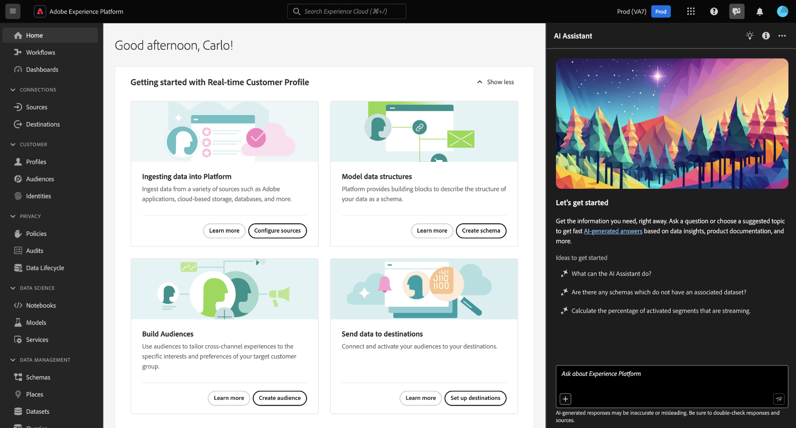

# Notas de versão da Adobe Experience Platform

**Data de lançamento: junho de 2024**

Novos recursos na Adobe Experience Platform:

- [Assistente de IA](#ai-assistant)

## Assistente de IA {#ai-assistant}

O Assistente de IA no Adobe Experience Platform é uma experiência de conversação que você pode usar para acelerar seus fluxos de trabalho em aplicativos Adobe. Você pode usar o AI Assistant para entender melhor o conhecimento do produto, solucionar problemas ou pesquisar informações e encontrar insights operacionais. O Assistente de IA é compatível com Experience Platform, Real-time Customer Data Platform, Adobe Journey Optimizer e Customer Journey Analytics.

**Novo recurso**

| Recurso | Descrição |
| --- | --- |
| Assistente de IA no Experience Platform | Agora você pode usar o Assistente de IA no Experience Platform. O Assistente de IA é compatível com Experience Platform, Real-time Customer Data Platform, Adobe Journey Optimizer e Customer Journey Analytics.   {width="100" zoomable="yes"}   Para obter mais informações sobre esse recurso, leia a [Guia da interface do assistente de IA](../../ai-assistant/ui-guide.md). |
| Suporte para perguntas de conhecimento sobre produtos | [Conhecimento do produto](../../ai-assistant/home.md#product-knowledge) são conceitos e tópicos baseados na documentação do Experience League e podem ser usados para aprendizagem pontual, descoberta aberta e solução de problemas. Você pode fazer perguntas sobre o conhecimento do produto do Assistente de IA, como: <ul><li>O que são públicos-alvo semelhantes?</li><li>Como a riqueza do perfil é calculada?</li><li> Posso excluir um esquema ativado por perfil depois que os dados forem assimilados?</li></ul> |
| [!BADGE Beta]{type=Informative} Suporte para perguntas de insights operacionais | [Insights operacionais](../../ai-assistant/home.md#operational-insights) As respostas que o Assistente de IA gera sobre seus objetos de metadados, incluindo contagens, pesquisas e impacto de linhagem. Os insights operacionais não analisam quaisquer dados na sandbox. Você pode fazer perguntas sobre insights operacionais do Assistente de IA, como: <ul><li>Quais destinos estão em um estado ativo?</li><li>Quantos conjuntos de dados eu tenho?</li><li>Liste os públicos-alvo que são usados em jornadas ativas.</li></ul> Os insights operacionais são suportados nos seguintes domínios: atributos, públicos, fluxos de dados, conjuntos de dados, destinos, jornadas, esquemas e fontes. |
| Acessar o assistente do AI | Para acessar o Assistente de IA para Experience Platform, Real-Time CDP e Journey Optimizer, você deve ser adicionado a uma função que inclua o **Habilitar o assistente de IA** e **Exibir Insights Operacionais** permissões. Para obter mais informações, leia a [guia de acesso a recursos](../../ai-assistant/access.md). Você deve usar o Admin Console para [acesso no Customer Journey Analytics](https://experienceleague.adobe.com/en/docs/analytics-platform/using/ai-assistant?lang=en#feature-access). |

Para obter mais informações sobre o Assistente de IA, leia a [Visão geral do Assistente de IA](../../ai-assistant/home.md).
