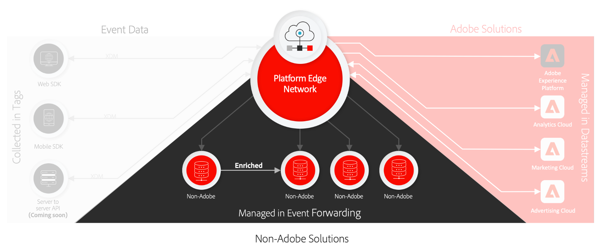

# Visão geral das conexões do Real-time Customer Data Platform

As Conexões Real-time Customer Data Platform (RTCDP) fornecem um conjunto de tecnologias que permitem coletar dados de experiência do cliente de fontes do lado do cliente e enviá-los para a Rede de borda da Adobe Experience Platform, onde podem ser enriquecidos, transformados e distribuídos para destinos Adobe ou não Adobe em segundos.

As conexões RTCDP são compatíveis com as seguintes fontes do lado do cliente:

* Aplicativos baseados na Web
* Aplicativos móveis nativos
* Aplicativos OTT (Over-the-top)

As conexões RTCDP se concentram na capacidade de descoberta e acessibilidade de conjuntos de dados assimilados, abrangendo o seguinte:

* [Rede de borda Adobe Experience Platform](https://experienceleague.adobe.com/docs/web-sdk-learn/tutorials/introduction-to-web-sdk-and-edge-network.html)
* [Tags](../tags/home.md)
* [Datastreams](../edge/datastreams/overview.md)
* [Encaminhamento de evento](../tags/ui/event-forwarding/overview.md)
* [SDK da Web da Adobe Experience Platform](../edge/home.md)
* [SDK móvel da Adobe Experience Platform](https://aep-sdks.gitbook.io/docs/)
* [Adobe Experience Platform Debugger](https://chrome.google.com/webstore/detail/adobe-experience-platform/bfnnokhpnncpkdmbokanobigaccjkpob?hl=en)
* [Experience Data Model (XDM)](../xdm/home.md)
* [Adobe Experience Platform Identity Service](../identity-service/home.md)

Este guia fornece uma introdução de alto nível sobre conexões RTCDP e como funciona para enviar dados para produtos da Adobe Experience Cloud e aplicativos não-Adobe pela Rede de borda da plataforma.

## Tags, SDK da Web e SDK móvel

O SDK da Web da plataforma e o SDK móvel da plataforma recolhem e compactam todas as bibliotecas de produtos do Adobe em um único kit de desenvolvimento para plataformas móveis e da Web, respectivamente. Elas podem ser implementadas usando o código bruto ou o [tags](../tags/home.md) por meio da interface do usuário da coleta de dados.

A compactação dessas bibliotecas acelera a coleta de dados e consolida as operações em um único fluxo de dispositivos do lado do cliente para a Rede de borda da plataforma.

## Rede de borda da plataforma e armazenamento de dados {#edge}

A Platform Edge Network é uma rede distribuída globalmente, rápida e confiável, de servidores capazes de receber e processar dados em grande escala. Usando tags, você pode configurar [datastreams](../edge/datastreams/overview.md) para produtos como Adobe Target, Adobe Audience Manager e Adobe Analytics, que permitem ativar esses produtos no lado do servidor sem alterar o código do lado do cliente.

>[!NOTE]
>
>Para obter uma introdução de alto nível à Rede de borda da plataforma, consulte o seguinte [tour interativo de produtos](https://adobe-ideacloud.forgedx.com/adobe-adobe-edge-collection/adobe-experience-edge/public/mx?SUID=hgb1a48ICSCpbM6MzBYHbxnsh9DgjUy1).

## Encaminhamento de evento

[Encaminhamento de evento](../tags/ui/event-forwarding/overview.md) O pode tocar em qualquer datastreamento do Experience Platform, permitindo transformar, enriquecer e enviar dados para qualquer destino que não seja o Adobe com latência extrema baixa e sem adicionar nenhum código de terceiros ao dispositivo cliente.

>[!NOTE]
>
>O encaminhamento de eventos é um recurso pago incluído apenas como parte da oferta do Real-time Customer Data Platform Connections.

## Próximas etapas

Este documento forneceu uma visão geral de alto nível de como as conexões RTCDP funcionam para automatizar o processo de envio dos dados de experiência do cliente coletados para produtos de Adobe e destinos de terceiros.

Para obter mais informações sobre o workflow geral envolvido no envio de dados de evento por meio da Edge Network, consulte [visão geral completa](./e2e.md).
