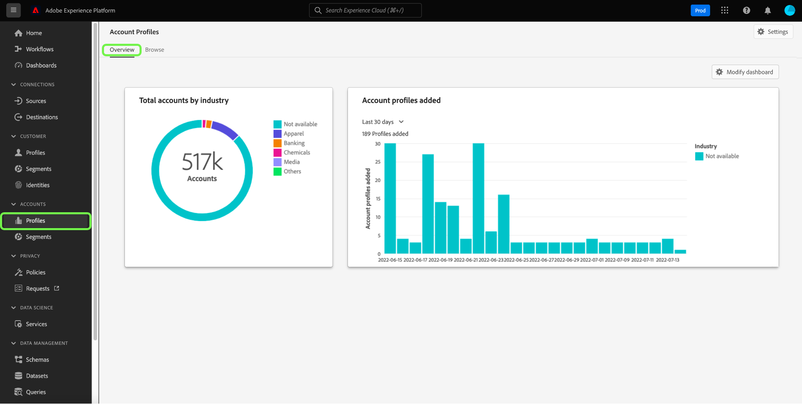

# Guia da interface do perfil da conta

>[!NOTE]
>
>Os perfis de conta só estão disponíveis para clientes do Real-time Customer Data Platform B2B Edition. Para saber mais sobre o Real-Time CDP, incluindo os recursos e a funcionalidade disponíveis para cada tipo de licença, comece lendo o [Visão geral do Real-Time CDP](../overview.md).

Os perfis de conta permitem unificar informações de conta de várias fontes. Essa visualização unificada de uma conta reúne dados de vários canais de marketing e os diversos sistemas que sua organização está usando atualmente para armazenar informações de contas de clientes. Este documento fornece um guia para interagir com perfis de conta usando os recursos do Real-Time CDP, B2B Edition disponíveis na interface do usuário (UI) do Adobe Experience Platform.

Para saber mais sobre como os perfis de conta são criados como parte do fluxo de trabalho B2B, consulte [tutorial completo](../b2b-tutorial.md).

## Visão geral dos perfis de conta {#account-profiles-overview}

Selecionar **[!UICONTROL Perfis]** em [!UICONTROL Contas] no painel de navegação esquerdo para exibir a visão geral dos perfis de conta. No [!UICONTROL Visão geral] , o painel mostra um gráfico ou gráfico exibindo widgets em um único ponto de entrada.

Consulte a documentação no [[!UICONTROL Perfis de conta]](../../dashboards/guides/account-profiles.md) painel para saber mais. Consulte a documentação em [Edição B2B do modelo de dados do Real-time Customer Data Platform Insights](../../dashboards/data-models/cdp-insights-data-model-b2b.md) para obter mais informações sobre como os modelos de dados do insights podem ser usados para criar gráficos personalizados para seus painéis.

## Configurar lead para correspondência de conta {#configure-lead-to-account-matching}

>[!IMPORTANT]
>
> Somente administradores de IA B2B podem habilitar, desabilitar e configurar o lead para o serviço de correspondência de contas. Ao desabilitar o serviço, os resultados correspondentes serão excluídos em 24 horas.

Para configurar o cliente potencial para correspondência de contas, selecione **[!UICONTROL Perfis]** em [!UICONTROL Contas] no painel de navegação esquerdo. No **[!UICONTROL Visão geral]** selecione **[!UICONTROL Configurações]** no canto superior direito.

A variável **[!UICONTROL Configurações da conta]** será aberta. Aqui, selecione a variável **[!UICONTROL Habilitar correspondência entre lead e conta]** para ativar o recurso. Use o menu suspenso para selecionar **[!UICONTROL Diariamente]** para o **[!UICONTROL Cadência de correspondência]** configuração. Por último, selecione as opções **[!UICONTROL Critérios de correspondência]** opções seguidas por **[!UICONTROL Salvar]** para confirmar suas configurações e retornar ao **[!UICONTROL Perfis de conta]** tela.

>[!NOTE]
>
> O Endereço não pode ser usado como o único critério de correspondência. Um ou mais dos outros critérios de correspondência devem ser selecionados.

Para saber mais sobre correspondência entre lead e conta, consulte a [Lead para correspondência de contas na visão geral B2B do Real-Time CDP](../../rtcdp/b2b-ai-ml-services/lead-to-account-matching.md).

## Procurar perfis de conta {#browse-account-profiles}

Para procurar perfis de conta, comece selecionando **[!UICONTROL Perfis]** em [!UICONTROL Contas] no painel de navegação esquerdo.

No **[!UICONTROL Procurar]** você pode explorar perfis de conta usando uma ID de conta de uma fonte corporativa conectada ou inserindo os detalhes da fonte diretamente.

### Procurar por [!UICONTROL Fonte corporativa conectada] {#browse-by-connected-enterprise-source}

Para procurar perfis de conta por uma fonte corporativa conectada, selecione **[!UICONTROL Fonte corporativa conectada]** do **[!UICONTROL Procurar por]** e escolha uma origem conectada usando o botão seletor ao lado da caixa de diálogo **[!UICONTROL Origem]** campo.

Isso abre o **[!UICONTROL Selecionar origem]** , em que você pode selecionar uma origem com base nas conexões que sua organização estabeleceu.

>[!NOTE]
>
>Sua organização pode ter várias origens configuradas para o mesmo provedor de serviços (por exemplo, Marketo), portanto, é importante revisar o nome da conexão, o sistema de origem e a instância do sistema de origem para garantir que você esteja pesquisando pela instância de origem correta.

Para saber mais sobre como conectar fontes corporativas, consulte a [visão geral das origens](../sources/sources-overview.md).

Você pode escolher uma origem selecionando o botão de opção ao lado do nome da conexão e, em seguida, usar **[!UICONTROL Selecionar]** para retornar ao [!UICONTROL Procurar] guia.

Com uma origem selecionada, agora você deve inserir um **[!UICONTROL ID da conta]** relacionado à origem. Por exemplo, selecionar uma origem do Salesforce exigiria que você inserisse uma ID de conta na instância do Salesforce para exibir o perfil da conta vinculado a essa ID.

>[!NOTE]
>
>Para IDs de conta da Marketo, há duas tabelas de conta possíveis que podem ser referenciadas. Portanto, você deve usar uma sintaxe específica para garantir que está visualizando a conta correta.
>
>A sintaxe padrão mais comum é a ID de conta do Marketo anexada por `.mkto_org` (por exemplo, `1234567.mkto_org`). Os clientes do Marketo Account-Based Marketing podem ter valores adicionais que podem ser encontrados usando a ID de conta do Marketo anexada por `.mkto_account`. Se não tiver certeza de qual sintaxe usar, consulte o administrador do Marketo.

### Procurar por [!UICONTROL Outros] {#browse-by-others}

O Real-Time CDP, B2B Edition oferece suporte à capacidade de executar uma pesquisa direta permitindo que você insira um **[!UICONTROL Nome de origem]**, **[!UICONTROL Instância de origem]**, e **[!UICONTROL ID da conta]** para uma conta que você gostaria de visualizar. Ao inserir o nome de origem e a instância diretamente, você fornece o contexto necessário para que o Experience Platform pesquise e exiba os dados corretos do perfil da conta.

A capacidade de executar uma pesquisa direta é útil em circunstâncias em que não é possível fazer uma conexão de origem diretamente com os dados. Por exemplo, se sua organização tiver políticas de governança de dados em vigor que impeçam a conexão direta com um CRM, você poderá exportar esses dados para um sistema de armazenamento na nuvem e assimilá-los no Experience Platform.

Outro exemplo pode ser que você esteja executando uma transformação nos dados entre o momento em que ele sai de um sistema e entra na Platform. Você pode usar a funcionalidade de pesquisa direta para fornecer contexto para os dados (como especificar que são dados do Marketo, apesar de virem de um bucket do Amazon S3, por exemplo) para que o sistema saiba onde procurar os dados e como renderizá-los corretamente.

Para iniciar uma pesquisa direta, selecione **[!UICONTROL Outros]** do **[!UICONTROL Procurar por]** e, em seguida, insira um **[!UICONTROL Nome de origem]**, **[!UICONTROL Instância de origem]**, e **[!UICONTROL ID da conta]** para a conta que deseja visualizar.

## Exibir detalhes do perfil da conta {#view-account-profile-details}

Depois de usar o **[!UICONTROL Procurar]** para localizar um perfil de conta, selecionando o **[!UICONTROL ID do perfil]** abre o **[!UICONTROL Detalhe]** para o perfil da conta. As informações do perfil exibidas na guia **[!UICONTROL Detalhe]** A guia foi mesclada de vários fragmentos de perfil para formar uma única visualização da conta individual. Isso inclui detalhes da conta, como atributos básicos e dados de redes sociais.

Os campos padrão mostrados também podem ser alterados em um nível organizacional para exibir atributos de perfil da conta preferencial.

>[!NOTE]
>
>Uma funcionalidade semelhante está disponível para perfis de clientes e um guia passo a passo foi criado com instruções para adicionar e remover atributos, redimensionar painéis, etc. Leia as [guia de personalização de detalhes do perfil](../../profile/ui/profile-customization.md) para saber mais.

É possível exibir detalhes adicionais relacionados à conta selecionando outra das guias disponíveis. Essas guias incluem atributos, pessoas e a guia oportunidades que mostra oportunidades abertas e fechadas relacionadas à conta em todos os sistemas da empresa. Consulte as seções a seguir para obter mais informações sobre cada guia.

## Guia Atributos {#attributes-tab}

A variável **[!UICONTROL Atributos]** A guia lista todas as informações de registro relacionadas à conta. Isso inclui dados de atributos provenientes de várias fontes que foram mesclados para formar uma única visualização da conta.

Além de poder exibir os dados em uma lista, você pode usar a barra de pesquisa para procurar atributos específicos ou exibir os dados de registro como JSON.

## Guia Pessoas {#people-tab}

A variável **[!UICONTROL Pessoas]** A guia fornece uma lista de pessoas individuais associadas à conta. Essas pessoas podem ser contatos e clientes potenciais de diferentes sistemas corporativos gerenciados por equipes diferentes em sua organização, mas no Real-Time CDP, B2B Edition, elas são apresentadas juntas como uma única lista, permitindo que você veja uma visão mais holística dos contatos de sua conta.

>[!NOTE]
>
>A variável [!UICONTROL Pessoas] exibe uma lista de até 25 pessoas associadas à conta. Para contas com mais de 25 pessoas associadas, o sistema mostra uma amostragem aleatória de 25 registros.

Além de mostrar um instantâneo das informações do contato, cada pessoa listada também inclui uma **[!UICONTROL ID do perfil]**, que é um link clicável que permite explorar o Perfil do cliente em tempo real desse indivíduo. Para saber mais sobre como visualizar perfis de clientes individuais relacionados às suas contas, visite o guia para [procurar perfis no Real-Time CDP, B2B Edition](../profile/profile-browse.md).

## Guia Oportunidades {#opportunities-tab}

A variável **[!UICONTROL Oportunidades]** A guia fornece informações sobre oportunidades abertas e fechadas relacionadas à conta. Essas oportunidades podem ser assimiladas no Experience Platform de várias fontes. No entanto, o Real-Time CDP, B2B Edition facilita que os profissionais de marketing vejam todas essas oportunidades em um único local.

>[!NOTE]
>
>A variável [!UICONTROL Oportunidades] exibe uma lista de até 25 oportunidades associadas à conta. Para contas com mais de 25 oportunidades associadas, o sistema mostra uma amostragem aleatória de 25 registros.

Cada oportunidade inclui informações como o nome da oportunidade, sua quantidade, estágio e se a oportunidade está em aberto, fechada, ganha ou perdida.

## Guia Contas relacionadas {#related-accounts-tab}

A variável **[!UICONTROL Contas relacionadas]** A guia fornece informações sobre outras contas que podem estar relacionadas à conta que você está navegando. Para obter informações detalhadas sobre a funcionalidade, leia o [visão geral de contas relacionadas](/help/rtcdp/b2b-ai-ml-services/related-accounts.md).

>[!NOTE]
>
>* Um grupo de contas relacionadas pode ter no máximo 30 perfis de conta. Se mais de 30 perfis de conta forem encontrados relacionados, eles serão arbitrariamente divididos em vários grupos, cada um com no máximo 30 membros. O grupo Contas relacionadas de um perfil de conta sempre inclui a si mesmo.
>* A variável [!UICONTROL Contas relacionadas] exibe uma lista de até 25 contas relacionadas associadas à conta que você está navegando. Essa é uma limitação que será abordada em uma atualização futura. Apesar dessa limitação da interface do usuário, quando você usa contas relacionadas nas definições de segmento, para grupos de 30 perfis de conta relacionados, todos os perfis são usados para direcionamento.

Cada conta relacionada inclui informações como a ID e o nome do perfil da conta, sua chave de origem da conta e informações adicionais relacionadas à página inicial, endereço, conta pai, telefone, setor e receita anual.

Você pode usar as contas relacionadas nesta lista para fins de segmentação. Consulte uma [exemplo de segmentação](/help/rtcdp/segmentation/b2b.md#related-account) para entender como usar contas relacionadas para expandir seu alcance nas definições de segmento.