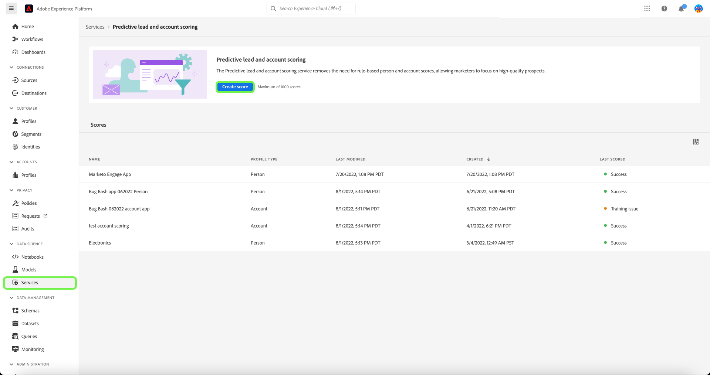
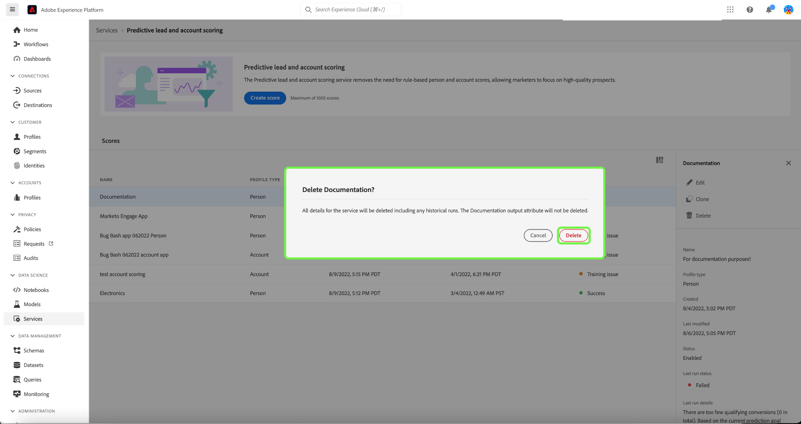

# Gerenciar pontuação preditiva de leads e contas no Adobe Real-time Customer Data Platform, B2B Edition

>[!NOTE]
>
>Somente usuários com a permissão Gerenciar IA B2B podem criar, alterar e excluir metas de pontuação.

Este tutorial percorre as etapas para gerenciar metas de pontuação do lead preditivo e do serviço de pontuação da conta. As metas de pontuação podem ser para perfil de pessoa ou perfil de conta

## Criar uma nova pontuação

Para criar uma nova pontuação, selecione o **[!UICONTROL Serviços]** na barra lateral e selecione **[!UICONTROL Criar pontuação]**.

A variável **[!UICONTROL Informações básicas]** é exibida, solicitando que você selecione um tipo de perfil, insira um nome e uma descrição opcional. Quando terminar, selecione **[!UICONTROL Próxima]**.

A variável **[!UICONTROL Definir sua meta]** é exibida. Selecione a seta suspensa e, em seguida, selecione um tipo de meta na janela suspensa exibida.

A variável **[!UICONTROL Especificações da meta]** será aberta. Selecione a seta suspensa e selecione o nome do campo de meta na janela suspensa exibida.

A variável **[!UICONTROL Condições da meta]** é exibida. Selecione a seta suspensa e selecione condição na janela suspensa exibida.

A variável **[!UICONTROL Valor da meta]** é exibido. Em seguida, configure o [!UICONTROL Especificações da meta]. Selecione o [!UICONTROL Inserir valor do campo] e insira o valor da meta.

>[!NOTE]
>
>Vários valores de meta podem ser adicionados.

Para adicionar campos extras, selecione **[!UICONTROL Adicionar campo]**.

Para configurar o período de previsão, selecione a seta suspensa e selecione o período desejado.

A política de mesclagem selecionada determina como os valores de campo de um perfil de pessoa são selecionados. Usando a seta suspensa, selecione a política de mesclagem de escolha e selecione **[!UICONTROL Concluir]**.

A variável **[!UICONTROL A configuração de pontuação foi concluída]** será exibida confirmando que a nova pontuação foi criada. Selecionar **[!UICONTROL OK]**.

>[!NOTE]
>
>Pode levar até 24 horas para que cada processo de pontuação seja concluído.

Você retornará à janela **[!UICONTROL Serviços]** guia, onde você pode ver a nova pontuação criada na lista de pontuações.

Selecione a pontuação para exibir detalhes e informações adicionais sobre os detalhes da última execução.

Para obter informações mais detalhadas sobre os códigos de erro que podem ser vistos nos detalhes da última execução, consulte a seção em [códigos de erro de pipeline de IA para clientes potenciais](#leads-ai-pipeline-error-codes) neste documento.

## Editar uma pontuação

Para editar uma pontuação, selecione uma das **[!UICONTROL Serviços]** e selecione **[!UICONTROL Editar]** no painel de detalhes adicionais no lado direito da tela.

A variável **[!UICONTROL Editar instância]** será exibida, onde você poderá editar a descrição da pontuação. Faça as alterações e selecione **[!UICONTROL Salvar]**.

>[!NOTE]
>
>A configuração de pontuação não pode ser alterada, pois isso acionará o novo treinamento e a nova pontuação do modelo. É equivalente a excluir a pontuação e criar uma nova. Para editar a configuração da pontuação, você precisará clonar essa pontuação ou criar uma nova.

Você retornará à janela **[!UICONTROL Serviços]** guia. Selecione a pontuação para exibir os detalhes da descrição atualizada no painel de detalhes adicionais no lado direito da tela.

## Clonar uma pontuação

Para clonar uma pontuação, selecione uma pontuação na **[!UICONTROL Serviços]** e selecione **[!UICONTROL Clonar]** no painel de detalhes adicionais no lado direito da tela.

A variável **[!UICONTROL Informações básicas]** é exibida. O tipo, o nome e a descrição do perfil são clonados da pontuação original. Corrija esses detalhes e selecione **[!UICONTROL Próxima]**.

A variável **[!UICONTROL Definir sua meta]** é exibida. Complete a seção de metas como faria ao criar uma nova pontuação e selecione **[!UICONTROL Concluir]**.

Você retornará à janela **[!UICONTROL Serviços]** guia, onde você pode ver a pontuação recém-clonada na lista.

>[!NOTE]
>
>A variável **[!UICONTROL Definir sua meta]** A seção não é clonada da pontuação original.

## Excluir uma pontuação

Para excluir uma pontuação, selecione uma das **[!UICONTROL Serviços]** e selecione **[!UICONTROL Excluir]** no painel de detalhes adicionais no lado direito da tela.

A variável **[!UICONTROL Excluir documentação]** confirmação será exibida. Clique em **[!UICONTROL Excluir]**.

>[!NOTE]
>
>A exclusão da definição de pontuação também excluiria todas as pontuações previstas no perfil de pessoa ou no perfil de conta, mas não no grupo de campos criado para a definição de pontuação. O grupo de campos será deixado &quot;órfão&quot; no modelo de dados.

Você retornará à janela **[!UICONTROL Serviços]** onde não é mais possível ver a pontuação na lista.

## Códigos de erro de pipeline de IA de clientes potenciais

| Código de erro | Mensagem de erro |
| --- | --- |
| 401 | ERRO 401. O pipeline de IA de cliente potencial foi interrompido: não há contas válidas suficientes para a pontuação da conta. Contagem de contas: {}. |
| 402 | ERRO 402. O pipeline de IA de cliente potencial foi interrompido: não há contatos válidos suficientes para a pontuação de contatos. Contagem de contatos: {}. |
| 403 | ERRO 403. O pipeline de IA de cliente potencial foi interrompido: volume de atividade insuficiente para treinamento de modelo. Contagem de eventos: {}. |
| 404 | ERRO 404. O pipeline de IA de cliente potencial foi interrompido: não há conversões suficientes para treinamento de modelo. Contagem de conversões: {}. |
| 405 | ERRO 405. O pipeline de IA de cliente potencial foi interrompido: atividade muito esparsa para treinamento de modelo válido. Somente {} porcentagem de contas tem atividade. |
| 406 | ERRO 406. O pipeline de IA de cliente potencial foi interrompido: atividade muito esparsa para treinamento de modelo válido. Somente {} porcentagem de contatos tem atividade. |
| 407 | ERRO 407. O pipeline de IA de cliente potencial foi interrompido: os tipos de atividade de dados de pontuação não correspondem aos dados de treinamento. |
| 408 | ERRO 408. O pipeline de IA de cliente potencial foi interrompido: a taxa de ausências é muito alta para recursos de atividade. Taxa ausente: {}. |
| 409 | ERRO 409. O pipeline de IA de cliente potencial parou: a auc de teste está muito baixa. Auc de teste: {}. |
| 410 | ERRO 410. Pipeline de IA de cliente potencial interrompido: a auc de teste está muito baixa após o ajuste do parâmetro. Auc de teste: {}. |
| 411 | ERRO 411. O pipeline de IA de cliente potencial foi interrompido: os dados de treinamento não têm conversões suficientes para produzir um modelo confiável. Conversões: {}. |
| 412 | ERRO 412. O pipeline de IA de cliente potencial foi interrompido: os dados de teste não têm nenhuma conversão para calcular a AUC-ROC. |

| Código de aviso/informações | Mensagem |
| --- | --- |
| 100 | INFORMAÇÃO 100. Verificação de qualidade de IA de clientes potenciais: a contagem de contas é: {}. |
| 101 | INFORMAÇÃO 101. Verificação de qualidade de IA de clientes potenciais: a contagem de contatos é: {}. |
| 102 | INFORMAÇÃO 102. Conduz à verificação de qualidade da IA: a contagem de oportunidades é: {}. |
| 103 | INFORMAÇÃO 103. Conduz a verificação de qualidade da IA: o teste de auc é baixo. Iniciar ajuste de parâmetro. Testando auc: {}. |
| 200 | AVISO 200. Conduz à verificação de qualidade da IA: a taxa de recursos firmográficos ausentes é: {}. |
| 201 | AVISO 201. Conduz à verificação de qualidade da IA: a taxa de recursos de atividade ausentes é: {}. |

## Próximas etapas

Ao seguir este tutorial, agora é possível criar e gerenciar pontuações com êxito. Consulte os seguintes documentos para obter mais detalhes:

* [Pontuação preditiva de conta e lead](/help/rtcdp/b2b-ai-ml-services/predictive-lead-and-account-scoring.md)
* [Monitorar trabalhos de pontuação preditiva de leads e contas](/help/dataflows/ui/b2b/monitor-profile-enrichment.md)
